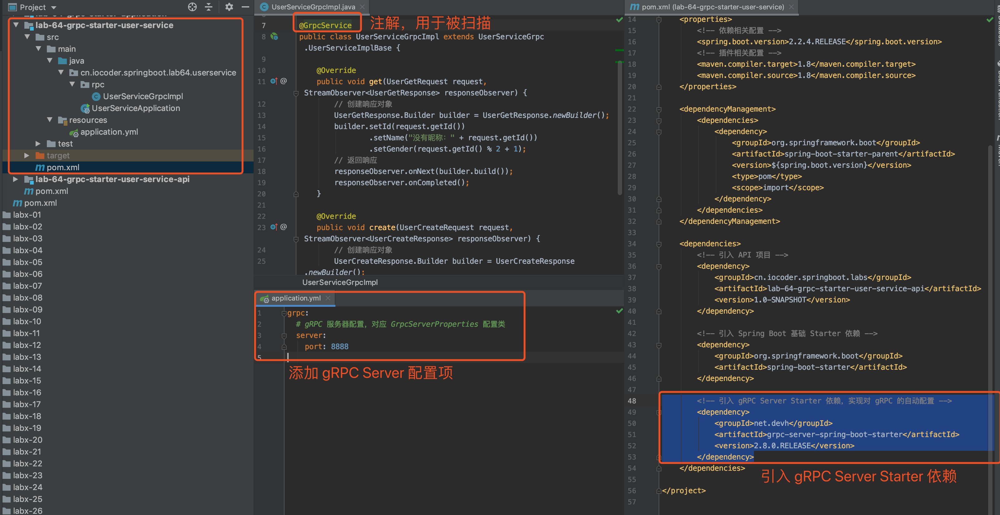
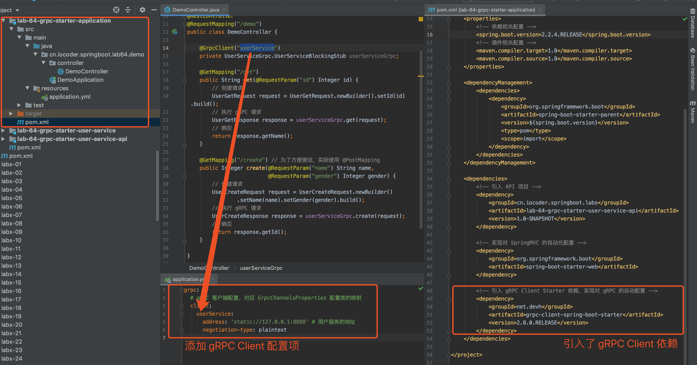

# Spring Boot gRPC 入门


## 1. 概述

[gRPC](https://grpc.io/) 是一个高性能、开源和通用的 RPC 框架，面向移动和 HTTP/2 设计。目前其提供了 C、Java、Go 等等语言的支持，如下图所示：


gRPC 基于 HTTP/2 标准设计，带来诸如双向流、流控、头部压缩、单 TCP 连接上的多复用请求等特。这些特性使得其在移动设备上表现更好，更省电和节省空间占用。

目前，有非常多优秀的开源项目采用 gRPC 作为通信方式，例如说 [Kubernetes](http://www.iocoder.cn/Books/Kubernetes-books-recommended/?self)、[SkyWalking](http://www.iocoder.cn/categories/SkyWalking/?self)、[istio](https://github.com/istio/istio) 等等。甚至说，Dubbo 自 2.7.5 版本之后，开始提供对 gRPC 协议的支持，具体可见[《Dubbo 官方文档 —— grpc://》](http://dubbo.apache.org/zh-cn/docs/user/references/protocol/gRPC.html)。

> 友情提示：本文关于 gRPC 概念相关的内容，会采用[《gRPC 官方文档中文版》](http://doc.oschina.net/grpc)，方便胖友后续互相对应。

### 1.1 gRPC 是什么？

在 gRPC 里，客户端应用可以像调用本地对象一样直接调用另一台不同的机器上服务端应用的方法，使得我们能够更容易地创建分布式应用和服务。

与许多 RPC 框架类似，gRPC 也是基于以下理念：

- 定义一个服务，指定其能够被远程调用的方法（包含参数和返回类型）。
- 在服务端实现这个接口，并运行一个 gRPC 服务器来处理客户端调用。
- 在客户端拥有一个存根 Stub 能够像服务端一样的方法。


并且，gRPC 客户端和服务端可以在多种**语言**与**环境**中运行和交互！我们可以很容易地用 Java 创建一个 gRPC 服务端，用 Java、Go、Python、Ruby 来创建 gRPC 客户端来访问它。

### 1.2 使用 protocol buffers

gRPC 默认使用 [protocol buffers](https://github.com/protocolbuffers)，这是 Google 开源的一套成熟的结构数据序列化机制。

> 当然，gRPC 也可以使用 JSON 等数据格式，不过貌似很少这么干。

在稍后的[「2. 快速入门」](https://www.iocoder.cn/Spring-Boot/gRPC/?self#)小节中，我们将使用 protobuf 文件 创建 gRPC 服务，使用 protocol buffers 消息类型来定义方法参数和返回类型。


## 2. 快速入门

> 示例代码对应仓库：[`lab-64-grpc-demo`](https://github.com/YunaiV/SpringBoot-Labs/tree/master/lab-64/lab-64-grpc-demo/) 。

本小节，我们一起来快速入门下 gRPC 的使用。示例项目如下图所示：


> 友情提示：如果胖友使用过 Dubbo 的话，我们在使用 gRPC 也是类似的，也会有服务 API 项目，服务实现项目，以及服务的调用者。

① 创建 [`lab-64-grpc-demo-user-service-api`](https://github.com/YunaiV/SpringBoot-Labs/tree/master/lab-64/lab-64-grpc-demo/lab-64-grpc-demo-user-service-api) 项目，创建 **protobuf** 文件，定义 gRPC 服务的 Service API，以及作为 Service API 方法的方法参数和返回类型的 Message。

这样，我们可以将它们在不同项目中，进行**共享**。例如说，`lab-64-grpc-demo-user-service` 和 `lab-64-grpc-demo-application` 两个项目，都会引入 `lab-64-grpc-demo-user-service-api` 项目。

② 创建 [`lab-64-grpc-demo-user-service`](https://github.com/YunaiV/SpringBoot-Labs/tree/master/lab-64/lab-64-grpc-demo/lab-64-grpc-demo-user-service) 项目，实现 [`lab-64-grpc-demo-user-service-api`](https://github.com/YunaiV/SpringBoot-Labs/tree/master/lab-64/lab-64-grpc-demo/lab-64-grpc-demo-user-service-api) 定义的 Service API，基于 gRPC Server 实现用户服务。

③ 创建 [`lab-64-grpc-demo-application`](https://github.com/YunaiV/SpringBoot-Labs/tree/master/lab-64/lab-64-grpc-demo/lab-64-grpc-demo-application) 项目，引用 [`lab-64-grpc-demo-user-service-api`](https://github.com/YunaiV/SpringBoot-Labs/tree/master/lab-64/lab-64-grpc-demo/lab-64-grpc-demo-user-service-api) 定义的 Service API，基于 gRPC Stub 调用用户服务。

下面，我们开始撸这三个项目的代码。良心的艿艿，再来补充一张小图：

> 有哦请提示：注意艿艿加的红色小字，嘿嘿。


### 2.1 API 项目

创建 [`lab-64-grpc-demo-user-service-api`](https://github.com/YunaiV/SpringBoot-Labs/tree/master/lab-64/lab-64-grpc-demo/lab-64-grpc-demo-user-service-api) 项目，创建 **protobuf** 文件，定义 gRPC 服务的 Service API，以及作为 Service API 方法的方法参数和返回类型的 Message。如下图所示：


#### 2.1.1 protobuf 文件

在 [`proto`](https://github.com/YunaiV/SpringBoot-Labs/blob/master/lab-64/lab-64-grpc-demo/lab-64-grpc-demo-user-service-api/src/main/proto/) 目录下，创建 [`UserService.proto`](https://github.com/YunaiV/SpringBoot-Labs/blob/master/lab-64/lab-64-grpc-demo/lab-64-grpc-demo-user-service-api/src/main/proto/UserService.proto) 文件，定义用户服务的 Message 和 Service。内容如下：


```java
syntax = "proto3";
option java_multiple_files = true;

package cn.iocoder.springboot.lab64.userservice.api;

message UserGetRequest {
    int32 id = 1;
}

message UserGetResponse {
    int32 id = 1;
    string name = 2;
    int32 gender = 3;
}

message UserCreateRequest {
    string name = 1;
    int32 gender = 2;
}

message UserCreateResponse {
    int32 id = 1;
}

service UserService {

    rpc get(UserGetRequest) returns (UserGetResponse);

    rpc create(UserCreateRequest) returns (UserCreateResponse);

}
```


#### 2.1.2 引入依赖

创建 [`pom.xml`](https://github.com/YunaiV/SpringBoot-Labs/blob/master/lab-64/lab-64-grpc-demo/lab-64-grpc-demo-user-service-api/pom.xml) 文件，引入 gRPC 相关依赖。内容如下：


```xml
<?xml version="1.0" encoding="UTF-8"?>
<project xmlns="http://maven.apache.org/POM/4.0.0"
         xmlns:xsi="http://www.w3.org/2001/XMLSchema-instance"
         xsi:schemaLocation="http://maven.apache.org/POM/4.0.0 http://maven.apache.org/xsd/maven-4.0.0.xsd">
    <parent>
        <artifactId>lab-64-grpc-demo</artifactId>
        <groupId>cn.iocoder.springboot.labs</groupId>
        <version>1.0-SNAPSHOT</version>
    </parent>
    <modelVersion>4.0.0</modelVersion>

    <artifactId>lab-64-grpc-demo-user-service-api</artifactId>

    <properties>
        <!-- 依赖相关配置 -->
        <io.grpc.version>1.30.0</io.grpc.version>
        <!-- 插件相关配置 -->
        <maven.compiler.target>1.8</maven.compiler.target>
        <maven.compiler.source>1.8</maven.compiler.source>
        <os-maven-plugin.version>1.6.2</os-maven-plugin.version>
        <protobuf-maven-plugin.version>0.6.1</protobuf-maven-plugin.version>
    </properties>

    <dependencies>
        <!-- 引入 gRPC Protobuf 依赖，因为使用它作为序列化库 -->
        <dependency>
            <groupId>io.grpc</groupId>
            <artifactId>grpc-protobuf</artifactId>
            <version>${io.grpc.version}</version>
        </dependency>
        <!-- 引入 gRPC Stub 依赖，因为使用它作为 gRPC 客户端库 -->
        <dependency>
            <groupId>io.grpc</groupId>
            <artifactId>grpc-stub</artifactId>
            <version>${io.grpc.version}</version>
        </dependency>
    </dependencies>

    <build>
        <extensions>
            <!-- os-maven-plugin 插件，从 OS 系统中获取参数 -->
            <extension>
                <groupId>kr.motd.maven</groupId>
                <artifactId>os-maven-plugin</artifactId>
                <version>${os-maven-plugin.version}</version>
            </extension>
        </extensions>
        <plugins>
            <!-- protobuf-maven-plugin 插件，通过 protobuf 文件，生成 Service 和 Message 类 -->
            <plugin>
                <groupId>org.xolstice.maven.plugins</groupId>
                <artifactId>protobuf-maven-plugin</artifactId>
                <version>${protobuf-maven-plugin.version}</version>
                <configuration>
                    <pluginId>grpc-java</pluginId>
                    <protocArtifact>com.google.protobuf:protoc:3.9.1:exe:${os.detected.classifier}</protocArtifact>
                    <pluginArtifact>io.grpc:protoc-gen-grpc-java:${io.grpc.version}:exe:${os.detected.classifier}</pluginArtifact>
                </configuration>
                <executions>
                    <execution>
                        <goals>
                            <goal>compile</goal>
                            <goal>compile-custom</goal>
                        </goals>
                    </execution>
                </executions>
            </plugin>
        </plugins>
    </build>

</project>
```


① 引入 [`grpc-protobuf`](https://mvnrepository.com/artifact/io.grpc/grpc-protobuf) 依赖，使用 Protobuf 作为序列化库。引入 [`grpc-stub`](https://mvnrepository.com/artifact/io.grpc/grpc-stub) 依赖，使用 gRPC Stub 作为客户端。

② 引入 [`os-maven-plugin`](https://mvnrepository.com/artifact/kr.motd.maven/os-maven-plugin) 插件，从 OS 系统中获取参数。因为需要通过它，从 OS 系统中获取 `os.detected.classifier` 参数，稍后使用到 `protobuf-maven-plugin` 插件和 OS 系统相关。

③ 引入 [`protobuf-maven-plugin`](https://mvnrepository.com/artifact/org.xolstice.maven.plugins/protobuf-maven-plugin) 插件，实现通过 `proto` 目录下的 protobuf 文件，生成 Service 和 Message 类。

下面，我们点击 IDEA 的「compile」按钮，编译该 API 项目，并同时执行 `protobuf-maven-plugin` 插件进行生成。结果如下图所示：


> 友情提示：因为胖友本地没有上述 Maven 插件，所以执行时间可能比较长。

### 2.2 用户服务

创建 [`lab-64-grpc-demo-user-service`](https://github.com/YunaiV/SpringBoot-Labs/tree/master/lab-64/lab-64-grpc-demo/lab-64-grpc-demo-user-service) 项目，实现 [`lab-64-grpc-demo-user-service-api`](https://github.com/YunaiV/SpringBoot-Labs/tree/master/lab-64/lab-64-grpc-demo/lab-64-grpc-demo-user-service-api) 定义的 Service API，基于 gRPC Server 实现用户服务。如下图所示：


#### 2.2.1 引入依赖

创建 [`pom.xml`](https://github.com/YunaiV/SpringBoot-Labs/blob/master/lab-64/lab-64-grpc-demo/lab-64-grpc-demo-user-service/pom.xml) 文件，引入 gRPC 相关依赖。内容如下：


```xml
<?xml version="1.0" encoding="UTF-8"?>
<project xmlns="http://maven.apache.org/POM/4.0.0"
         xmlns:xsi="http://www.w3.org/2001/XMLSchema-instance"
         xsi:schemaLocation="http://maven.apache.org/POM/4.0.0 http://maven.apache.org/xsd/maven-4.0.0.xsd">
    <parent>
        <artifactId>lab-64-grpc-demo</artifactId>
        <groupId>cn.iocoder.springboot.labs</groupId>
        <version>1.0-SNAPSHOT</version>
    </parent>
    <modelVersion>4.0.0</modelVersion>

    <artifactId>lab-64-grpc-demo-user-service</artifactId>

    <properties>
        <!-- 依赖相关配置 -->
        <io.grpc.version>1.30.0</io.grpc.version>
        <spring.boot.version>2.2.4.RELEASE</spring.boot.version>
        <!-- 插件相关配置 -->
        <maven.compiler.target>1.8</maven.compiler.target>
        <maven.compiler.source>1.8</maven.compiler.source>
    </properties>

    <dependencyManagement>
        <dependencies>
            <dependency>
                <groupId>org.springframework.boot</groupId>
                <artifactId>spring-boot-starter-parent</artifactId>
                <version>${spring.boot.version}</version>
                <type>pom</type>
                <scope>import</scope>
            </dependency>
        </dependencies>
    </dependencyManagement>

    <dependencies>
        <!-- 引入 API 项目 -->
        <dependency>
            <groupId>cn.iocoder.springboot.labs</groupId>
            <artifactId>lab-64-grpc-demo-user-service-api</artifactId>
            <version>1.0-SNAPSHOT</version>
        </dependency>

        <!-- 引入 Spring Boot 基础 Starter 依赖 -->
        <dependency>
            <groupId>org.springframework.boot</groupId>
            <artifactId>spring-boot-starter</artifactId>
        </dependency>

        <!-- 引入 gRPC Netty 依赖，因为使用它作为网络库 -->
        <dependency>
            <groupId>io.grpc</groupId>
            <artifactId>grpc-netty</artifactId>
            <version>${io.grpc.version}</version>
        </dependency>
    </dependencies>

</project>
```


① 引入 `lab-64-grpc-demo-user-service-api` 依赖，因为用户服务奖实现它。

② 引入 [`grpc-netty`](https://mvnrepository.com/artifact/io.grpc/grpc-netty) 依赖，使用 Netty 作为网络库，启动用户服务的服务器。

#### 2.2.2 UserServiceGrpcImpl

创建 [UserServiceGrpcImpl](https://github.com/YunaiV/SpringBoot-Labs/blob/master/lab-64/lab-64-grpc-demo/lab-64-grpc-demo-user-service/src/main/java/cn/iocoder/springboot/lab64/userservice/rpc/UserServiceGrpcImpl.java) 类，继承 UserServiceGrpc.UserServiceImplBase 类，实现用户服务的逻辑。代码如下：


```xml
@Service
public class UserServiceGrpcImpl extends UserServiceGrpc.UserServiceImplBase {

    @Override
    public void get(UserGetRequest request, StreamObserver<UserGetResponse> responseObserver) {
        // 创建响应对象
        UserGetResponse.Builder builder = UserGetResponse.newBuilder();
        builder.setId(request.getId())
                .setName("没有昵称：" + request.getId())
                .setGender(request.getId() % 2 + 1);
        // 返回响应
        responseObserver.onNext(builder.build());
        responseObserver.onCompleted();
    }

    @Override
    public void create(UserCreateRequest request, StreamObserver<UserCreateResponse> responseObserver) {
        // 创建响应对象
        UserCreateResponse.Builder builder = UserCreateResponse.newBuilder();
        builder.setId((int) (System.currentTimeMillis() / 1000));
        // 返回响应
        responseObserver.onNext(builder.build());
        responseObserver.onCompleted();
    }

}
```


- 每个方法的第一个参数，是具体**请求**。
- 每个方法的第二个参数，通过它进行**响应**。

另外，UserServiceGrpc.UserServiceImplBase 是 protobuf 文件生成的 Service 的抽象实现类。如下图所示：


#### 2.2.3 GrpcConfig

创建 [GrpcConfig](https://github.com/YunaiV/SpringBoot-Labs/blob/master/lab-64/lab-64-grpc-demo/lab-64-grpc-demo-user-service/src/main/java/cn/iocoder/springboot/lab64/userservice/config/GrpcConfig.java) 配置类，创建用户服务的 gRPC [Server](https://github.com/grpc/grpc-java/blob/master/api/src/main/java/io/grpc/Server.java)，并进行启动。代码如下：


```java
@Configuration
public class GrpcConfig {

    private final Logger logger = LoggerFactory.getLogger(getClass());

    /**
     * gRPC Server 端口
     */
    private static final Integer GRPC_PORT = 8888;

    @Bean
    public Server grpcServer(final UserServiceGrpcImpl userServiceGrpc) throws IOException {
        // 创建 gRPC Server 对象
        Server server = ServerBuilder.forPort(GRPC_PORT)
                .addService(userServiceGrpc)
                .build();
        // 启动 gRPC Server
        server.start();
        logger.info("[grpcServer][启动完成，端口为({})]", server.getPort());
        return server;
    }

}
```


#### 2.2.4 UserServiceApplication

创建 [UserServiceApplication](https://github.com/YunaiV/SpringBoot-Labs/blob/master/lab-64/lab-64-grpc-demo/lab-64-grpc-demo-user-service/src/main/java/cn/iocoder/springboot/lab64/userservice/UserServiceApplication.java) 类，用户服务启动类。代码如下：


```java
@SpringBootApplication
public class UserServiceApplication {

    public static void main(String[] args) throws InterruptedException {
        // 启动 Spring Boot 应用
        SpringApplication.run(UserServiceApplication.class, args);
        // 阻塞，避免应用退出
        new CountDownLatch(1).await();
    }

}
```


#### 2.2.5 简单测试

执行 UserServiceApplication 类，启动成功，打印如下日志：


```
2020-06-14 10:36:38.245  INFO 27199 --- [           main] cConfig$$EnhancerBySpringCGLIB$$b554c7db : [grpcServer][启动完成，端口为(8888)]
2020-06-14 10:36:38.379  INFO 27199 --- [           main] c.i.s.l.u.UserServiceApplication         : Started UserServiceApplication in 1.109 seconds (JVM running for 1.664)
```


### 2.3 调用示例项目

创建 [`lab-64-grpc-demo-application`](https://github.com/YunaiV/SpringBoot-Labs/tree/master/lab-64/lab-64-grpc-demo/lab-64-grpc-demo-application) 项目，引用 [`lab-64-grpc-demo-user-service-api`](https://github.com/YunaiV/SpringBoot-Labs/tree/master/lab-64/lab-64-grpc-demo/lab-64-grpc-demo-user-service-api) 定义的 Service API，基于 gRPC Stub 调用用户服务。如下图所示：


#### 2.3.1 引入依赖

和[「2.2.1 引入依赖」](https://www.iocoder.cn/Spring-Boot/gRPC/?self#)小节基本一致，可见 [`pom.xml`](https://github.com/YunaiV/SpringBoot-Labs/blob/master/lab-64/lab-64-grpc-demo/lab-64-grpc-demo-application/pom.xml) 文件。

#### 2.3.2 GrpcConfig

创建 [GrpcConfig](https://github.com/YunaiV/SpringBoot-Labs/blob/master/lab-64/lab-64-grpc-demo/lab-64-grpc-demo-application/src/main/java/cn/iocoder/springboot/lab64/demo/config/GrpcConfig.java) 配置类，创建调用用户服务的 gRPC Stub。代码如下：


```java
@Configuration
public class GrpcConfig {

    private static final Integer GRPC_PORT = 8888;

    @Bean
    public ManagedChannel userGrpcManagedChannel() {
        return ManagedChannelBuilder.forAddress("127.0.0.1", GRPC_PORT).usePlaintext().build();
    }

    @Bean
    public UserServiceGrpc.UserServiceBlockingStub userServiceGrpc() {
        // 创建 ManagedChannel 对象
        ManagedChannel userGrpcManagedChannel = this.userGrpcManagedChannel();
        // 创建 UserServiceGrpc 对象
        return UserServiceGrpc.newBlockingStub(userGrpcManagedChannel);
    }

}
```


其中，UserServiceGrpc.UserServiceBlockingStub 是 protobuf 文件生成的 Service 的**同步**调用的 Stub 实现类。如下图所示：


#### 2.3.3 DemoController

创建 [DemoController](https://github.com/YunaiV/SpringBoot-Labs/blob/master/lab-64/lab-64-grpc-demo/lab-64-grpc-demo-application/src/main/java/cn/iocoder/springboot/lab64/demo/controller/DemoController.java) 类，提供使用 gRPC 调用用户服务的示例 API。代码如下：


```java
@RestController
@RequestMapping("/demo")
public class DemoController {

    @Autowired
    private UserServiceGrpc.UserServiceBlockingStub userServiceGrpc;

    @GetMapping("/get")
    public String get(@RequestParam("id") Integer id) {
        // 创建请求
        UserGetRequest request = UserGetRequest.newBuilder().setId(id).build();
        // 执行 gRPC 请求
        UserGetResponse response = userServiceGrpc.get(request);
        // 响应
        return response.getName();
    }

    @GetMapping("/create") // 为了方便测试，实际使用 @PostMapping
    public Integer create(@RequestParam("name") String name,
                          @RequestParam("gender") Integer gender) {
        // 创建请求
        UserCreateRequest request = UserCreateRequest.newBuilder()
                .setName(name).setGender(gender).build();
        // 执行 gRPC 请求
        UserCreateResponse response = userServiceGrpc.create(request);
        // 响应
        return response.getId();
    }

}
```


代码比较简单，胖友一瞅就明白。

#### 2.3.4 DemoApplication

创建 [DemoApplication](https://github.com/YunaiV/SpringBoot-Labs/blob/master/lab-64/lab-64-grpc-demo/lab-64-grpc-demo-application/src/main/java/cn/iocoder/springboot/lab64/demo/DemoApplication.java) 类，示例项目的启动类。代码如下：


```java
@SpringBootApplication
public class DemoApplication {

    public static void main(String[] args) {
        // 启动 Spring Boot 应用
        SpringApplication.run(DemoApplication.class, args);
    }

}
```


#### 2.3.5 简单测试

① 执行 DemoApplication 类，启动示例项目。

② 使用浏览器，访问 <http://127.0.0.1:8080/demo/get?id=1> 地址，成功执行 gRPC 调用。返回结果如下：


```
没有昵称：1
```


③ 使用浏览器，访问 <http://127.0.0.1:8080/demo/create?name=yudaoyuanma&gender=1> 地址，成功执行 gRPC 调用。返回结果如下：


```
1592104596
```


## 3. gRPC Spring Boot Starter

> 示例代码对应仓库：[`lab-64-grpc-starter`](https://github.com/YunaiV/SpringBoot-Labs/tree/master/lab-64/lab-64-grpc-starter/) 。

gRPC 社区暂时没有提供 Spring Boot Starter 库，以简化我们对 gRPC 的配置。不过艿艿经过一轮搜寻对比，发现咱国产了 [gRPC Spring Boot Starter](https://yidongnan.github.io/grpc-spring-boot-starter/) 项目，能够很好的满足我们的诉求。

> gRPC 框架的 Spring Boot 启动器模块
>
> - 使用`@ GrpcService`自动创建并运行一个 gRPC 服务，内嵌在 spring-boot 应用中
> - 使用`@ GrpcClient`自动创建和管理你的`channel`和`stub`
> - 支持 [Spring Cloud](https://spring.io/projects/spring-cloud)（向 [Consul](https://github.com/spring-cloud/spring-cloud-consul) 或 [Eureka](https://github.com/spring-cloud/spring-cloud-netflix) 或 [Nacos](https://github.com/spring-cloud-incubator/spring-cloud-alibaba) 注册服务并获取gRPC服务信息）
> - 支持 [Spring Sleuth](https://github.com/spring-cloud/spring-cloud-sleuth) 进行链路跟踪(需要单独引入 [brave-instrumentation-grpc](https://mvnrepository.com/artifact/io.zipkin.brave/brave-instrumentation-grpc))
> - 支持对 server、client 分别设置全局拦截器或单个的拦截器
> - 支持 [Spring-Security](https://github.com/spring-projects/spring-security)
> - 支持 metric ([micrometer](https://micrometer.io/) / [actuator](https://github.com/spring-projects/spring-boot/tree/master/spring-boot-project/spring-boot-actuator))
> - 可以使用 (non-shaded) grpc-netty

下面，我们在[「2. 快速入门」](https://www.iocoder.cn/Spring-Boot/gRPC/?self#)的基础上，改造接入 gRPC Spring Boot Starter 组件。最终项目如下图所示：


### 3.1 API 项目

创建 [`lab-64-grpc-starter-user-service-api`](https://github.com/YunaiV/SpringBoot-Labs/tree/master/lab-64/lab-64-grpc-starter/lab-64-grpc-starter-user-service-api) 项目，创建 **protobuf** 文件，定义 gRPC 服务的 Service API，以及作为 Service API 方法的方法参数和返回类型的 Message。如下图所示：


> 友情提示：和[「2.1 API 项目」](https://www.iocoder.cn/Spring-Boot/gRPC/?self#)小节一致，胖友自己瞅瞅哈。

### 3.2 用户服务

创建 [`lab-64-grpc-starter-user-service`](https://github.com/YunaiV/SpringBoot-Labs/tree/master/lab-64/lab-64-grpc-starter/lab-64-grpc-starter-user-service) 项目，实现 [`lab-64-grpc-starter-user-service-api`](https://github.com/YunaiV/SpringBoot-Labs/tree/master/lab-64/lab-64-grpc-starter/lab-64-grpc-starter-user-service-api) 定义的 Service API，基于 gRPC Server 实现用户服务。如下图所示：



> 友情提示：和[「2.2 用户服务」](https://www.iocoder.cn/Spring-Boot/gRPC/?self#)小节**基本**一致，差别在于引入 gRPC Spring Boot Starter 依赖，并删除自己创建的 GrpcConfig 配置类，改成 `application.yml` 配置文件。

#### 3.2.1 引入依赖

创建 [`pom.xml`](https://github.com/YunaiV/SpringBoot-Labs/blob/master/lab-64/lab-64-grpc-starter/lab-64-grpc-starter-user-service/pom.xml) 文件，引入 gRPC **Server** 相关依赖。内容如下：


```xml
<?xml version="1.0" encoding="UTF-8"?>
<project xmlns="http://maven.apache.org/POM/4.0.0"
         xmlns:xsi="http://www.w3.org/2001/XMLSchema-instance"
         xsi:schemaLocation="http://maven.apache.org/POM/4.0.0 http://maven.apache.org/xsd/maven-4.0.0.xsd">
    <parent>
        <artifactId>lab-64-grpc-starter</artifactId>
        <groupId>cn.iocoder.springboot.labs</groupId>
        <version>1.0-SNAPSHOT</version>
    </parent>
    <modelVersion>4.0.0</modelVersion>

    <artifactId>lab-64-grpc-starter-user-service</artifactId>

    <properties>
        <!-- 依赖相关配置 -->
        <spring.boot.version>2.2.4.RELEASE</spring.boot.version>
        <!-- 插件相关配置 -->
        <maven.compiler.target>1.8</maven.compiler.target>
        <maven.compiler.source>1.8</maven.compiler.source>
    </properties>

    <dependencyManagement>
        <dependencies>
            <dependency>
                <groupId>org.springframework.boot</groupId>
                <artifactId>spring-boot-starter-parent</artifactId>
                <version>${spring.boot.version}</version>
                <type>pom</type>
                <scope>import</scope>
            </dependency>
        </dependencies>
    </dependencyManagement>

    <dependencies>
        <!-- 引入 API 项目 -->
        <dependency>
            <groupId>cn.iocoder.springboot.labs</groupId>
            <artifactId>lab-64-grpc-starter-user-service-api</artifactId>
            <version>1.0-SNAPSHOT</version>
        </dependency>

        <!-- 引入 Spring Boot 基础 Starter 依赖 -->
        <dependency>
            <groupId>org.springframework.boot</groupId>
            <artifactId>spring-boot-starter</artifactId>
        </dependency>

        <!-- 引入 gRPC Server Starter 依赖，实现对 gRPC 的自动配置 -->
        <dependency>
            <groupId>net.devh</groupId>
            <artifactId>grpc-server-spring-boot-starter</artifactId>
            <version>2.8.0.RELEASE</version>
        </dependency>
    </dependencies>

</project>
```


引入 [`grpc-server-spring-boot-starter`](https://mvnrepository.com/artifact/net.devh/grpc-server-spring-boot-starter) 依赖，实现对 gRPC **Server** 的自动配置。

#### 3.2.2 配置文件

创建 [`application.yml`](https://github.com/YunaiV/SpringBoot-Labs/blob/master/lab-64/lab-64-grpc-starter/lab-64-grpc-starter-user-service/src/main/resources/application.yml) 配置文件，添加 gRPC Server 配置。内容如下：


```yaml
grpc:
  # gRPC 服务器配置，对应 GrpcServerProperties 配置类
  server:
    port: 8888
```


通过 `grpc.server.port` 配置配置项，设置 gRPC Server 启动在 8888 端口。

更多配置项，胖友可以后续看看 [GrpcServerProperties](https://github.com/yidongnan/grpc-spring-boot-starter/blob/master/grpc-server-spring-boot-autoconfigure/src/main/java/net/devh/boot/grpc/server/config/GrpcServerProperties.java) 配置类。

#### 3.2.3 UserServiceGrpcImpl

创建 [UserServiceGrpcImpl](https://github.com/YunaiV/SpringBoot-Labs/blob/master/lab-64/lab-64-grpc-starter/lab-64-grpc-starter-user-service/src/main/java/cn/iocoder/springboot/lab64/userservice/rpc/UserServiceGrpcImpl.java) 类，继承 UserServiceGrpc.UserServiceImplBase 类，实现用户服务的逻辑。代码如下：


```java
@GrpcService
public class UserServiceGrpcImpl extends UserServiceGrpc.UserServiceImplBase {

    @Override
    public void get(UserGetRequest request, StreamObserver<UserGetResponse> responseObserver) {
        // 创建响应对象
        UserGetResponse.Builder builder = UserGetResponse.newBuilder();
        builder.setId(request.getId())
                .setName("没有昵称：" + request.getId())
                .setGender(request.getId() % 2 + 1);
        // 返回响应
        responseObserver.onNext(builder.build());
        responseObserver.onCompleted();
    }

    @Override
    public void create(UserCreateRequest request, StreamObserver<UserCreateResponse> responseObserver) {
        // 创建响应对象
        UserCreateResponse.Builder builder = UserCreateResponse.newBuilder();
        builder.setId((int) (System.currentTimeMillis() / 1000));
        // 返回响应
        responseObserver.onNext(builder.build());
        responseObserver.onCompleted();
    }

}
```


在类上，添加了 [`@GrpcService`](https://github.com/yidongnan/grpc-spring-boot-starter/blob/master/grpc-server-spring-boot-autoconfigure/src/main/java/net/devh/boot/grpc/server/service/GrpcService.java) 注解，声明它是一个 gRPC Server 实现类。

#### 3.2.4 UserServiceApplication

创建 [UserServiceApplication](https://github.com/YunaiV/SpringBoot-Labs/blob/master/lab-64/lab-64-grpc-starter/lab-64-grpc-starter-user-service/src/main/java/cn/iocoder/springboot/lab64/userservice/UserServiceApplication.java) 类，用户服务启动类。代码如下：


```java
@SpringBootApplication
public class UserServiceApplication {

    public static void main(String[] args) throws InterruptedException {
        // 启动 Spring Boot 应用
        SpringApplication.run(UserServiceApplication.class, args);
    }

}
```


无需手动阻塞主线程，避免 Spring Boot 应用退出。

#### 3.2.5 简单测试

执行 UserServiceApplication 类，启动成功，打印如下日志：


```
2020-06-14 20:26:47.246  INFO 33941 --- [           main] n.d.b.g.s.s.GrpcServerLifecycle          : gRPC Server started, listening on address: *, port: 8888
2020-06-14 20:26:47.254  INFO 33941 --- [           main] c.i.s.l.u.UserServiceApplication         : Started UserServiceApplication in 1.115 seconds (JVM running for 1.573)
```


### 3.3 调用示例项目

创建 [`lab-64-grpc-starter-application`](https://github.com/YunaiV/SpringBoot-Labs/tree/master/lab-64/lab-64-grpc-starter/lab-64-grpc-starter-application) 项目，引用 [`lab-64-grpc-starter-user-service-api`](https://github.com/YunaiV/SpringBoot-Labs/tree/master/lab-64/lab-64-grpc-starter/lab-64-grpc-starter-user-service-api) 定义的 Service API，基于 gRPC Stub 调用用户服务。如下图所示：



#### 3.3.1 引入依赖

创建 [`pom.xml`](https://github.com/YunaiV/SpringBoot-Labs/blob/master/lab-64/lab-64-grpc-starter/lab-64-grpc-starter-application/pom.xml) 文件，引入 gRPC **Client** 相关依赖。内容如下：


```xml
<?xml version="1.0" encoding="UTF-8"?>
<project xmlns="http://maven.apache.org/POM/4.0.0"
         xmlns:xsi="http://www.w3.org/2001/XMLSchema-instance"
         xsi:schemaLocation="http://maven.apache.org/POM/4.0.0 http://maven.apache.org/xsd/maven-4.0.0.xsd">
    <parent>
        <artifactId>lab-64-grpc-starter</artifactId>
        <groupId>cn.iocoder.springboot.labs</groupId>
        <version>1.0-SNAPSHOT</version>
    </parent>
    <modelVersion>4.0.0</modelVersion>

    <artifactId>lab-64-grpc-starter-application</artifactId>

    <properties>
        <!-- 依赖相关配置 -->
        <spring.boot.version>2.2.4.RELEASE</spring.boot.version>
        <!-- 插件相关配置 -->
        <maven.compiler.target>1.8</maven.compiler.target>
        <maven.compiler.source>1.8</maven.compiler.source>
    </properties>

    <dependencyManagement>
        <dependencies>
            <dependency>
                <groupId>org.springframework.boot</groupId>
                <artifactId>spring-boot-starter-parent</artifactId>
                <version>${spring.boot.version}</version>
                <type>pom</type>
                <scope>import</scope>
            </dependency>
        </dependencies>
    </dependencyManagement>

    <dependencies>
        <!-- 引入 API 项目 -->
        <dependency>
            <groupId>cn.iocoder.springboot.labs</groupId>
            <artifactId>lab-64-grpc-starter-user-service-api</artifactId>
            <version>1.0-SNAPSHOT</version>
        </dependency>

        <!-- 实现对 SpringMVC 的自动化配置 -->
        <dependency>
            <groupId>org.springframework.boot</groupId>
            <artifactId>spring-boot-starter-web</artifactId>
        </dependency>

        <!-- 引入 gRPC Client Starter 依赖，实现对 gRPC 的自动配置 -->
        <dependency>
            <groupId>net.devh</groupId>
            <artifactId>grpc-client-spring-boot-starter</artifactId>
            <version>2.8.0.RELEASE</version>
        </dependency>
    </dependencies>

</project>
```


引入 [`grpc-client-spring-boot-starter`](https://mvnrepository.com/artifact/net.devh/grpc-client-spring-boot-starter) 依赖，实现对 gRPC **Client** 的自动配置。

#### 3.3.2 配置文件

创建 [`application.yml`](https://github.com/YunaiV/SpringBoot-Labs/blob/master/lab-64/lab-64-grpc-starter/lab-64-grpc-starter-application/src/main/resources/application.yml) 配置文件，添加 gRPC Client 配置。内容如下：


```yaml
grpc:
  # gRPC 客户端配置，对应 GrpcChannelsProperties 配置类的映射
  client:
    userService:
      address: 'static://127.0.0.1:8888' # 用户服务的地址
      negotiation-type: plaintext
```


在 `grpc.client` 配置项下，可以添加 gRPC Client 配置项，对应 [GrpcChannelsProperties](https://github.com/yidongnan/grpc-spring-boot-starter/blob/master/grpc-client-spring-boot-autoconfigure/src/main/java/net/devh/boot/grpc/client/config/GrpcChannelProperties.java) 配置类。这里，我们创建了 `userService` 配置项，对应[「3.2 用户服务」](https://www.iocoder.cn/Spring-Boot/gRPC/?self#)。

#### 3.3.3 DemoController

创建 [DemoController](https://github.com/YunaiV/SpringBoot-Labs/blob/master/lab-64/lab-64-grpc-starter/lab-64-grpc-starter-application/src/main/java/cn/iocoder/springboot/lab64/demo/controller/DemoController.java) 类，提供使用 gRPC 调用用户服务的示例 API。代码如下：


```java
@RestController
@RequestMapping("/demo")
public class DemoController {

    @GrpcClient("userService")
    private UserServiceGrpc.UserServiceBlockingStub userServiceGrpc;

    @GetMapping("/get")
    public String get(@RequestParam("id") Integer id) {
        // 创建请求
        UserGetRequest request = UserGetRequest.newBuilder().setId(id).build();
        // 执行 gRPC 请求
        UserGetResponse response = userServiceGrpc.get(request);
        // 响应
        return response.getName();
    }

    @GetMapping("/create") // 为了方便测试，实际使用 @PostMapping
    public Integer create(@RequestParam("name") String name,
                          @RequestParam("gender") Integer gender) {
        // 创建请求
        UserCreateRequest request = UserCreateRequest.newBuilder()
                .setName(name).setGender(gender).build();
        // 执行 gRPC 请求
        UserCreateResponse response = userServiceGrpc.create(request);
        // 响应
        return response.getId();
    }

}
```


在 `userServiceGrpc` 属性上，添加 [`@GrpcClient`](https://github.com/yidongnan/grpc-spring-boot-starter/blob/master/grpc-client-spring-boot-autoconfigure/src/main/java/net/devh/boot/grpc/client/inject/GrpcClient.java) 注解，声明引用 `userService` 对应的 gRPC Client，即用户服务。

#### 3.3.4 DemoApplication

创建 [DemoApplication](https://github.com/YunaiV/SpringBoot-Labs/blob/master/lab-64/lab-64-grpc-starter/lab-64-grpc-starter-application/src/main/java/cn/iocoder/springboot/lab64/demo/DemoApplication.java) 类，示例项目的启动类。代码如下：


```java
@SpringBootApplication
public class DemoApplication {

    public static void main(String[] args) {
        // 启动 Spring Boot 应用
        SpringApplication.run(DemoApplication.class, args);
    }

}
```


#### 3.3.5 简单测试

① 执行 DemoApplication 类，启动示例项目。

② 使用浏览器，访问 <http://127.0.0.1:8080/demo/get?id=1> 地址，成功执行 gRPC 调用。返回结果如下：


```
没有昵称：1
```


③ 使用浏览器，访问 <http://127.0.0.1:8080/demo/create?name=yudaoyuanma&gender=1> 地址，成功执行 gRPC 调用。返回结果如下：


```
1592138788
```


## 666. 彩蛋

至此，我们已经完成了 gRPC 的学习。后续，胖友可以阅读[《gRPC 官方文档中文版》](http://doc.oschina.net/grpc)，更加完善的补齐一些本文未提到的 gRPC 相关的概念。

在实际项目中，protobuf 文件定义的消息可能会比较丰富，胖友可以查阅[《Protobuf 语法指南》](http://www.iocoder.cn/Fight/Protobuf-language-guide/?self)进行解决。

另外，如果想要在 Spring Cloud 项目中使用 gRPC 的胖友，可以看看艿艿写的[《芋道 Spring Cloud 服务调用 gRPC 入门》](http://www.iocoder.cn/Spring-Cloud/gRPC/?self)文章！