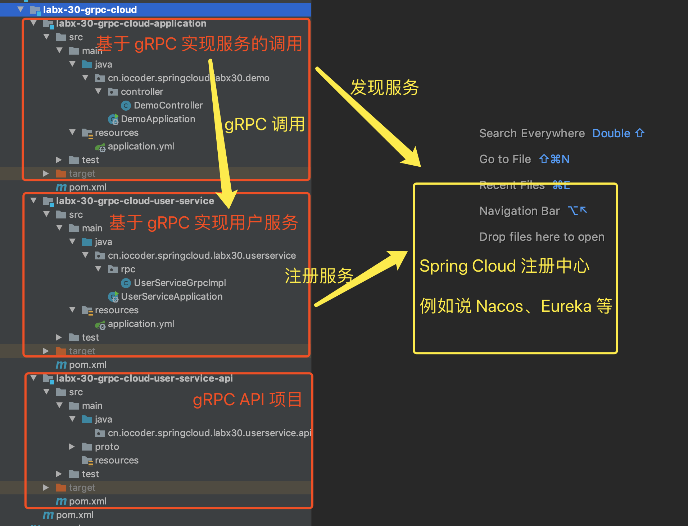
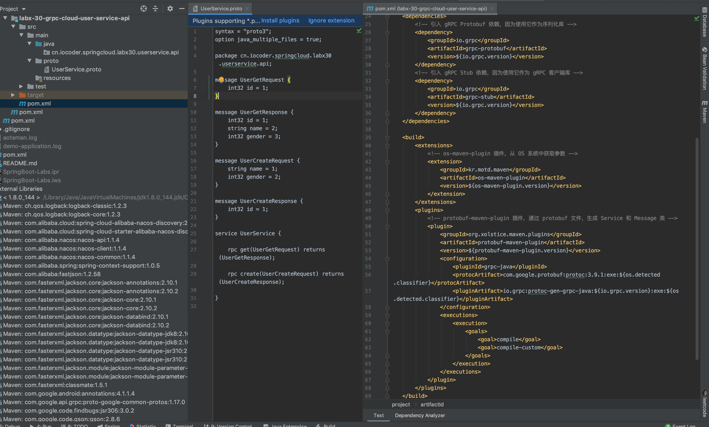
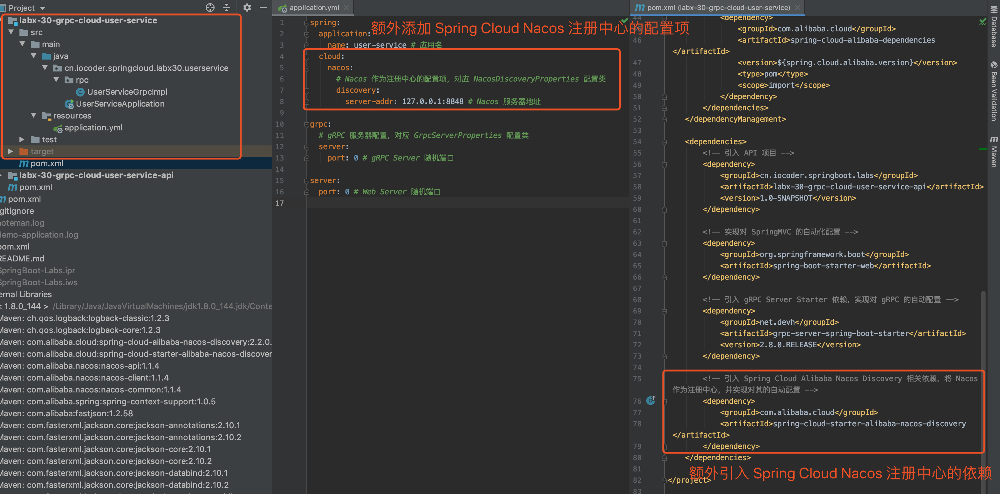
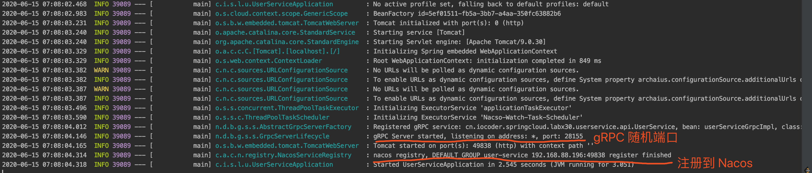
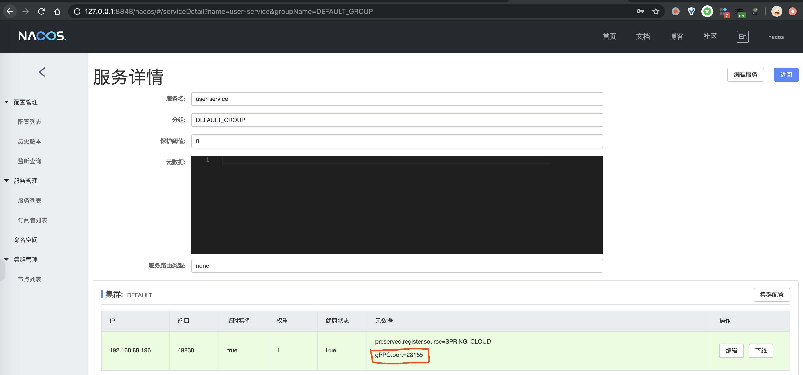
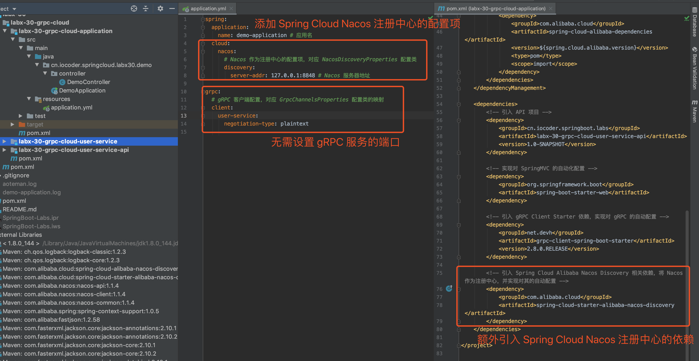

# Spring Cloud 服务调用 gRPC 入门


## 1. 概述

在[《芋道 Spring Boot gRPC 入门》](http://www.iocoder.cn/Spring-Boot/gRPC/?self)文章中，我们学习了如何在 Spring **Boot** 中如何集成 gRPC 实现服务调用。如果还木有看过的胖友，建议先去撸完~

在本文中，我们将学习如何在 Spring **Cloud** 使用 gRPC 实现服务调用。

目前 Spring Cloud 社区暂时没有提供 gRPC 相关的集成，不过我们仍然可以使用 [gRPC Spring Boot Starter](https://yidongnan.github.io/grpc-spring-boot-starter/) 项目。它已经支持将 gRPC 服务注册到 Spring Cloud 注册中心，同时从 Spring Cloud 注册中心获取指定服务的 gRPC 服务实例列表。

## 2. 快速入门

> 示例代码对应仓库：[`labx-30-grpc-cloud`](https://github.com/YunaiV/SpringBoot-Labs/tree/master/labx-30-spring-cloud-grpc/labx-30-grpc-cloud/) 。

本小节，我们来将[《芋道 Spring Boot gRPC 入门》](http://www.iocoder.cn/Spring-Boot/gRPC/?self)的示例项目 [`lab-64-grpc-starter`](https://github.com/YunaiV/SpringBoot-Labs/tree/master/lab-64/lab-64-grpc-starter/) 进行改造，接入 Spring Cloud 注册中心，从而实现服务的注册与发现。最终项目如下图所示：



### 2.1 API 项目

创建 [`labx-30-grpc-cloud-user-service-api`](https://github.com/YunaiV/SpringBoot-Labs/tree/master/labx-30-spring-cloud-grpc/labx-30-grpc-cloud/labx-30-grpc-cloud-user-service-api) 项目，创建 **protobuf** 文件，定义 gRPC 服务的 Service API，以及作为 Service API 方法的方法参数和返回类型的 Message。如下图所示：



> 友情提示：没有任何改动，胖友自己瞅瞅哈。

### 2.2 用户服务

创建 [`labx-30-grpc-cloud-user-service`](https://github.com/YunaiV/SpringBoot-Labs/tree/master/labx-30-spring-cloud-grpc/labx-30-grpc-cloud/labx-30-grpc-cloud-user-service) 项目，实现 [`labx-30-grpc-cloud-user-service-api`](https://github.com/YunaiV/SpringBoot-Labs/tree/master/labx-30-spring-cloud-grpc/labx-30-grpc-cloud/labx-30-grpc-cloud-user-service-api) 定义的 Service API，基于 gRPC Server 实现用户服务。如下图所示：



#### 2.2.1 引入依赖

创建 [`pom.xml`](https://github.com/YunaiV/SpringBoot-Labs/tree/master/labx-30-spring-cloud-grpc/labx-30-grpc-cloud/labx-30-grpc-cloud-user-service/pom.xml) 文件，引入 gRPC **Server** 相关依赖。内容如下：


```xml
<?xml version="1.0" encoding="UTF-8"?>
<project xmlns="http://maven.apache.org/POM/4.0.0"
         xmlns:xsi="http://www.w3.org/2001/XMLSchema-instance"
         xsi:schemaLocation="http://maven.apache.org/POM/4.0.0 http://maven.apache.org/xsd/maven-4.0.0.xsd">
    <parent>
        <artifactId>labx-30-grpc-cloud</artifactId>
        <groupId>cn.iocoder.springboot.labs</groupId>
        <version>1.0-SNAPSHOT</version>
    </parent>
    <modelVersion>4.0.0</modelVersion>

    <artifactId>labx-30-grpc-cloud-user-service</artifactId>

    <properties>
        <!-- 依赖相关配置 -->
        <spring.boot.version>2.2.4.RELEASE</spring.boot.version>
        <spring.cloud.version>Hoxton.SR1</spring.cloud.version>
        <spring.cloud.alibaba.version>2.2.0.RELEASE</spring.cloud.alibaba.version>
        <!-- 插件相关配置 -->
        <maven.compiler.target>1.8</maven.compiler.target>
        <maven.compiler.source>1.8</maven.compiler.source>
    </properties>

    <!--
        引入 Spring Boot、Spring Cloud、Spring Cloud Alibaba 三者 BOM 文件，进行依赖版本的管理，防止不兼容。
        在 https://dwz.cn/mcLIfNKt 文章中，Spring Cloud Alibaba 开发团队推荐了三者的依赖关系
     -->
    <dependencyManagement>
        <dependencies>
            <dependency>
                <groupId>org.springframework.boot</groupId>
                <artifactId>spring-boot-starter-parent</artifactId>
                <version>${spring.boot.version}</version>
                <type>pom</type>
                <scope>import</scope>
            </dependency>
            <dependency>
                <groupId>org.springframework.cloud</groupId>
                <artifactId>spring-cloud-dependencies</artifactId>
                <version>${spring.cloud.version}</version>
                <type>pom</type>
                <scope>import</scope>
            </dependency>
            <dependency>
                <groupId>com.alibaba.cloud</groupId>
                <artifactId>spring-cloud-alibaba-dependencies</artifactId>
                <version>${spring.cloud.alibaba.version}</version>
                <type>pom</type>
                <scope>import</scope>
            </dependency>
        </dependencies>
    </dependencyManagement>

    <dependencies>
        <!-- 引入 API 项目 -->
        <dependency>
            <groupId>cn.iocoder.springboot.labs</groupId>
            <artifactId>labx-30-grpc-cloud-user-service-api</artifactId>
            <version>1.0-SNAPSHOT</version>
        </dependency>

        <!-- 实现对 SpringMVC 的自动化配置 -->
        <dependency>
            <groupId>org.springframework.boot</groupId>
            <artifactId>spring-boot-starter-web</artifactId>
        </dependency>

        <!-- 引入 gRPC Server Starter 依赖，实现对 gRPC 的自动配置 -->
        <dependency>
            <groupId>net.devh</groupId>
            <artifactId>grpc-server-spring-boot-starter</artifactId>
            <version>2.8.0.RELEASE</version>
        </dependency>

        <!-- 引入 Spring Cloud Alibaba Nacos Discovery 相关依赖，将 Nacos 作为注册中心，并实现对其的自动配置 -->
        <dependency>
            <groupId>com.alibaba.cloud</groupId>
            <artifactId>spring-cloud-starter-alibaba-nacos-discovery</artifactId>
        </dependency>
    </dependencies>

</project>
```


额外引入 [`spring-cloud-starter-alibaba-nacos-discovery`](https://mvnrepository.com/artifact/com.alibaba.cloud/spring-cloud-starter-alibaba-nacos-discovery) 依赖，使用 Nacos 作为注册中心。

> 友情提示：如果胖友对 Nacos 作为 Spring Cloud 的注册中心不了解的话，可以后续看看[《芋道 Spring Cloud Alibaba 注册中心 Nacos 入门》](http://www.iocoder.cn/Spring-Cloud-Alibaba/Nacos-Discovery/?self)文章。

#### 2.2.2 配置文件

创建 [`application.yml`](https://github.com/YunaiV/SpringBoot-Labs/blob/master/labx-30-spring-cloud-grpc/labx-30-grpc-cloud/labx-30-grpc-cloud-user-service/src/main/resources/application.yml) 配置文件，添加 gRPC Server 配置。内容如下：


```yml
spring:
  application:
    name: user-service # 应用名
  cloud:
    nacos:
      # Nacos 作为注册中心的配置项，对应 NacosDiscoveryProperties 配置类
      discovery:
        server-addr: 127.0.0.1:8848 # Nacos 服务器地址

grpc:
  # gRPC 服务器配置，对应 GrpcServerProperties 配置类
  server:
    port: 0 # gRPC Server 随机端口

server:
  port: 0 # Web Server 随机端口
```


① 通过 `spring.application.name` 配置项，设置应用名（服务名），因为注册到 Spring Cloud 注册中心中，必须进行设置。

通过 `spring.cloud.nacos.discovery` 配置项，设置使用 Nacos 作为注册中心。

> 友情提示：如果胖友本地暂未安装 Nacos，可以参考[《Nacos 极简入门》](http://www.iocoder.cn/Nacos/install/?self)的[「2. 单机部署（最简模式）」](http://www.iocoder.cn/Nacos/install/?self)小节，花 5 分钟快速搭建一个。

② 设置 `grpc.server.port` 配置项为 0，设置**随机** gRPC 服务器的端口。

③ 设置 `server.port` 配置项为 0，设置**随机** Web 服务器的端口。因为向 Spring Cloud 注册中心实例时，必须使用一个服务器端口，这里就使用它。

#### 2.2.3 UserServiceGrpcImpl

创建 [UserServiceGrpcImpl](https://github.com/YunaiV/SpringBoot-Labs/blob/master/labx-30-spring-cloud-grpc/labx-30-grpc-cloud/labx-30-grpc-cloud-user-service/src/main/java/cn/iocoder/springcloud/labx30/userservice/rpc/UserServiceGrpcImpl.java) 类，继承 UserServiceGrpc.UserServiceImplBase 类，实现用户服务的逻辑。代码如下：


```java
@GrpcService
public class UserServiceGrpcImpl extends UserServiceGrpc.UserServiceImplBase {

    @Override
    public void get(UserGetRequest request, StreamObserver<UserGetResponse> responseObserver) {
        // 创建响应对象
        UserGetResponse.Builder builder = UserGetResponse.newBuilder();
        builder.setId(request.getId())
                .setName("没有昵称：" + request.getId())
                .setGender(request.getId() % 2 + 1);
        // 返回响应
        responseObserver.onNext(builder.build());
        responseObserver.onCompleted();
    }

    @Override
    public void create(UserCreateRequest request, StreamObserver<UserCreateResponse> responseObserver) {
        // 创建响应对象
        UserCreateResponse.Builder builder = UserCreateResponse.newBuilder();
        builder.setId((int) (System.currentTimeMillis() / 1000));
        // 返回响应
        responseObserver.onNext(builder.build());
        responseObserver.onCompleted();
    }

}
```


在类上，添加了 [`@GrpcService`](https://github.com/yidongnan/grpc-spring-boot-starter/blob/master/grpc-server-spring-boot-autoconfigure/src/main/java/net/devh/boot/grpc/server/service/GrpcService.java) 注解，声明它是一个 gRPC Server 实现类。

#### 2.2.4 UserServiceApplication

创建 [UserServiceApplication](https://github.com/YunaiV/SpringBoot-Labs/blob/master/labx-30-spring-cloud-grpc/labx-30-grpc-cloud/labx-30-grpc-cloud-user-service/src/main/java/cn/iocoder/springcloud/labx30/userservice/UserServiceApplication.java) 类，用户服务启动类。代码如下：


```java
@SpringBootApplication
public class UserServiceApplication {

    public static void main(String[] args) throws InterruptedException {
        // 启动 Spring Boot 应用
        SpringApplication.run(UserServiceApplication.class, args);
    }

}
```


#### 2.2.5 简单测试

① 执行 UserServiceApplication 类，启动成功，打印日志如下图：



② 在 Nacos 运维界面上，我们可以注册的服务实例上，其元数据带有 gRPC 服务器的端口。如下图所示：



如此，服务调用方从 Spring Cloud 注册中心获取到服务实例时，就知道 gRPC 调用时请求哪个端口咧。

### 2.3 调用示例项目

创建 [`labx-30-grpc-cloud-application`](https://github.com/YunaiV/SpringBoot-Labs/blob/master/labx-30-spring-cloud-grpc/labx-30-grpc-cloud/labx-30-grpc-cloud-application/) 项目，引用 [`labx-30-grpc-cloud-user-service-api`](https://github.com/YunaiV/SpringBoot-Labs/tree/master/labx-30-spring-cloud-grpc/labx-30-grpc-cloud/labx-30-grpc-cloud-user-service-api) 定义的 Service API，基于 gRPC Stub 调用用户服务。如下图所示：



#### 2.3.1 引入依赖

创建 [`pom.xml`](https://github.com/YunaiV/SpringBoot-Labs/blob/master/labx-30-spring-cloud-grpc/labx-30-grpc-cloud/labx-30-grpc-cloud-application/pom.xml) 文件，引入 gRPC **Client** 相关依赖。内容如下：


```xml
<?xml version="1.0" encoding="UTF-8"?>
<project xmlns="http://maven.apache.org/POM/4.0.0"
         xmlns:xsi="http://www.w3.org/2001/XMLSchema-instance"
         xsi:schemaLocation="http://maven.apache.org/POM/4.0.0 http://maven.apache.org/xsd/maven-4.0.0.xsd">
    <parent>
        <artifactId>labx-30-grpc-cloud</artifactId>
        <groupId>cn.iocoder.springboot.labs</groupId>
        <version>1.0-SNAPSHOT</version>
    </parent>
    <modelVersion>4.0.0</modelVersion>

    <artifactId>labx-30-grpc-cloud-application</artifactId>

    <properties>
        <!-- 依赖相关配置 -->
        <spring.boot.version>2.2.4.RELEASE</spring.boot.version>
        <spring.cloud.version>Hoxton.SR1</spring.cloud.version>
        <spring.cloud.alibaba.version>2.2.0.RELEASE</spring.cloud.alibaba.version>
        <!-- 插件相关配置 -->
        <maven.compiler.target>1.8</maven.compiler.target>
        <maven.compiler.source>1.8</maven.compiler.source>
    </properties>

    <!--
        引入 Spring Boot、Spring Cloud、Spring Cloud Alibaba 三者 BOM 文件，进行依赖版本的管理，防止不兼容。
        在 https://dwz.cn/mcLIfNKt 文章中，Spring Cloud Alibaba 开发团队推荐了三者的依赖关系
     -->
    <dependencyManagement>
        <dependencies>
            <dependency>
                <groupId>org.springframework.boot</groupId>
                <artifactId>spring-boot-starter-parent</artifactId>
                <version>${spring.boot.version}</version>
                <type>pom</type>
                <scope>import</scope>
            </dependency>
            <dependency>
                <groupId>org.springframework.cloud</groupId>
                <artifactId>spring-cloud-dependencies</artifactId>
                <version>${spring.cloud.version}</version>
                <type>pom</type>
                <scope>import</scope>
            </dependency>
            <dependency>
                <groupId>com.alibaba.cloud</groupId>
                <artifactId>spring-cloud-alibaba-dependencies</artifactId>
                <version>${spring.cloud.alibaba.version}</version>
                <type>pom</type>
                <scope>import</scope>
            </dependency>
        </dependencies>
    </dependencyManagement>

    <dependencies>
        <!-- 引入 API 项目 -->
        <dependency>
            <groupId>cn.iocoder.springboot.labs</groupId>
            <artifactId>labx-30-grpc-cloud-user-service-api</artifactId>
            <version>1.0-SNAPSHOT</version>
        </dependency>

        <!-- 实现对 SpringMVC 的自动化配置 -->
        <dependency>
            <groupId>org.springframework.boot</groupId>
            <artifactId>spring-boot-starter-web</artifactId>
        </dependency>

        <!-- 引入 gRPC Client Starter 依赖，实现对 gRPC 的自动配置 -->
        <dependency>
            <groupId>net.devh</groupId>
            <artifactId>grpc-client-spring-boot-starter</artifactId>
            <version>2.8.0.RELEASE</version>
        </dependency>

        <!-- 引入 Spring Cloud Alibaba Nacos Discovery 相关依赖，将 Nacos 作为注册中心，并实现对其的自动配置 -->
        <dependency>
            <groupId>com.alibaba.cloud</groupId>
            <artifactId>spring-cloud-starter-alibaba-nacos-discovery</artifactId>
        </dependency>
    </dependencies>

</project>
```


额外引入 [`spring-cloud-starter-alibaba-nacos-discovery`](https://mvnrepository.com/artifact/com.alibaba.cloud/spring-cloud-starter-alibaba-nacos-discovery) 依赖，使用 Nacos 作为注册中心。

#### 2.3.2 配置文件

创建 [`application.yml`](https://github.com/YunaiV/SpringBoot-Labs/blob/master/labx-30-spring-cloud-grpc/labx-30-grpc-cloud/labx-30-grpc-cloud-application/src/main/resources/application.yml) 配置文件，添加 gRPC Client 配置。内容如下：


```yaml
spring:
  application:
    name: demo-application # 应用名
  cloud:
    nacos:
      # Nacos 作为注册中心的配置项，对应 NacosDiscoveryProperties 配置类
      discovery:
        server-addr: 127.0.0.1:8848 # Nacos 服务器地址

grpc:
  # gRPC 客户端配置，对应 GrpcChannelsProperties 配置类的映射
  client:
    user-service:
      negotiation-type: plaintext
```


① 通过 `spring.application.name` 配置项，设置应用名（服务名），因为注册到 Spring Cloud 注册中心中，必须进行设置。

通过 `spring.cloud.nacos.discovery` 配置项，设置使用 Nacos 作为注册中心。

② 在 `grpc.client` 配置项，添加 `user-service` 配置项，需要设置和用户服务注册到 Spring Cloud 注册中心的名字一致，并且无需填写 gRPC 服务的地址。

#### 2.3.3 DemoController

创建 [DemoController](https://github.com/YunaiV/SpringBoot-Labs/blob/master/labx-30-spring-cloud-grpc/labx-30-grpc-cloud/labx-30-grpc-cloud-application/src/main/java/cn/iocoder/springcloud/labx30/demo/controller/DemoController.java) 类，提供使用 gRPC 调用用户服务的示例 API。代码如下：


```java
@RestController
@RequestMapping("/demo")
public class DemoController {

    @GrpcClient("user-service")
    private UserServiceGrpc.UserServiceBlockingStub userServiceGrpc;

    @GetMapping("/get")
    public String get(@RequestParam("id") Integer id) {
        // 创建请求
        UserGetRequest request = UserGetRequest.newBuilder().setId(id).build();
        // 执行 gRPC 请求
        UserGetResponse response = userServiceGrpc.get(request);
        // 响应
        return response.getName();
    }

    @GetMapping("/create") // 为了方便测试，实际使用 @PostMapping
    public Integer create(@RequestParam("name") String name,
                          @RequestParam("gender") Integer gender) {
        // 创建请求
        UserCreateRequest request = UserCreateRequest.newBuilder()
                .setName(name).setGender(gender).build();
        // 执行 gRPC 请求
        UserCreateResponse response = userServiceGrpc.create(request);
        // 响应
        return response.getId();
    }

}
```


在 `userServiceGrpc` 属性上，添加 [`@GrpcClient`](https://github.com/yidongnan/grpc-spring-boot-starter/blob/master/grpc-client-spring-boot-autoconfigure/src/main/java/net/devh/boot/grpc/client/inject/GrpcClient.java) 注解，声明引用 `user-service` 对应的 gRPC Client，即用户服务。

#### 2.3.4 DemoApplication

创建 [DemoApplication](https://github.com/YunaiV/SpringBoot-Labs/blob/master/labx-30-spring-cloud-grpc/labx-30-grpc-cloud/labx-30-grpc-cloud-application/src/main/java/cn/iocoder/springcloud/labx30/demo/DemoApplication.java) 类，示例项目的启动类。代码如下：


```java
@SpringBootApplication
public class DemoApplication {

    public static void main(String[] args) {
        // 启动 Spring Boot 应用
        SpringApplication.run(DemoApplication.class, args);
    }

}
```


#### 2.3.5 简单测试

① 执行 DemoApplication 类，启动示例项目。

② 使用浏览器，访问 <http://127.0.0.1:8080/demo/get?id=1> 地址，成功执行 gRPC 调用。返回结果如下：


```
没有昵称：1
```


③ 使用浏览器，访问 <http://127.0.0.1:8080/demo/create?name=yudaoyuanma&gender=1> 地址，成功执行 gRPC 调用。返回结果如下：


```
1592176922
```