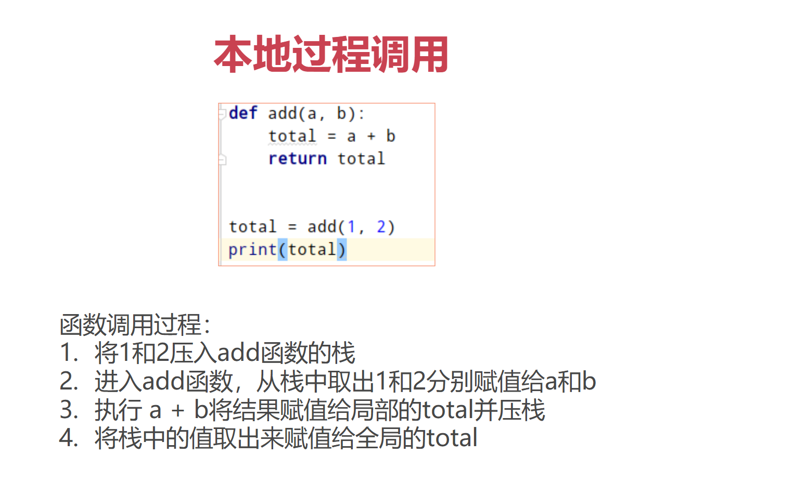
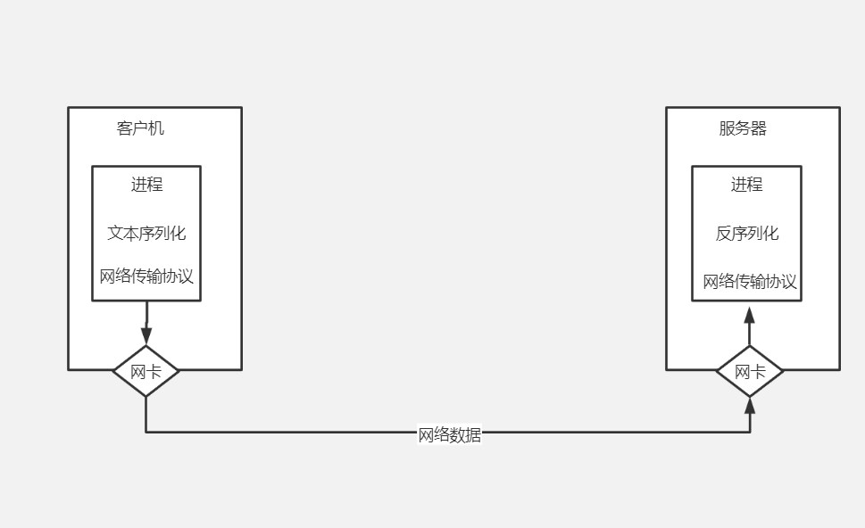
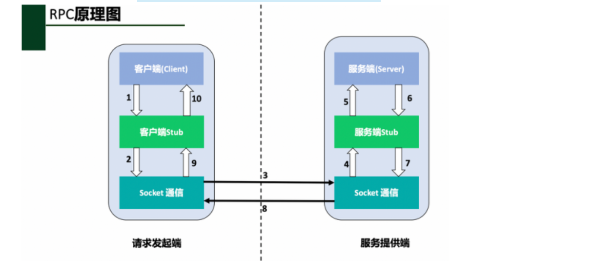
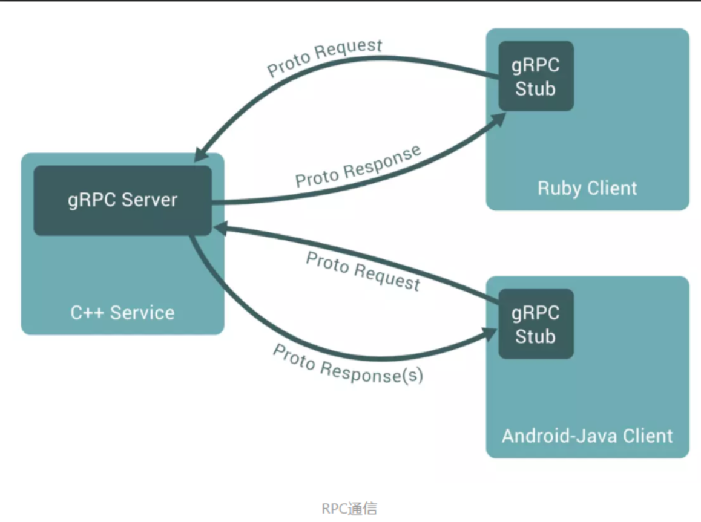
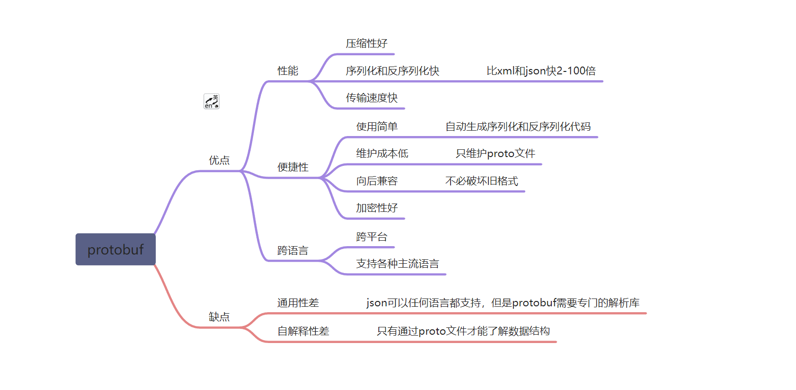
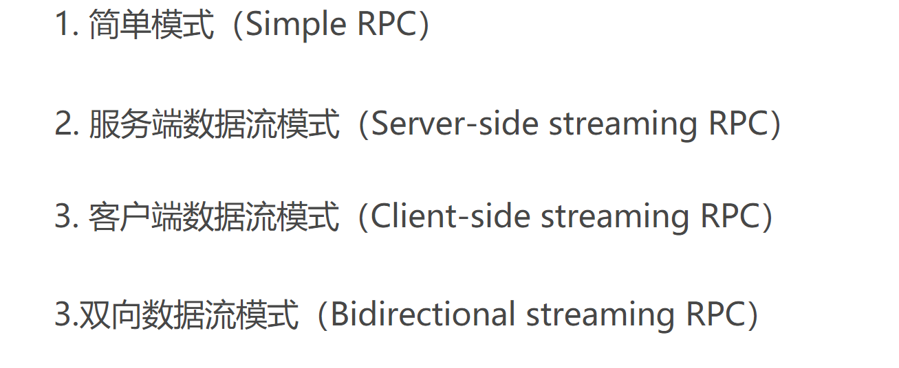
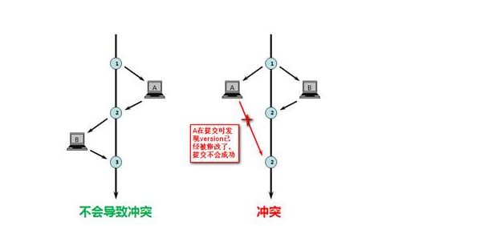

# grpc入门和进阶


## python 下的rpc开发


### 1.什么是rpc


```
RPC (Remote Procedure Call)远程过程调用，简单的理解是一个节点请求另一个节点提供的服务。

对应rpc的是本地过程调用，函数调用是最常见的本地过程调用

将本地过程调用变成远程过程调用会面临各种问题
```



远程过程面临的问题

1.原本的本地函数放到另一个服务器上去运行。但是引入了很多新问题。

2.Call的id映射

3.序列化和反序列化

4.网络传输


**远程过程调用带来的新问题**

在远程调用时，我们需要执行的函数体是在远程的机器上的，也就是说，add是在另一个进程中执行的。这就带来了几个新问题：

1. **Call ID映射**。我们怎么告诉远程机器我们要调用add，而不是sub或者Foo呢？在本地调用中，函数体是直接通过函数指针来指定的，我们调用add，编译器就自动帮我们调用它相应的函数指针。但是在远程调用中，函数指针是不行的，因为两个进程的地址空间是完全不一样的。所以，在RPC中，所有的函数都必须有自己的一个ID。这个ID在所有进程中都是唯一确定的。客户端在做远程过程调用时，必须附上这个ID。然后我们还需要在客户端和服务端分别维护一个 {函数 <--> Call ID} 的对应表。两者的表不一定需要完全相同，但相同的函数对应的Call ID必须相同。当客户端需要进行远程调用时，它就查一下这个表，找出相应的Call ID，然后把它传给服务端，服务端也通过查表，来确定客户端需要调用的函数，然后执行相应函数的代码。
2. **序列化和反序列化**。客户端怎么把参数值传给远程的函数呢？在本地调用中，我们只需要把参数压到栈里，然后让函数自己去栈里读就行。但是在远程过程调用时，客户端跟服务端是不同的进程，不能通过内存来传递参数。甚至有时候客户端和服务端使用的都不是同一种语言（比如服务端用C++，客户端用Java或者Python）。这时候就需要客户端把参数先转成一个字节流，传给服务端后，再把字节流转成自己能读取的格式。这个过程叫序列化和反序列化。同理，从服务端返回的值也需要序列化反序列化的过程。
3. **网络传输**。远程调用往往用在网络上，客户端和服务端是通过网络连接的。所有的数据都需要通过网络传输，因此就需要有一个网络传输层。网络传输层需要把Call ID和序列化后的参数字节流传给服务端，然后再把序列化后的调用结果传回客户端。只要能完成这两者的，都可以作为传输层使用。因此，它所使用的协议其实是不限的，能完成传输就行。尽管大部分RPC框架都使用TCP协议，但其实UDP也可以，而gRPC干脆就用了HTTP2。Java的Netty也属于这层的东西。



解决了上面三个机制，就能实现RPC了，具体过程如下：

client端解决的问题：

```
 将这个调用映射为Call ID。这里假设用最简单的字符串当Call ID的方法
2. 将Call ID，a和b序列化。可以直接将它们的值以二进制形式打包
3. 把2中得到的数据包发送给ServerAddr，这需要使用网络传输层
4. 等待服务器返回结果
4. 如果服务器调用成功，那么就将结果反序列化，并赋给total
```

server端解决的问题

```
1. 在本地维护一个Call ID到函数指针的映射call_id_map，可以用dict完成
2. 等待请求，包括多线程的并发处理能力
3. 得到一个请求后，将其数据包反序列化，得到Call ID
4. 通过在call_id_map中查找，得到相应的函数指针
5. 将a和rb反序列化后，在本地调用add函数，得到结果
6. 将结果序列化后通过网络返回给Client
```

在上面的整个流程中，估计有部分同学看到了熟悉的计算机网络的流程和web服务器的定义。

所以要实现一个RPC框架，其实只需要按以上流程实现就基本完成了。

其中：

- Call ID映射可以直接使用函数字符串，也可以使用整数ID。映射表一般就是一个哈希表。
- 序列化反序列化可以自己写，也可以使用Protobuf或者FlatBuffers之类的。
- 网络传输库可以自己写socket，或者用asio，ZeroMQ，Netty之类。

实际上真正的开发过程中，除了上面的基本功能以外还需要更多的细节：网络错误、流量控制、超时和重试等。

最后提一个问题： 如何将远程的这些过程写出本地函数调用的感觉来？


### **4.rpc开发的要素分析**

rpc开发的四大要素

RPC技术在架构设计上有四部分组成，分别是：**客户端、客户端存根、服务端、服务端存根。**

- **客户端(Client)：**服务调用发起方，也称为服务消费者。
- **客户端存根(Client  Stub)：**该程序运行在客户端所在的计算机机器上，主要用来存储要调用的服务器的地址，另外，该程序还负责将客户端请求远端服务器程序的数据信息打包成数据包，通过网络发送给服务端Stub程序；其次，还要接收服务端Stub程序发送的调用结果数据包，并解析返回给客户端。
- **服务端(Server)：**远端的计算机机器上运行的程序，其中有客户端要调用的方法。
- **服务端存根(Server Stub)：**接收客户Stub程序通过网络发送的请求消息数据包，并调用服务端中真正的程序功能方法，完成功能调用；其次，将服务端执行调用的结果进行数据处理打包发送给客户端Stub程序。

了解完了RPC技术的组成结构我们来看一下具体是如何实现客户端到服务端的调用的。实际上，如果我们想要在网络中的任意两台计算机上实现远程调用过程，要解决很多问题，比如：

- 两台物理机器在网络中要建立稳定可靠的通信连接。

- 两台服务器的通信协议的定义问题，即两台服务器上的程序如何识别对方的请求和返回结果。也就是说两台计算机必须都能够识别对方发来的信息，并且能够识别出其中的请求含义和返回含义，然后才能进行处理。这其实就是通信协议所要完成的工作。

  

在上述图中，通过1-10的步骤图解的形式，说明了RPC每一步的调用过程。具体描述为：

- 1、客户端想要发起一个**远程过程调用**，首先通过调用**本地**客户端Stub程序的方式调用想要使用的功能方法名；
- 2、客户端Stub程序接收到了客户端的功能调用请求，**将客户端请求调用的方法名，携带的参数等信息做序列化操作，并打包成数据包。**
- 3、客户端Stub查找到远程服务器程序的IP地址，调用Socket通信协议，通过网络发送给服务端。
- 4、服务端Stub程序接收到客户端发送的数据包信息，并**通过约定好的协议将数据进行反序列化，得到请求的方法名和请求参数等信息。**
- 5、服务端Stub程序准备相关数据，**调用本地Server对应的功能方法进行，并传入相应的参数，进行业务处理。**
- 6、服务端程序根据已有业务逻辑执行调用过程，待业务执行结束，将执行结果返回给服务端Stub程序。
- 7、服务端Stub程序**将程序调用结果按照约定的协议进行序列化，**并通过网络发送回客户端Stub程序。
- 8、客户端Stub程序接收到服务端Stub发送的返回数据，**对数据进行反序列化操作，**并将调用返回的数据传递给客户端请求发起者。
- 9、客户端请求发起者得到调用结果，整个RPC调用过程结束。

rpc需要使用到的术语

通过上文一系列的文字描述和讲解，我们已经了解了RPC的由来和RPC整个调用过程。我们可以看到RPC是一系列操作的集合，其中涉及到很多对数据的操作，以及网络通信。因此，我们对RPC中涉及到的技术做一个总结和分析：

- **1、动态代理技术：** 上文中我们提到的Client Stub和Sever Stub程序，在具体的编码和开发实践过程中，都是使用动态代理技术自动生成的一段程序。
- **2、序列化和反序列化：**  在RPC调用的过程中，我们可以看到数据需要在一台机器上传输到另外一台机器上。在互联网上，所有的数据都是以字节的形式进行传输的。而我们在编程的过程中，往往都是使用数据对象，因此想要在网络上将数据对象和相关变量进行传输，就需要对数据对象做序列化和反序列化的操作。
  - **序列化：**把对象转换为字节序列的过程称为对象的序列化，也就是编码的过程。
  - **反序列化：**把字节序列恢复为对象的过程称为对象的反序列化，也就是解码的过程。

我们常见的Json,XML等相关框架都可以对数据做序列化和反序列化编解码操作。后面我们要学习的Protobuf协议，这也是一种数据编解码的协议，在RPC框架中使用的更广泛。


## grpc入门


### 1. 什么是grpc和protobuf


#### grpc

gRPC 是一个高性能、开源和通用的 RPC 框架，面向移动和 HTTP/2 设计。目前提供 C、Java 和 Go 语言版本，分别是：[grpc](https://github.com/grpc/grpc), [grpc-java](https://github.com/grpc/grpc-java), [grpc-go](https://github.com/grpc/grpc-go). 其中 C 版本支持 [C](https://github.com/grpc/grpc), [C++](https://github.com/grpc/grpc/tree/master/src/cpp), [Node.js](https://github.com/grpc/grpc/tree/master/src/node), [Python](https://github.com/grpc/grpc/tree/master/src/python), [Ruby](https://github.com/grpc/grpc/tree/master/src/ruby), [Objective-C](https://github.com/grpc/grpc/tree/master/src/objective-c), [PHP](https://github.com/grpc/grpc/tree/master/src/php) 和 [C#](https://github.com/grpc/grpc/tree/master/src/csharp) 支持.




#### protobuf

java中的dubbo dubbo/rmi/hessian messagepack 如果你懂了协议完全有能力自己去实现一个协议

- 习惯用 `Json、XML` 数据存储格式的你们，相信大多都没听过`Protocol Buffer`
- `Protocol Buffer` 其实 是 `Google`出品的一种轻量 & 高效的结构化数据存储格式，性能比 `Json、XML` 真的强！太！多！
- protobuf经历了protobuf2和protobuf3，pb3比pb2简化了很多，目前主流的版本是pb3




### **6.grpc的四种数据流**

之前我们讲了 grpc 怎么简单的使用 ，这次讲讲 grpc 中的 stream，srteam 顾名思义 就是 一种 流，可以源源不断的 推送 数据，很适合 传输一些大数据，或者 服务端 和 客户端 长时间 数据交互，比如 客户端 可以向 服务端 订阅 一个数据，服务端 就 可以利用 stream ，源源不断地 推送数据。


#### rpc还有哪些需求




#### 简单模式

这种模式最为传统，即客户端发起一次请求 ，服务端响应一个数据，这和大家平时熟悉的RPC没有什么大的区别，所以不再详细介绍。


#### 服务端数据流

这种模式是客户端发起一次请求，服务端返回一段连续的数据流。典型的例子是客户端向服务端发送一个股票代码，服务端就把该股票的实时数据源源不断的返回给客户端。


#### 客户端数据流

与服务端数据流模式相反，这次是客户端源源不断的向服务端发送数据流。而在发送结束后，由服务端返回一个响应。典型的例子就是物联网终端向服务器报送数据。


#### 双向数据流

顾名思义，就是客户端和服务端都可以向对方发送数据流，这个时候 双方的数据可以同时互相发送，也就是可以实现实时交互。典型的例子就是聊天机器人。


### grpc的超时和重试

#### **超时**

timeout是为了保护服务，避免consumer服务因为provider 响应慢而也变得响应很慢，这样consumer可以尽量保持原有的性能。

#### 重试

如果provider只是偶尔抖动，那么超时后直接放弃，不做后续处理，就会导致当前请求错误，也会带来业务方面的损失。对于这种偶尔抖动，可以在超时后重试一下，重试如果正常返回了，那么这次请求就被挽救了，能够正常给前端返回数据，只不过比原来响应慢一点。重试可以考虑切换一台机器来进行调用，因为原来机器可能由于临时负载高而性能下降，重试会更加剧其性能问题，而换一台机器，得到更快返回的概率也更大一些。

#### 幂等

如果允许consumer重试，那么provider就要能够做到幂等。同一个请求被consumer多次调用，对provider产生的影响是一致的。而且这个幂等应该是服务级别的，而不是某台机器层面的，重试调用任何一台机器，都应该做到幂等。


##### 背景  

**我们实际系统中有很多操作，是不管做多少次，都应该产生一样的效果或返回一样的结果。**

**get请求一般没有幂等性需求、delete请求一般也没有幂等性需求，post、update视情况而定例如：**  

1. 前端重复提交选中的数据，应该后台只产生对应这个数据的一个反应结果。 
2. 我们发起一笔付款请求，应该只扣用户账户一次钱，当遇到网络重发或系统bug重发，也应该只扣一次钱； 
3. 发送消息，也应该只发一次，同样的短信发给用户，用户会哭的； 
4. 创建业务订单，一次业务请求只能创建一个，创建多个就会出大问题。  


##### 幂等性概念  

幂等（idempotent、idempotence）是一个数学与计算机学概念，常见于抽象代数中。 

在编程中.一个幂等操作的特点是其任意多次执行所产生的影响均与一次执行的影响相同。幂等函数，或幂等方法，是指可以使用相同参数重复执行，并能获得相同结果的函数。这些函数不会影响系统状态，也不用担心重复执行会对系统造成改变。例如，“getUsername()和setTrue()”函数就是一个幂等函数。

**更复杂的操作幂等保证是利用唯一交易号(流水号）实现。**


##### 技术方案  

###### 唯一索引，防止新增脏数据

比如：新建用户的时候将手机号码设置为唯一索引，那么即使你重试，也只会新建一个用户，不会因为重试导致当前用户注册了两个用户。

**要点： 唯一索引或唯一组合索引来防止新增数据存在脏数据 （当表存在唯一索引，并发时新增报错时，再查询一次就可以了，数据应该已经存在了，返回结果即可）**  


###### token机制，防止页面重复提交

**业务要求：**  

页面的数据只能被点击提交一次  

**发生原因：**  

由于重复点击或者网络重发，或者nginx重发等情况会导致数据被重复提交  

**解决办法：**  

集群环境：采用token加redis（redis单线程的，处理需要排队） 

**处理流程：**  

1. 数据提交前要向服务的申请token，token放到redis或内存，token有效时间 
2. 提交后后台校验token，同时删除token,生成新的token返回。

**token特点：**  

要申请，一次有效性，可以限流  

注意：redis要用删除操作来判断token，删除成功代表token校验通过，如果用select+delete来校验token，存在并发问题，不建议使用


######  悲观锁  

获取数据的时候加锁获取 
select * from table_xxx where id='xxx' for update;  

**注意：id字段一定是主键或者唯一索引，不然是锁表，会死人的 悲观锁使用时一般伴随事务一起使用，数据锁定时间可能会很长，根据实际情况选用** 


###### 乐观锁  

乐观锁只是在更新数据那一刻锁表，其他时间不锁表，所以相对于悲观锁，效率更高。

乐观锁的实现方式多种多样可以通过version或者其他状态条件： 
1. 通过版本号实现 
update table_xxx set name=#name#,version=version+1 where version=#version# 
如下图(来自网上)： 



2. 通过条件限制 

update table_xxx set avai_amount=avai_amount-#subAmount# where avai_amount-#subAmount# >= 0  

要求：quality-#subQuality# >= ，这个情景适合不用版本号，只更新是做数据安全校验，适合库存模型，扣份额和回滚份额，性能更高

**注意：乐观锁的更新操作，最好用主键或者唯一索引来更新,这样是行锁，否则更新时会锁表，上面两个sql改成下面的两个更好**

```sql
update table_xxx set name=#name#,version=version+1 where id=#id# and version=#version# 
update table_xxx set avai_amount=avai_amount-#subAmount# where id=#id# and avai_amount-#subAmount# >= 0  
```

###### 分布式锁

还是拿插入数据的例子，如果是分布是系统，构建全局唯一索引比较困难，例如唯一性的字段没法确定，这时候可以引入分布式锁，通过第三方的系统(redis或zookeeper)，在业务系统插入数据或者更新数据，获取分布式锁，然后做操作，之后释放锁，这样其实是把多线程并发的锁的思路，引入多个系统，也就是分布式系统中得解决思路。 

**要点：某个长流程处理过程要求不能并发执行，可以在流程执行之前根据某个标志(用户ID+后缀等)获取分布式锁，其他流程执行时获取锁就会失败，也就是同一时间该流程只能有一个能执行成功，执行完成后，释放分布式锁(分布式锁要第三方系统提供。**


###### select + insert  

并发不高的后台系统，或者一些任务JOB，为了支持幂等，支持重复执行，简单的处理方法是，先查询下一些关键数据，判断是否已经执行过，在进行业务处理，就可以了  

**注意：核心高并发流程不要用这种方法。**  


##### 对外提供接口的api如何保证

如银联提供的付款接口：需要接入商户提交付款请求时附带：source来源，seq序列号 

source+seq在数据库里面做唯一索引，防止多次付款，(并发时，只能处理一个请求) 

**重点：     对外提供接口为了支持幂等调用，接口有两个字段必须传，一个是来源source，一个是来源方序列号seq，这个两个字段在提供方系统里面做联合唯一索引，这样当第三方调用时，先在本方系统里面查询一下，是否已经处理过，返回相应处理结果；没有处理过，进行相应处理，返回结果。注意，为了幂等友好，一定要先查询一下，是否处理过该笔业务，不查询直接插入业务系统，会报错，但实际已经处理了。**  

##### 总结 

幂等与你是不是分布式高并发没有关系。关键是你的操作是不是幂等的。一个幂等的操作典型如：把编号为5的记录的A字段设置为0这种操作不管执行多少次都是幂等的。一个非幂等的操作典型如：把编号为5的记录的A字段增加1这种操作显然就不是幂等的。要做到幂等性，从接口设计上来说不设计任何非幂等的操作即可。譬如说需求是：当用户点击赞同时，将答案的赞同数量+1。改为：当用户点击赞同时，确保答案赞同表中存在一条记录，用户、答案。赞同数量由答案赞同表统计出来。总之幂等性应该是合格程序员的一个基因，在设计系统时，是首要考虑的问题，尤其是在像支付宝，银行，互联网金融公司等涉及的都是钱的系统，既要高效，数据也要准确，所以不能出现多扣款，多打款等问题，这样会很难处理，用户体验也不好。