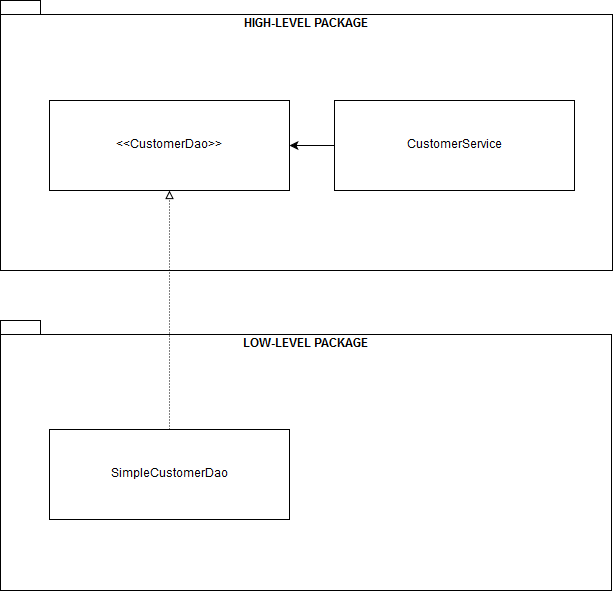

# Java中的依赖倒置原则


## 1、概述

依赖倒置原则 (DIP) 是面向对象编程原则集合的一部分，通常称为[SOLID](https://www.baeldung.com/solid-principles)。

从本质上讲，DIP 是一种简单但功能强大的编程范例，我们可以使用它**来实现结构良好、高度解耦和可重用的软件组件**。

在本教程中，**我们将探讨实现 DIP 的不同方法——一种在 Java 8 中，另一种在 Java 11** 中使用[JPMS](https://www.baeldung.com/java-9-modularity)（Java 平台模块系统）。

## **2、 依赖注入和控制反转不是 DIP 实现**

首先也是最重要的，让我们做一个基本的区别来正确理解基础知识：**DIP既不是依赖注入 (DI) 也不是控制反转 (IoC)**。即便如此，他们都很好地协同工作。

简单地说，DI 就是让软件组件通过 API 显式声明它们的依赖关系或协作者，而不是自己获取它们。

如果没有 DI，软件组件就会彼此紧密耦合。因此，它们难以重用、替换、模拟和测试，导致设计僵化。

**使用 DI，提供组件依赖关系和连接对象图的责任从组件转移到底层注入框架。**从这个角度来看，DI 只是实现 IoC 的一种方式。

另一方面，**IoC 是一种模式，其中应用程序的流控制是反向的**。使用传统的编程方法，我们的自定义代码可以控制应用程序的流程。相反，**使用 IoC，控制权转移到外部框架或容器**。

**该框架是一个可扩展的代码库，它定义了用于插入我们自己的代码的挂钩点**。

反过来，框架通过一个或多个专门的子类、使用接口的实现以及通过注解来回调我们的代码。[Spring 框架](https://www.baeldung.com/spring-tutorial)是最后一种方法的一个很好的例子。


## **3、DIP 的基本原理**

[*为了理解 DIP 背后的动机，让我们从 Robert C. Martin 在他的著作《敏捷软件开发：原则、模式和实践》*](https://www.pearson.com/us/higher-education/program/Martin-Agile-Software-Development-Principles-Patterns-and-Practices/PGM272869.html)中给出的正式定义开始：

1. 高级模块不应该依赖于低级模块。两者都应该依赖于抽象。
2. 抽象不应该依赖于细节。细节应该取决于抽象。

因此，很明显，**DIP 的核心是通过抽象出高级组件和低级组件之间的交互来反转高级组件和低级组件之间的经典依赖关系**。

在传统的软件开发中，高级组件依赖于低级组件。因此，很难重用高级组件。


### **3.1 设计选择和 DIP**

让我们考虑一个简单的*StringProcessor*类，它使用*StringReader组件获取**String*值，并使用*StringWriter*组件将其写入其他地方：

```java
public class StringProcessor {
    
    private final StringReader stringReader;
    private final StringWriter stringWriter;
    
    public StringProcessor(StringReader stringReader, StringWriter stringWriter) {
        this.stringReader = stringReader;
        this.stringWriter = stringWriter;
    }

    public void printString() {
        stringWriter.write(stringReader.getValue());
    }
}
```

尽管*StringProcessor*类的实现是基本的，但我们可以在此处做出多种设计选择。

让我们将每个设计选择分解为单独的项目，以清楚地了解每个项目如何影响整体设计：

1. 底层组件 StringReader 和 StringWriter 是放置在同一个包中的具体类。 StringProcessor，高级组件被放置在不同的包中。 StringProcessor 依赖于 StringReader 和 StringWriter。没有依赖倒置，因此 StringProcessor 不能在不同的上下文中重用。

2. **StringReader和StringWriter是与实现一起放在同一个包中的接口**。*StringProcessor*现在依赖于抽象，但低级组件不依赖。我们还没有实现依赖倒置。

3. StringReader 和 StringWriter 是与 StringProcessor 放在同一个包中的接口。现在，StringProcessor 拥有抽象的明确所有权。 StringProcessor、StringReader 和 StringWriter 都依赖于抽象。我们通过抽象组件之间的交互，实现了从上到下的依赖倒置。 StringProcessor 现在可以在不同的上下文中重用。

4. **StringReader和StringWriter是放在与StringProcessor分开的包中的接口。我们实现了依赖倒置，替换StringReader*和*StringWriter*实现也更容易。*StringProcessor*也可以在不同的上下文中重用。

   在上述所有场景中，只有第 3 项和第 4 项是 DIP 的有效实现。

     

### 3.2 **Defining the Ownership of the Abstractions**

  第 3 项是直接 DIP 实现，**其中高级组件和抽象被放置在同一个包中。**因此，**高级组件拥有抽象**。在这个实现中，高层组件负责定义抽象协议，通过它与低层组件交互。

同样，第 4 项是一个更加解耦的 DIP 实现。在该模式的变体中，**高级组件和低级组件都没有抽象的所有权**。

抽象被放置在一个单独的层中，这有助于切换低级组件。同时，所有组件相互隔离，从而产生更强的封装性。


### **3.3 选择正确的抽象级别**

在大多数情况下，选择高级组件将使用的抽象应该相当简单，但有一个值得注意的警告：抽象级别。

在上面的例子中，我们用DI将一个StringReader类型注入到StringProcessor类中。只要StringReader的抽象层次与StringProcessor的领域接近，这将是有效的。

相比之下，如果StringReader是一个文件对象，从文件中读取一个字符串值，我们就会错过DIP的内在好处。在这种情况下，StringReader的抽象水平会比StringProcessor的领域水平低很多。
  简而言之，**高层组件用于与低层组件互操作的抽象级别应该始终接近前者的领域**。


## **4、Java 8 实现**

我们已经深入研究了 DIP 的关键概念，所以现在我们将探索 Java 8 中该模式的一些实际实现。


### **4.1 直接 DIP 实现**

让我们创建一个演示应用程序，它从持久层获取一些客户并以一些额外的方式处理它们。

该层的底层存储通常是一个数据库，但为了保持代码简单，这里我们将使用一个普通的*Map*。

让我们从**定义高级组件**开始：

```java
public class CustomerService {

    private final CustomerDao customerDao;

    // standard constructor / getter

    public Optional<Customer> findById(int id) {
        return customerDao.findById(id);
    }

    public List<Customer> findAll() {
        return customerDao.findAll();
    }
}
```

正如我们所见，*CustomerService*类实现了*findById()*和*findAll()*方法，它们使用简单的[DAO](https://www.baeldung.com/java-dao-pattern)实现从持久层获取客户。当然，我们本可以在类中封装更多的功能，但为了简单起见，让我们保持这样。

在这种情况下，CustomerDao类型是CustomerService用于消费底层组件的抽象。

*由于这是一个直接的 DIP 实现，让我们将抽象定义为CustomerService*的同一包中的接口：

```java
public interface CustomerDao {

    Optional<Customer> findById(int id);

    List<Customer> findAll();

}
```

通过将抽象放在高级组件的同一个包中，**我们使组件负责拥有抽象**。这个实现细节**真正颠倒了高级组件和低级组件之间的依赖关系**。

此外，**CustomerDao****的抽象级别接近*****CustomerService**的抽象级别，*这也是良好的 DIP 实现所必需的。

现在，让我们在不同的包中创建低级组件。在这种情况下，它只是一个基本的*CustomerDao*实现：  

```java
public class SimpleCustomerDao implements CustomerDao {

    // standard constructor / getter

    @Override
    public Optional<Customer> findById(int id) {
        return Optional.ofNullable(customers.get(id));
    }

    @Override
    public List<Customer> findAll() {
        return new ArrayList<>(customers.values());
    }
}
```

最后，让我们创建一个单元测试来检查*CustomerService*类的功能：

```java
@Before
public void setUpCustomerServiceInstance() {
    var customers = new HashMap<Integer, Customer>();
    customers.put(1, new Customer("John"));
    customers.put(2, new Customer("Susan"));
    customerService = new CustomerService(new SimpleCustomerDao(customers));
}

@Test
public void givenCustomerServiceInstance_whenCalledFindById_thenCorrect() {
    assertThat(customerService.findById(1)).isInstanceOf(Optional.class);
}

@Test
public void givenCustomerServiceInstance_whenCalledFindAll_thenCorrect() {
    assertThat(customerService.findAll()).isInstanceOf(List.class);
}

@Test
public void givenCustomerServiceInstance_whenCalledFindByIdWithNullCustomer_thenCorrect() {
    var customers = new HashMap<Integer, Customer>();
    customers.put(1, null);
    customerService = new CustomerService(new SimpleCustomerDao(customers));
    Customer customer = customerService.findById(1).orElseGet(() -> new Customer("Non-existing customer"));
    assertThat(customer.getName()).isEqualTo("Non-existing customer");
}
```

单元测试练习*CustomerService* API。而且，它还展示了如何手动将抽象注入到高级组件中。在大多数情况下，我们会使用某种 DI 容器或框架来完成此任务。

此外，下图显示了我们的演示应用程序的结构，从高级到低级包的角度：




### **4.2 Alternative DIP 实现**

正如我们之前所讨论的，可以使用另一种 DIP 实现，我们将高级组件、抽象和低级组件放在不同的包中。

由于显而易见的原因，这种变体更加灵活，产生了更好的组件封装，并且更容易替换低级组件。

当然，实现这种模式的变体归结为只是将*CustomerService*、*MapCustomerDao*和*CustomerDao*放在单独的包中。

因此，一张图就足以显示每个组件在此实现中的布局方式：


## **5、Java 11 模块化实现**

暂略

