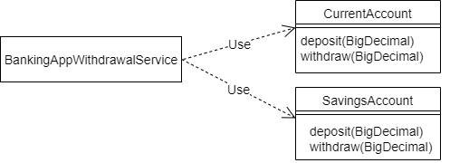
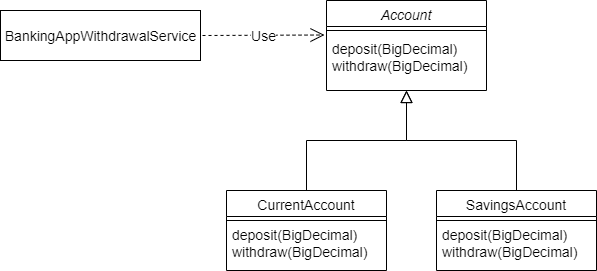
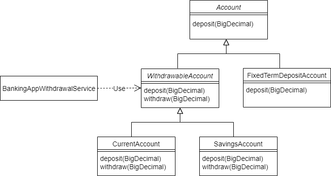

# Java中的里氏替换原则

## 1、概述

[SOLID 设计原则](https://www.baeldung.com/solid-principles)由 Robert C. Martin 在其 2000 年的论文《*设计原则和设计模式》*中介绍。SOLID 设计原则帮助我们**创建更易于维护、更易于理解和更灵活的软件。**

在本文中，我们将讨论 Liskov 替换原则，即首字母缩写词中的“L”。


## 2、 开闭原则

要了解 Liskov 替换原则，我们必须首先了解开闭原则（SOLID 中的“O”）。

开放/封闭原则的目标鼓励我们设计我们的软件，所以我们**只能通过添加新代码来添加新功能**。当这可能时，我们有松散耦合的，因此易于维护的应用程序。


## 3、一个示例用例

让我们看一个银行应用程序示例，以进一步了解开放/封闭原则。

### 3.1 没有开闭原则

我们的银行应用程序支持两种账户类型——“当前”和“储蓄”。它们分别由*CurrentAccount*和*SavingsAccount*类表示。BankingAppWithdrawalService*为其*用户提供提款功能：



不幸的是，扩展这种设计存在问题。BankingAppWithdrawalService知道*account*的两个具体实现*。*因此，每次引入新的帐户类型时，都需要更改*BankingAppWithdrawalService 。*


### 3.2. 使用开闭原则使代码可扩展

让我们重新设计解决方案以符合 Open/Closed 原则。当需要新的账户类型时，我们将通过使用*Account*基类来关闭*BankingAppWithdrawalService的修改：*



*在这里，我们介绍了CurrentAccount*和*SavingsAccount*扩展的新抽象*Account*类。

BankingAppWithdrawalService*不再*依赖于具体的账户类。因为它现在只依赖于抽象类，所以在引入新的帐户类型时不需要更改它。

因此，*BankingAppWithdrawalService*对具有新帐户类型的扩展开放，但对**修改****关闭**，因为新类型不需要更改即可集成。

### 3.3 Java 代码

让我们看一下 Java 中的这个例子。首先，让我们定义*Account*类：

```java
public abstract class Account {
    protected abstract void deposit(BigDecimal amount);

    /**
     * Reduces the balance of the account by the specified amount
     * provided given amount > 0 and account meets minimum available
     * balance criteria.
     *
     * @param amount
     */
    protected abstract void withdraw(BigDecimal amount);
}
```

而且，让我们定义*BankingAppWithdrawalService*：

```java
public class BankingAppWithdrawalService {
    private Account account;

    public BankingAppWithdrawalService(Account account) {
        this.account = account;
    }

    public void withdraw(BigDecimal amount) {
        account.withdraw(amount);
    }
}
```

现在，让我们看看在这个设计中，一个新的账户类型可能会如何违反 Liskov 替换原则。


### 3.4 一种新的帐户类型

该银行现在希望为其客户提供高利息定期存款账户。

为了支持这一点，让我们引入一个新的*FixedTermDepositAccount*类。现实世界中的定期存款账户“是”一种账户。这意味着我们面向对象设计中的继承。

因此，让我们将*FixedTermDepositAccount 设为 Account**的*子类：

```java
public class FixedTermDepositAccount extends Account {
    // Overridden methods...
}
```

到目前为止，一切都很好。但是，银行不希望允许定期存款账户取款。

这意味着新的FixedTermDepositAccount类不能有意义地提供Account定义的提款方法。一个常见的解决方法是让FixedTermDepositAccount在它不能实现的方法中抛出一个UnsupportedOperationException。

```java
public class FixedTermDepositAccount extends Account {
    @Override
    protected void deposit(BigDecimal amount) {
        // Deposit into this account
    }

    @Override
    protected void withdraw(BigDecimal amount) {
        throw new UnsupportedOperationException("Withdrawals are not supported by FixedTermDepositAccount!!");
    }
}
```

### 3.5 使用新帐户类型进行测试

虽然新类工作正常，但让我们尝试将它与*BankingAppWithdrawalService*一起使用：

```java
Account myFixedTermDepositAccount = new FixedTermDepositAccount();
myFixedTermDepositAccount.deposit(new BigDecimal(1000.00));

BankingAppWithdrawalService withdrawalService = new BankingAppWithdrawalService(myFixedTermDepositAccount);
withdrawalService.withdraw(new BigDecimal(100.00));
```

不出所料，银行应用程序崩溃并出现以下错误：

```
Withdrawals are not supported by FixedTermDepositAccount!!
```

如果对象的有效组合导致错误，那么这种设计显然有问题。


### 3.6  什么地方出了错？

BankingAppWithdrawalService是*Account*类的*客户端。*它期望*Account*及其子类型都保证*Account*类为其*提款*方法指定的行为：

```java
/**
 * Reduces the account balance by the specified amount
 * provided given amount > 0 and account meets minimum available
 * balance criteria.
 *
 * @param amount
 */
protected abstract void withdraw(BigDecimal amount);
```

但是，由于不支持*withdraw*方法，*FixedTermDepositAccount*违反了此方法规范*。*因此，我们不能可靠地将*FixedTermDepositAccount*替换为*Account*。

换句话说，*FixedTermDepositAccount*违反了 Liskov 替换原则。


### 3.7  我们不能处理*BankingAppWithdrawalService*中的错误吗？

我们可以修改设计，以便*Account*的*提取*方法的客户端必须意识到调用它时可能出现的错误。然而，这意味着客户必须对意外的子类型行为有特殊的了解。这开始打破开放/封闭原则。

换句话说，为了让开/关原则运作良好，所有**子类型都必须可以替代它们的超类型，而无需修改客户端代码**。遵守里氏替换原则确保了这种可替换性。

现在让我们详细看看里氏替换原则。


## 4、 里氏替换原则

### 4.1 定义

Robert C. Martin 总结道：

```
子类型必须可以替代它们的基本类型。
```

Barbara Liskov 在 1988 年定义它，提供了一个更数学的定义：

```
如果对于每个 S 类型的对象 o1 都有一个 T 类型的对象 o2 使得对于所有以 T 定义的程序 P，当 o1 替换 o2 时 P 的行为不变，则 S 是 T 的子类型。
```


### 4.2. 什么时候子类型可以替代它的超类型？

子类型不会自动替代其超类型。**为了可替代，子类型必须表现得像它的超类型**。

一个对象的行为是它的客户可以依赖的契约。行为由公共方法、对其输入的任何约束、对象经历的任何状态更改以及方法执行的副作用指定。

Java 中的子类型化要求基类的属性和方法在子类中可用。

但是，[行为子类型](https://en.wikipedia.org/wiki/Behavioral_subtyping)意味着子类型不仅提供超类型中的所有方法，而且**必须遵守超类型的行为规范**。这可确保子类型满足客户端对超类型行为所做的任何假设。

这是 Liskov 替换原则给面向对象设计带来的额外限制。

现在让我们重构我们的银行应用程序来解决我们之前遇到的问题。


## 5、 重构

为了解决我们在银行示例中发现的问题，让我们从了解根本原因开始。

### 5.1 根本原因

在示例中，我们的*FixedTermDepositAccount*不是*Account*的行为子类型。

*账户*的设计错误地假设所有*账户*类型都允许提款。因此，*Account 的所有子类型，* 包括不支持提款的*FixedTermDepositAccount ，都继承了**withdraw*方法。

虽然我们可以通过扩展*Account*的合约来解决这个问题，但还有其他解决方案。


### 5.2  修改后的类图

让我们以不同的方式设计我们的帐户层次结构：




因为所有账户都不支持提款，所以我们将*提款*方法从*Account*类移到了一个新的抽象子类*WithdrawableAccount*中。*CurrentAccount*和*SavingsAccount*都允许提款。因此，它们现在已成为新*WithdrawableAccount*的子类。

这意味着 *BankingAppWithdrawalService*可以信任正确的账户类型来提供*提款*功能。


### 5.3 重构*BankingAppWithdrawalService*

*BankingAppWithdrawalService*现在需要使用*WithdrawableAccount* *：*

```java
public class BankingAppWithdrawalService {
    private WithdrawableAccount withdrawableAccount;

    public BankingAppWithdrawalService(WithdrawableAccount withdrawableAccount) {
        this.withdrawableAccount = withdrawableAccount;
    }

    public void withdraw(BigDecimal amount) {
        withdrawableAccount.withdraw(amount);
    }
}
```

至于*FixedTermDepositAccount*，我们保留*Account*作为其父类。因此，它只继承了它可以可靠地实现的*存款*行为，而不再继承它不想要的*提款方法。*这种新设计避免了我们之前看到的问题。


## 6、 规则

现在让我们看看一些关于方法签名、不变量、前置条件和后置条件的规则/技术，我们可以遵循并使用这些规则/技术来确保我们创建行为良好的子类型。

[*在他们的 Java 程序开发：抽象、规范和面向对象设计*](https://www.oreilly.com/library/view/program-development-in/9780768685299/)一书中，Barbara Liskov 和 John Guttag 将这些规则分为三类——签名规则、属性规则和方法规则。

其中一些实践已经被 Java 的压倒一切的规则强制执行。

我们应该在这里注意一些术语。宽类型更通用—— 例如*Object*可以表示任何 Java 对象，并且比*CharSequence*更宽，其中*String*非常具体，因此更窄。

### 6.1 签名规则 – 方法参数类型

该规则规定，**被覆盖的子类型方法参数类型可以与超类型方法参数类型相同或更宽**。

Java 的方法覆盖规则通过强制覆盖的方法参数类型与超类型方法完全匹配来支持此规则。


### 6.2. 签名规则 - 返回类型

**被覆盖的子类型方法的返回类型可以比超类型方法的返回类型更窄**。这称为返回类型的[协方差](https://en.wikipedia.org/wiki/Covariance_and_contravariance_(computer_science)#Covariant_method_return_type)。协方差表示何时接受子类型代替超类型。Java 支持返回类型的协变。让我们看一个例子：

```java
public abstract class Foo {
    public abstract Number generateNumber();    
    // Other Methods
}
```

*Foo*中的*generateNumber*方法的返回类型为*Number*。*现在让我们通过返回更窄类型的Integer*来覆盖此方法：

```java
public class Bar extends Foo {
    @Override
    public Integer generateNumber() {
        return new Integer(10);
    }
    // Other Methods
}
```

因为*Integer* IS-A *Number*，期望*Number*的客户端代码可以将*Foo*替换为*Bar*而不会出现任何问题。

另一方面，如果*Bar*中的重写方法要返回比*Number*更宽的类型，例如*Object*，则可能包括*Object*的任何子类型，例如*Truck*。任何依赖*Number*返回类型的客户端代码都无法处理*Truck*！

幸运的是，Java 的方法覆盖规则阻止了覆盖方法返回更广泛的类型。


### 6.3 签名规则 – 例外

**与超类型方法相比，子类型方法可以抛出更少或更窄（但不是任何额外或更广泛）的异常**。

这是可以理解的，因为当客户端代码替换子类型时，它可以处理抛出比超类型方法更少的异常的方法。但是，如果子类型的方法抛出新的或更广泛的检查异常，它将破坏客户端代码。

Java 的方法覆盖规则已经对检查的异常强制执行此规则。但是，**Java 中的覆盖方法可以抛出任何**RuntimeException**，无论被覆盖的方法是否声明了异常。


### 6.4. 属性规则——类不变量

类[不变量](https://en.wikipedia.org/wiki/Class_invariant)是关于对象属性的断言，对于对象的所有有效状态都必须为真。

让我们看一个例子：

```java
public abstract class Car {
    protected int limit;

    // invariant: speed < limit;
    protected int speed;

    // postcondition: speed < limit
    protected abstract void accelerate();

    // Other methods...
}
```

*Car*类指定了一个类不变量，即速度*必须*始终低于*限制*。不变量规则规定**所有子类型方法（继承的和新的）必须维护或加强超类型的类不变量**。

让我们定义一个保留类不变式的*Car子类：*

```java
public class HybridCar extends Car {
    // invariant: charge >= 0;
    private int charge;

      @Override
    // postcondition: speed < limit
    protected void accelerate() {
        // Accelerate HybridCar ensuring speed < limit
    }

    // Other methods...
}
```

在此示例中，*Car中的不变量由**HybridCar*中的覆盖*加速*方法保留。HybridCar*还*定义了自己的类不变*电荷 >= 0*，这非常好。

相反，如果子类型不保留类不变量，它会破坏任何依赖于超类型的客户端代码。

### 6.5 属性规则 - 历史约束

历史约束规定**子类** **方法（继承的或新的）不应允许基类不允许的状态更改**。

让我们看一个例子：

```java
public abstract class Car {

    // Allowed to be set once at the time of creation.
    // Value can only increment thereafter.
    // Value cannot be reset.
    protected int mileage;

    public Car(int mileage) {
        this.mileage = mileage;
    }

    // Other properties and methods...

}
```

*Car*类指定了对*mileage*属性的约束。*里程*属性只能在创建时设置一次，之后无法重置。

现在让我们定义一个扩展*Car的**ToyCar ：*

```java
public class ToyCar extends Car {
    public void reset() {
        mileage = 0;
    }

    // Other properties and methods
}
```

ToyCar*有*一个额外的方法*reset*来重置*里程*属性。在这样做时，*ToyCar*忽略了其父级对*里程*属性施加的约束。这会破坏任何依赖于约束的客户端代码。因此，  *ToyCar*不能替代*Car*。

同样，如果基类具有不可变属性，则子类不应允许修改此属性。这就是为什么[不可变类](https://www.baeldung.com/java-immutable-object)应该是*final*的。


### 6.6 方法规则 - 前提条件

在执行方法之前应满足[先决条件。](https://en.wikipedia.org/wiki/Precondition)让我们看一个关于参数值的先决条件示例：

```java
public class Foo {

    // precondition: 0 < num <= 5
    public void doStuff(int num) {
        if (num <= 0 || num > 5) {
            throw new IllegalArgumentException("Input out of range 1-5");
        }
        // some logic here...
    }
}
```

*在这里， doStuff*方法的前提条件是*num*参数值必须介于 1 和 5 之间。我们在方法内部通过范围检查来强制执行此前提条件。**子类型可以削弱（但不能加强）它覆盖的方法的前提条件**。当子类型削弱前提条件时，它会放松超类型方法施加的约束。

现在让我们用弱化的前提条件覆盖*doStuff方法：*

```java
public class Bar extends Foo {

    @Override
    // precondition: 0 < num <= 10
    public void doStuff(int num) {
        if (num <= 0 || num > 10) {
            throw new IllegalArgumentException("Input out of range 1-10");
        }
        // some logic here...
    }
}
```

*在这里，重写的doStuff* 方法中的前提条件被弱化为*0 < num <= 10 ，从而允许**num*的值范围更广。*对Foo.doStuff有效的所有**num*值对*Bar.doStuff*也有效。因此，*Foo.doStuff的客户端在将**Foo*替换为*Bar*时不会注意到差异。

相反，当子类型加强前提条件时（例如，在我们的示例中*为 0 < num <= 3*），它会应用比超类型更严格的限制。例如，num 的值 4 和 5 对*Foo.doStuff**有效*，但对*Bar.doStuff*不再有效。

这将破坏不期望这种新的更严格约束的客户端代码。


### 6.7 方法规则——后置条件

[后置条件](https://en.wikipedia.org/wiki/Postcondition)是在方法执行后应该满足的条件。

让我们看一个例子：

```java
public abstract class Car {

    protected int speed;

    // postcondition: speed must reduce
    protected abstract void brake();

    // Other methods...
}
```

在这里，*Car的**刹车* 方法指定了一个后置条件，即在方法执行结束时  *Car*的*速度必须降低。***子类型可以加强（但不能削弱）它覆盖的方法的后置条件**。当子类型加强后置条件时，它提供的不仅仅是超类型方法。

*现在，让我们定义一个Car*的派生类来加强这个前提条件：

```java
public class HybridCar extends Car {

   // Some properties and other methods...

    @Override
    // postcondition: speed must reduce
    // postcondition: charge must increase
    protected void brake() {
        // Apply HybridCar brake
    }
}
```

HybridCar中的*超驰**制动*方法通过额外确保*充电*也增加来加强后置条件。因此，任何依赖*Car类中**刹车*方法后置条件的客户端代码在用*HybridCar*替换*Car*时都不会注意到任何区别。

反之，如果*HybridCar*弱化了超驰*制动*方法的后置条件，它就不再保证*速度*会降低。给定*HybridCar*作为*Car*的替代品，这可能会破坏客户端代码。


## 7、 代码气味

我们如何才能发现在现实世界中无法替代其超类型的子类型？

让我们看看一些常见的代码异味，这些异味是违反 Liskov 替换原则的迹象。


### 7.1 子类型对其无法实现的行为抛出异常

我们在前面的银行应用程序示例中已经看到了一个这样的示例。

在重构之前，*Account*类有一个额外的方法*withdraw*，它的子类*FixedTermDepositAccount*不需要。FixedTermDepositAccount类通过为*提取*方法抛出*UnsupportedOperationException来解决此**问题。*然而，这只是为了掩盖继承层次结构建模中的一个弱点。


### 7.2. 子类型没有为它无法实现的行为提供实现

这是上述代码气味的变体。子类型无法实现行为，因此它在被覆盖的方法中什么也不做。

这是一个例子。让我们定义一个*FileSystem*接口：

```java
public interface FileSystem {
    File[] listFiles(String path);

    void deleteFile(String path) throws IOException;
}
```

让我们定义一个实现*FileSystem的**ReadOnlyFileSystem ：*

```java
public class ReadOnlyFileSystem implements FileSystem {
    public File[] listFiles(String path) {
        // code to list files
        return new File[0];
    }

    public void deleteFile(String path) throws IOException {
        // Do nothing.
        // deleteFile operation is not supported on a read-only file system
    }
}
```

在这里，*ReadOnlyFileSystem*不支持*deleteFile*操作，因此不提供实现。


### 7.3. 客户了解子类型

如果客户端代码需要使用 *instanceof*或向下转换，那么很有可能同时违反了 Open/Closed 原则和 Liskov 替换原则。

让我们使用*FilePurgingJob*来说明这一点：

```java
public class FilePurgingJob {
    private FileSystem fileSystem;

    public FilePurgingJob(FileSystem fileSystem) {
        this.fileSystem = fileSystem;
    }

    public void purgeOldestFile(String path) {
        if (!(fileSystem instanceof ReadOnlyFileSystem)) {
            // code to detect oldest file
            fileSystem.deleteFile(path);
        }
    }
}
```

因为 *FileSystem*模型与只读文件系统根本不兼容，所以*ReadOnlyFileSystem*继承了它无法支持的*deleteFile方法。*此示例代码使用*instanceof*检查基于子类型实现执行特殊工作。


### 7.4. 子类型方法总是返回相同的值

这比其他违规行为要微妙得多，也更难被发现。在此示例中，*ToyCar始终为**剩余*燃料属性返回一个固定值：

```java
public class ToyCar extends Car {

    @Override
    protected int getRemainingFuel() {
        return 0;
    }
}
```

这取决于接口，以及值的含义，但一般来说，硬编码应该是一个对象的可改变的状态值，这表明子类没有履行其超类型的全部内容，也不是真正可替代的。


## 8、结论

在本文中，我们研究了 Liskov Substitution SOLID 设计原则。

Liskov 替换原则帮助我们为良好的继承层次结构建模。它可以帮助我们防止不符合 Open/Closed 原则的模型层次结构。

任何遵循 Liskov 替换原则的继承模型都将隐含地遵循 Open/Closed 原则。

首先，我们查看了一个尝试遵循开放/封闭原则但违反里氏替换原则的用例。接下来，我们查看了 Liskov 替换原则的定义、行为子类型的概念以及子类型必须遵循的规则。

最后，我们查看了一些常见的代码异味，这些异味可以帮助我们检测现有代码中的违规行为。