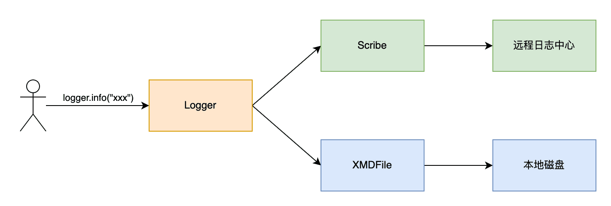
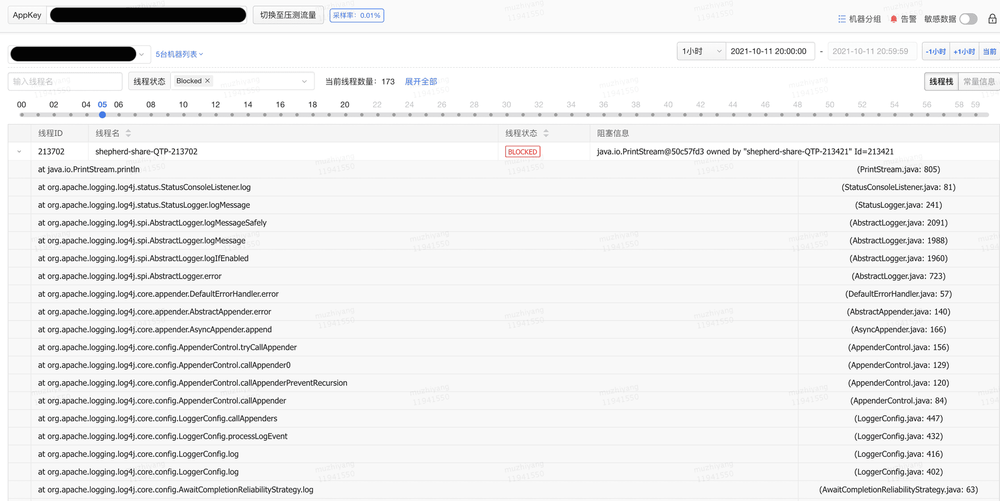
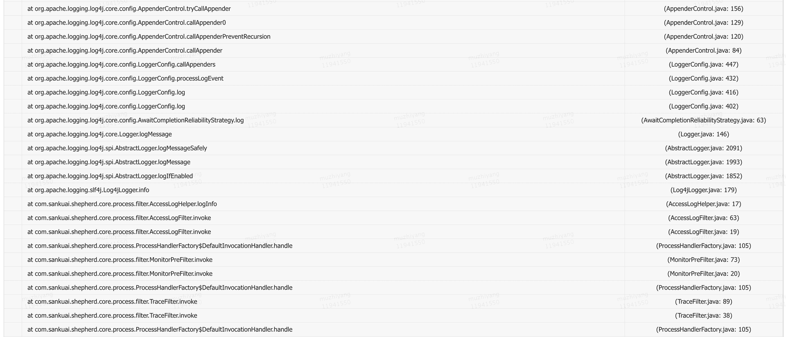
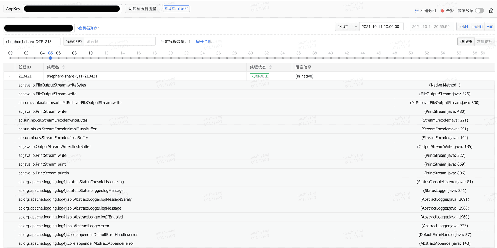
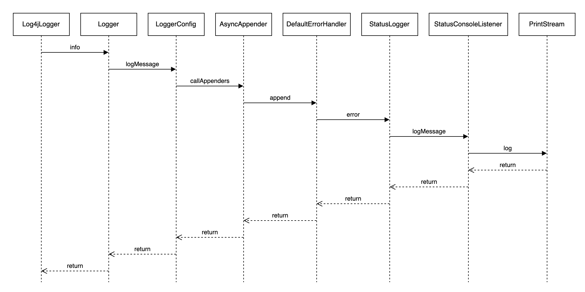
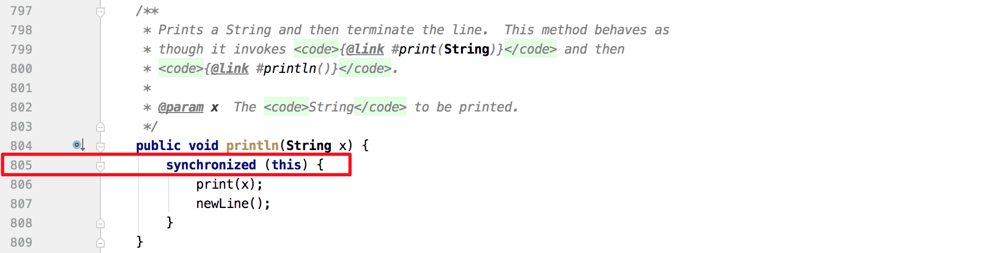

# 美团: 日志导致线程Block的这些坑，你不得不防


##  前言

>日志对程序的重要性不言而喻。它很“大”，我们在项目中经常通过日志来记录信息和排查问题，相关代码随处可见。它也很“小”，作为辅助工具，日志使用简单、上手快，我们通常不会花费过多精力耗在日志上。但看似不起眼的日志也隐藏着各种各样的“坑”，如果使用不当，它不仅不能帮助我们，反而还可能降低服务性能，甚至拖垮我们的服务。

日志导致线程Block的问题，相信你或许已经遇到过，对此应该深有体会；或许你还没遇到过，但不代表没有问题，只是可能还没有触发而已。本文主要介绍美团统一API网关服务Shepherd（参见《百亿规模API网关服务Shepherd的设计与实现》一文）在实践中所踩过的关于日志导致线程Block的那些“坑”，然后再分享一些避“坑”经验。


## 背景

>API网关服务Shepherd基于Java语言开发，使用业界大名鼎鼎的Apache Log4j2作为主要日志框架，同时使用美团内部的XMD-Log SDK和Scribe-Log SDK对日志内容进行处理，日志处理整体流程如下图1所示。业务打印日志时，日志框架基于Logger配置来决定把日志交给XMDFile处理还是Scribe处理。其中，XMDFile是XMD-Log内部提供的日志Appender名称，负责输出日志到本地磁盘，Scribe是Scribe-Log内部提供的日志Appender名称，负责上报日志到远程日志中心。




随着业务的快速增长，日志导致的线程Block问题愈发频繁。比如调用后端RPC服务超时，导致调用方大量线程Block；再比如，业务内部输出异常日志导致服务大量线程Block等，这些问题严重影响着服务的稳定性。因此，我们结合项目在过去一段时间暴露出来的各种由于日志导致的线程Block问题，对日志框架存在的稳定性风险因素进行了彻底的排查和修复，并在线下、线上环境进行全方位验证。在此过程中，我们总结了一些日志使用相关的实践经验，希望分享给大家。

**日志依赖版本**

```xml
<dependency>
    <groupId>org.apache.logging.log4j</groupId>
    <artifactId>log4j-api</artifactId>
    <version>2.7</version>
</dependency>
<dependency>
    <groupId>org.apache.logging.log4j</groupId>
    <artifactId>log4j-core</artifactId>
    <version>2.7</version>
</dependency>
<dependency>
    <groupId>org.apache.logging.log4j</groupId>
    <artifactId>log4j-slf4j-impl</artifactId>
    <version>2.7</version>
</dependency>
```

**日志配置文件**

```xml
<?xml version="1.0" encoding="UTF-8"?>
<configuration status="warn">
    <appenders>
        <Console name="Console" target="SYSTEM_OUT" follow="true">
            <PatternLayout pattern="%d{yyyy/MM/dd HH:mm:ss.SSS} %t [%p] %c{1} (%F:%L) %msg%n" />
        </Console>

        <XMDFile name="ShepherdLog" fileName="shepherd.log"/>

        <!--XMDFile异步磁盘日志配置示例-->
        <!--默认按天&按512M文件大小切分日志，默认最多保留30个日志文件。-->
        <!--注意：fileName前会自动增加文件路径，只配置文件名即可-->
        <XMDFile name="LocalServiceLog" fileName="request.log"/>

        <Scribe name="LogCenterSync">
            <!-- 在指定日志名方面，scribeCategory 和 appkey 两者至少存在一种，且 scribeCategory 高于 appkey。-->
            <!-- <Property name="scribeCategory">data_update_test_lc</Property> -->
            <LcLayout/>
        </Scribe>
        <Async name="LogCenterAsync" blocking="false">
            <AppenderRef ref="LogCenterSync"/>
        </Async>
    </appenders>

    <loggers>
        <AsyncLogger name="com.sankuai.shepherd" level="info" additivity="false">
            <AppenderRef ref="ShepherdLog" level="warn"/>
            <AppenderRef ref="LogCenterAsync" level="info"/>
        </AsyncLogger>

        <root level="info">
            <!--Console日志是同步、阻塞的，推荐只在本地调试时使用，线上将该配置去掉-->
            <!--appender-ref ref="Console" /-->
            <appender-ref ref="LocalServiceLog"/>
            <appender-ref ref="LogCenterAsync"/>
        </root>
    </loggers>
</configuration>
```


## 踩过的坑


###  日志队列满导致线程Block


#### 问题现场

收到“jvm.thread.blocked.count”告警后立刻通过监控平台查看线程监控指标，当时的线程堆栈如图2和图3所示。







从Blocked线程堆栈不难看出这跟日志打印相关，而且是INFO级别的日志，遂即登陆机器查看日志是否有异样，发现当时日志量非常大，差不多每两分钟就写满一个500MB的日志文件。

那大量输出日志和线程Block之间会有怎样的关联呢？接下来本章节将结合如下图4所示的调用链路深入分析线程Block的根因。




####  为什么会Block线程

从Blocked线程堆栈着手分析，查看PrintStream相关代码片段如下图5所示，可以看到被阻塞地方有synchronized同步调用，再结合上文发现每两分钟写满一个500MB日志文件的现象，初步怀疑是日志量过大导致了线程阻塞。



但上述猜测仍有一些值得推敲的地方：

- 如果仅仅因为日志量过大就导致线程Block，那日志框架也太不堪重用了，根本没法在高并发、高吞吐业务场景下使用。
- 日志配置里明明是输出日志到文件，怎么会输出到Console PrintStream？


#### 为什么会输出到Console

继续沿着线程堆栈调用链路分析，可以看出是AsyncAppender调用append方法追加日志时发生了错误，相关代码片段如下：

```java
// org.apache.logging.log4j.core.appender.AsyncAppender

// 内部维护的阻塞队列，队列大小默认是128
private final BlockingQueue<LogEvent> queue;

@Override
public void append(final LogEvent logEvent) {
    if (!isStarted()) {
        throw new IllegalStateException("AsyncAppender " + getName() + " is not active");
    }
    if (!Constants.FORMAT_MESSAGES_IN_BACKGROUND) { // LOG4J2-898: user may choose
        logEvent.getMessage().getFormattedMessage(); // LOG4J2-763: ask message to freeze parameters
    }
    final Log4jLogEvent memento = Log4jLogEvent.createMemento(logEvent, includeLocation);
  	// 日志事件转入异步队列
    if (!transfer(memento)) {
      	// 执行到这里说明队列满了，入队失败，根据是否blocking执行具体策略
        if (blocking) {
          	// 阻塞模式，选取特定的策略来处理，策略可能是 "忽略日志"、"日志入队并阻塞"、"当前线程打印日志"
            // delegate to the event router (which may discard, enqueue and block, or log in current thread)
            final EventRoute route = asyncQueueFullPolicy.getRoute(thread.getId(), memento.getLevel());
            route.logMessage(this, memento);
        } else {
          	// 非阻塞模式，交由 ErrorHandler 处理失败日志
            error("Appender " + getName() + " is unable to write primary appenders. queue is full");
            logToErrorAppenderIfNecessary(false, memento);
        }
    }
}

private boolean transfer(final LogEvent memento) {
    return queue instanceof TransferQueue
        ? ((TransferQueue<LogEvent>) queue).tryTransfer(memento)
        : queue.offer(memento);
}

public void error(final String msg) {
    handler.error(msg);
}
```

AsyncAppender顾名思义是个异步Appender，采用异步方式处理日志，在其内部维护了一个BlockingQueue队列，每次处理日志时，都先尝试把Log4jLogEvent事件存入队列中，然后交由后台线程从队列中取出事件并处理（把日志交由AsyncAppender所关联的Appender处理），但队列长度总是有限的，且队列默认大小是128，如果日志量过大或日志异步线程处理不及时，就很可能导致日志队列被打满。

当日志队列满时，日志框架内部提供了两种处理方式，具体如下：

- 如果blocking配置为true，会选择相应的处理策略，默认是SYNCHRONOUS策略，可以在log4j2.component.properties文件中，通过log4j2.AsyncQueueFullPolicy参数配置日志框架提供的其他策略或自定义策略。 
  - **DISCARD策略**，直接忽略日志。
  - **SYNCHRONOUS策略**，当前线程直接发送日志到Appender。
  - **ENQUEUE策略**，强制阻塞入队。
- 如果blocking配置为false，则由ErrorHandler和ErrorAppender处理失败日志。日志框架提供了默认的ErrorHandler实现，即DefaultErrorHandler，目前暂不支持业务在XML、JSON等日志配置文件里自定义ErrorHandler。日志框架默认不提供ErrorAppender，业务如有需要可在XML、JSON等日志配置文件里自定义error-ref配置。

在本项目的日志配置文件中可以看到，AsyncAppender设置了blocking为false，且没有配置error-ref，下面具体分析DefaultErrorHandler。

```java
// org.apache.logging.log4j.core.appender.DefaultErrorHandler

private static final Logger LOGGER = StatusLogger.getLogger();

private static final int MAX_EXCEPTIONS = 3;

// 5min 时间间隔
private static final long EXCEPTION_INTERVAL = TimeUnit.MINUTES.toNanos(5);

private int exceptionCount = 0;

private long lastException = System.nanoTime() - EXCEPTION_INTERVAL - 1;

public void error(final String msg) {
    final long current = System.nanoTime();
  	// 当前时间距离上次异常处理时间间隔超过5min 或者异常处理数小于3次
    if (current - lastException > EXCEPTION_INTERVAL || exceptionCount++ < MAX_EXCEPTIONS) {
      	// StatusLogger 负责处理
        LOGGER.error(msg);
    }
    lastException = current;
}
```


...

...

...

...


#### 问题小结

日志量过大导致AsyncAppender日志队列被打满，新的日志事件无法入队，进而由ErrorHandler处理日志，同时由于ErrorHandler存在线程安全问题，导致大量日志输出到了Console，而Console在输出日志到PrintStream输出流时，存在synchronized同步代码块，所以在高并发场景下导致线程Block。


## 避坑指南


### 对症下药


####  出队后避免线程Block

日志事件出队后会按照用户配置的输出样式，对日志内容进行格式化转换，此时仍然可能触发解析、加载异常堆栈类。因此，日志出队后避免线程Block的根本解决方法是在异常格式化转换时避免解析、加载异常堆栈类。

先说方案结论：**显式配置日志输出样式%ex来代替默认的%xEx，避免对日志内容格式化时解析、加载异常堆栈类**。

下面通过分析日志内容格式化处理流程来介绍解决方案。以PatternLayout为例，日志内容格式化转换流程链路为：Layout->PatternFormatter->LogEventPatternConverter。其中LogEventPatternConverter是个抽象类，有两个处理异常的格式化转换具体实现类，分别是ThrowablePatternConverter和ExtendedThrowablePatternConverter。

```java
// org.apache.logging.log4j.core.layout.PatternLayout

// 将 LogEvent 转换为可以输出的 String
@Override
public String toSerializable(final LogEvent event) {
  	// 由 PatternSerializer 对日志事件格式化处理
    return eventSerializer.toSerializable(event);
}
// org.apache.logging.log4j.core.layout.PatternLayout.PatternSerializer

@Override
public String toSerializable(final LogEvent event) {
    final StringBuilder sb = getStringBuilder();
    try {
        return toSerializable(event, sb).toString();
    } finally {
        trimToMaxSize(sb);
    }
}

@Override
public StringBuilder toSerializable(final LogEvent event, final StringBuilder buffer) {
    final int len = formatters.length;
    for (int i = 0; i < len; i++) {
    		// 由 PatternFormatter 对日志事件格式化处理
        formatters[i].format(event, buffer);
    }
    if (replace != null) { // creates temporary objects
        String str = buffer.toString();
        str = replace.format(str);
        buffer.setLength(0);
        buffer.append(str);
    }
    return buffer;
}
// org.apache.logging.log4j.core.pattern.PatternFormatter

public void format(final LogEvent event, final StringBuilder buf) {
    if (skipFormattingInfo) {
      	// 由 LogEventPatternConverter 对日志事件进行格式化处理
        converter.format(event, buf);
    } else {
        formatWithInfo(event, buf);
    }
}

private void formatWithInfo(final LogEvent event, final StringBuilder buf) {
    final int startField = buf.length();
  	// 由 LogEventPatternConverter 对日志事件进行格式化处理
    converter.format(event, buf);
    field.format(startField, buf);
}
// org.apache.logging.log4j.core.pattern.LogEventPatternConverter

public abstract class LogEventPatternConverter extends AbstractPatternConverter {

    /**
     * 将日志事件 LogEvent 转换为 String
     * Formats an event into a string buffer.
     *
     * @param event      event to format, may not be null.
     * @param toAppendTo string buffer to which the formatted event will be appended.  May not be null.
     */
    public abstract void format(final LogEvent event, final StringBuilder toAppendTo);

}
```


日志框架对异常进行格式化转换时，有如下两个配置项可参考，默认配置是%xEx。

1.**%ex，仅输出异常信息，不获取扩展信息（jar文件名称和版本信息）**

对应的格式转化类是ThrowablePatternConverter，在format方法内部并没有获取ThrowableProxy对象，所以不会触发解析、加载异常堆栈类。

```java
// org.apache.logging.log4j.core.pattern.ThrowablePatternConverter

@Plugin(name = "ThrowablePatternConverter", category = PatternConverter.CATEGORY)
@ConverterKeys({ "ex", "throwable", "exception" })
public class ThrowablePatternConverter extends LogEventPatternConverter {

    /**
     * {@inheritDoc}
     */
    @Override
    public void format(final LogEvent event, final StringBuilder buffer) {
        final Throwable t = event.getThrown();

        if (isSubShortOption()) {
            formatSubShortOption(t, getSuffix(event), buffer);
        }
        else if (t != null && options.anyLines()) {
            formatOption(t, getSuffix(event), buffer);
        }
    }

    private boolean isSubShortOption() {
        return ThrowableFormatOptions.MESSAGE.equalsIgnoreCase(rawOption) ||
                ThrowableFormatOptions.LOCALIZED_MESSAGE.equalsIgnoreCase(rawOption) ||
                ThrowableFormatOptions.FILE_NAME.equalsIgnoreCase(rawOption) ||
                ThrowableFormatOptions.LINE_NUMBER.equalsIgnoreCase(rawOption) ||
                ThrowableFormatOptions.METHOD_NAME.equalsIgnoreCase(rawOption) ||
                ThrowableFormatOptions.CLASS_NAME.equalsIgnoreCase(rawOption);
    }

    private void formatSubShortOption(final Throwable t, final String suffix, final StringBuilder buffer) {
        StackTraceElement[] trace;
        StackTraceElement throwingMethod = null;
        int len;

        if (t != null) {
            trace = t.getStackTrace();
            if (trace !=null && trace.length > 0) {
                throwingMethod = trace[0];
            }
        }

        if (t != null && throwingMethod != null) {
            String toAppend = Strings.EMPTY;

            if (ThrowableFormatOptions.CLASS_NAME.equalsIgnoreCase(rawOption)) {
                toAppend = throwingMethod.getClassName();
            }
            else if (ThrowableFormatOptions.METHOD_NAME.equalsIgnoreCase(rawOption)) {
                toAppend = throwingMethod.getMethodName();
            }
            else if (ThrowableFormatOptions.LINE_NUMBER.equalsIgnoreCase(rawOption)) {
                toAppend = String.valueOf(throwingMethod.getLineNumber());
            }
            else if (ThrowableFormatOptions.MESSAGE.equalsIgnoreCase(rawOption)) {
                toAppend = t.getMessage();
            }
            else if (ThrowableFormatOptions.LOCALIZED_MESSAGE.equalsIgnoreCase(rawOption)) {
                toAppend = t.getLocalizedMessage();
            }
            else if (ThrowableFormatOptions.FILE_NAME.equalsIgnoreCase(rawOption)) {
                toAppend = throwingMethod.getFileName();
            }

            len = buffer.length();
            if (len > 0 && !Character.isWhitespace(buffer.charAt(len - 1))) {
                buffer.append(' ');
            }
            buffer.append(toAppend);

            if (Strings.isNotBlank(suffix)) {
                buffer.append(' ');
                buffer.append(suffix);
            }
        }
    }

    private void formatOption(final Throwable throwable, final String suffix, final StringBuilder buffer) {
        final StringWriter w = new StringWriter();

        throwable.printStackTrace(new PrintWriter(w));
        final int len = buffer.length();
        if (len > 0 && !Character.isWhitespace(buffer.charAt(len - 1))) {
            buffer.append(' ');
        }
        if (!options.allLines() || !Strings.LINE_SEPARATOR.equals(options.getSeparator()) || Strings.isNotBlank(suffix)) {
            final StringBuilder sb = new StringBuilder();
            final String[] array = w.toString().split(Strings.LINE_SEPARATOR);
            final int limit = options.minLines(array.length) - 1;
            final boolean suffixNotBlank = Strings.isNotBlank(suffix);
            for (int i = 0; i <= limit; ++i) {
                sb.append(array[i]);
                if (suffixNotBlank) {
                    sb.append(' ');
                    sb.append(suffix);
                }
                if (i < limit) {
                    sb.append(options.getSeparator());
                }
            }
            buffer.append(sb.toString());

        } else {
            buffer.append(w.toString());
        }
    }

    /**
     * This converter obviously handles throwables.
     *
     * @return true.
     */
    @Override
    public boolean handlesThrowable() {
        return true;
    }

    protected String getSuffix(final LogEvent event) {
        //noinspection ForLoopReplaceableByForEach
        final StringBuilder toAppendTo = new StringBuilder();
        for (int i = 0, size = formatters.size(); i <  size; i++) {
            formatters.get(i).format(event, toAppendTo);
        }
        return toAppendTo.toString();
    }

    public ThrowableFormatOptions getOptions() {
        return options;
    }
}
```

2.**%xEx，不仅输出异常信息，同时获取扩展信息**

对应的格式转化类是ExtendedThrowablePatternConverter，在format方法内部获取了ThrowableProxy对象，此时一定会触发解析、加载异常堆栈类。

```java
// org.apache.logging.log4j.core.pattern.ExtendedThrowablePatternConverter

@Plugin(name = "ExtendedThrowablePatternConverter", category = PatternConverter.CATEGORY)
@ConverterKeys({ "xEx", "xThrowable", "xException" })
public final class ExtendedThrowablePatternConverter extends ThrowablePatternConverter {

    /**
     * {@inheritDoc}
     */
    @Override
    public void format(final LogEvent event, final StringBuilder toAppendTo) {
      	// 获取 ThrowableProxy 对象，触发解析、加载异常堆栈类
        final ThrowableProxy proxy = event.getThrownProxy();
        final Throwable throwable = event.getThrown();
        if ((throwable != null || proxy != null) && options.anyLines()) {
            if (proxy == null) {
                super.format(event, toAppendTo);
                return;
            }
            final String extStackTrace = proxy.getExtendedStackTraceAsString(options.getIgnorePackages(),
                    options.getTextRenderer(), getSuffix(event), options.getSeparator());
            final int len = toAppendTo.length();
            if (len > 0 && !Character.isWhitespace(toAppendTo.charAt(len - 1))) {
                toAppendTo.append(' ');
            }
            toAppendTo.append(extStackTrace);
        }
    }

}
```


## 最佳实践

> 本章节主要结合项目在日志使用方面的一系列踩坑经历和实践经验，总结了一份关于日志配置的最佳实践，供大家参考。

- **建议日志配置文件中对所有Appender的PatternLayout都增加%ex配置**，因为如果没有显式配置%ex，则异常格式化输出的默认配置是%xEx，此时会打印异常的扩展信息（JAR名称和版本），可能导致业务线程Block。
- **不建议日志配置文件中使用AsyncAppender，建议自定义Appender实现**，因为AsyncAppender是日志框架默认提供的，目前最新版本中仍然存在日志事件入队前就触发加载异常堆栈类的问题，可能导致业务线程Block。
- **不建议生产环境使用ConsoleAppender**，因为输出日志到Console时有synchronized同步操作，高并发场景下非常容易导致业务线程Block。
- **不建议在配置文件中使用`<AsyncLogger>`标签**，因为日志事件元素在入队前就会触发加载异常堆栈类，可能导致业务线程Block。如果希望使用Log4j2提供的异步日志AsyncLogger，建议配置Log4jContextSelector=org.apache.logging.log4j.core.async.AsyncLoggerContextSelector参数，开启异步日志。

下面提供一份log4j2.xml配置示例：

```xml
<configuration status="warn">
    <appenders>
        <Console name="Console" target="SYSTEM_OUT" follow="true">
            <PatternLayout pattern="%d{yyyy/MM/dd HH:mm:ss.SSS} %t [%p] %c{1} (%F:%L) %msg%n %ex" />
        </Console>

        <XMDFile name="ShepherdLog" fileName="shepherd.log">
          	<PatternLayout pattern="%d{yyyy/MM/dd HH:mm:ss.SSS} %t [%p] %c{1} (%F:%L) %msg%n %ex" />
	      </XMDFile>

        <!--XMDFile异步磁盘日志配置示例-->
        <!--默认按天&按512M文件大小切分日志，默认最多保留30个日志文件。-->
        <!--注意：fileName前会自动增加文件路径，只配置文件名即可-->
        <XMDFile name="LocalServiceLog" fileName="request.log">
	          <PatternLayout pattern="%d{yyyy/MM/dd HH:mm:ss.SSS} %t [%p] %c{1} (%F:%L) %msg%n %ex" />
	      </XMDFile>
  			
      	<!-- 使用自定义的AsyncScribeAppender代替原有的AsycncAppender -->
        <AsyncScribe name="LogCenterAsync" blocking="false">
            <!-- 在指定日志名方面，scribeCategory 和 appkey 两者至少存在一种，且 scribeCategory 高于 appkey。-->
            <!-- <Property name="scribeCategory">data_update_test_lc</Property> -->
           <LcLayout/>
        </AsyncScribe>
    </appenders>

    <loggers>
        <logger name="com.sankuai.shepherd" level="info" additivity="false">
            <AppenderRef ref="ShepherdLog" level="warn"/>
            <AppenderRef ref="LogCenterAsync" level="info"/>
        </logger>

        <root level="info">
            <!--Console日志是同步、阻塞的，推荐只在本地调试时使用，线上将该配置去掉-->
            <!--appender-ref ref="Console" /-->
            <appender-ref ref="LocalServiceLog"/>
            <appender-ref ref="LogCenterAsync"/>
        </root>
    </loggers>
</configuration>
```


## 文章来源

[日志导致线程Block的这些坑，你不得不防](https://tech.meituan.com/2022/07/29/tips-for-avoiding-log-blocking-threads.html)