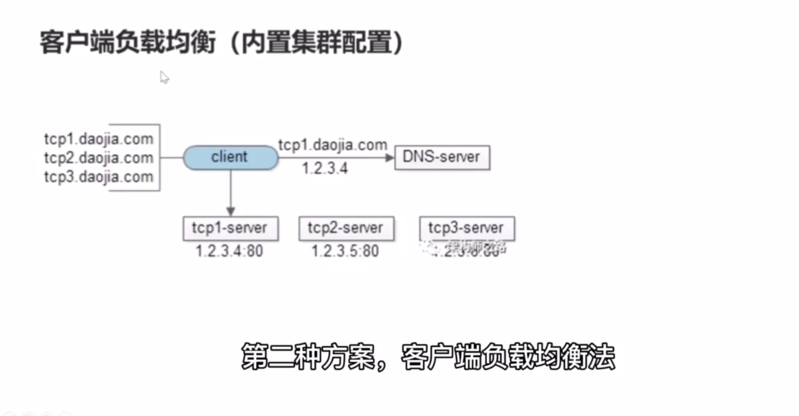
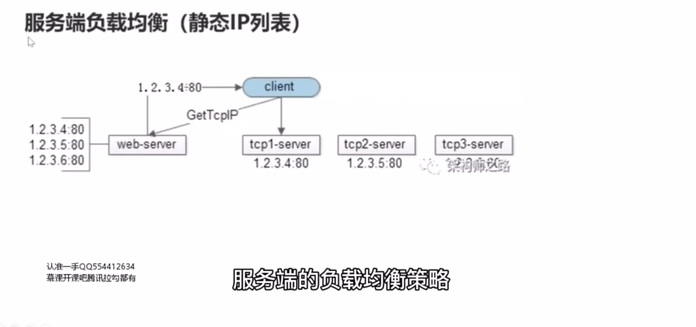
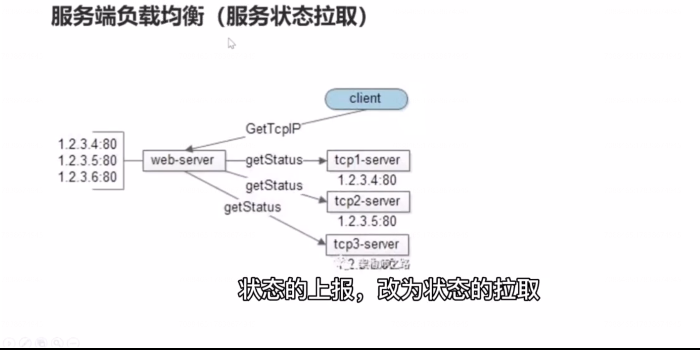
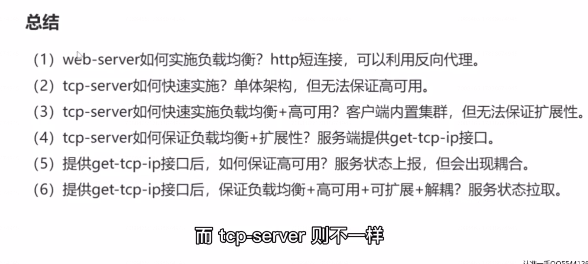

# 10、TCP 负载均衡，该怎么玩？

## 那TCP呢？

tcp 他是有状态的连接，客户端与服务器进行的是长连接。一旦建立连接，一个客户端发起的请求，必须落在同一台 tcp 的server上 ，此时如何做负载均衡，既能够保证长连接，又能够保证 每一台 tcp-server 上的连接数量是差不多的呢？

当然必须要保证高可用，以及很好的扩展性。

首先我们来看下单体架构法：

## 单体架构法

单体架构可以保证请求的一致性。

该方案的缺点是没办法扩展，没有办法高可用，如果服务器挂了，那么整个服务就不可用了。

## 客户端负载均衡（内置集群配置）

## 服务端负载均衡（静态IP 列表）

## 服务端负载均衡（服务状态上报）

设计不合理，反向耦合。状态的上报改为状态的拉取。

## 总结：

