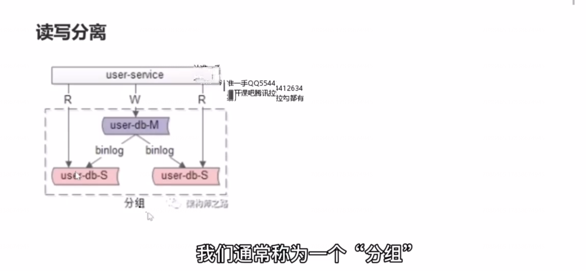
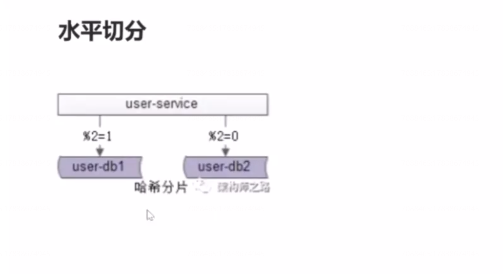
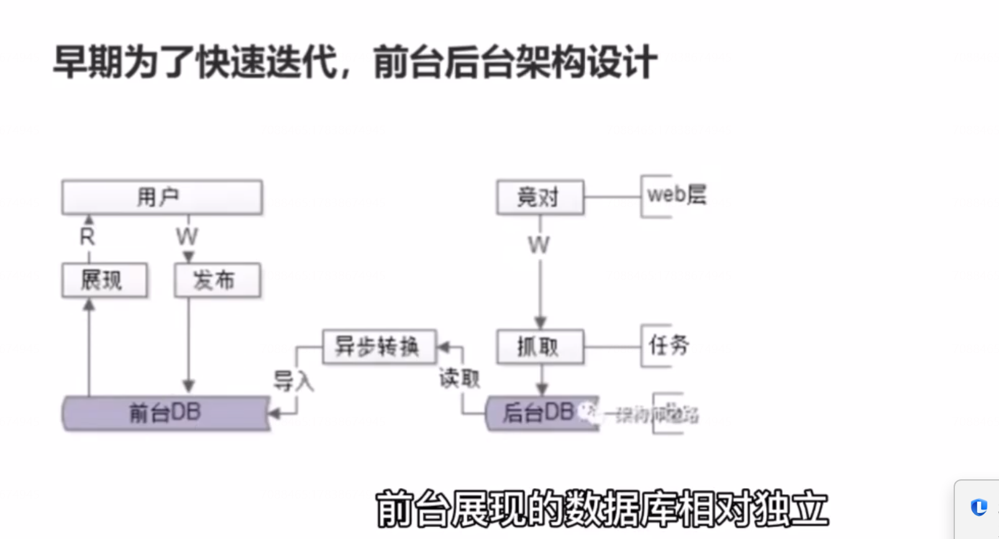
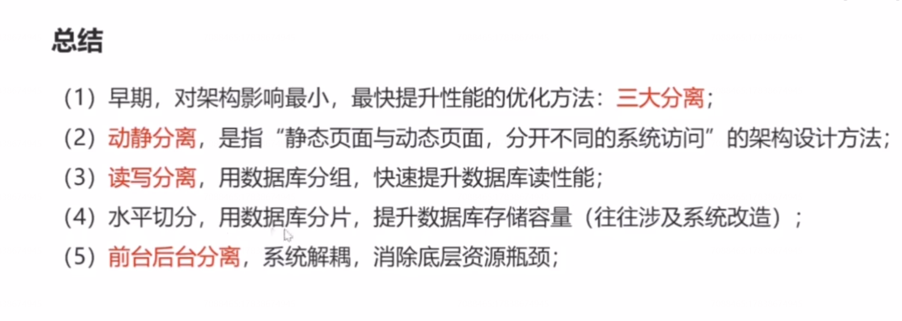

# 12、 性能优化：读写分离，前台与后台分离

### 读写分离

一个主从同步集群我们通常称为一个“分组”。

读写分离解决什么问题呢？

数据库读性能提升。如果希望线性的提升数据库的读性能，通过消除读写锁冲突来提升数据库的写性能。此时可以用分组，读写分离的架构设计。

一句话，分组主要解决数据库读性能瓶颈的问题，它是用来提升数据库的读性能的，在数据库扛不住读的时候可以用读写分离。通过增加从库的方式，线性的提升系统的读性能。

**比较容易与分组读写分离架构方案混淆的是数据库的水平切分方案**，作为对比，我们看下一下什么是数据库的水平切分方案？

水平切分也是一种常见的数据库架构，水平切分后，每个数据库之间没有数据的重合，没有类似于binlog 同步的关联，所有数据的并集会组成全部的数据，会用算法对全量的数据类似进行切割。

水平切分解决什么问题？

数据库存储容量提升。

### 前后台分离

### 总结：

