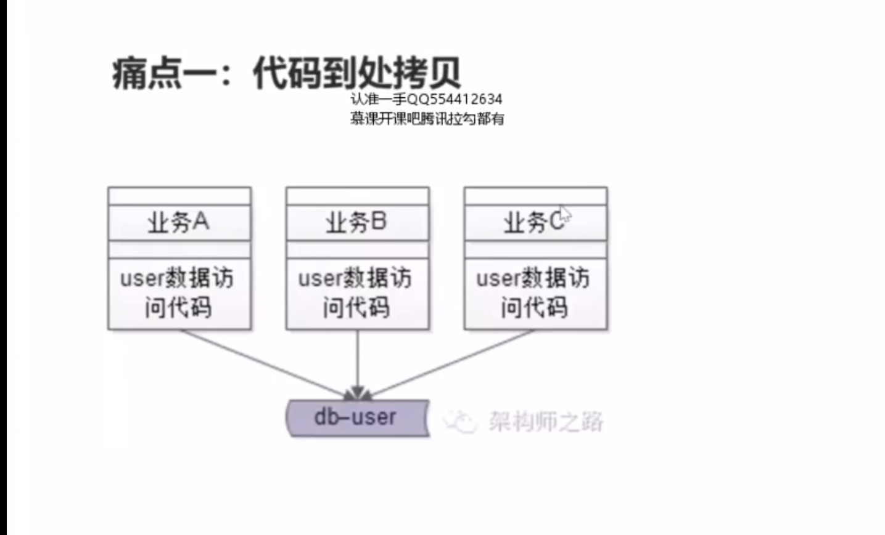
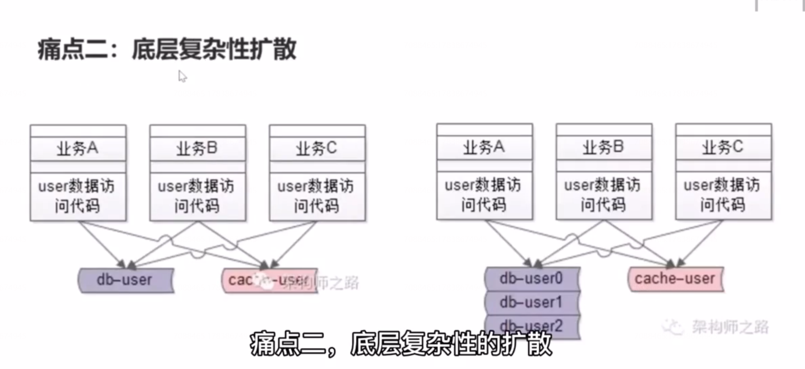
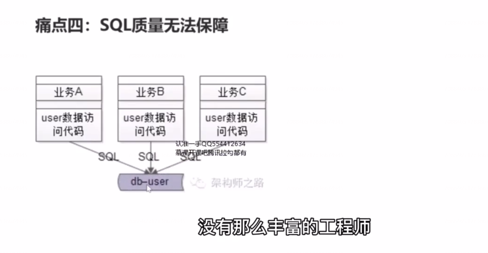
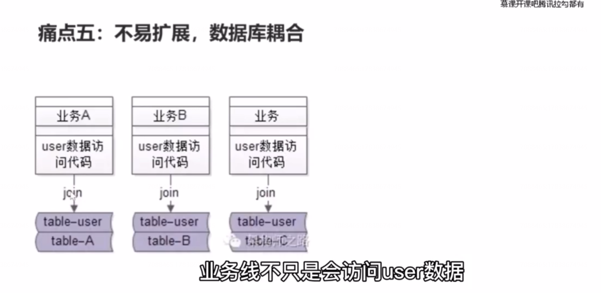
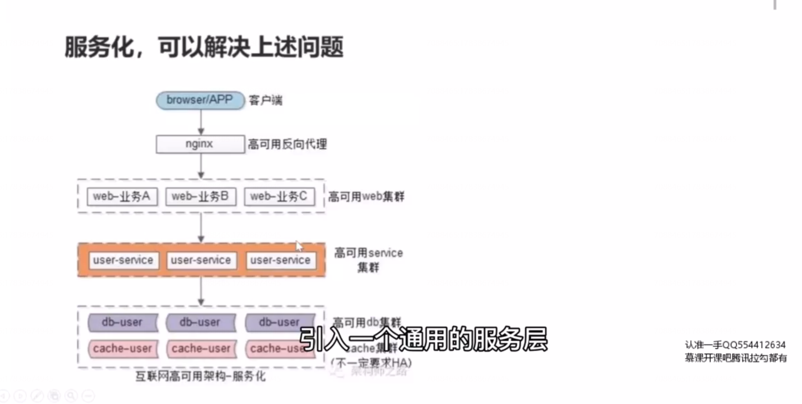
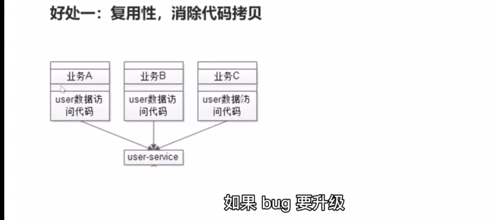
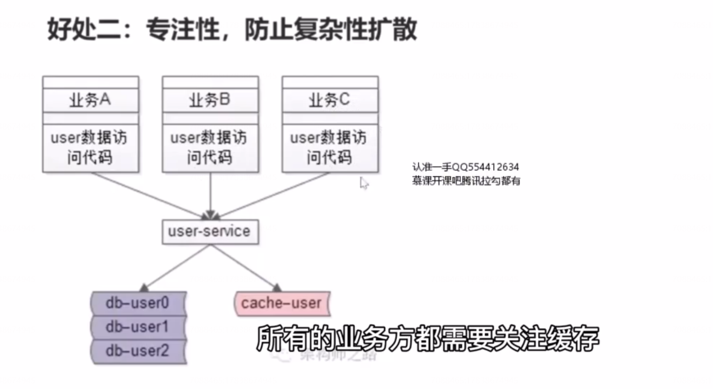
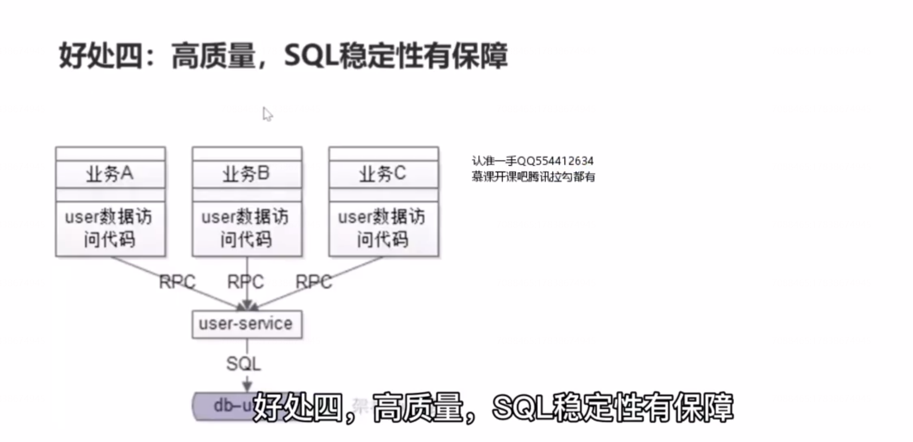
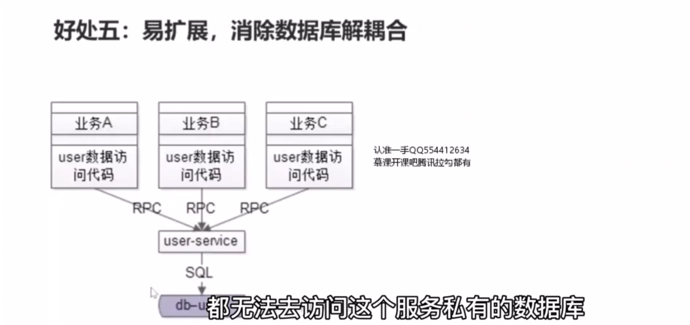

# 14、服务化：微服务架构，究竟解决什么问题？

## 痛点一：代码到处拷贝

## 痛点二：底层复杂性扩散

随着并发的越来越高，用户数据的访问，数据库成了瓶颈，需要加入缓存层来降低数据库的压力，于是可能在架构中要引入一个缓存层，如果没有统一的服务，第一个业务、第二个业务、第三个业务都需要去升级自己的 代码来关注缓存层的引入导致的架构复杂性，各个业务都需要访问缓存，对于写请求，各个业务都要升级代码，淘汰缓存、读写数据库。对于读请求，各个业务线也需要升级代码，读缓存，没有命中读db再把数据放入缓存。这个复杂性是典型的业务无关的复杂性。因为系统的要求，各个业务方被迫升级。 

## 痛点三：公共库耦合

服务化并不是解决上述两个痛点的唯一方法，抽象出一层统一的公共库，是最容易也最先想到的方法，去解决代码拷贝以及复杂性扩散的一个方案。，可以避免代码拷贝，但是公共库会引入新的问题，维护公共库的多个版本，会导致各个业务线之间的耦合。

## 痛点四：SQL质量无法保证

## 痛点五：不易扩展，数据库耦合

引入一个通用的服务层，是可以解决上述问题的。

## 好处一：复用性，消除代码拷贝

## 好处二：专注性，防止复杂性扩散

## 好处三：解耦合，消除公共库耦合

业务站点不再依赖公共库了，改为依赖服务。

## 好处四：高质量，SQL稳定性有保障

## 好处五：易扩展，消除数据库解耦合

## 总结

