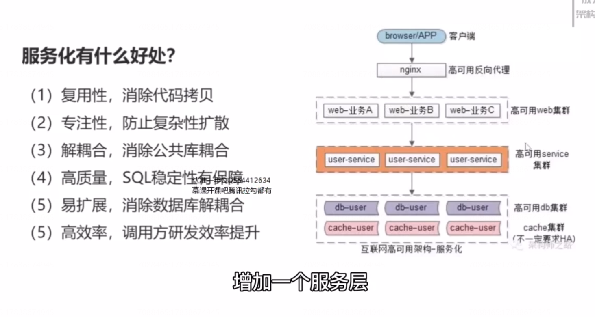
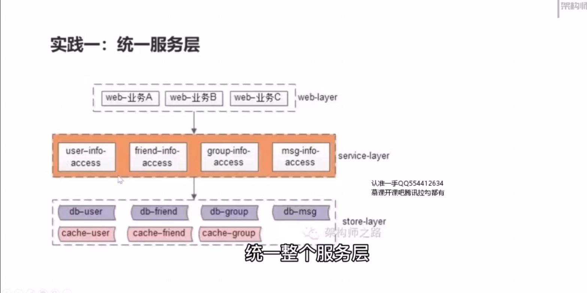
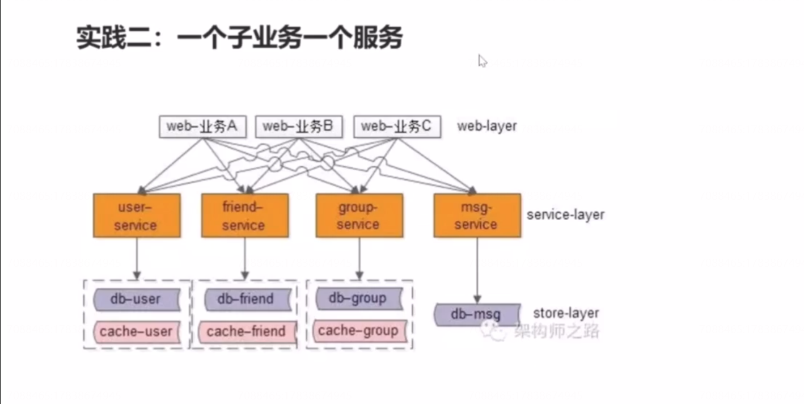
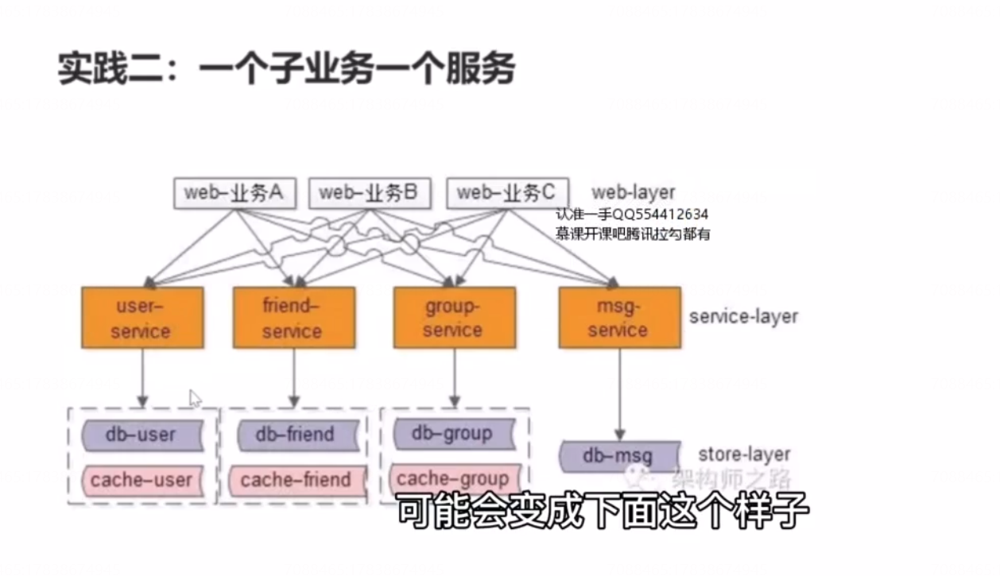
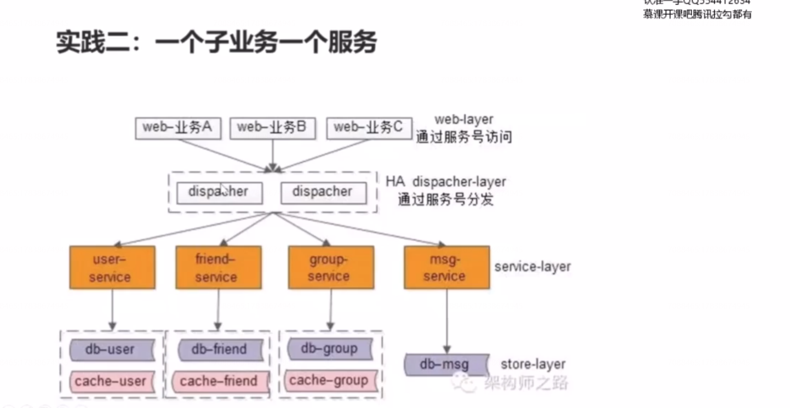
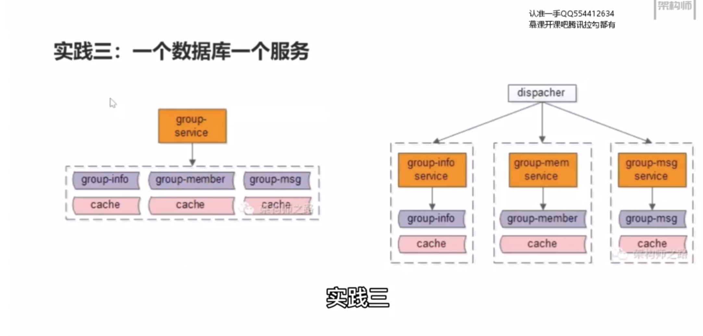
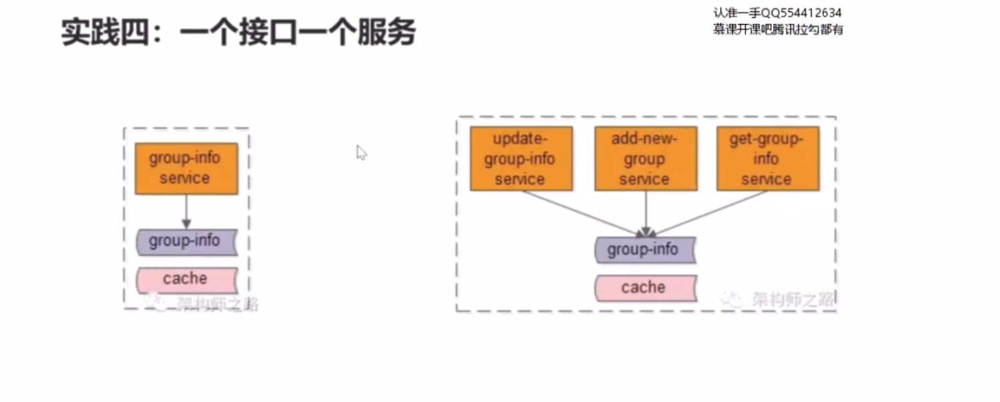
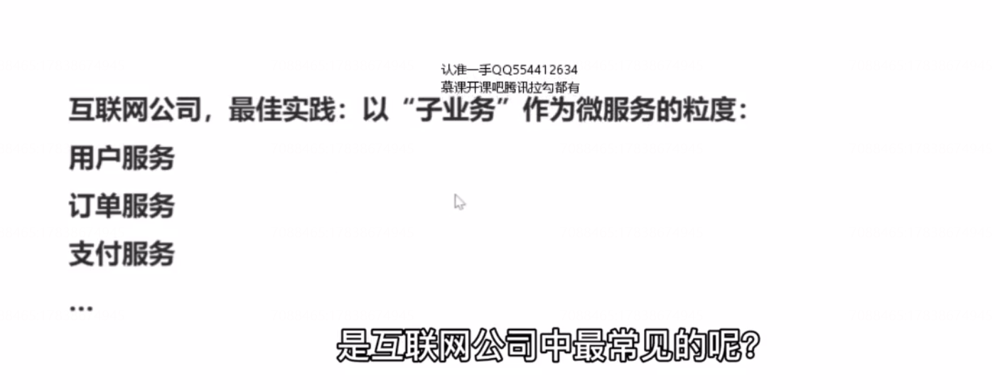
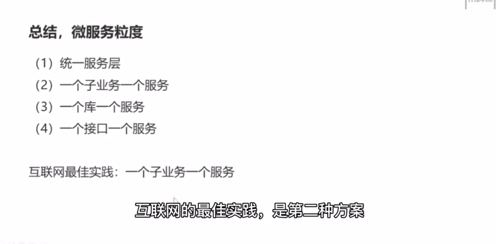

# 15、服务化：微服务架构，粒度多少合适？ 

## 微服务，服务的粒度应该如何选择呢？

### 实践一：统一服务层

只是最粗狂的玩法， 所有的基础数据都通过一个统一的服务层来进行访问，当业务不是特别复杂的时候，这不失为一个快速分层的一个方案。一旦业务变得复杂，服务层会变得非常重，成为耦合的焦点。我们举一个微信的场景，假设微信通过一个通用的服务层，来访问基础数据，  有一个统一的服务层，用户的数据，好友的数据，群组的数据，消息的数据，都通过这个服务层来访问，向调用方屏蔽底层的复杂性，分库分表啊，缓存啊，通过rpc接口来调用底层的数据。

### 实践二：一个子业务有一个服务

如果整个数据的访问，都通过一个服务层来访问的话，一旦代码出故障，就将影响整个服务，所以更合理的做法应该是在服务层进行垂直拆分，服务层如何进行垂直拆分呢？ 还是以微信的场景为例，一个子业务，抽象出一个服务，抽象之后，可能会变成下面这个样子。

你会发现服务的粒度变细了会出现一个新的问题，业务与服务的连接关系变得复杂了。有没有更好的方案呢？

大家可以看到每一个业务，他会调用多个服务，业务与服务之间的依赖关系，变成了  类似于蜘蛛网这样的概念，有没有什么优化方案。最常见的一个方案是加入一个网关分发层 来消除业务与子服务 之间的网状关系。

service mesh 就是这样干的，他是一种常见的消除网状依赖结构的方案。

### 实践三：一个数据库一个服务

还有没有可能 粒度再细呢？是可以的。

### 实践四：一个接口一个服务

 

互联网公司，最佳实践：以“子业务”作为微服务的粒度。

## 总结

