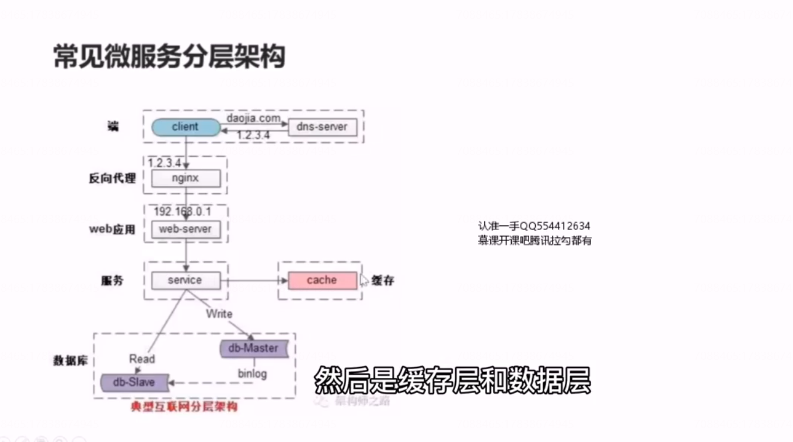
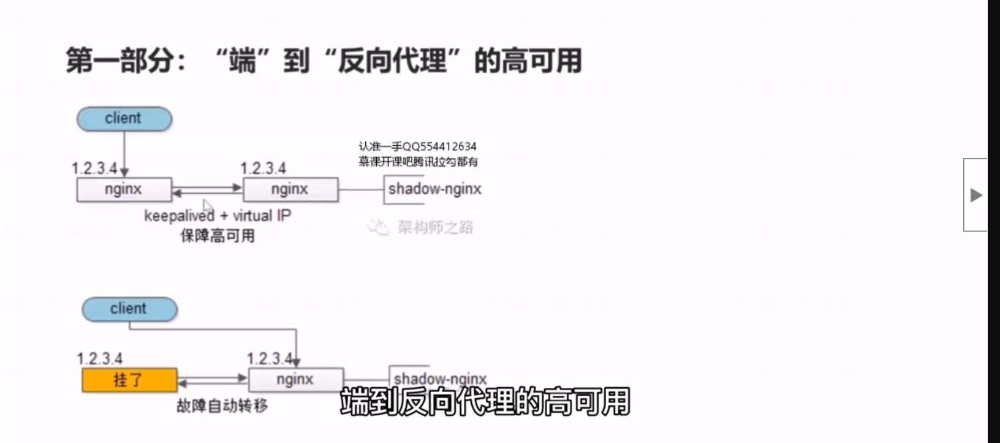
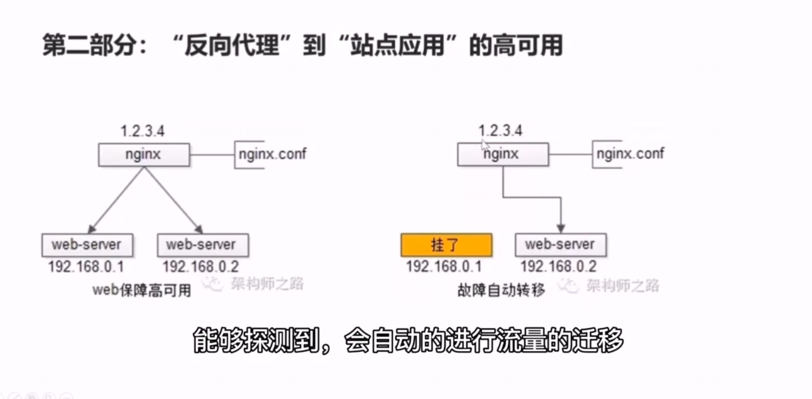
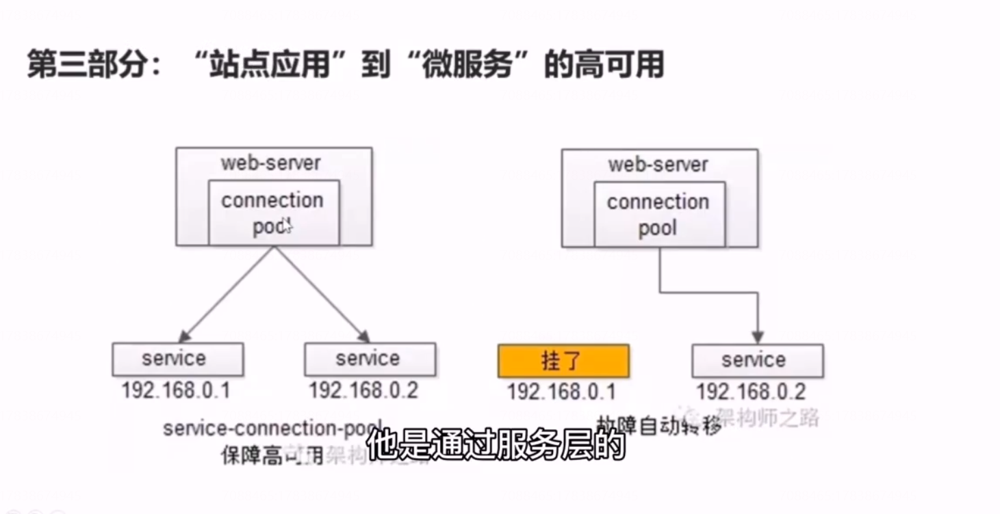
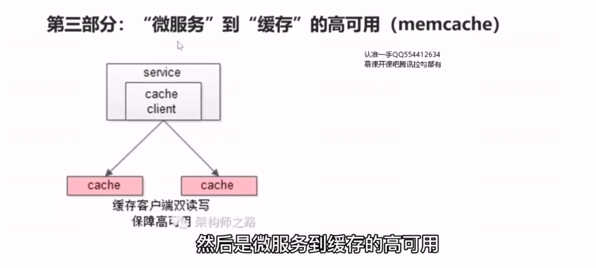
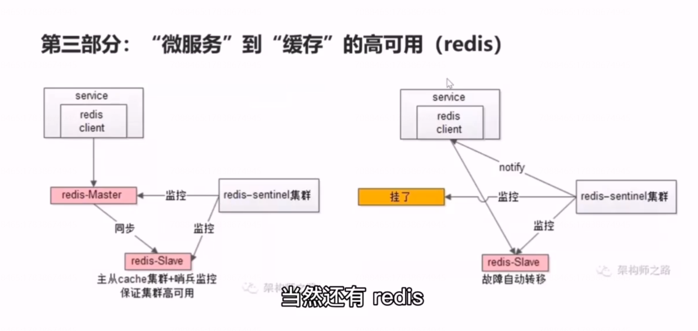
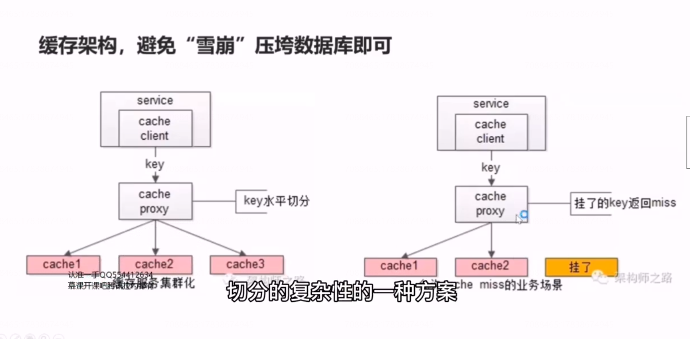
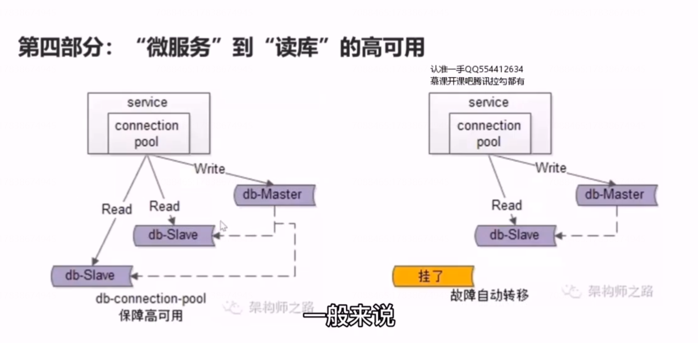
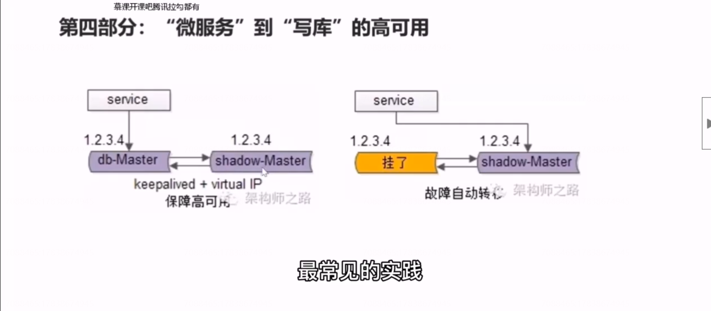
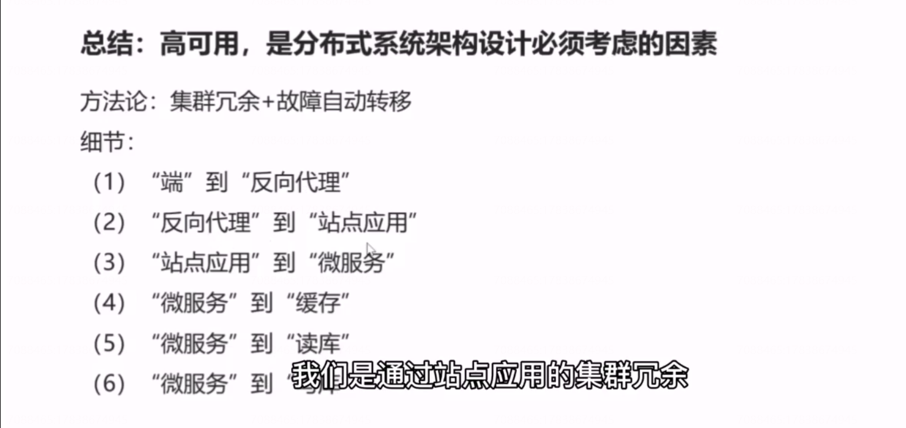

# 16、服务化：微服务架构，必须搞定高可用

## 如何保障系统的高可用？

（1）集群化（冗余）

（2） 故障自动转移

## 第一部分：“端”到 “反向代理”的高可用

## 第二部分：“反向代理”到“站点应用”的高可用

## 第三部分：“站点应用”到“微服务”的高可用

是通过服务层的集群冗余来实现的，他的上游调用方，是服务连接池，rpc-client 里面有一个组件，是服务连接池。他会建立与下游多个服务的连接，每次请求会用随机、轮询、一致性hash 等等方式来选取连接池中的连接，来访问下游的服务。当有下游挂掉的时候连接池是能够探测到的，他会进行自动的故障转移 ，将流量迁移到其他可用的微服务上去，整个过程是有连接池完成的。对于调用方也是透明的，这个连接池是rpc-client 中非常非常重要的一个基础组件。

## 第四部分：“微服务”到“缓存”的高可用

首先讲 memcache ,因为 memcache 他天然不支持集群，如果我们要实现高可用，那我们要自己部署 memcache的集群来进行数据的冗余。我们可以封装 memcache 访问的客户端，每一次利用双读或者双写的方式来进行数据的冗余来保证 memcache 的高可用。

 当然还有redis

  redis 他 天然支持集群，那我们可以使用redis 官方的 sentinel 哨兵机制来做redis 集群的存活性探测，比如说集群中有节点挂掉的时候，sentinel 哨兵集群他能够探测到，能够自动的通知redis  的客户端。

你会发现他的本质也是集群冗余 加上故障自动转移去实现 微服务到缓存的访问的高可用的。

缓存，真的有高可用的需求吗?更多的时候，只要不“雪崩”压垮数据库，就ok了。很多时候缓存是不需要高可用的，缓存更多的使用场景是用来加速数据访问的，把一部分热数据放到缓存里，能够降低数据库的访问量，如果缓存挂了，或者缓存没有命中，可以去后端的数据库里再取数据。只要你保证所有的缓存流量压到数据库，数据库不会雪崩。

## 缓存架构，避免“雪崩”压垮数据库即可

## 第五部分：“微服务”到“数据库”的高可用，如果做了读写分离，必须保证

### (1)读高可用

在做读写分离，分组集群的时候，一般来说，会有两个从库或者三个从库，数据库的读连接池会建立与多个从库的连接， 每一次会将请求路由到这些从库，当有从库挂了的时候，数据库的读连接池，能够探测到会自动的将流量转移到可用的从库节点，也就是说你的服务层，通过连接池拿到数据库连接的时候他会返回可用的从库的连接。整个过程 由连接池自动完成的，对于调用方是透明的。 

### (2) 写高可用

微服务到写库的高可用也是通过写库的冗余来实现到的，

大家如果有使用aliyun 的高可用的rds 主库服务，他也是用的类似的方式去保证的高可用的。

## 总结

