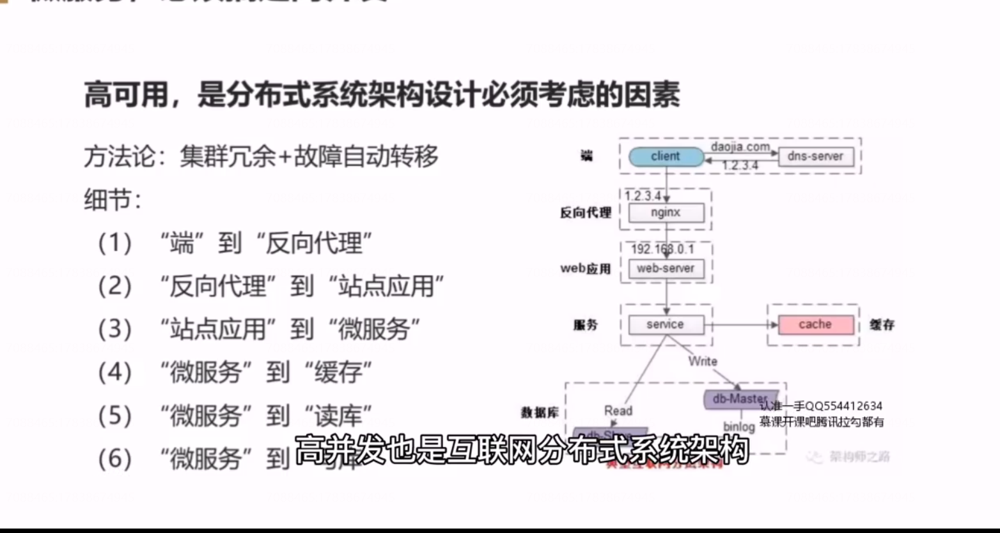
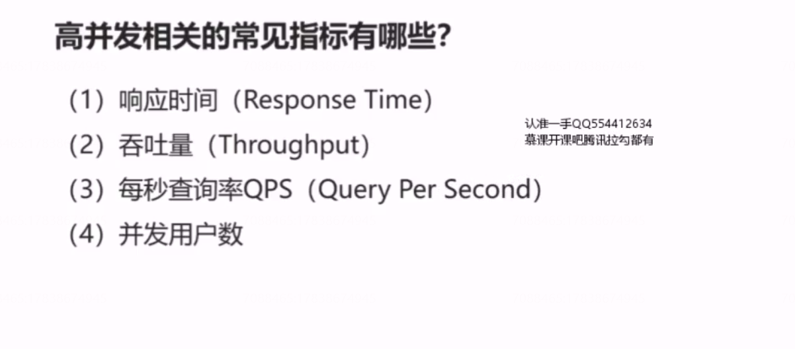
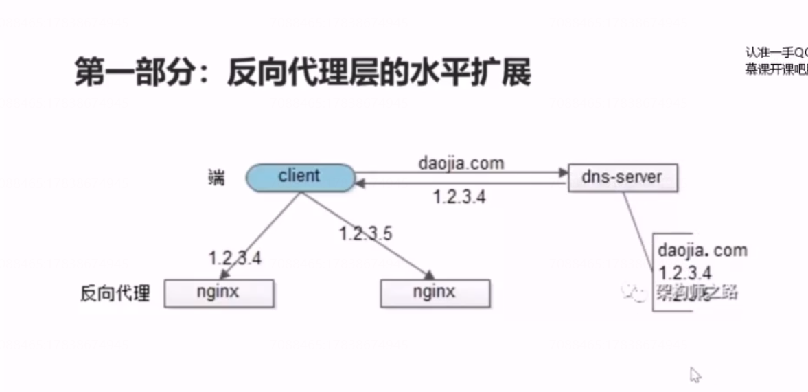
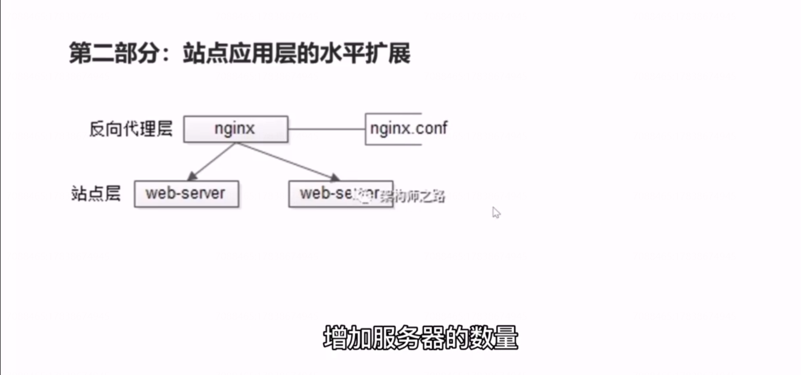
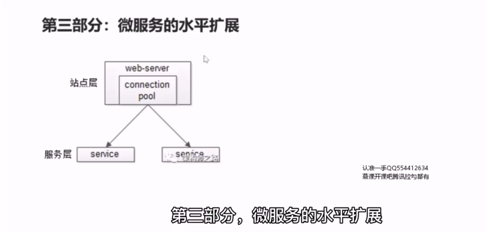
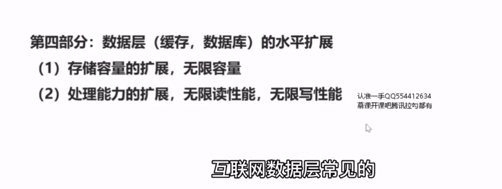
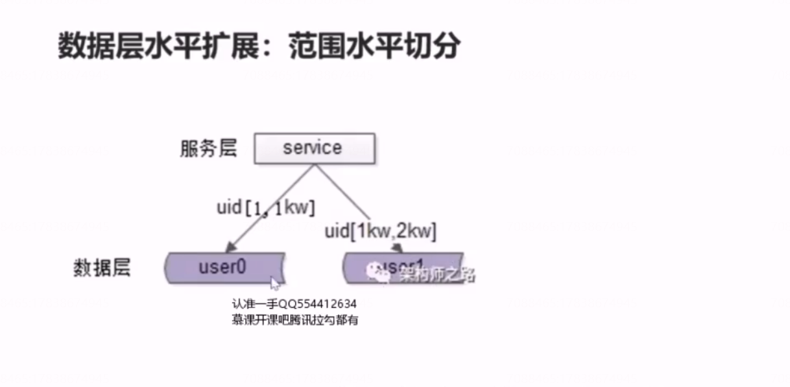
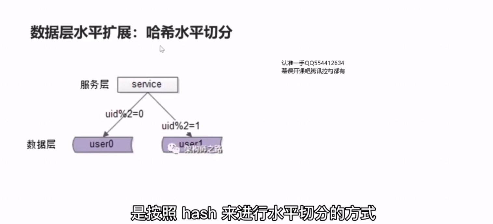
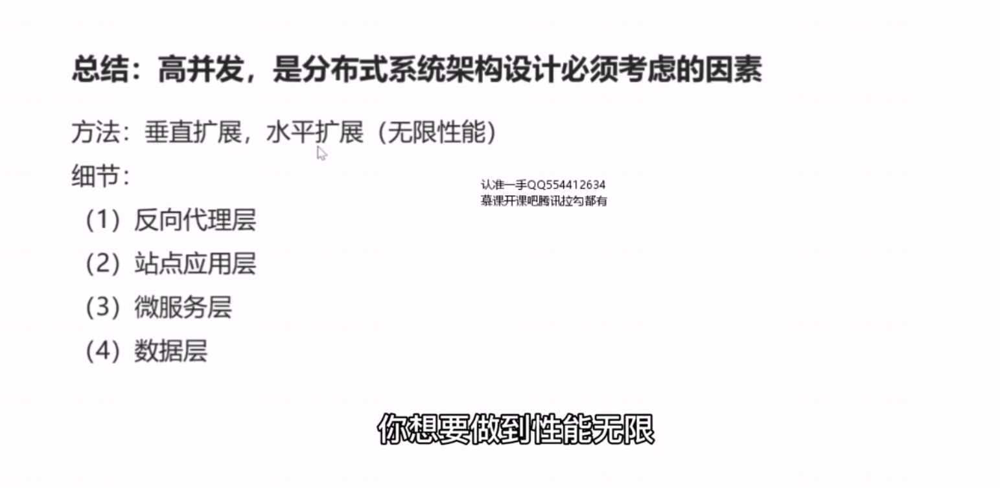

# 17、服务化：微服务架构，必须搞定高并发

回顾

## 高并发相关的常见指标有哪些？

## 提升系统并发处理能力的方法论？

（1） 垂直扩展（Scale Up）

（2）水平扩展（Scale Out）

#### 垂直扩展

 （1）增强单机硬件性能

（2）提升单机架构性能

#### 解决性能并发终极方案

## 第一部分：反向代理层的水平扩展

## 第二部分：站点应用层的水平扩展

## 第三部分：微服务的水平扩展

微服务也需要做集群，通过做集群来保证高可用，通过服务连接池保证高可用，对于扩展性也是相同的道理。微服务的水平扩展是通过服务连接池去实现的，站点层通过 rpc client 调用下游的服务层rpc server 。rpc client 会建立与多个server 的连接。当然此处，如果你要做到优雅的进行服务层的自动扩容，可能需要实现配置中心， 服务发现等等功能，来做到优雅的，自动的，服务层水平扩展。

## 第四部分：数据层（缓存，数据库）的水平扩展

###  数据层水平扩展：范围水平切分

### 数据层水平扩展：哈希水平切分

、

不足：不太容易扩展。

数据库“水平切分”架构，和“读写分离”架构有什么本质不同？

**水平切分主要是扩充数据库的存储量和读写量的。此时每个服务器上存储的数据量是总量的1/n ，单机的性能也会提升，每个服务器的数据受没有交集的，并且所有服务器的数据的并集是全量数据。**

****

**主从同步，读写分离的分组架构它主要是提升从库的读性能，此时每个服务器上存储的数据的量是相同的，主库和从库之间有一种机制进行数据同步， 每个服务器都存储了数据的全集。读性能扩充了 n 倍，写仍是单点写。**

## 总结

