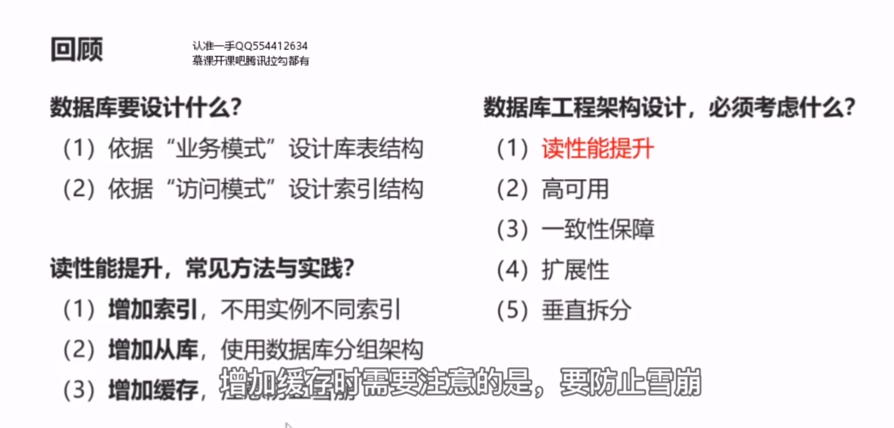
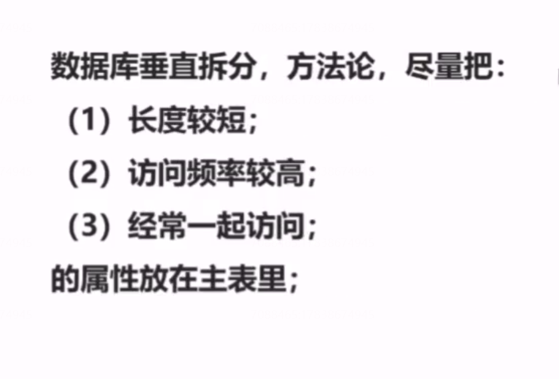
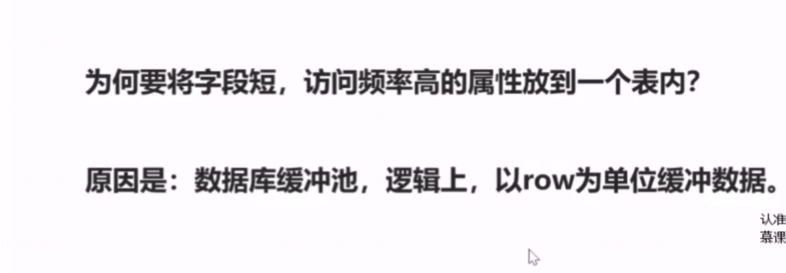
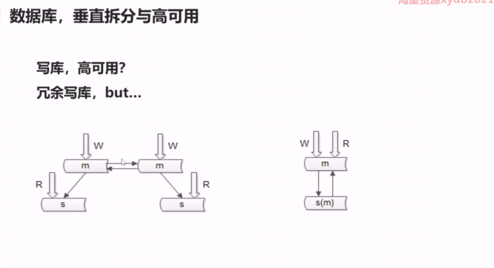

# 22、数据库：垂直拆分与高可用

## 回顾

**增加缓存时需要注意的是，要防止雪崩，缓存挂了，不能把数据库压垮，此时缓存要么做高可用，要么做水平切分。**

## 数据库垂直拆分

（1） 什么是数据库垂直拆分？和水平切分有什么区别？

**水平切分：他是以某一个字段为依据，例如用户id ，按照一定的规则，比如取模，将一个库（表）中的数据 拆分到多个库（表）中去，以降低单库数据量大小的目的，来提升数据库的性能。水平切分可以用分库，也可以用分表的方式来实现，以分库为例介绍，水平切分之后，每个库有什么特点呢?每个库的表结构都一样，并且每个库的数据都不一样，没有交集，所有库的并集是全量的数据。这是水平切分，他的目的是降低单库或者单表的数据量，提升性能。**

**垂直拆分：是指将一个属性较多，一行数据较大的表将不同的属性拆分到不同的表中去，以降低单表的大小，达到提升性能的目的。垂直拆分之后，每一个表的结构都不一样，每个表属性至少有一列交集，一般来说是主键，所有表的并集是全部的数据**

 

（2）解决什么问题

**对于垂直拆分来说，他能够降低单表的数据量，能够提升读写的性能，数据量少了，磁盘io会减少，读写性能会提升。**

（3） 带来什么问题

 **会带来数据存取的复杂性**

（4）没有解决什么问题

**没有解决数据 可用性的问题，以及水平拆分扩展性的问题**

数据库垂直拆分，方法论，尽量把：

## 数据库的高可用设计

