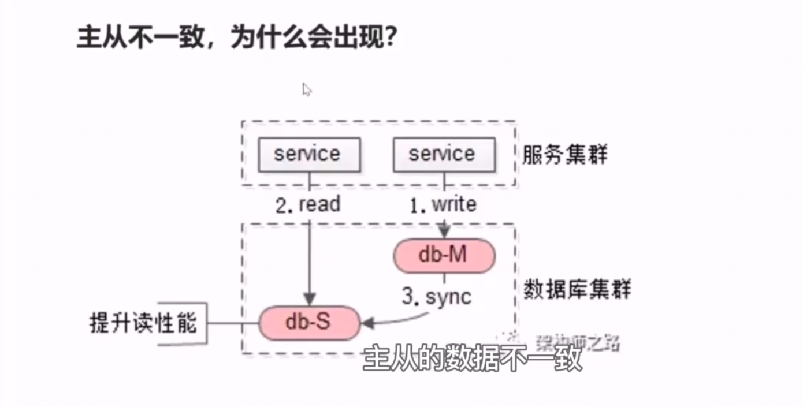
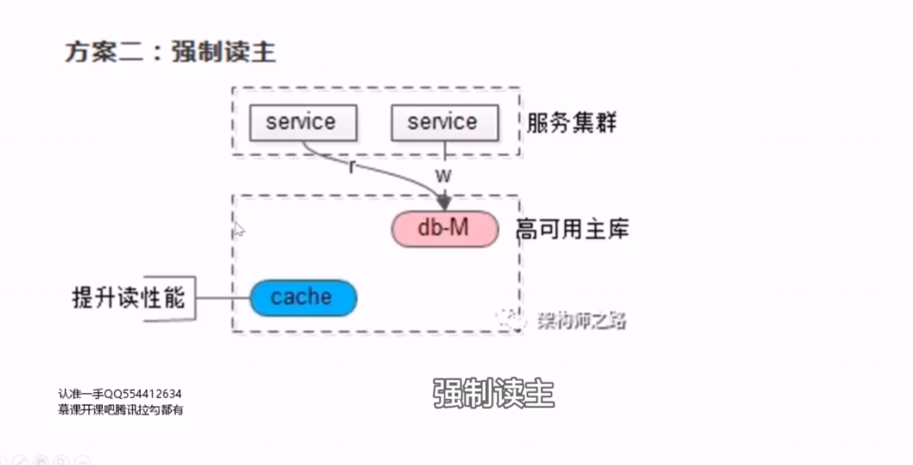
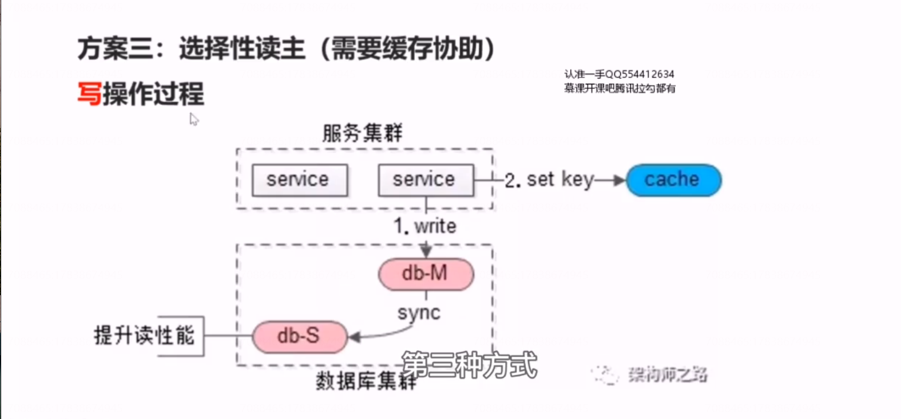
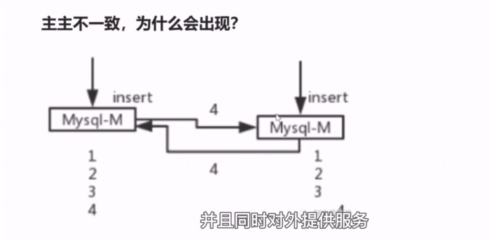
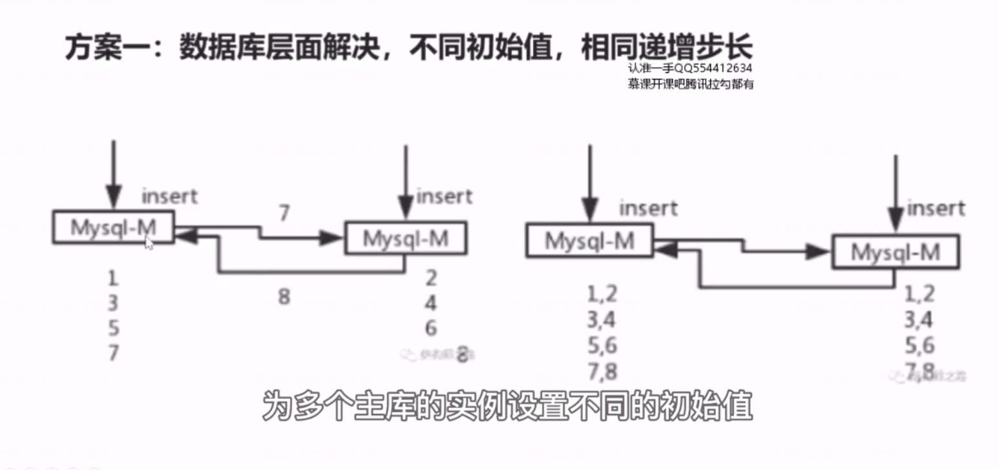
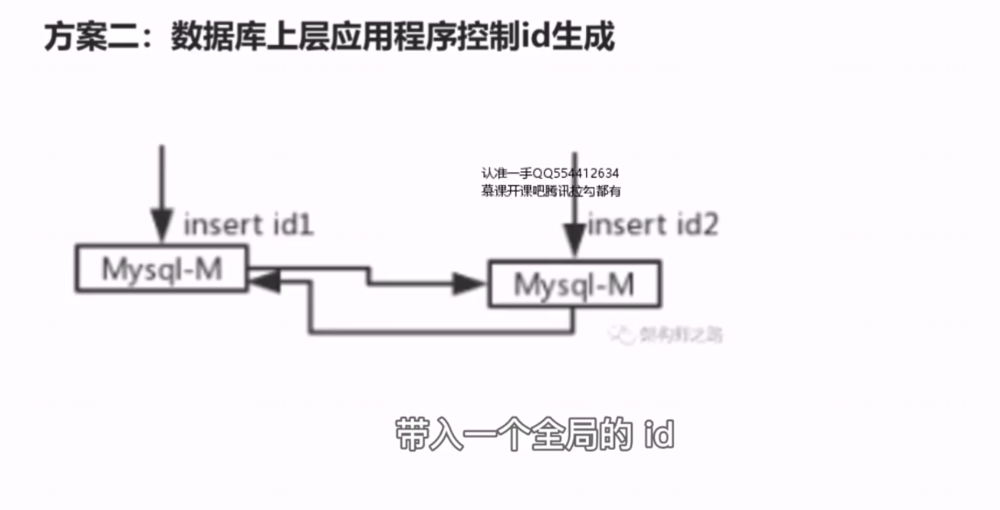
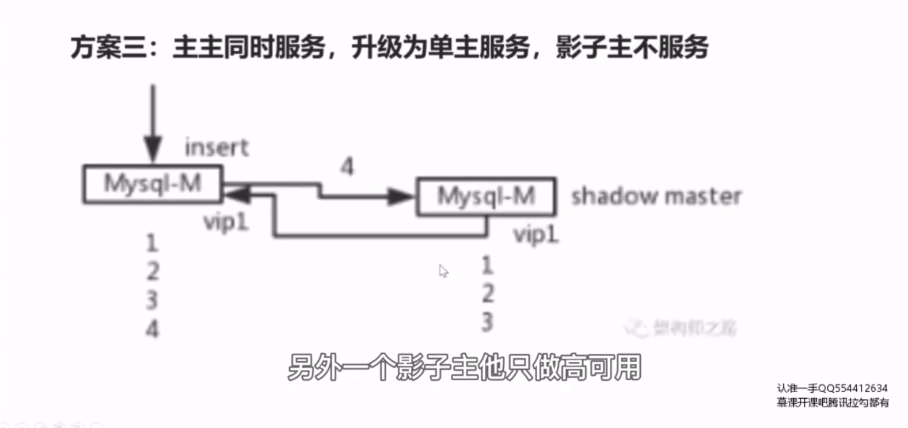
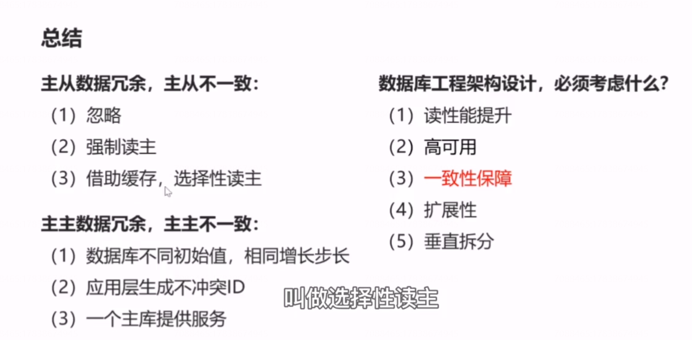

# 23、数据库：主从一致性，主主一致性如何保障？

## 情况一：主从数据冗余，主从数据不一致

### 如何来解决这种情况呢？

#### 方案一：忽略不计

因为主从不一致的时间非常非常短，可能也就几百毫秒，绝大部分业务例如百度，淘宝订单访问，qq消息访问，他其实都允许很短的一个时延，所以很多业务，他都可以对于这种情况进行忽略。

#### 方案二：强制读主

都落到主库就避免了主从延时，但是他放弃了读写分离，一主多从的分组架构。

分组架构根本上我们是希望增加从库来提升系统的读性能，那么你放弃了分组架构通过从库来提升读性能，你就必须使用缓存的方式来提升读性能。但此时又会引入新的问题，缓存与数据库中的数据不一致。因为他们两个中的数据修改也是有先有后的。

#### 方案三：选择性读主(需要缓存协助)

是一个折中的方案。

## 情况二：主主数据冗余，主主数据不一致

并发的写入很可能导致数据的同步的失败，这个数据的同步失败，会比主从同步的时延要严重非常多吗，主从同步的时延，大不了一秒之内，读到一个旧数据，1s 之后就会读到新数据。主主的双写冲突，他会引起数据的丢失，不是一个短暂时间的不一致，是一个永久数据的丢失，所以会非常严重。

### 如何解决主主数据引发的不一致？

#### 方案一：数据库层面解决，不同初始值，相同递增步长

#### 方案二：数据库上层应用程序控制id 生成

 

#### 方案三：主主同时服务，升级为单主服务，影子主不服务

#### 情况三：数据库缓存数据冗余，数据库缓存数据不一致

后面。

## 总结

