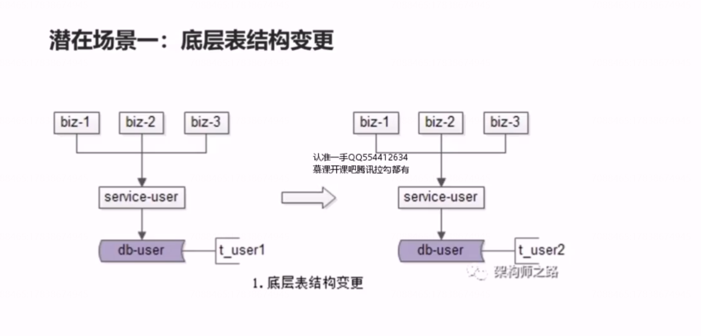
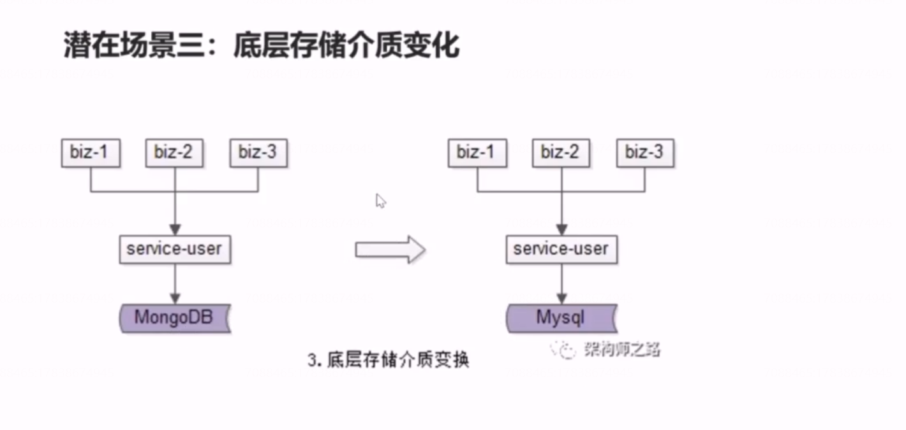
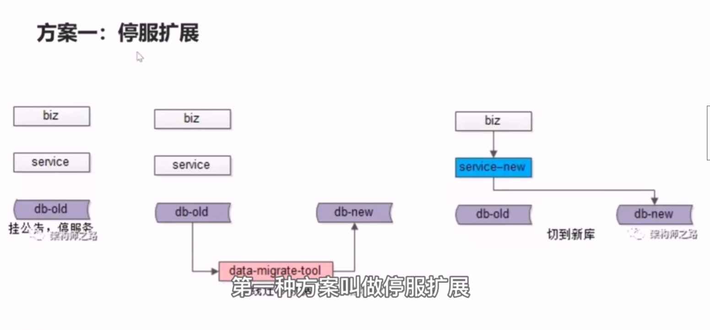
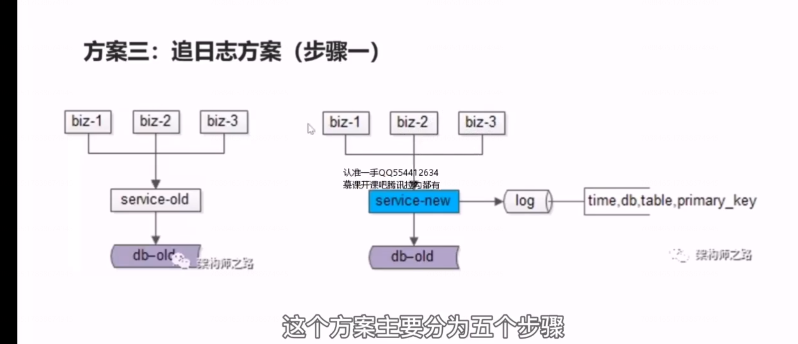

# 24、数据库：扩展性，要如何解决？

数据库扩展性，有哪些典型的场景

## 潜在场景一：底层表结构变更

在数据量非常大的情况下，数据表增加例了一些属性，或者删除了一些属性，修改了一些属性，此时是不能直接alter  table 的，因为数据量非常大，并发量非常大，如果alter  table,相当于会锁住表，会对外拒绝服务，底层表结构变更，是数据库扩展性要解决的问题之一。

## 潜在场景二：水平扩展，分库个数变化

## 潜在场景三：底层存储介质变化

 

## 数据库，扩展性，要如何解决？

### 方案一：停服扩展

停机方案是我们最容易想到的方案，不管是表结构的变更，水平切分、分库个数的添加，还是底层存储介质的扩展，都可以使用停服方案。停服方案有这么几个步骤。

步骤一：挂公告听服务，挂一个类似于（参考王者）

步骤二：研发一个离线的数据迁移工具，对数据进行迁移。针对前面说的三类需求分别开发不同的数据迁移工具，底层表结构扩展，我们就研发旧表导新表的工具，分库个数的变化，我们就开发两个库导三个库得的工具，底层存储介质的变化，我们就开发 mongodb 导mysql 的数据工具。

步骤三：恢复服务，并将流量迁移到新的库。

### 方案二：online schema change 

### 方案三：追日志方案（步骤一）

 

这个方案分为五步：

## 总结

