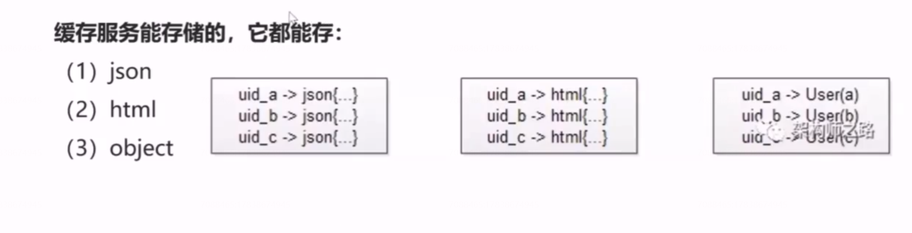
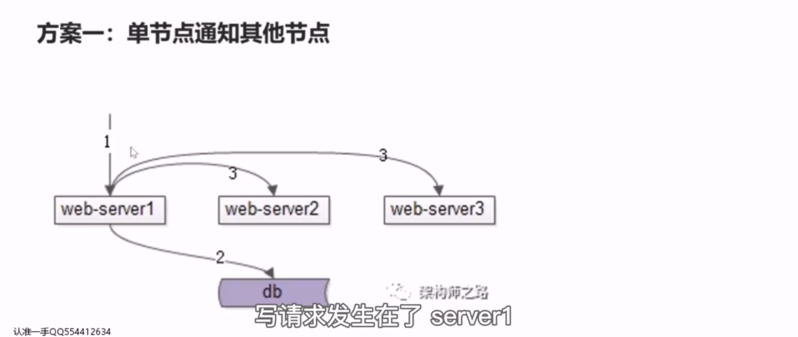
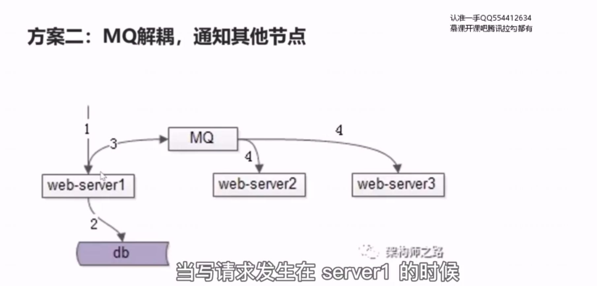
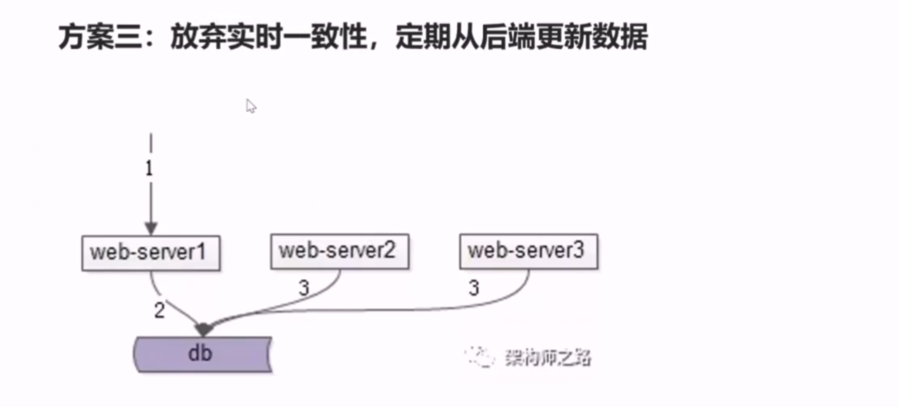
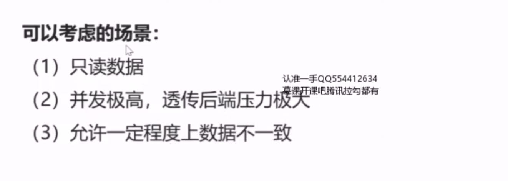
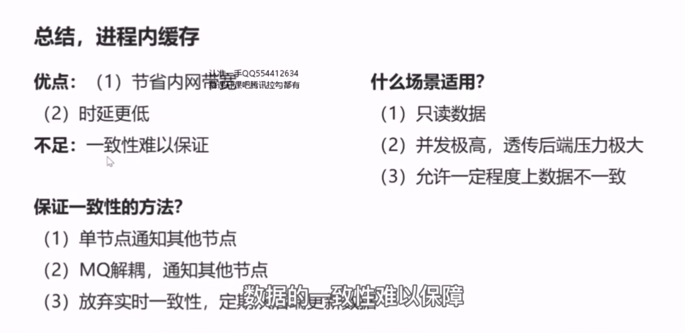

# 27、缓存：进程内缓存要怎么玩

 

## 进程内缓存：

它是将一些数据缓存在站点或者服务的进程内，进程内缓存的实现载体，最简单的他可以是一个，带锁的 map,又或者他可以使用第三方的库，例如 leveldb 来实现进程内的缓存。

## 进程内缓存能存储什么

## 进程内缓存 vs  缓存集群

优点：

（1）节省内网带宽

（2）时延更低

## 如何保证进程内缓存一致性

### 方案一

 

### 方案二：MQ解耦，通知其他节点

### 方案三：放弃实时一致性，定期 从后端更新数据

 

## 什么时候可以使用进程内缓存

##  总结

