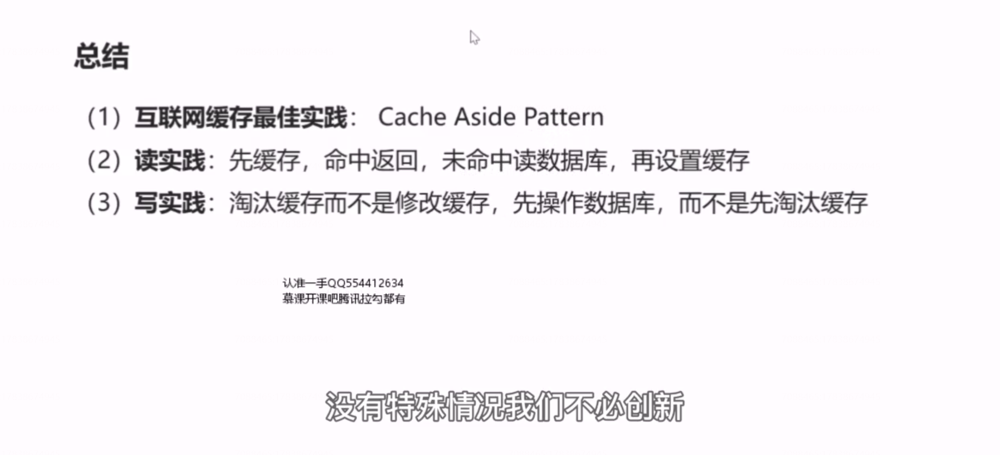

# 29、缓存：互联网最佳实践

## 为什么建议淘汰缓存，而不是更新缓存？

原因是，如果更新缓存在并发写时可能出现数据不一致，如上图所示，，假设我们采用 set 缓存，也就是写回缓存，当操作一和操作二两个并发写发生时，由于无法保证时序，此时不管是先操作缓存还是先操作数据库，都有可能出现请求一（先）操作的数据库，请求二后操作数据库，请求二先操作了缓存，请求一才操作了缓存，请求二set 了一个新值，请求一set 了一个旧值。就会导致数据库中是最新的数据，而缓存中是旧的数据。

## 为什么建议先操作数据库，而不是先操作缓存？

如果先操作缓存，在读写并发时有可能出现数据不一致，如上图所示，如果我们先操作缓存，在请求一写请求和请求二读请求发生并发时，由于无法保证时序可能出现以下的异常时序，第一步先发生写操作，写操作的第一步我们先删除缓存中的key,然后第二步我们操作的数据库，此时数据库的主从同步第三步并没有完成，然后发生了并发读请求，第一步读取缓存，此时缓存已经被写请求的删除操作删除，于是他会 cache miss,第二步读请求我们会读数据库的从库，但由于主从同步尚未完成，所以读到的是一个旧数据，然后第三步，将旧数据写回了缓存，此时，主从同步完成，于是数据库中出现了一个新数据，而缓存中出现了一个旧数据。

## 总结

