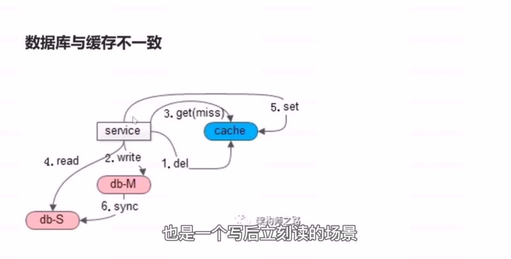
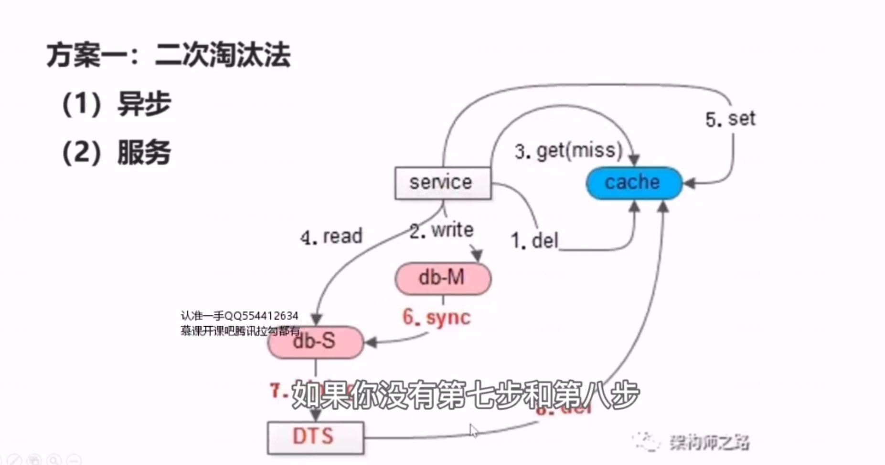
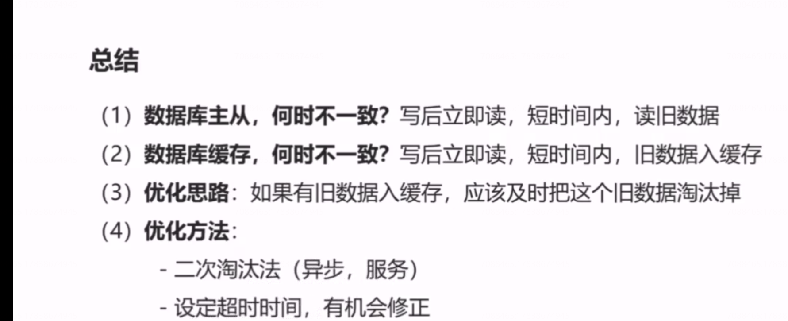

# 30、缓存：一致性优化

如上图所示，是一个写后立刻读的场景，第一步和第二步也是先发生了一个写请求，我们会删除缓存中的数据，并且修改数据库，接着第三步、第四步、第五步立刻发生了一个读请求，读缓存，由于缓存中的数据被写请求淘汰掉，此时会 cache miss ，接着会读从库，但此时主从同步并没有完成，会读到一个旧数据，然后第五步，会把这个旧数据写回缓存，以便后续的读能够 cache hit,最后主从同步才会完成。

此时，写后立刻读，导致的结果是旧数据进入了缓存，即使主从同步完成，后续的读请求仍然会从缓存里一直读到一个旧数据。

 

**根本上，数据冗余必将引发数据一致性问题。**

主库与从库的冗余，会引发主从一致性问题，主库与主库高可用冗余，会引发主主一致性的问题，数据库与缓存本质也是数据的冗余，必将引发数据库与缓存不一致的问题。

那么如何进行优化呢？

##  方案一：二次淘汰法

如果没有第七步、第八步，可能导致脏数据一直在缓存里，而主从的不一致只会有一个小的间隔的不一致。引入了第七步和第八步之后，最多缓存中的脏数据和主从时延脏数据的时间间隔是相同的。

当然异步淘汰也可以发生在服务里，在写操作发生时，服务淘汰缓存中的数据之后，假设主从同步的时延是 500 毫秒，服务启动一个timer,在500 ms 之后再次向缓存发起一个异步淘汰，再次向缓存发起一个二次淘汰，如果这段时间有脏数据写入缓存服务， 服务有机会二次淘汰，将旧数据从缓存中踢除掉。

## 方案二：为允许 cache miss 的场景，设定超时时间。

## 总结

