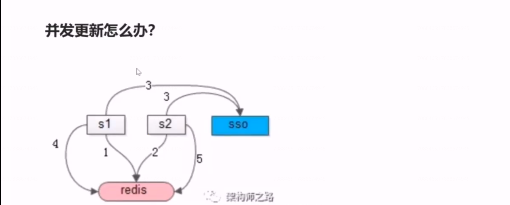
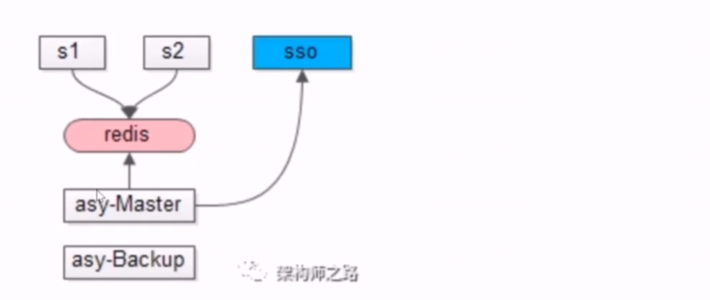
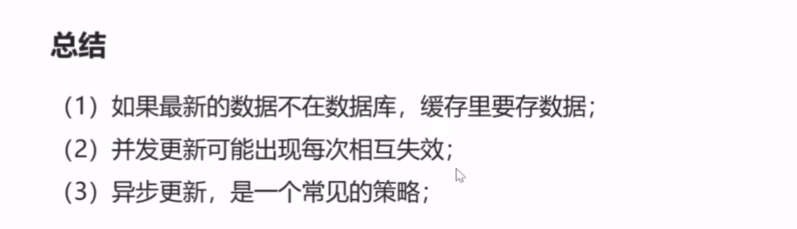

# 31、缓存：并发更新的大坑

当系统存在并发访问第三方接口的时候，在 token 过期的极限时间内，并发更新有可能导致token 相互的失效，有可能导致 token 递归的失效。 

如图所示，服务集群，并发的发起了第三方接口的访问，第一步，取旧的 token 访问接口，发现 token 过期了，同时（第二步），并发的请求取旧的token,访问接口也发现 token 过期了，第三步，第一个请求去访问新的token(得到token1),同时并发的请求也去访问新的 token （得到token2）,第四步，把token1 放入缓存，同时使用 token1 去访问接口，但把token1 放入缓存时，其实token 1已经过期，因为token1 是第三步申请的token ，而后续立刻发起了第二次申请token2 的请求，token2 的请求申请下来之后，token1 会过期，第四步把token写回redis,然后带着token1 去访问第三方的接口，又会提示token 失效，可能服务会重新的发起新token 的申请（得到token3），新 token 一旦申请，之前并发生成的 token2又会失效，第二次的并发访问带着 token2 去访问新的接口，又发现token2又失效，如此递归，可能并发的接口会一直相互的申请token3、token4、token5 .........。每一次申请新的token,都会导致并发申请的token 失效。

## 如何进行优化呢？

线上的服务s1、s2 只从缓存中读取token,token 的更新由一个一步的服务asy master 定期的更新token,避免并发的更新。

## 总结

