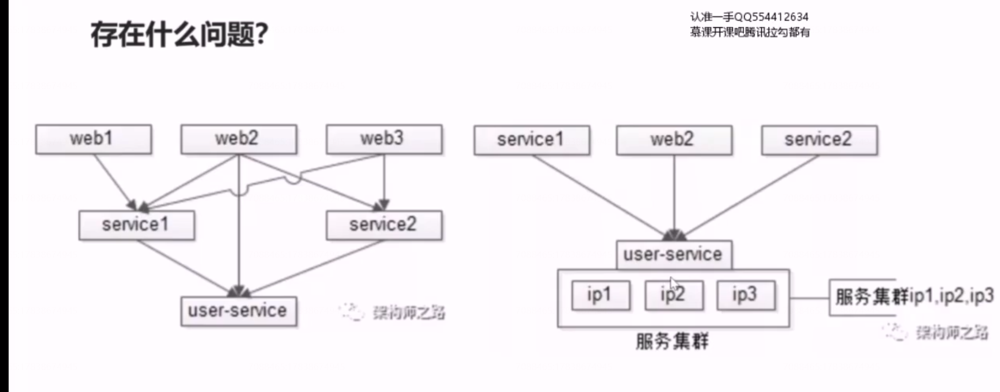
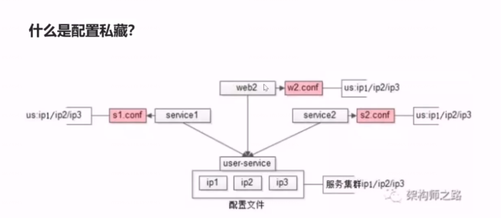
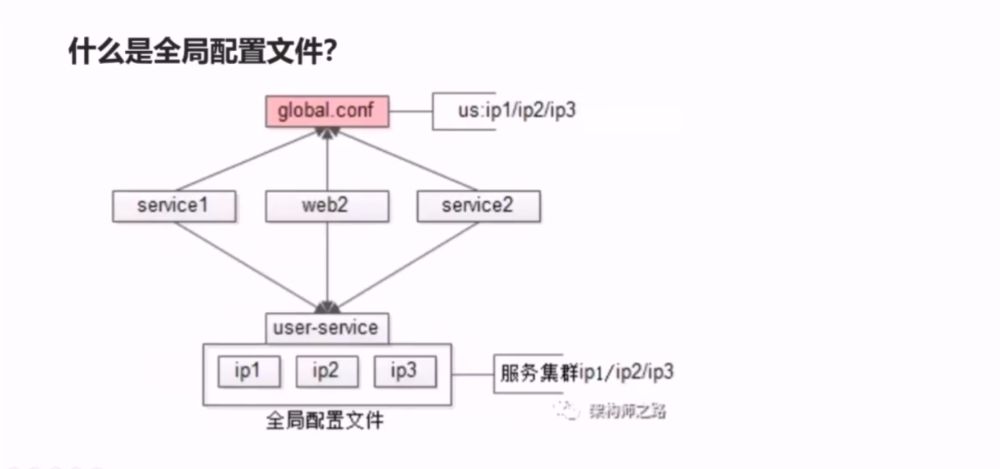

# 34、解耦：配置中心，与配置架构演进

## 存在什么问题？

调用方如何维护下游服务的集群配置，当集群节点增减时,调用方是否有感知呢？

我们的配置架构是如何演进的？

## 阶段一：配置私藏

绝大部分的公司在初期都是这么玩配置文件的，他叫配置私藏，配置私藏架构缺点是什么？

比如：当运维检测出user-service 的ip1 节点可能因为硬盘性能下降，需要通知上游要将ip1 节点下线，同时扩容了两个节点ip4和ip5,此时，要通知所有的上游调用方， 去修改各自私藏的配置，并重启上游，将连接连接到新的集群（节点）上去，将流量从下线的节点上迁走。当业务复杂度较高，上述过程会异常的复杂。

## 阶段二：全局配置文件

对于通用的服务，建立全局配置文件，消除配置私藏。    

不足：如果调用方一直不重启，那就没有办法读取全局配置文件中的新的ip,将流量迁移到扩容的这个服务提供方的节点上。

但是依然解决不了服务方不知道有多少个上游调用的自己。

## 阶段三：配置中心

## 总结

