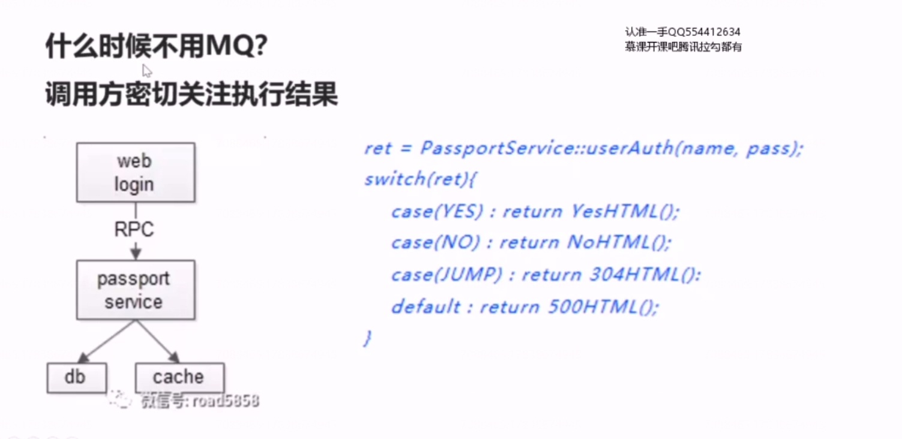
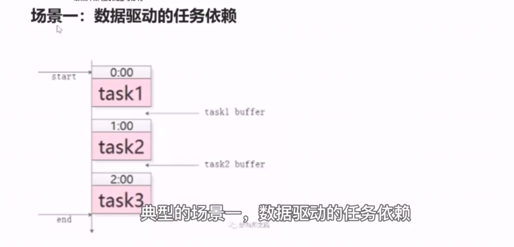
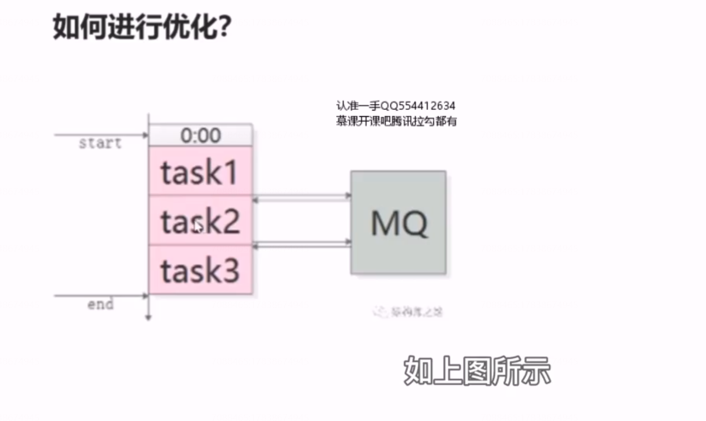
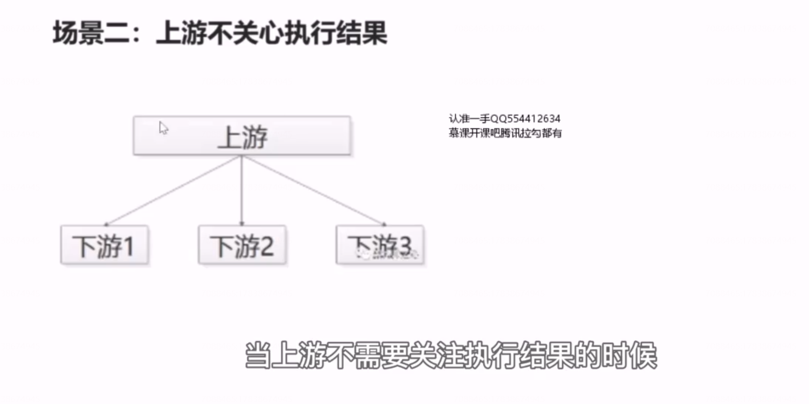
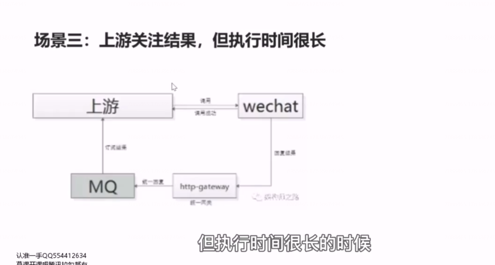
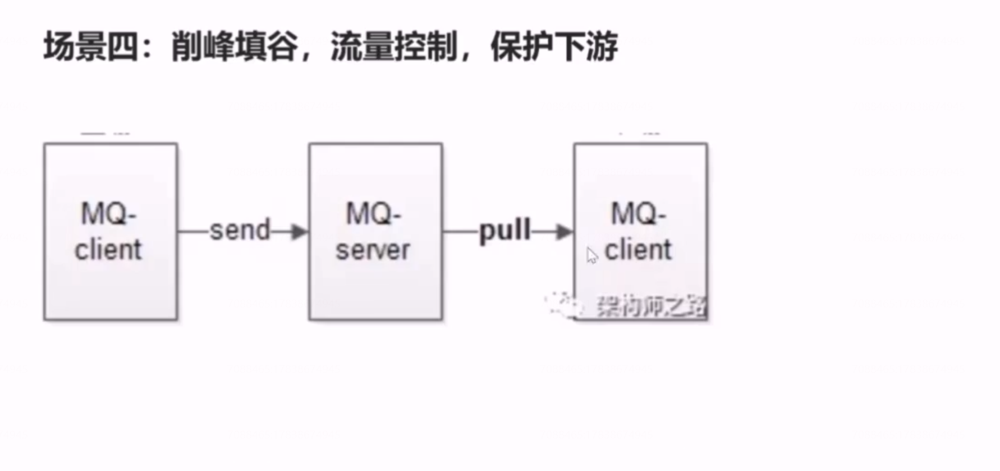
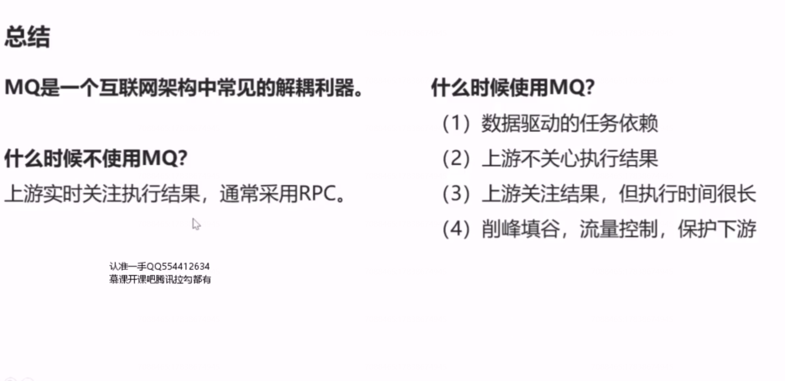

# 35、MQ,互联网架构解耦利器

## 什么时候不用MQ?

调用方密切关注执行结果，通常不使用mq，而使用rpc 调用。

**绝大部分的场景应该使用rpc 调用。那到底何时使用mq 来做解耦呢？**

## 场景一：数据驱动的任务依赖

什么是任务依赖，举一个例子，互联网公司经常在凌晨进行一些数据统计的任务，这些任务之间往往有一定的依赖关系，比如说task3需要使用task2 的输出作为输入，task2需要使用task1 的输出，作为task2 的输入，这样的话，任务一、任务二、任务三之间就有了依赖关系，必须任务一先执行，任务二再执行，任务三后执行。对于这类的需求通常是怎样实现的呢？

通常的玩法就是crontab,人工执行时间表，如上图所示，我们需要手动的设定，在零点task1 先执行，根据经验来说，task1 的执行时间为 50 分钟，task2 什么时候执行呢？通常我们会约定一点执行，中间为task1 的50分钟。会预留十分钟的buffer,同理我们也会为 task3设定执行的时间，并为task2的执行时间预留buffer,这个crontab手动排班表有什么坏处呢？

  如果有一个任务的执行时间超过了buffer 预留时间，后续的执行会得到一个错误的结果.............. 

此时，可以使用mq 来进行解耦优化

如上图所示，任务之间通过mq 来传递任务开始与任务结束的通知。比如说task1 我们仍然准时开始，在他结束之后，会往mq 发送一个 task1 完成的消息，task2 订阅task1 完成的消息，收到消息之后第一时间内启动执行，结束之后发动一个task2完成的消息，task3 订阅task2完成的消息，在收到相关的消息之后，task3 启动处理。

好处1：上游的任务执行万，下游总会在第一时间内启动任务的执行。

好处2：执行多个任务，依赖多个任务，依赖关系非常好处理，只需要订阅相关的消息完成即可。当有任务的执行时间发生变化的时候，任何下游都不需要调整执行时间，因为他都是以上一个任务完成的通知为下一个任务启动的信号。

 

## 场景二：上游不关心执行结果

## 场景三：上游关注结果，但执行时间很长

## 场景四：削峰填谷，流量控制，保护下游

## 总结

