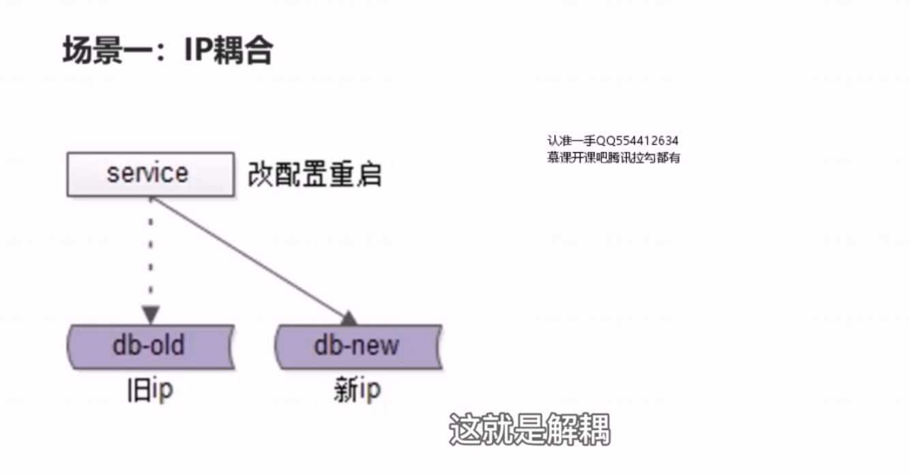
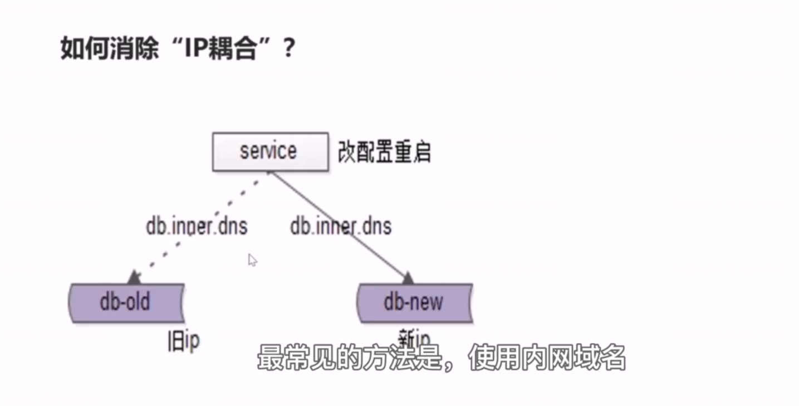
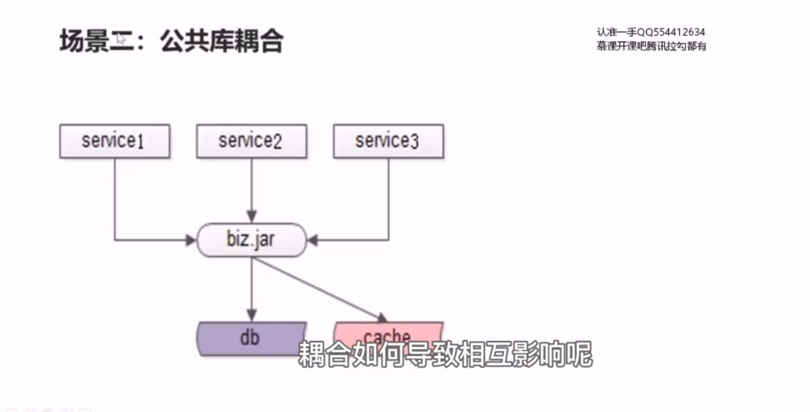
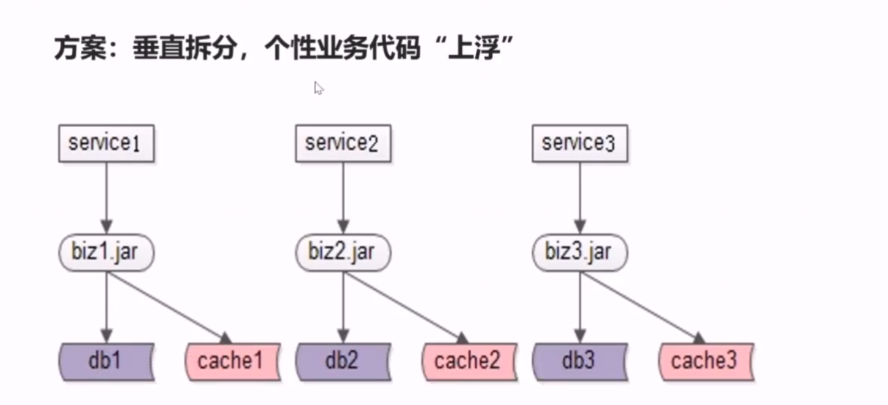
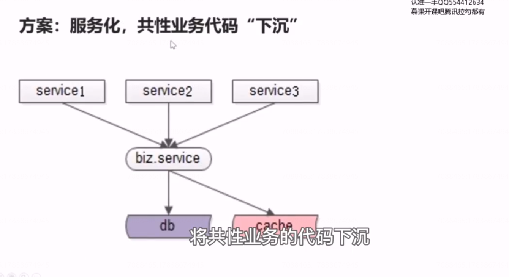
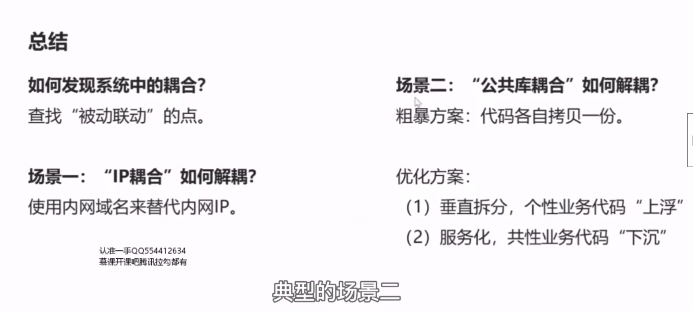

# 37、解耦：IP耦合，公共库耦合，解耦实践

## 场景一：IP耦合

## 如何进行IP解耦呢？

最常见的方法是，使用内网域名代替内网IP，如果没有做这个优化，将配置文件中的内网IP全部干掉，全部更换为内网域名。

## 场景二， 公共库耦合

这里更多的是指通用业务的公共库

## 如何消除公共库耦合？

### 最粗暴的解法：代码拷贝一份

### 方案：垂直拆分，个性业务代码“上浮”

### 方案：服务化，共性业务代码“下沉”

最终达到通过服务，rpc 的调用方式来消除解耦。

## 总结

