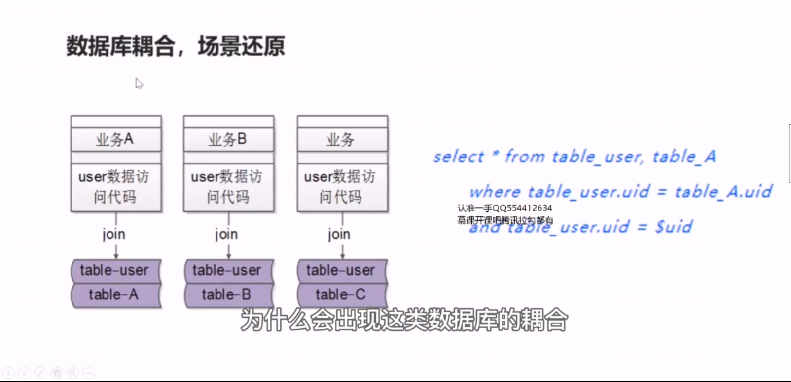
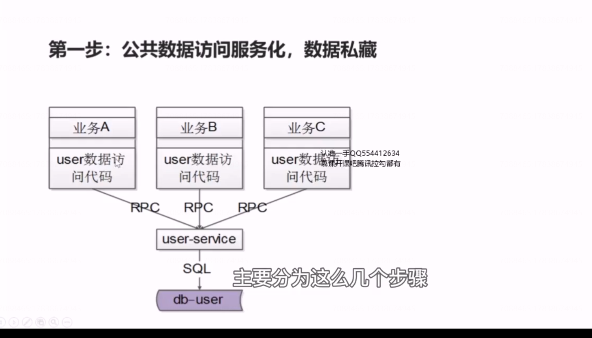
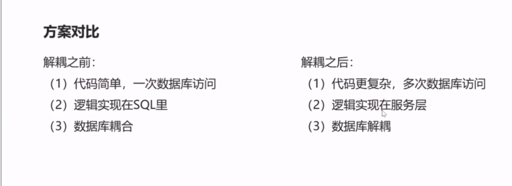

# 38、解耦：数据库耦合，解耦实战

## 数据库耦合，场景还原

这种通过连表去实现业务逻辑，导致通用的用户表table-user和个性化的业务表 table-A必须存在一个数据库实例里面，如果业务b 也这么做，业务c 也这么做，就有可能导致业务a业务b业务c都必须存在一个数据库实例里面。

## 如何解耦 

### 第二步，个性数据访问，自己家的屎自己管理

 

总的来说，公共的部分下沉拆分成服务，个性化的部分自己管理。

## 总结

最终达到的效果：给机器就能扩容。

