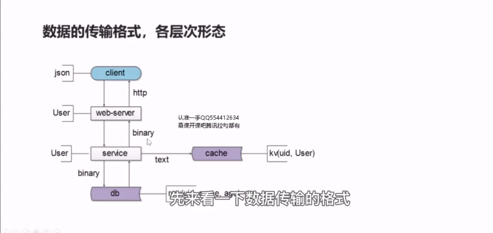
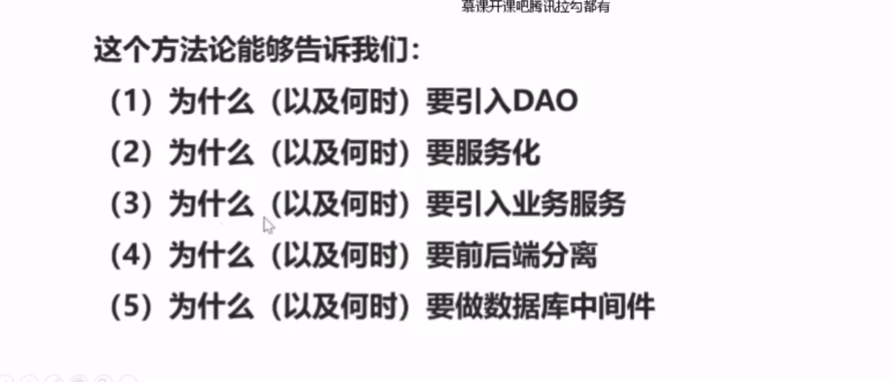
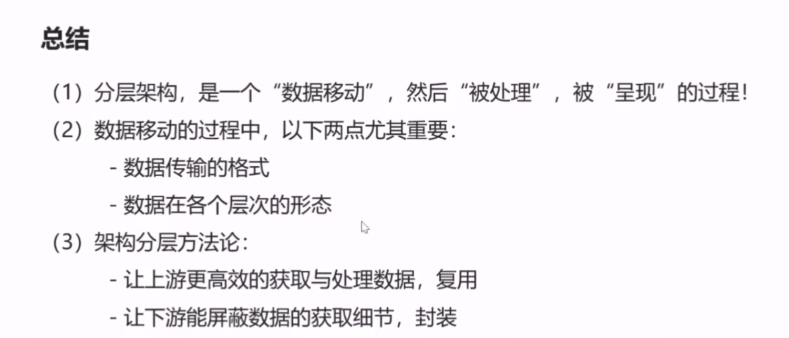

## 40、分层：互联网分层架构方法论

随着共性代码下沉，分层会不会越来越多？

分层的方法论是什么？

什么时候要开始分层？

此时，有两个东西就显得尤其重要：

（1）数据传输的格式

（2）数据在各个层次的形态

 先来看一下数据传输的格式

协议是数据传输的载体，服务和数据库与缓存之间，二进制与文本的协议是数据传输的载体.站点应用到服务之间，rpc的二进制协议是数据传输的载体。客户端到站点应用之间http协议是数据传输的载体。

在缓存层，数据是以kv的形式存在的，key 是用户的id,value 是用户的实体序列化后的二进制。

## 架构分层方法论：

（1）让上游更高效的获取与处理数据，复用。

  (2) 让下游能屏蔽数据的获取细节，封装。

## 总结

