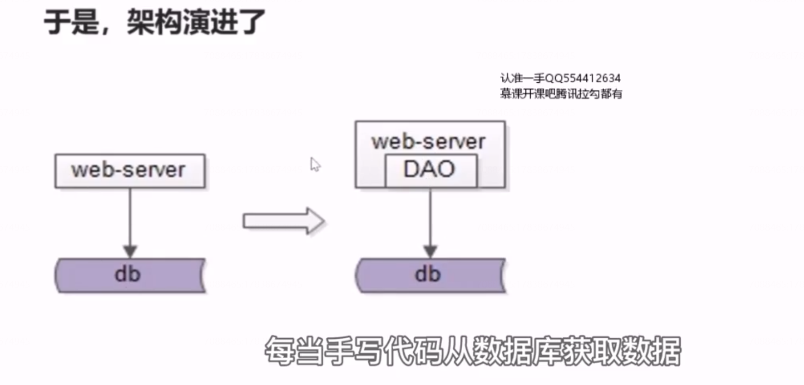
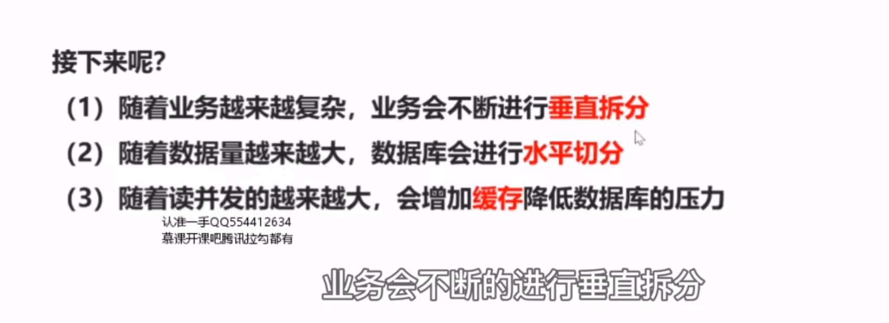
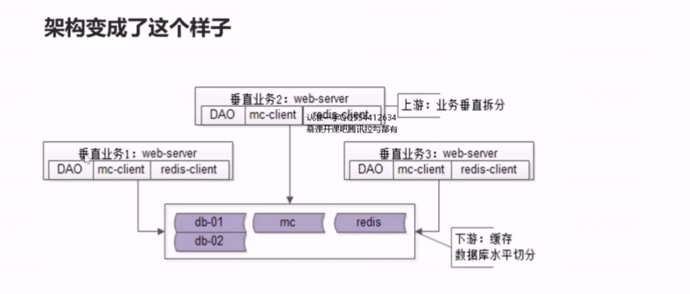
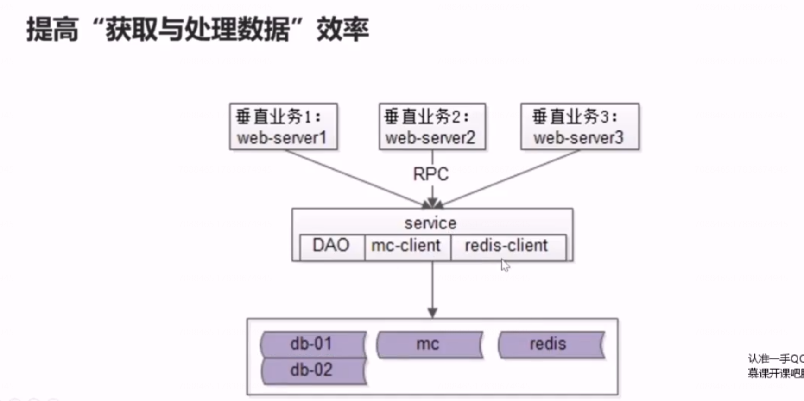
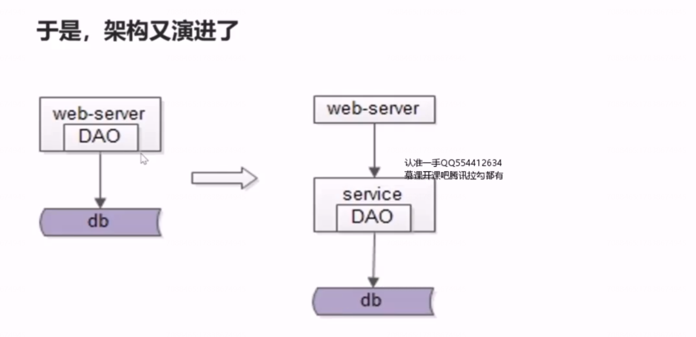
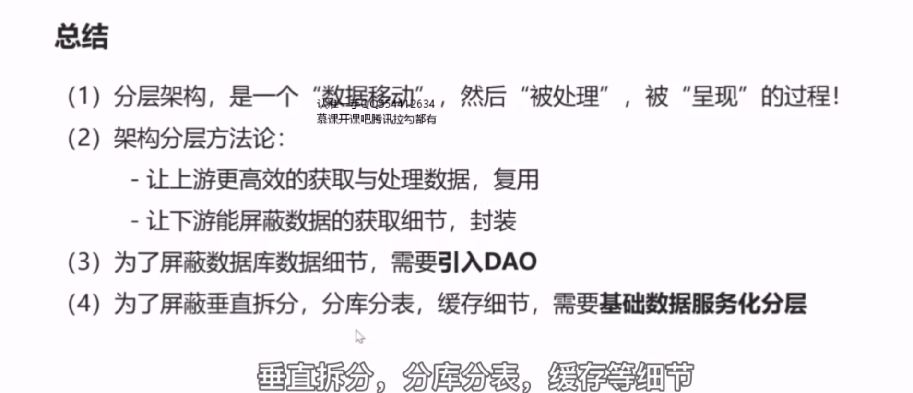

# 41、分层：DAO与服务化

这里的结论是：每当手写代码从数据库获取数据成为通用痛点的时候，就应该抽象出DAO层，简化数据获取的过程，提高数据获取的效率，向上游屏蔽底层数据获取的复杂性。

于是这个时候架构变成了这个样子

提高“获取与处理数据”效率

数据服务层周游这一个地方需要关注缓存、分库分表、读写分离这一些复杂性，这样就能够极大的提升上游获取与处理数据的效率。

于是，架构又演进了

**这里的结论是，随着业务越来越复杂，垂直拆分的系统越来越多，数据库实施了水平切分，数据层实施了缓存加速，底层数据获取的复杂性， 成为通用痛点的时候，这个时候我们应该进行服务化，抽象出数据服务层，以简化上游获取数据的过程，提高数据获取的效率，向上游屏蔽底层的复杂性。**

## 总结

