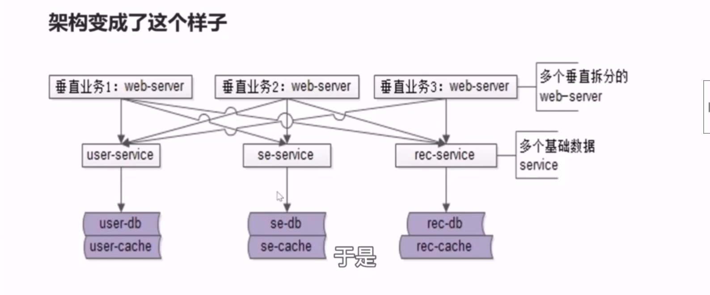

#  42、分层：业务服务层，是否有必要？

## 基础数据服务化后的架构

接下来呢？

（1）随着业务越来越复杂，业务会不断进行垂直拆分

（2）随着数据越来越复杂，基础数据service 也会越来越多

## 于是架构变成了这个样子

**不同业务的上游列表页都依赖于底层若干相同的服务，一旦一个服务的rpc 接口有变化，上游所有的系统都需要升级等等问题。**

## 提高“获取与处理数据”效率

业务服务化，**通用业务**服务层的抽象势在必行。通过通用业务服务层的抽象，例如58同城，

它抽象出了通用列表服务，多个站点应用层通过 rpc 接口像调用本地函数一样去调用通用列表服务，一次性获取他所需的商业、自然搜索，推荐和用户数据。而通用业务服务，首先它是一个跟业务相关的服务，listting service 是一个列表页的服务。它可以多次调用基础服务，封装所有业务上游所需要共性展现的一些数据，底层数据的复杂性，都屏蔽在了他这一层。好处是复杂的代码，只在通用业务服务写了一次，并没有任何代码的拷贝。

 

## 于是，架构又演进了

## 总结

