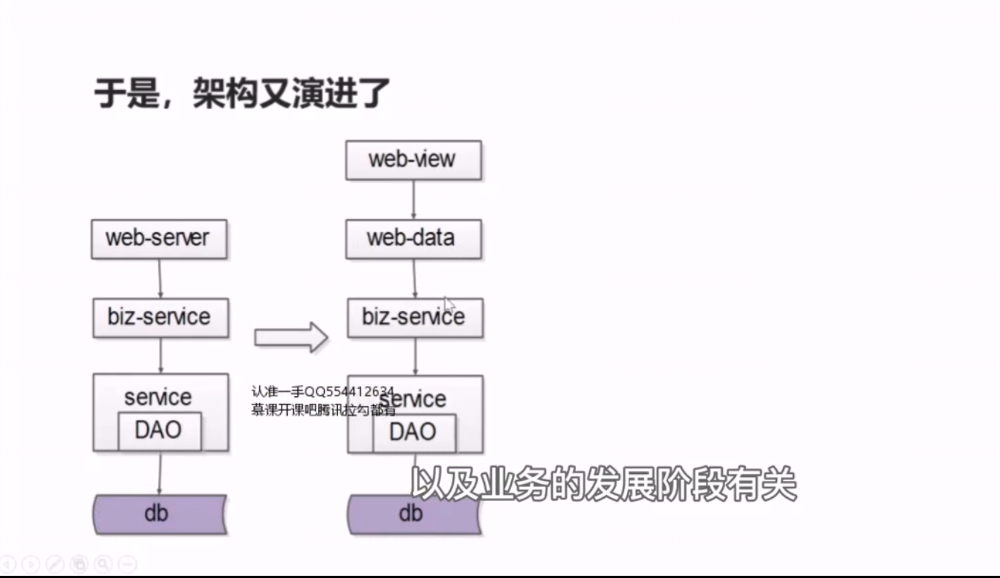

# 43、分层：前后端分离

上面有什么痛点呢？

（1）设备兼容性，折磨着MVC工程师

（2）PC、H5、APP前端变化的频率，远大于后端业务逻辑变化的频率

 

使用node.js 负责数据的展现与交互，有前端fe同学维护，后端站点数据层，负责业务逻辑处理与json 数并没有代码拷贝。据接口的提供。，由java 工程师维护，这样的好处是，复杂的业务逻辑与数据的形成只有在站点层一处来实施了，当底层 service 接口发生变化的时候，只有站点数据层一处需要升级修改，如果站点数据层或者底层的服务层出现bug,

只有站点数据层一处需要升级修改，站点展现层可以根据不同的产品形态，pc、

移动h5版，或者是app 版本，传入不同的参数，调用不同的站点数据层的接口，连适配端上所需要的产品形态变化。 

## 于是，架构又演进了

