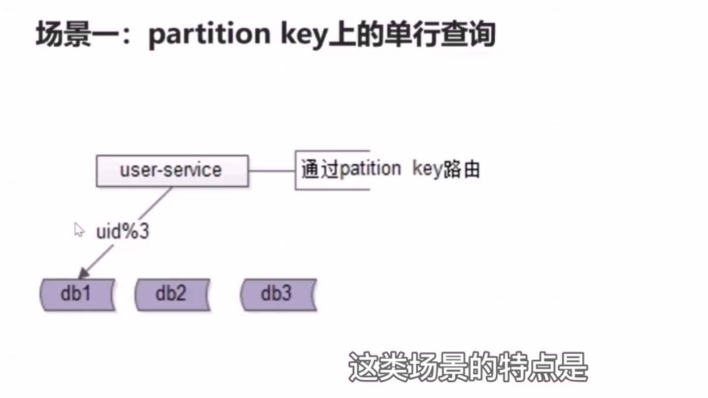
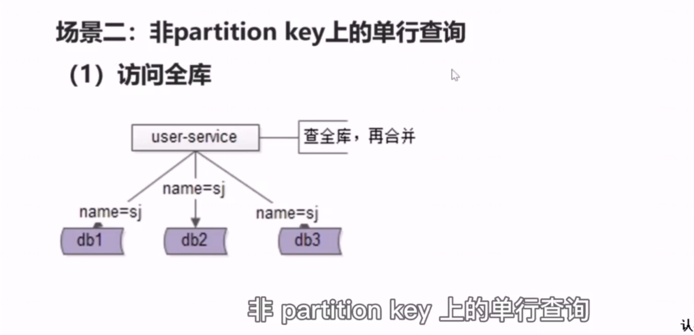
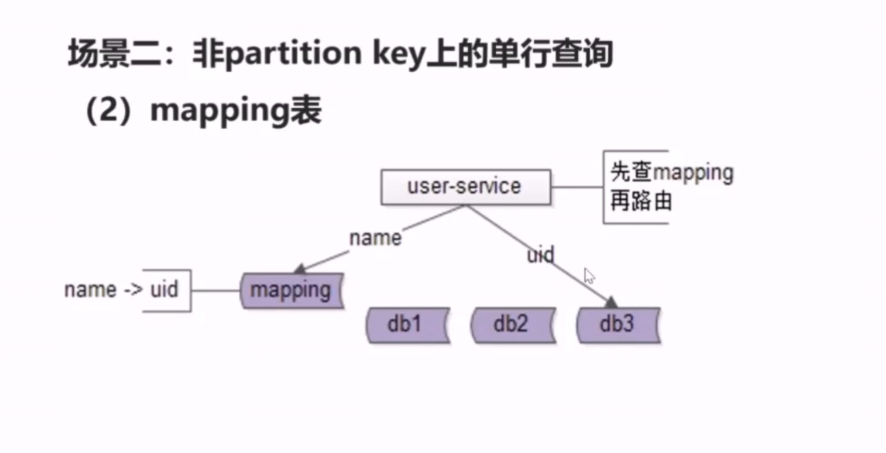
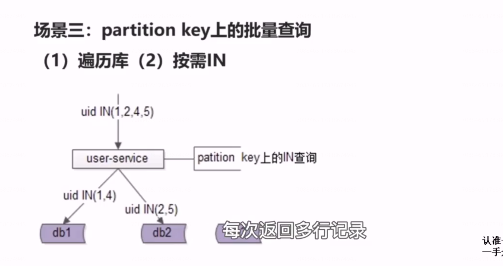
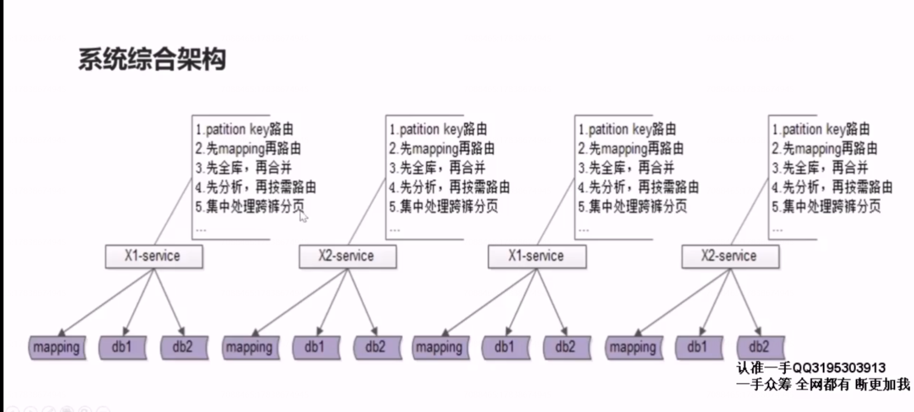
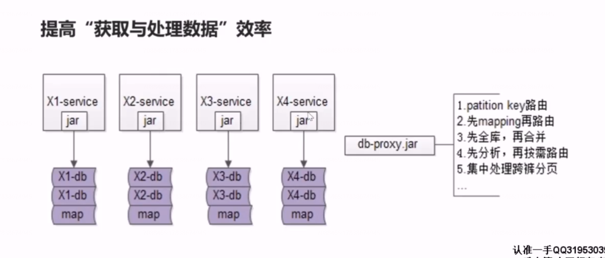
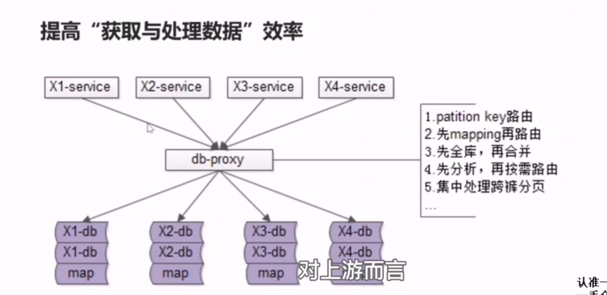
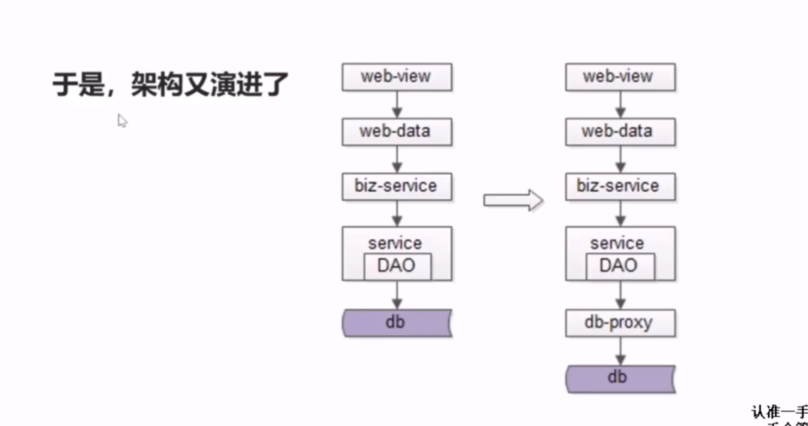
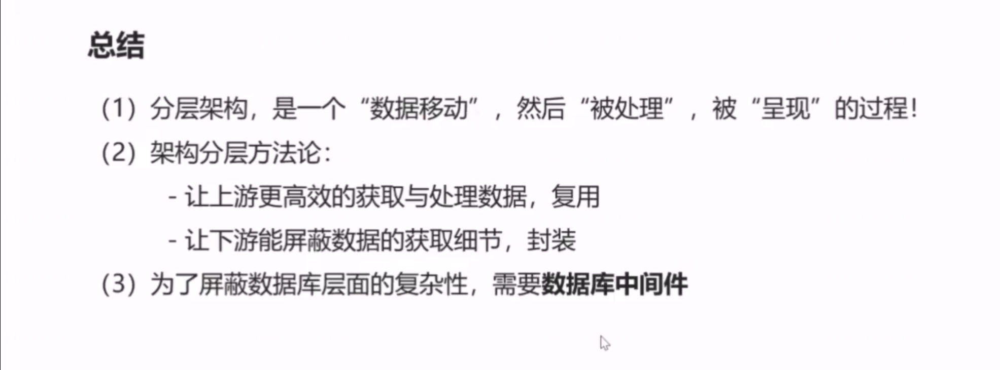

# 44、分层：数据库中间件

随着时间的推移，数据量会越来越大，此时数据库需要考虑水平切分，一旦数据库进行水平切分，原来很多SQL可以支持的功能，就需要基础数据服务来进行特殊的处理。

## 场景一:partition key 上的单行查询

   

发现问题了吗？

（1）基础数据服务层的复杂度提高了

（2）获取数据与处理数据的效率降低为了

最终，我们的架构变成了什么样子呢？

当数据库水平切分之后，基础数据服务层越来越多之后，底层的复杂性会扩散到所有的基础，数据服务层，每一个基础数据服务层都需要实施按 partition key 路由，先 mapping 再路由，先全库再合并.........。，这些复杂性会扩散到所有的基础服务。  

## 如何让数据的获取更加高效快捷呢？

数据库中间件的引入势在必行。数据库中间件的实施又有两种方案，一种是基于客户端的方案，这个架构图是基于客户端实施的数据库中间件。

所有的数据库调用方通过这个客户端去数据库获取数据库底层的数据，而所有底层的复杂性，都封装在了这一个客户端里。这是基于客户端的数据库中间件。

还有一种是基于服务端的数据库中间件，基于服务端的数据库中间件，对上游而言，他就是数据库，所以上游不需要有大的修改，所有复杂性都屏蔽在基于服务端的数据库中间件里。

## 于是，架构演进了

## 总结

