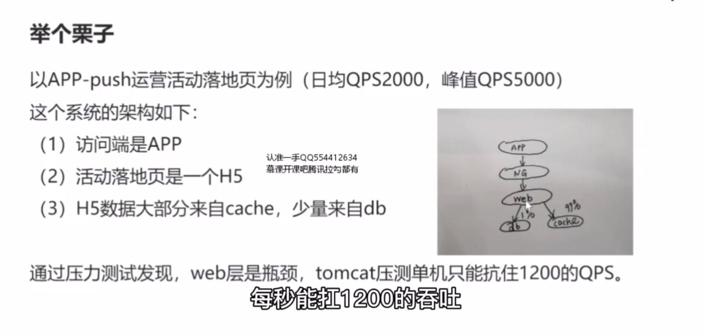

# 4、容量设计：流量高低，对架构究竟有什么影响?

随着业务的增长，日流量从 10 W 级别，增长到 100 W 级别，此时，要进行容量预估

什么样的场景，需要进行容量设计呢？

## 哪些指标要进行容量预估？

看具体业务，对应到系统侧的主要矛盾是什么，例如：

（1）数据量     ---（帖子业务）

（2）并发量，吞吐量  ---（12306  抢票业务）

（3）带宽   ---（音视频，直播业务，可能带宽是系统的第主要矛盾）

（4）CPU/MEM/DISK 等   -----（加解密，区块链）

## 如何 进行容量评估

### 第一步：评估总访问量

### 第二步：评估平均吞吐量（QPS）

第三步：评估高峰吞吐量（QPS）

第四步：评估单机极限 QPS

进行压力测试

一般来说，线上的系统是不会跑满的，大哥八折，单机线上允许跑到 qps 1000。 最后我们根据线上系统的冗余度，来做对策，上述一到四步已经得到了系统的峰值 qps 是5000，单机 qps 是 1000 。假设线上部署了两台服务，此时我们就能够自信的回答技术老大提出的问题了。 技术老大问，我们回答，峰值是5000，单机抗1000，线上只有两条，所以扛不住。

