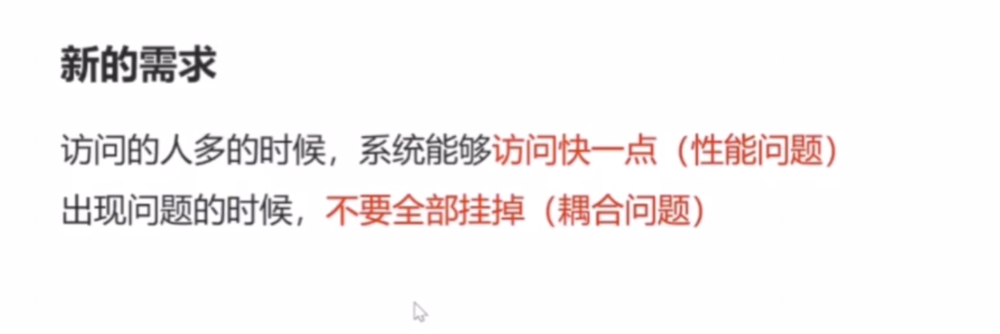
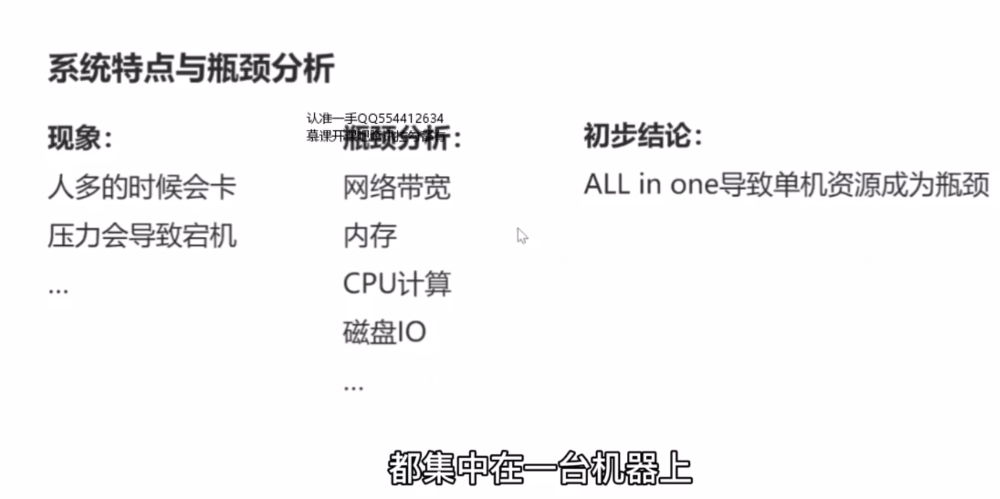
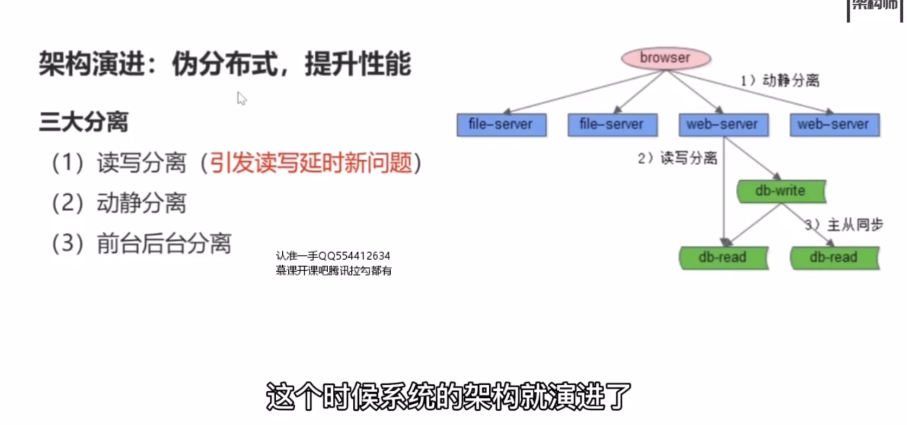
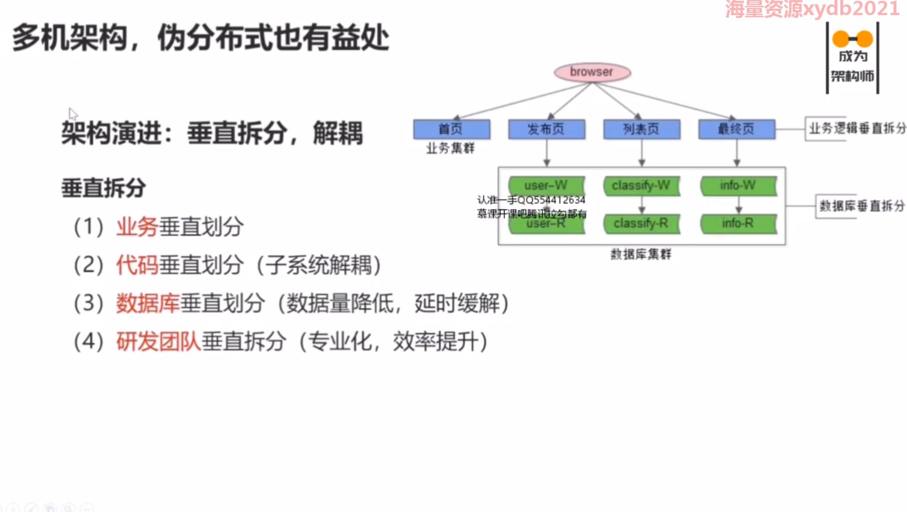
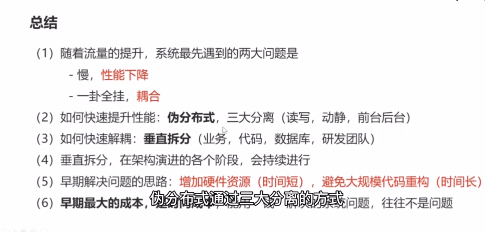

# 5、伪分布式：你以为，多机就是分布式？

初期，架构的特点是什么？

（1） 单机系统 （ALL in  one  ）

（2） 程序耦合（All in one）

（3） 逻辑 核心 是 CURD

 

为了提升性能

这个时候系统的架构就演进了，他由一个单机系统，变成了一个伪分布式系统。 

### 三大分离的架构设计思路：

用最快的速度，增加硬件的资源，提升系统性能，增加访问速度。

### 什么问题没有得到解决？

（1） 耦合问题：一个子系统挂了，仍然是全站挂。

（2） 主从延时新问题：读写分离只能提升读性能，无法降低库数据量。

如何解决呢？

早期的架构实施方案是业务垂直拆分。 

总结：

