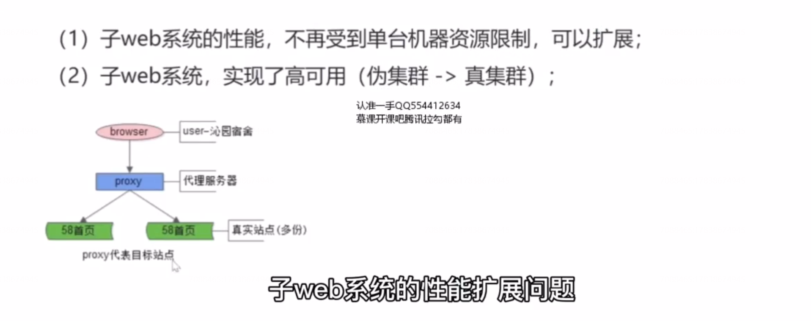

# 6、接入层：反向代理，负载均衡，我有话要说  

  

这被称为，“伪”分布式。每一个业务其实它并不是高可用的，伪集群，伪多机，他存在的问题是子系统的性能仍然受到单机资源的限制，无法扩展。

第二，每一个子系统仍然无法做到高可用，只能够做到挂了这个子系统，另外一个子系统不受影响。

此时，反向代理技术，就站了出来。

## 方向代理，解决什么问题？

## 反向代理，带来了什么新的问题？

## 反向代理，如何实施负载均衡？

四层指的是传输层，七层是应用层， 更具体的，对应到 nginx 来做反向代理哈希，四层是指根据用户的ip和端口来做哈希。七层是根据  http 协议中的某些属性来做哈希，比如session id 或者 用户 id 等。

## 反向代理，如何包装高可用？

这个方案的缺点是 两台 nginx ,实际上只有一台对外提供服务，整个资源的利用率只有 50 % 

## 总结

