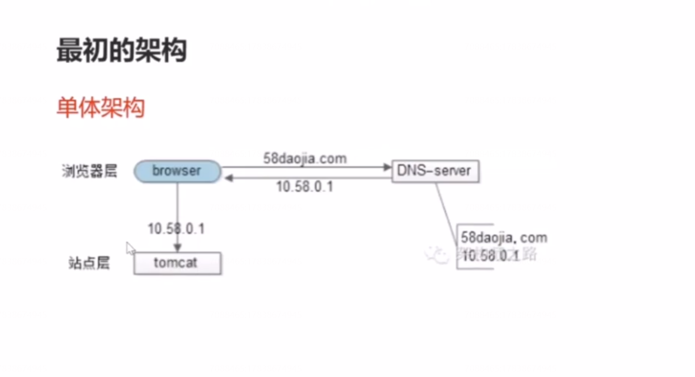
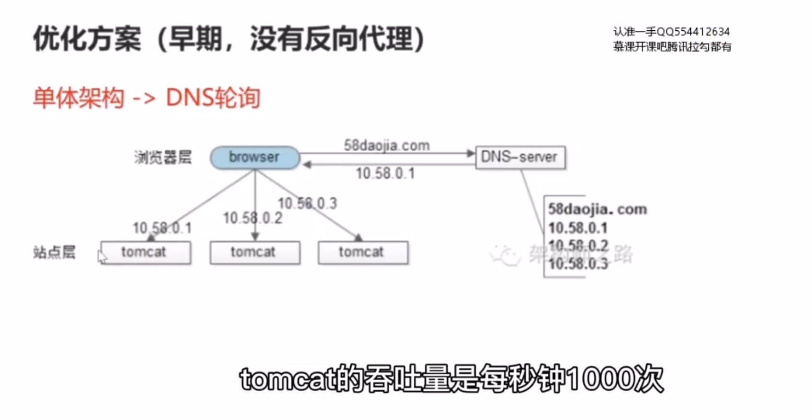
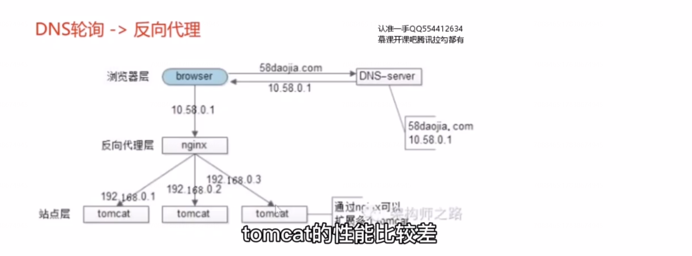
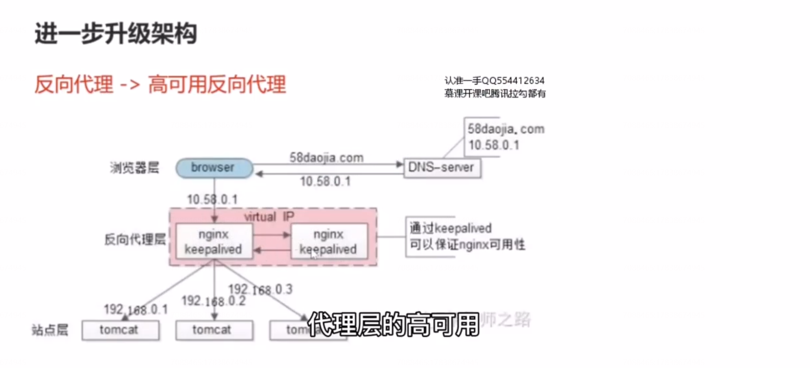
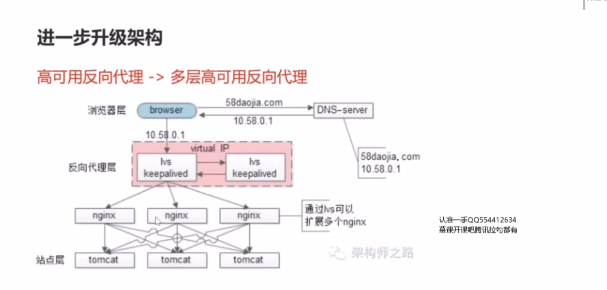
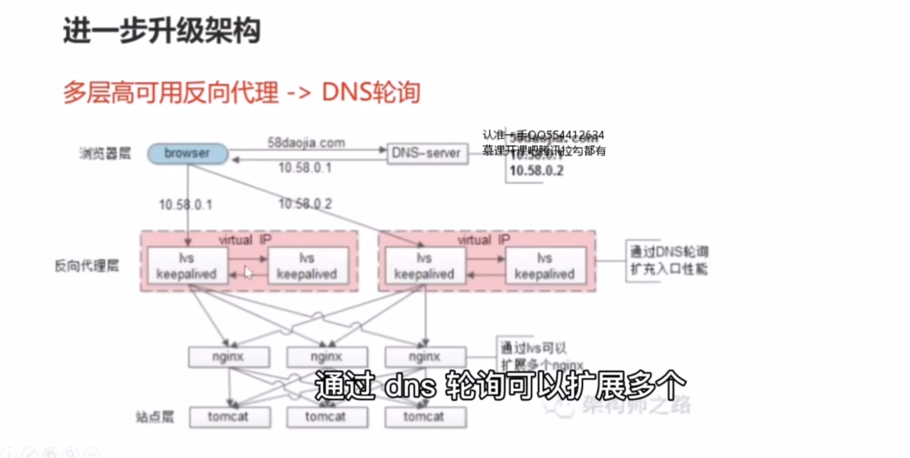
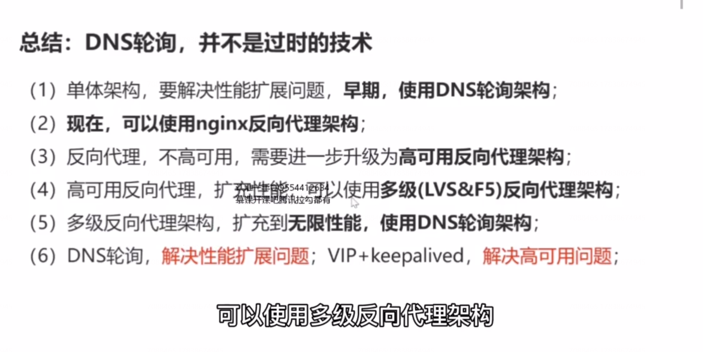

# 7、DNS 轮询，以及接入层架构演进

两个问题

（1）nginx 是 2012 年，国内才流行起来的技术，在反向代理之前呢？

（2）nginx 成了系统的瓶颈，怎么办？反向代理虽然可以做到高可用，但是他的资源利用率只有 50%，也就是说只有一台 nginx 对外提供服务。

今天来讲讲 “DNS  轮询”，以及接入层架构演进！

### 最初的架构

### 早期，优化方案

但是dns 不足的是：系统仍然是非高可用的，dns-server 他只负责域名解析ip,这个 ip  上的服务是否可用，dns-server 是不知道的。

### 升级优化方案（有了反向代理之后）

但是他的不足是整个处理的流程，时延增加了，因为他中间增加了一层，中间加了一个反向代理层，时延增加了，架构更复杂了。并且反向代理成了单点，反向代理成了单点之后，那我们需要通过keepalived 加冗余 nginx 节点来保证反向代理层的高可用。

### 高可用反向代理

这个过程对调方是透明的 ，这样就解决反向代理的高可用问题，但是他的不足是资源利用率只有 50%,两台nginx 只有一台对线上提供服务，另外一台是 standby 的。仅在主nginx 出问题的时候，才提供服务。

### 多层高可用反向代理

那还存在什么问题呢？

nginx  他只有一台对线上提供服务，那整个站点的吞吐超过了 nginx 的 1 万每秒，比如说达到了5万，那怎么办呢？当然，绝大部分公司到不了这一步，每秒吞吐量5万次。此时系统的架构会从高可用反向代理升级到，多层高可用反向代理。

nginx 是应用层的软件，性能比tomcat 好，但总有一个上限。当系统的吞吐量超出了 nginx 的上限，还是扛不住，lvs 就不一样了，它是实施在操作系统层面的，F5 的性能又更好了，它是实施硬件层面的。他们的性能都比 nginx 高很多。这样的话，我们可以利用 lvs 和 F5 来进行扩容，形成多级反向代理。把 lvs  架在 nginx的上层。他每秒可能可以扛5 万。F5 可能可以扛10 万，我们依然选用 虚ip 加 keepalived 的方式来保证系统的高可用。这里需要强调的的是，lvs 作为系统的总入，做了高可用之后，他下层的反向代理nginx,和再下层的站点层tomcat 其实是不用再做虚ip的 ，是因为nginx 如果出了问题，lvs 能够探测到实时的将流量迁移到其他的nginx,如果Tomcat 出了问题， nginx 也能探测到，能够将流量转移到其他Tomcat,所以nginx 和 Tomcat下层的反向代理和站点不需要做虚ip,只有在入口处需要做虚ip。

99.99%的公司到这一步，基本就结束了。他能够解决接入层的高可用，扩展性和负载均衡的问题。难道这就完美了吗？还有什么潜在的问题呢？

不管是lvs 还是 f5，这些都是典型的 scale up 的方案。 什么是 scale up？根本上lvs 和 F5 还是会有性能上限的，假设lvs 每秒钟能够处理十万个请求，那么他一天也就只能处理80亿的请求， 假设有一个系统，日pv 超过了80 亿次，改怎么办呢？此时架构需要进一步升级。

多层高可用反向代理再增加一个 dns 轮询。水平扩展，才是解决性能的根本方案。他能够增加机器的方式扩充系统的性能，像 fb,google这样的一些站点，他的日pv 肯定是超过 80 亿次的， 那么他们的域名只对应一个 ip 吗？还是得通过 dns 轮询的方式来进行扩容。此处dns 轮询解决的是扩展性的问题。 

通过dns 轮询，可以扩展多个高可用的lvs。通过dns  轮询，同一个域名返回不同的外网ip,来扩充接入入口，一组虚ip 的lvs能够每秒扛10万，两组能够扛20万。

又使用了 DNS 轮询，有没有保证高可用？

如果仅仅使用dns 轮询，他不能够保证高可用，但他加上 keepalived vip 就可以解决这些问题了，最终 dns 轮询解决的是，性能扩展的问题，keepalived  加 vip 解决的是，高可用的问题。

### 总结

