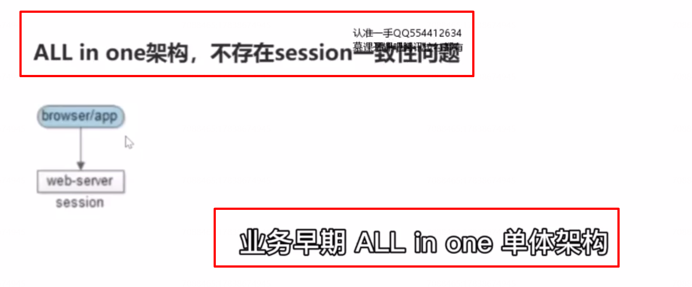

# 8、接入层：session 一致性，要如何保证？

## 什么是session?

服务器会为每个用户创建一个会话，存储用户相关的信息，以便多次请求，能够定位到同一个上下文。web 开发中，web-server可以自动的为同一个浏览器的访问用户自动创建session, 提供数据存储功能，最常见的，会把用户的登录信息、用户信息存储在session 中，以保证登录状态。 

## 什么是 session 一致性问题呢？

只要用户不重启浏览器，每次http 短连接请求，理论上服务端都能定位到 session,都能够定位到 同一台 web-server,以保持会话，这就是所谓 session 一致性问题。

解决session 一致性问题有哪些方案呢？

后端实现了web 集群化，保证高可用，当使用多台 web-server 来保证高可用时，每次 http 短连接请求， 就不一定能路由到正确的session 了，如上图所示，假设用户包含登录信息的session 都记录在第一台 web-server 上，如果反向代理将请求 路由到另外一台 web-server 上，就可能找不到相关的信息。而导致用户需要重新登录。这就是session  不一致了。

## 反向代理架构，保证高可用的同时，如何保证 session 路由的一致性呢？

### 方案一：session 同步法

思路是 多个 web-server 之间相互同步session,这样每个 web-server 之间都包含全部的session,使用这种方法的优点是只是web-server 支持的功能，应用程序不需要任何代码的修改。但他的不足是session同步需要数据传输，他需要占内网带宽。所有的web-server 都包含所有的session 数据， 所以他的数据量受内存限制，没有办法进行水平扩展。当有更多的web-server 时，这个方案要歇菜，性能会急剧下降。

### 方案二：客户端存储法

可以将session 数据存储在浏览器的cookie 里，每个端只要存储一个用户。也就是自己的数据就可以了，他的优点是 web-server 不需要存储 session, 他的缺点是每次 http 请求都要携带session,非常占用外网的带宽。最后，如果你把session 存储在端上，存储量的大小，会受端上 cookie  的限制，端存储的方案虽然不常用，但确实是一种思路。把海量存储在服务端的数据分散，存储到每一个端上。

### 方案三：反向代理hash 一致性（四层，七层）

 

这种方案的思路是web-server 为了保证高可用，有多台冗余，反向代理层能不能做一些事情，让同一个用户的请求，保证落在同一台web-server上呢？

左边的方案：四层代理 hash,反向代理层可以使用用户的ip来做hash,以保证同一个ip 的请求落在同一个web-server上，方案二，七层代理hash,反向代理使用http 协议中的某些业务属性来做hash，例如session id，又或者城市id,又或者用户id等，能够更加灵活的实施hash 策略，以保证同一个浏览器的用户的请求落在同一台 web-server 上。

这种方案的优点是只需要修改 nginx 的配置，而不需要修改应用层的代码。并且他负载是均衡的。只要你的ip 是随机的，session id 是随机的，对台web-server 的负载均衡都是均衡的。

缺点是如果 web-server 重启，一部分 session 会丢失， 会对业务有微小的影响，例如出发部分用户重新登录，

第二个缺点是如果web-server 进行水平扩展，nginx 会进行重新的hash。session 会重新的发布,会导致一部分用户路由不到正确的session,从而要重新登录。当然session 一般是有有效期的，上面两点不足可以认为等同于 session  的失效，一般来说对业务影响不大。

个人推荐使用四层的hash。尽量不要引入业务层的属性最好不要让nginx 来关注。

### 方案四：后端统一存储法

他的思路是将session 存储在 web-server 后端的存储层，数据库或者缓存系统。

优点是首先没有了安全隐患，session 不用在外网上进行传输了，同时他可以实现 web-sever 层的任意水平扩展。当数据量增大的时候，数据库或者缓存进行相应的水平切分即可。同时 webserver扩容或者重启的时候都不会有session 的丢失，用户都不需要重新登录。它的不足是， 增加了一次网络调用，同时需要修改应用层的代码，前面提到很多的web-server 他能够自动的生成session,管理session,但是如果你放在数据库或者缓存里， 就需要你的应用代码来管理session。如果session 有高可用的要求（一般没有），cache 可以做高可用，但大部分的情况下，session 是可以丢失的。一般也不需要高可用。

## 总结：

