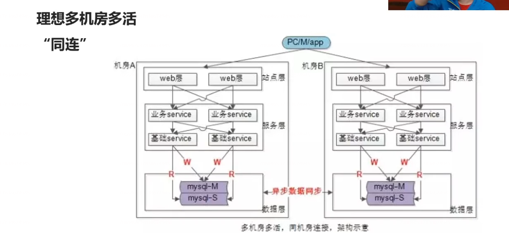
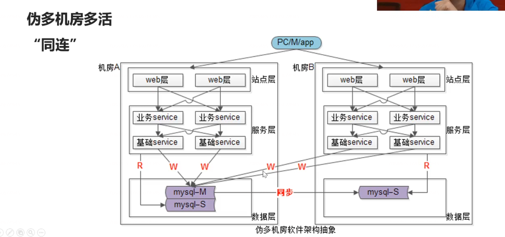

# 多机房多活架构设计，与机房平滑迁移方案

## 单机房架构

## 机房迁移目标与难点

最容易想到的迁移方案是：有没有可能，把现在机房里的所有站点、服务、缓存在新机房部署一套，然后切流量，可不可以？

首先是不可以的，存在这么几个问题，第一个问题，迁移的过程中要不要停服务，因为两边的数据是不一样的，不能直接切，你需要停服务，把数据迁移过去，再迁流量。

第二个问题，即使你能接受停服务，当有几百台机器，几千个集群的时候，系统的复杂度特别特别的高，你几百台机器部署一份，你切流量，一步到位的成功率特别特别的低，风险特别特别的高。

所以机房迁移的难点在于平滑，整个过程不停服务，并且能够蚂蚁搬家式的迁移。

所谓“平滑”：

（1）分业务，分子业务迁移

（2）分层迁移

（3）可回滚

（4）不停服

那么在迁移的过程中，一定会有一个中间状态，是两个机房同时对外提供服务的，你会被迫的做多机房多活，

大量“跨机房调用”是不可接受的！但迁移过程“跨机房调用”又难以避免，所以必须，多机房多活架构。

## 多机房架构

上图会有严重的数据一致性问题，两边同时写，中间存在着很大的延迟，会引发非常大的一致性问题。那什么样的情况下可以这种绝对的数据分割呢？就是当你每个机房访问的业务局部数据和城市这类属性相关的时候，是可以进行数据的绝对分割，然后进行远程数据同步的。理想状态是没有跨机房调用的。

### 伪多机房多活同连

  

## 自顶向下的平滑迁移方案

### 步骤一：站点与服务的迁移

### 步骤二：缓存层迁移

### 步骤三：数据库层迁移

## 总结

