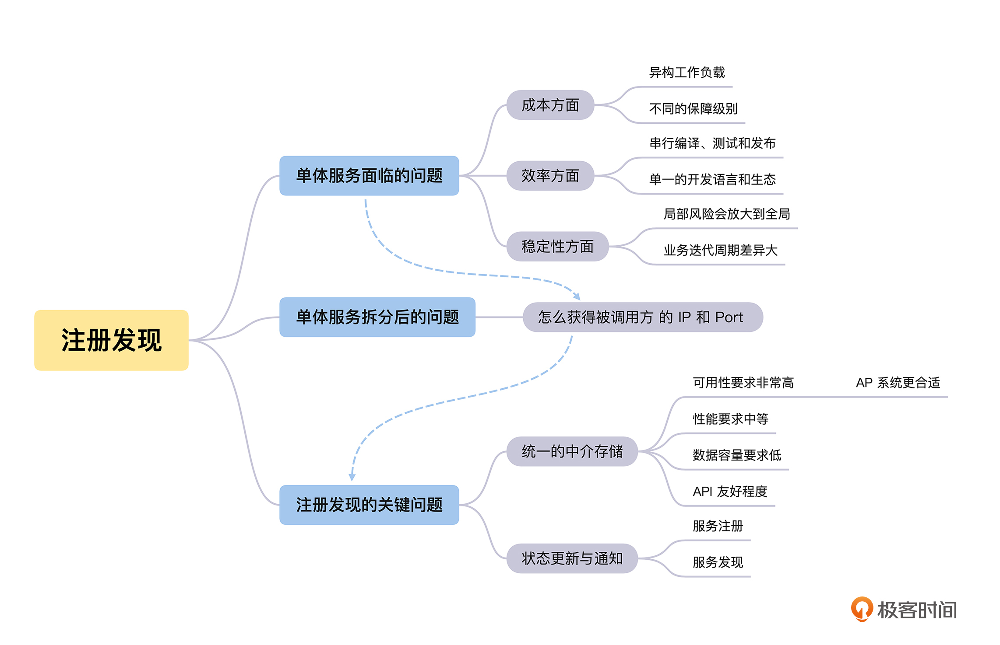
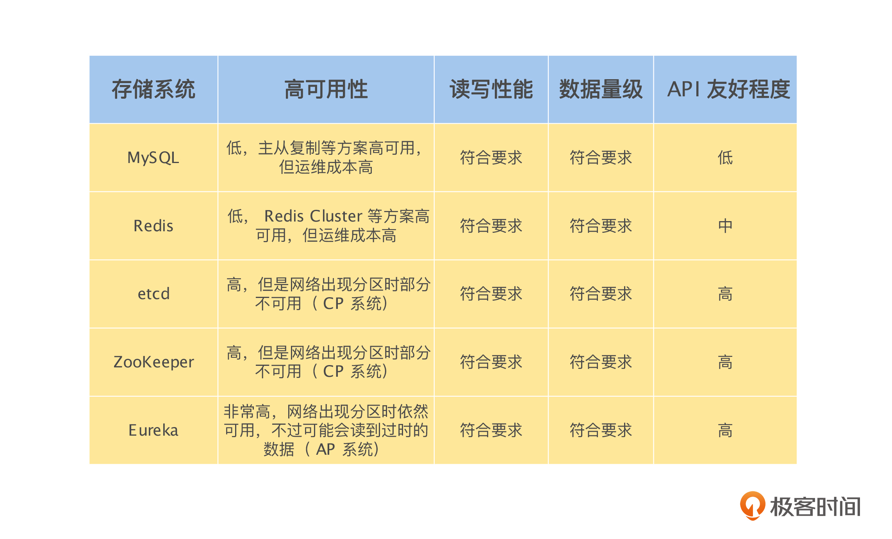
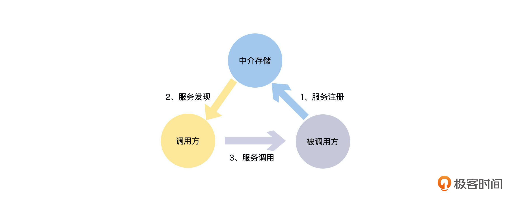

# 服务注册发现的业务场景

我们会遇到一个新的问题：之前所有的功能都在一个服务里面，不同模块和功能之间直接通过本地函数进行调用，拆分为多个服务后，怎么调用其他服务的函数呢？

你肯定能很快想到，通过 REST API 或者 RPC 来进行跨服务的调用。的确，这是个非常好的办法，但是通过 REST API 或者 RPC 都需要知道被调用服务的 IP 和 Port。所以，我们还需要解决一个问题：**如果服务 A 需要调用服务 B，那么服务 A 怎么获取被调用服务 B 的 IP 和 Port 呢**？这个其实就是服务注册发现的业务场景。

# 服务注册发现的关键问题是什么

首先，最容易想到的方式是配置 IP 和 Port 列表，即直接在服务 A 的配置文件中配置服务 B 的 IP 和 Port，如果服务 B 有多个实例，那么就配置一个列表。

这样的确解决了问题，但是如果服务 C、D、E 等非常多的服务，都需要调用服务 B，那么这些服务都需要维护服务 B 的 IP 和 Port 列表。每一次当服务 B 增加、删除一个实例，或者一个实例的 IP 和 Port 发生改变时，所有调用服务 B 的服务都需要更新配置，这是一个非常繁杂并且容易出错的工作，那么怎么避免这个问题呢？

其实，**我们可以将配置 IP 和 Port 列表的方式修改为配置域名和 Port**，即在服务 A 的配置文件中不再配置服务 B 的 IP 和 Port 列表，而是配置服务 B 的域名和 Port。这样可以通过域名解析获得所有服务 B 的 IP 列表，让所有的服务 B 都监听同一个 Port。

当服务 B 的实例有变更，不论有多少个服务调用服务 B，只需要修改服务 B 的域名解析就行了，这样就解决了配置分散到各个调用服务，导致配置一致性的问题。

但是如果服务 B 的某个实例出现了崩溃、网络不通等情况时，服务 A 在对服务 B 的域名做 DNS 解析时，会因为我们不能实时感知服务实例的状态变更，依然获得该实例的 IP，从而导致访问错误。

这里我们举一个租房中介的例子来说明一下。假设每一个要租 A 小区房子的人，都需要亲自去 A 小区获得租房的信息，同样，如果还想租 B 小区的房子，也需要亲自去 B 小区获得租房的信息，这是一个非常麻烦的事情。而更麻烦的是，一个小区的租房信息有变化了，之前获得信息的人都不会立刻知道，非常影响我们的租房效率和成功率。

这个时候，租房中介出现了，他每天去各个小区收集租房信息，我们需要租房的时候，直接联系中介就可以获得相关小区的租房信息，并且，中介会记录谁关心哪一个小区的租房信息。如果一个小区的租房信息有变化，中介会主动通知给关心这个小区的人，这样就让租房这件事情变得非常高效了。这里的租房中介，其实就是承担租房信息的注册和发现的功能。

所以，经过前面的讨论，我们可以得出服务注册发现需要解决的两个关键问题：

- **统一的中介存储**：调用方在唯一的地方获得被调用服务的所有实例的信息。
- **状态更新与通知**：服务实例的信息能够及时更新并且通知到服务调用方。

# 怎么实现服务注册发现

接下来我们就一起来讨论“统一的中介存储”和“状态更新与通知”这两个关键问题的解决办法。

## 如何选择适合的中介存储

“中介存储”这个问题，其实是我们在解决服务注册发现的时候，引入的一个中间层。“**计算机科学领域的任何问题都可以通过增加一个间接的中间层来解决**”，这一经典论断又一次被验证了。

我们需要找一个外部存储来做解决问题的中间层，但是基于服务注册发现的场景，我认为这个存储需要有以下几个特点：

- **可用性要求非常高**：因为服务注册发现是整个分布式系统的基石，如果它出现问题，整个分布式系统将不可用。
- **性能要求中等**：只要设计得当，整体的性能要求还是可控的，不过需要注意的是性能要求会随分布式系统的实例数量变多而提高。
- **数据容量要求低**：因为主要是存储实例的 IP 和 Port 等元数据，单个实例存储的数据量非常小。
- **API 友好程度**：是否能很好支持服务注册发现场景的“发布/订阅”模式，将被调用服务实例的 IP 和 Port 信息同步给调用方。

基于上面对所需求存储系统特点的分析，我们一起来对常见的存储系统做一个系统性的比较：-

\- 通过上面的分析，我们可以看到，这些存储系统几乎都能用来作为服务发现的中介存储系统，但是基于整体考虑，MySQL 和 Redis 在高可用性和 API 友好程度上不满足要求，**所以更合适的存储系统为 etcd、ZooKeeper 和Eureka**。如果你希望在系统出现网络分区的时候，调用方一定不能获取过期的被调用服务实例信息，那么就选择 etcd 和 ZooKeeper，但是在被分区的部分网络中，可能出现因为不能获取被调用服务实例信息，而导致请求失败的情况。

如果你认为获取过期的实例信息，可能比完全不能获取被调用服务的实例信息要好，那么就选择 Eureka。毕竟大部分情况下，信息并没有过期，因为被调用服务的实例配置还没有发生变更，并且就算获得的信息过期了，也只是导致一次请求失败。

>Redis 高可用是满足要求的，只不过 Redis 的高可用需要我们自己来运维，比如通过哨兵机制在检察和剔除出现故障的节点等，而 etcd、ZooKeeper 和 Eureka 它们的高可用是系统自带的，所以课程中说 Redis 高可用的运维成本高。

## 怎么做服务状态的更新与通知

对于“状态更新与通知”这个问题，我们可以将其分解为两个问题解决：-

\- 首先是服务的状态更新，即**服务注册**：如上图中的 1，服务的每一个实例每隔一段时间，比如 30 秒，主动向中介存储上报一次自己的 IP 和 Port 信息，同时告诉中介存储这一信息的有效期，比如 90 秒。这样如果实例一直存活，那么每隔 30 秒，它都会将自己的状态信息更新到中介存储。如果实例崩溃或者被 Kill 了，那么 90 秒后，中介存储就会自动将该实例的信息清除，避免了实例信息的不一致。所以这里的数据同步是最终一致性的。

然后是服务的状态通知，即**服务发现**：如上图中的 2，服务的调用方通过中介存储监听被调用服务的状态变更信息。这里可以采用“发布/订阅”模式，也可以采用轮询模式，比如每30秒去中介存储获取一次。所以这里的数据同步也是最终一致性的。

# 选择 AP 还是 CP

根据上面的讨论，从服务注册发现的场景来说，**我认为Eureka 之类的 AP 系统更符合要求**。因为服务发现是整个分布式系统的基石，所以可用性是最关键的设计目标。并且上面介绍的服务，在同步自己的状态到中介存储，以及调用方通过中介存储区获得服务的状态，这两个过程中的数据同步都是最终一致性的。既然服务注册发现系统整体是一个 AP 系统，那么将中介存储设计为 CP 系统，去放弃部分的可用性是不值得的。

到这里，服务注册发现的基本原理就介绍完了。当我们去研究各种各样服务发现的实现方式时，就会发现其实它们都是在解决“如何选择适合的中介存储”和“怎么做服务状态的更新与通知”的问题。当然由于服务发现是非常基础和重要的功能，所以其中的各种实现都是在高性能、高可用性的基础上解决上面的两个问题，做着各自的优化与权衡。

