# xmlSpring Cloud 配置中心 Apollo 入门


## 1. 概述

本文我们来学习如何在 Spring Cloud 中使用 Apollo 作为**配置中心**，实现服务的统一配置管理。

> FROM [《Apollo 设计文档 —— Home》](https://github.com/ctripcorp/apollo/wiki)
>
> Apollo（阿波罗）是携程框架部门研发的分布式配置中心，能够集中化管理应用不同环境、不同集群的配置，配置修改后能够实时推送到应用端，并且具备规范的权限、流程治理等特性，适用于微服务配置管理场景。

在开始本文之前，胖友需要对 Apollo 进行简单的学习。可以阅读[《Apollo 极简入门》](http://www.iocoder.cn/Apollo/install/?self)文章，将第一二小节看完，在本机搭建一个 Apollo 服务。

> 友情提示：因为 Apollo 没有对 Spring Cloud 进行集成，所以在使用上和在 Spring Boot 中差异性不大，因此本文内容上和[《芋道 Spring Boot 配置中心 Apollo 入门》](http://www.iocoder.cn/Spring-Boot/config-apollo/?self)大致相同，嘿嘿~

## 2. 快速入门

> 示例代码对应仓库：[`labx-09-sc-apollo-demo`](https://github.com/YunaiV/SpringBoot-Labs/tree/master/labx-09-spring-cloud-apollo/labx-09-sc-apollo-demo)。

本小节，我们会在 Apollo 服务中定义配置，并使用 [`@ConfigurationProperties`](https://github.com/spring-projects/spring-boot/blob/master/spring-boot-project/spring-boot/src/main/java/org/springframework/boot/context/properties/ConfigurationProperties.java) 和 [`@Value`](https://github.com/spring-projects/spring-framework/blob/master/spring-beans/src/main/java/org/springframework/beans/factory/annotation/Value.java) 注解，读取该配置。

> 友情提示：如果胖友看过[《芋道 Spring Boot 配置文件入门》](http://www.iocoder.cn/Spring-Boot/config-file/?self)的[「2. 自定义配置」](https://www.iocoder.cn/Spring-Cloud/Apollo/?self#)小节，就会发现本小节是对标这块的内容。
>
> 如果没看过，也没关系，艿艿只是提一下而已，嘿嘿。继续往下看即可。

下面，我们来创建一个 [`labx-09-sc-apollo-demo`](https://github.com/YunaiV/SpringBoot-Labs/tree/master/labx-09-spring-cloud-apollo/labx-09-sc-apollo-demo) 示例项目，进行快速入门。最终项目代码如下图所示：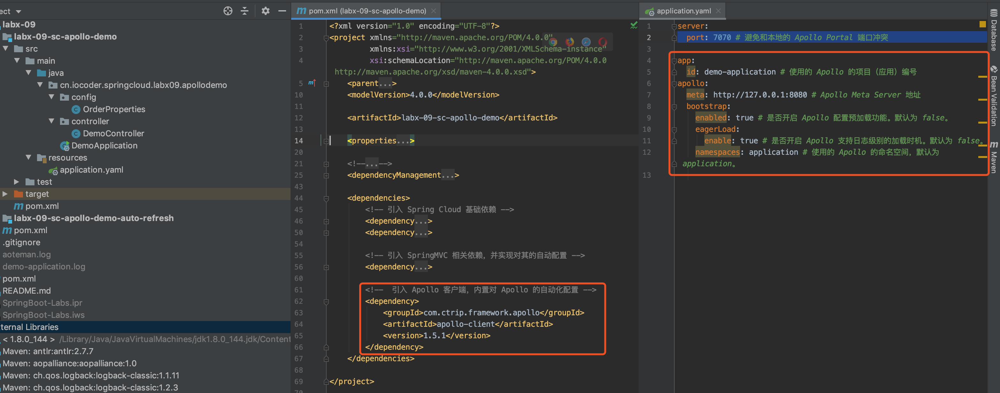

### 2.1 引入依赖

在 [`pom.xml`](https://github.com/YunaiV/SpringBoot-Labs/blob/master/labx-09-spring-cloud-apollo/labx-09-sc-apollo-demo/pom.xml) 文件中，主要引入 Apollo 相关依赖。代码如下：


```xml
<?xml version="1.0" encoding="UTF-8"?>
<project xmlns="http://maven.apache.org/POM/4.0.0"
         xmlns:xsi="http://www.w3.org/2001/XMLSchema-instance"
         xsi:schemaLocation="http://maven.apache.org/POM/4.0.0 http://maven.apache.org/xsd/maven-4.0.0.xsd">
    <parent>
        <artifactId>labx-09</artifactId>
        <groupId>cn.iocoder.springboot.labs</groupId>
        <version>1.0-SNAPSHOT</version>
    </parent>
    <modelVersion>4.0.0</modelVersion>

    <artifactId>labx-09-sc-apollo-demo</artifactId>

    <properties>
        <maven.compiler.target>1.8</maven.compiler.target>
        <maven.compiler.source>1.8</maven.compiler.source>
        <spring.boot.version>2.2.4.RELEASE</spring.boot.version>
        <spring.cloud.version>Hoxton.SR1</spring.cloud.version>
    </properties>

    <!--
        引入 Spring Boot、Spring Cloud、Spring Cloud Alibaba 三者 BOM 文件，进行依赖版本的管理，防止不兼容。
        在 https://dwz.cn/mcLIfNKt 文章中，Spring Cloud Alibaba 开发团队推荐了三者的依赖关系
     -->
    <dependencyManagement>
        <dependencies>
            <dependency>
                <groupId>org.springframework.boot</groupId>
                <artifactId>spring-boot-starter-parent</artifactId>
                <version>${spring.boot.version}</version>
                <type>pom</type>
                <scope>import</scope>
            </dependency>
            <dependency>
                <groupId>org.springframework.cloud</groupId>
                <artifactId>spring-cloud-dependencies</artifactId>
                <version>${spring.cloud.version}</version>
                <type>pom</type>
                <scope>import</scope>
            </dependency>
        </dependencies>
    </dependencyManagement>

    <dependencies>
        <!-- 引入 Spring Cloud 基础依赖 -->
        <dependency>
            <groupId>org.springframework.cloud</groupId>
            <artifactId>spring-cloud-commons</artifactId>
        </dependency>
        <dependency>
            <groupId>org.springframework.cloud</groupId>
            <artifactId>spring-cloud-context</artifactId>
        </dependency>

        <!-- 引入 SpringMVC 相关依赖，并实现对其的自动配置 -->
        <dependency>
            <groupId>org.springframework.boot</groupId>
            <artifactId>spring-boot-starter-web</artifactId>
        </dependency>

        <!--  引入 Apollo 客户端，内置对 Apollo 的自动化配置 -->
        <dependency>
            <groupId>com.ctrip.framework.apollo</groupId>
            <artifactId>apollo-client</artifactId>
            <version>1.5.1</version>
        </dependency>
    </dependencies>

</project>
```


通过引入 [`apollo-client`](https://mvnrepository.com/artifact/com.ctrip.framework.apollo/apollo-client) 依赖，引入 Apollo 客户端，并实现对 Apollo 的自动化配置。

> 友情提示：Apollo 并未提供单独的 Spring Boot 项目，而是在 `apollo-client` 中直接提供对 Apollo 在 Spring Boot 自动配置的实现。

### 2.2 配置文件

在 [`application.yml`](https://github.com/YunaiV/SpringBoot-Labs/blob/master/labx-09-spring-cloud-apollo/labx-09-sc-apollo-demo/src/main/resources/application.yaml) 中，添加 Apollo 配置，如下：


```xml
server:
  port: 7070 # 避免和本地的 Apollo Portal 端口冲突

app:
  id: demo-application # 使用的 Apollo 的项目（应用）编号
apollo:
  meta: http://127.0.0.1:8080 # Apollo Meta Server 地址
  bootstrap:
    enabled: true # 是否开启 Apollo 配置预加载功能。默认为 false。
    eagerLoad:
      enable: true # 是否开启 Apollo 支持日志级别的加载时机。默认为 false。
    namespaces: application # 使用的 Apollo 的命名空间，默认为 application。
```


- `app.id` 配置项，使用的 Apollo 的项目（应用）编号。稍后，我们在[「2.3 创建 Apollo 配置」](https://www.iocoder.cn/Spring-Cloud/Apollo/?self#)小节中进行创建。
- `apollo.meta` 配置项，使用的 Apollo Meta Server 地址。
- `apollo.bootstrap.enabled` 配置项，是否开启 Apollo 配置预加载功能。默认为 `false`。😈 这里，我们设置为 `true`，保证使用 `@Value` 和 `@ConfigurationProperties` 注解，可以读取到来自 Apollo 的配置项。
- `apollo.bootstrap.eagerLoad.enable` 配置项，是否开启 Apollo 支持日志级别的加载时机。默认为 `false`。😈 这里，我们设置为 `true`，保证 Spring Boot 应用的 Logger 能够使用来自 Apollo 的配置项。
- `apollo.bootstrap.namespaces` 配置项，使用的 Apollo 的命名空间，默认为 `application`。关于 Apollo 的概念，可见[《Apollo 核心概念之“Namespace”》](https://github.com/ctripcorp/apollo/wiki/Apollo核心概念之“Namespace”)文章。

### 2.3 创建 Apollo 配置

在 Apollo 中创建 Apollo 配置，内容如下图所示：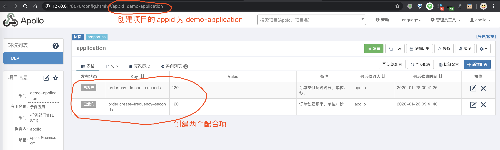

### 2.4 OrderProperties

创建 [OrderProperties](https://github.com/YunaiV/SpringBoot-Labs/blob/master/labx-09-spring-cloud-apollo/labx-09-sc-apollo-demo/src/main/java/cn/iocoder/springcloud/labx09/apollodemo/config/OrderProperties.java) 配置类，读取 `order` 配置项。代码如下：


```xml
@Component
@ConfigurationProperties(prefix = "order")
public class OrderProperties {

    /**
     * 订单支付超时时长，单位：秒。
     */
    private Integer payTimeoutSeconds;

    /**
     * 订单创建频率，单位：秒
     */
    private Integer createFrequencySeconds;

    // ... 省略 set/get 方法

}
```


- 在类上，添加 `@Component` 注解，保证该配置类可以作为一个 Bean 被扫描到。
- 在类上，添加 `@ConfigurationProperties` 注解，并设置 `prefix = "order"` 属性，这样它就可以读取**前缀**为 `order` 配置项，设置到配置类对应的属性上。

### 2.5 DemoController

创建 [DemoController](https://github.com/YunaiV/SpringBoot-Labs/blob/master/labx-09-spring-cloud-apollo/labx-09-sc-apollo-demo/src/main/java/cn/iocoder/springcloud/labx09/apollodemo/controller/DemoController.java) 类，提供测试 `@ConfigurationProperties` 和 `@Value` 注入配置的两个 HTTP 接口。代码如下：


```java
@RestController
@RequestMapping("/demo")
public class DemoController {

    @Autowired
    private OrderProperties orderProperties;

    /**
     * 测试 @ConfigurationProperties 注解的配置属性类
     */
    @GetMapping("/test01")
    public OrderProperties test01() {
        return orderProperties;
    }

    @Value(value = "${order.pay-timeout-seconds}")
    private Integer payTimeoutSeconds;
    @Value(value = "${order.create-frequency-seconds}")
    private Integer createFrequencySeconds;

    /**
     * 测试 @Value 注解的属性
     */
    @GetMapping("/test02")
    public Map<String, Object> test02() {
        return new JSONObject().fluentPut("payTimeoutSeconds", payTimeoutSeconds)
                .fluentPut("createFrequencySeconds", createFrequencySeconds);
    }

}
```


### 2.6 DemoApplication

创建 [DemoApplication](https://github.com/YunaiV/SpringBoot-Labs/blob/master/labx-09-spring-cloud-apollo/labx-09-sc-apollo-demo/src/main/java/cn/iocoder/springcloud/labx09/apollodemo/DemoApplication.java) 类，作为应用启动类。代码如下：


```java
@SpringBootApplication
public class DemoApplication {

    public static void main(String[] args) {
        SpringApplication.run(DemoApplication.class);
    }

}
```


### 2.7 简单测试

① 使用 DemoApplication 启动示例应用。在 IDEA 控制台中，可以看到 Apollo 相关的日志如下：


```xml
2020-03-01 14:42:54.155  INFO 74637 --- [           main] c.c.f.f.i.p.DefaultApplicationProvider   : App ID is set to demo-application by app.id property from System Property
2020-03-01 14:42:54.159  INFO 74637 --- [           main] c.c.f.f.i.p.DefaultServerProvider        : Loading /opt/settings/server.properties
2020-03-01 14:42:54.161  INFO 74637 --- [           main] c.c.f.f.i.p.DefaultServerProvider        : Environment is set to null. Because it is not available in either (1) JVM system property 'env', (2) OS env variable 'ENV' nor (3) property 'env' from the properties InputStream.
2020-03-01 14:42:54.161  INFO 74637 --- [           main] c.c.f.f.i.p.DefaultServerProvider        : Data Center is set to [yunai] by property 'idc' in server.properties.
2020-03-01 14:42:54.194  INFO 74637 --- [           main] c.c.f.a.i.DefaultMetaServerProvider      : Located meta services from apollo.meta configuration: http://127.0.0.1:8080!
2020-03-01 14:42:54.201  INFO 74637 --- [           main] c.c.f.apollo.core.MetaDomainConsts       : Located meta server address http://127.0.0.1:8080 for env UNKNOWN from com.ctrip.framework.apollo.internals.DefaultMetaServerProvider
```


② 使用浏览器，访问 <http://127.0.0.1:7070/demo/test01> 接口，测试 `@ConfigurationProperties` 注解的配置属性类，返回结果如下，符合预期：


```
{
    "payTimeoutSeconds": 120,
    "createFrequencySeconds": 120
}
```


② 使用浏览器，访问 <http://127.0.0.1:7070/demo/test02> 接口，测试 `@Value` 注解的属性，返回结果如下，符合预期：


```
{
    "payTimeoutSeconds": 120,
    "createFrequencySeconds": 120
}
```


## 3. 多环境配置

> 示例代码对应仓库：[`labx-09-sc-apollo-demo-profiles`](https://github.com/YunaiV/SpringBoot-Labs/tree/master/labx-09-spring-cloud-apollo/labx-09-sc-apollo-demo-profiles)。

在[《芋道 Spring Boot 配置文件入门》](http://www.iocoder.cn/Spring-Boot/config-file/?self)的[「6. 多环境配置」](https://www.iocoder.cn/Spring-Cloud/Apollo/?self#)中，我们介绍如何基于 `spring.profiles.active` 配置项，在 Spring Boot 实现多环境的配置功能。在本小节中，我们会在该基础之上，实现结合 Apollo 的多环境配置。

在 Apollo 中，我们可以通过搭建不同环境的 Config Service + Admin Service 服务。然后，在每个 `application-${profile}.yaml` 配置文件中，配置对应的 Config Service + Admin Service 服务即可。

下面，我们来创建一个 [`labx-09-sc-apollo-demo-profiles`](https://github.com/YunaiV/SpringBoot-Labs/tree/master/labx-09-spring-cloud-apollo/labx-09-sc-apollo-demo-profiles) 示例项目，搭建一个结合 Apollo 的多环境的示例。最终项目代码如下图所示：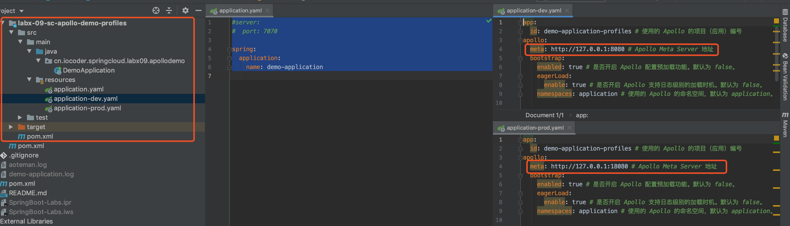

### 3.1 创建 Apollo 配置

在 Apollo 中创建 Apollo 配置，创建一个 AppId 为 `demo-application-profiles` 的项目，并配置 DEV（开发环境）和 PRO（生产环境）两套配置。如下图所示：

- 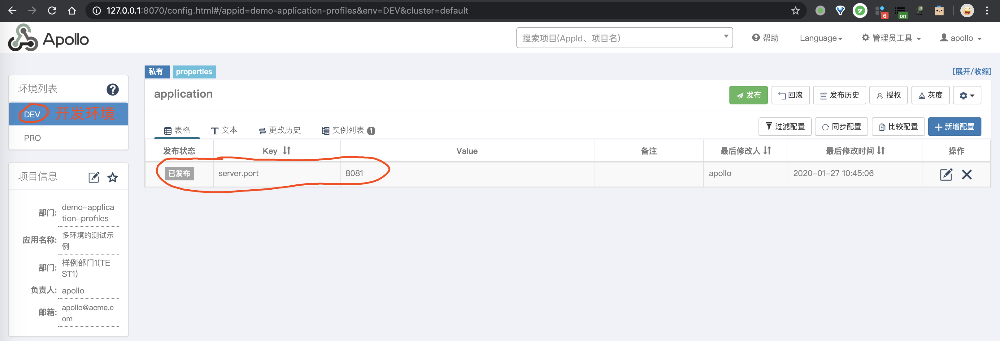
- 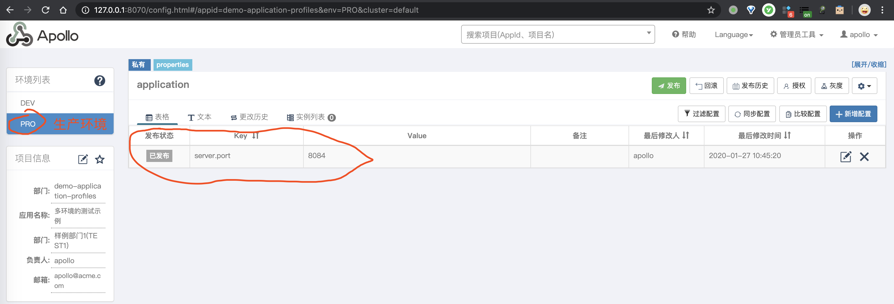

这里，我们通过不同环境，使用不同 `server.port` 配置项。这样， Spring Cloud 项目启动后，从日志中就可以看到生效的服务器端口，嘿嘿~从而模拟不同环境，不同配置。

3.2 引入依赖

和[「2.1 引入依赖」](https://www.iocoder.cn/Spring-Cloud/Apollo/?self#)一致，可以点击 [`pom.xml`](https://github.com/YunaiV/SpringBoot-Labs/blob/master/labx-09-spring-cloud-apollo/labx-09-sc-apollo-demo-profiles/pom.xml) 文件查看。

### 3.3 配置文件

在 [`resources`](https://github.com/YunaiV/SpringBoot-Labs/tree/master/labx-09-spring-cloud-apollo/labx-09-sc-apollo-demo-profiles/src/main/resources) 目录下，创建 2 个配置文件，对应不同的环境。如下：

- [`application-dev.yaml`](https://github.com/YunaiV/SpringBoot-Labs/blob/master/labx-09-spring-cloud-apollo/labx-09-sc-apollo-demo-profiles/src/main/resources/application-dev.yaml)，开发环境。

  ```
  app:
    id: demo-application-profiles # 使用的 Apollo 的项目（应用）编号
  apollo:
    meta: http://127.0.0.1:8080 # Apollo Meta Server 地址
    bootstrap:
      enabled: true # 是否开启 Apollo 配置预加载功能。默认为 false。
      eagerLoad:
        enable: true # 是否开启 Apollo 支持日志级别的加载时机。默认为 false。
      namespaces: application # 使用的 Apollo 的命名空间，默认为 application。
  ```

  

  - 和[「2.2 配置文件」](https://www.iocoder.cn/Spring-Cloud/Apollo/?self#)不同的点，重点是 `apollo.meta` 配置项，设置为 DEV 环境的 Apollo Meta Server 地址。

- [`application-prod.yaml`](https://github.com/YunaiV/SpringBoot-Labs/blob/master/labx-09-spring-cloud-apollo/labx-09-sc-apollo-demo-profiles/src/main/resources/application-prod.yaml)，生产环境。

  ```
  app:
    id: demo-application-profiles # 使用的 Apollo 的项目（应用）编号
  apollo:
    meta: http://127.0.0.1:18080 # Apollo Meta Server 地址
    bootstrap:
      enabled: true # 是否开启 Apollo 配置预加载功能。默认为 false。
      eagerLoad:
        enable: true # 是否开启 Apollo 支持日志级别的加载时机。默认为 false。
      namespaces: application # 使用的 Apollo 的命名空间，默认为 application。
  ```

  

  - 和[「2.2 配置文件」](https://www.iocoder.cn/Spring-Cloud/Apollo/?self#)不同的点，重点是 `apollo.meta` 配置项，设置为 PROD 环境的 Apollo Meta Server 地址。

另外，我们会创建 [`application.yaml`](https://github.com/YunaiV/SpringBoot-Labs/blob/master/labx-09-spring-cloud-apollo/labx-09-sc-apollo-demo-profiles/src/main/resources/application.yaml) 配置文件，放不同环境的**相同配置**。例如说，`spring.application.name` 配置项，肯定是相同的啦。配置如下：


```xml
#server:
spring:
  application:
    name: demo-application
```


3.4 DemoApplication

创建 [DemoApplication](https://github.com/YunaiV/SpringBoot-Labs/blob/master/labx-09-spring-cloud-apollo/labx-09-sc-apollo-demo-profiles/src/main/java/cn/iocoder/springcloud/labx09/apollodemo/DemoApplication.java) 类，配置 `@SpringBootApplication` 注解即可。代码如下：


```java
@SpringBootApplication
public class DemoApplication {

    public static void main(String[] args) {
        SpringApplication.run(DemoApplication.class);
    }

}
```


### 3.5 简单测试

下面，我们使用命令行参数进行 `--spring.profiles.active` 配置项，实现不同环境，读取不同配置文件。

> 经过测试：
>
> - 使用**命令行参数**进行 `--spring.profiles.active` 配置，对 `application.yaml` 配置文件**无效**。
> - 使用 **VM 参数**进行 `-Dspring.profiles.active` 配置爱，对 `application.yaml` 配置文件**有效**。
>
> 具体的原因还不知道，先暂时这么解决哈~

① **开发环境**示例：直接在 IDEA 中，增加 `-Dspring.profiles.active=dev` 到 VM options 中。如下图所示：[IDEA 配置 - dev](https://static.iocoder.cn/images/Spring-Cloud/2020-09-01/12.png)

启动 Spring Boot 应用，输出日志如下：


```
# 省略其它日志...
2020-01-27 12:08:57.051  INFO 27951 --- [           main] o.s.b.w.embedded.tomcat.TomcatWebServer  : Tomcat initialized with port(s): 8081 (http)
```


- Tomcat 启动在 8081 端口，符合读取 DEV 环境的配置。

② **生产环境**示例：直接在 IDEA 中，增加 `-Dspring.profiles.active=dev` 到 VM options 中。如下图所示：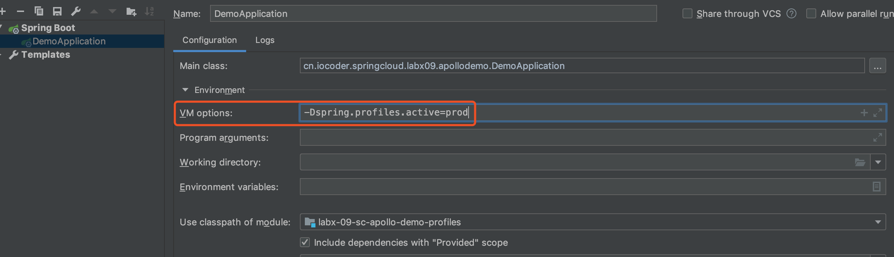

启动 Spring Boot 应用，输出日志如下：


```
# 省略其它日志...
2020-01-27 12:11:31.159  INFO 28150 --- [           main] o.s.b.w.embedded.tomcat.TomcatWebServer  : Tomcat initialized with port(s): 8084 (http)
```


- Tomcat 启动在 8084 端口，符合读取 PROD 环境的配置。

另外，关于 Spring Boot 应用的多环境部署，胖友也可以看看[《芋道 Spring Boot 持续交付 Jenkins 入门》](http://www.iocoder.cn/Spring-Boot/Jenkins/?self)文章。

## 4. 自动刷新配置

> 示例代码对应仓库：[`labx-09-sc-apollo-demo-auto-refresh`](https://github.com/YunaiV/SpringBoot-Labs/tree/master/labx-09-spring-cloud-apollo/labx-09-sc-apollo-demo-auto-refresh)。

在上面的示例中，我们已经实现从 Apollo 读取配置。那么，在应用已经启动的情况下，如果我们将读取的 Apollo 的配置进行修改时，应用是否会自动刷新本地的配置呢？

在上面的示例中，我们已经实现从 Apollo 读取配置。那么，在应用已经启动的情况下，如果我们将读取的 Apollo 的配置进行修改时，应用是否会自动刷新本地的配置呢？答案是，针对 `@Value` 注解的属性**是的**，针对 `@ConfigurationProperties` 注解的配置类需要**做特殊处理**。

下面，我们从[「2. 快速入门」](https://www.iocoder.cn/Spring-Cloud/Apollo/?self#)小节的 [`labx-09-sc-apollo-demo`](https://github.com/YunaiV/SpringBoot-Labs/tree/master/labx-09-spring-cloud-apollo/labx-09-sc-apollo-demo) 项目，复制出 [`labx-09-sc-apollo-demo-auto-refresh`](https://github.com/YunaiV/SpringBoot-Labs/tree/master/labx-09-spring-cloud-apollo/labx-09-sc-apollo-demo-auto-refresh) 项目，用于演示 Apollo 的**自动刷新配置**的功能。最终项目代码如下图所示：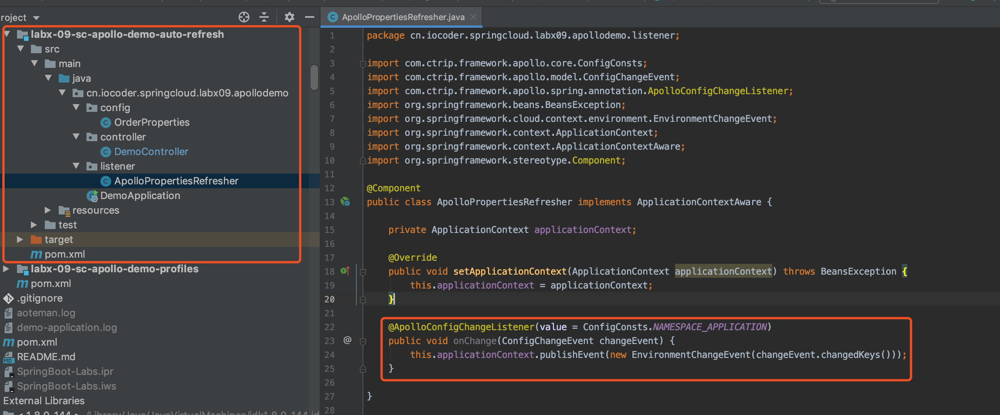

### 4.1 简单测试

① 使用 DemoApplication 启动示例应用。

② **获得**目前在 Apollo 的配置内容为：


```
order.pay-timeout-seconds: 60 # 订单支付超时时长，单位：秒。
order.create-frequency-seconds: 120 # 订单创建频率，单位：秒
```


使用 `curl` 命令，请求 DemoController 提供的两个测试接口，过程如下：


```
# 测试 `@ConfigurationProperties` 注解的配置属性类
$ curl http://127.0.0.1:8080/demo/test01
{"payTimeoutSeconds":60,"createFrequencySeconds":120}

# 测试 `@Value` 注解的属性
$ curl http://127.0.0.1:8080/demo/test02
{"payTimeoutSeconds":60,"createFrequencySeconds":120}
```


③ **修改**在 Apollo 的配置内容为：


```
order.pay-timeout-seconds: 60 # 订单支付超时时长，单位：秒。
order.create-frequency-seconds: 480 # 订单创建频率，单位：秒
```


此时，我们可以看到 IDEA 控制台打印出了好多 Apollo 相关的日志，如下：


```
2020-03-01 15:45:09.858  INFO 75990 --- [Apollo-Config-1] c.f.a.s.p.AutoUpdateConfigChangeListener : Auto update apollo changed value successfully, new value: 480, key: order.pay-timeout-seconds, beanName: demoController, field: cn.iocoder.springcloud.labx09.apollodemo.controller.DemoController.payTimeoutSecond
```


- 可以看到 `DemoController.payTimeoutSecond` 被修改成了 480 的提示。

使用 `curl` 命令，请求 DemoController 提供的两个测试接口，过程如下：


```
# 测试 `@ConfigurationProperties` 注解的配置属性类
$ curl http://127.0.0.1:8080/demo/test01
{"payTimeoutSeconds":120,"createFrequencySeconds":60}

# 测试 `@Value` 注解的属性
$ curl http://127.0.0.1:8080/demo/test02
{"payTimeoutSeconds":480,"createFrequencySeconds":60}
```


- 使用 `@ConfigurationProperties` 注解的**失败**刷新，使用 `@Value` 注解的**成功**刷新。

### 4.2 ApolloPropertiesRefresher

创建 [ApolloPropertiesRefresher](https://github.com/YunaiV/SpringBoot-Labs/blob/master/labx-09-spring-cloud-apollo/labx-09-sc-apollo-demo-auto-refresh/src/main/java/cn/iocoder/springcloud/labx09/apollodemo/listener/ApolloPropertiesRefresher.java) 类，监听 Apollo 的配置变更，发布 Spring Cloud [EnvironmentChangeEvent](https://github.com/spring-cloud/spring-cloud-commons/blob/master/spring-cloud-context/src/main/java/org/springframework/cloud/context/environment/EnvironmentChangeEvent.java) 事件，从而解决 `@ConfigurationProperties` 注解的属性的刷新的问题。代码如下：


```java
@Component
public class ApolloPropertiesRefresher implements ApplicationContextAware {

    private ApplicationContext applicationContext;

    @Override
    public void setApplicationContext(ApplicationContext applicationContext) throws BeansException {
        this.applicationContext = applicationContext;
    }

    @ApolloConfigChangeListener(value = ConfigConsts.NAMESPACE_APPLICATION)
    public void onChange(ConfigChangeEvent changeEvent) {
        this.applicationContext.publishEvent(new EnvironmentChangeEvent(changeEvent.changedKeys()));
    }

}
```


在 `#onChange(ConfigChangeEvent changeEvent)` 方法上，我们添加了 Apollo 定义的 [`@ApolloConfigChangeListener`](https://github.com/ctripcorp/apollo/blob/master/apollo-client/src/main/java/com/ctrip/framework/apollo/spring/annotation/ApolloConfigChangeListener.java) 注解，这样可以实现对 Apollo 配置的监听，从而发布 EnvironmentChangeEvent 事件。

> 友情提示：更多 `@ApolloConfigChangeListener` 注解的分享，胖友可以阅读[《芋道 Spring Boot 配置中心 Apollo 入门》](http://www.iocoder.cn/Spring-Boot/config-apollo/?self)文章的[「4.8 Apollo 配置监听器」](https://www.iocoder.cn/Spring-Cloud/Apollo/?self#)小节

### 4.3 重新测试

① 使用 DemoApplication 启动示例应用。

② **获得**目前在 Apollo 的配置内容为：


```
order.pay-timeout-seconds: 60 # 订单支付超时时长，单位：秒。
order.create-frequency-seconds: 120 # 订单创建频率，单位：秒
```


使用 `curl` 命令，请求 DemoController 提供的两个测试接口，过程如下：


```
# 测试 `@ConfigurationProperties` 注解的配置属性类
$ curl http://127.0.0.1:8080/demo/test01
{"payTimeoutSeconds":60,"createFrequencySeconds":120}

# 测试 `@Value` 注解的属性
$ curl http://127.0.0.1:8080/demo/test02
{"payTimeoutSeconds":60,"createFrequencySeconds":120}
```


③ **修改**在 Apollo 的配置内容为：


```
order.pay-timeout-seconds: 60 # 订单支付超时时长，单位：秒。
order.create-frequency-seconds: 480 # 订单创建频率，单位：秒
```


使用 `curl` 命令，请求 DemoController 提供的两个测试接口，过程如下：


```
# 测试 `@ConfigurationProperties` 注解的配置属性类
$ curl http://127.0.0.1:8080/demo/test01
{"payTimeoutSeconds":480,"createFrequencySeconds":60}

# 测试 `@Value` 注解的属性
$ curl http://127.0.0.1:8080/demo/test02
{"payTimeoutSeconds":480,"createFrequencySeconds":60}
```


- 使用 `@ConfigurationProperties` 注解的**成功**刷新，使用 `@Value` 注解的**成功**刷新。完美~

ps：还有一种解决方案，基于 Spring Cloud [RefreshScope](https://github.com/spring-cloud/spring-cloud-commons/blob/master/spring-cloud-context/src/main/java/org/springframework/cloud/context/scope/refresh/RefreshScope.java) 来解决，可以参考 [SpringBootApolloRefreshConfig](https://github.com/ctripcorp/apollo/blob/master/apollo-demo/src/main/java/com/ctrip/framework/apollo/demo/spring/springBootDemo/refresh/SpringBootApolloRefreshConfig.java) 的代码，如下图所示：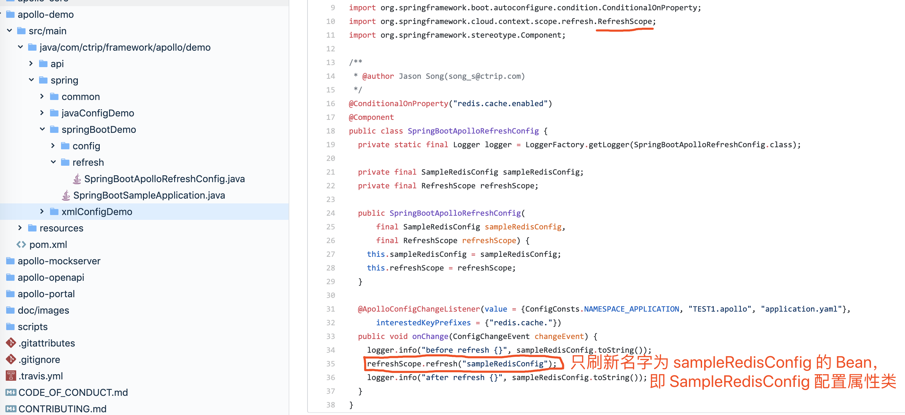

> 友情提示：具体的实现原理，可以阅读[《@RefreshScope 那些事》](http://www.iocoder.cn/Fight/RefreshScope-those-things/?self)文章，艿艿暂时还没去深入，嘿嘿~

### 4.4 日志级别刷新

在[「4.2 ApolloPropertiesRefresher」](https://www.iocoder.cn/Spring-Cloud/Apollo/?self#)小节中，我们实现了监听 Apollo 配置的变更，发布 Spring Cloud EnvironmentChangeEvent 事件，而 Spring Cloud [LoggingRebinder](https://github.com/spring-cloud/spring-cloud-commons/blob/master/spring-cloud-context/src/main/java/org/springframework/cloud/logging/LoggingRebinder.java) 会监听该事件，重新设置日志级别。整体流程如下图所示：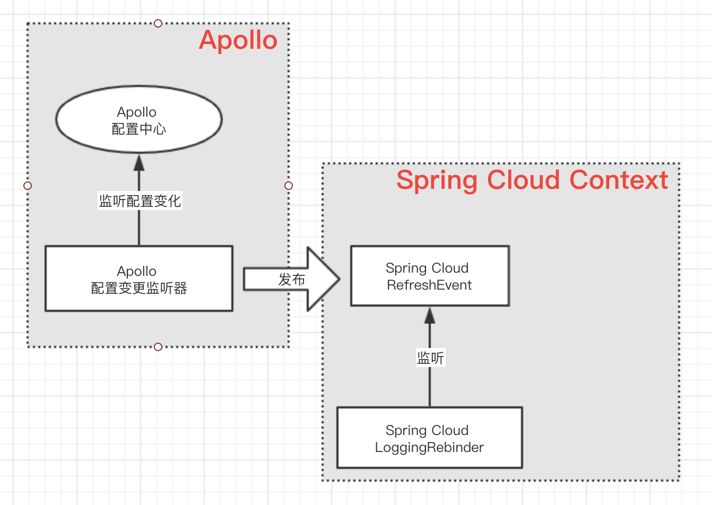

### 4.5 再次测试

① 在 [DemoController](https://github.com/YunaiV/SpringBoot-Labs/blob/master/labx-09-spring-cloud-apollo/labx-09-sc-apollo-demo-auto-refresh/src/main/java/cn/iocoder/springcloud/labx09/apollodemo/controller/DemoController.java) 类中，增加如下 API 接口。代码如下：


```
// DemoController.java

private Logger logger = LoggerFactory.getLogger(getClass());

@GetMapping("/logger")
public void logger() {
    logger.debug("[logger][测试一下]");
}
```


- 如果 DemoController 对应的 Logger 日志级别是 DEBUG 以上，则无法打印出日志。

② 在 Apollo 中，增加 `logging.level.cn.iocoder.springcloud.labx09.apollodemo.controller.DemoController` 配置项为 `INFO`。

③ 使用 DemoApplication 启动示例应用。

请求 <http://127.0.0.1:8080/demo/logger> 接口，控制台**并未打印日志**，因为当前日志级别是 INFO。

④ 在 Apollo 中，修改 `logging.level.cn.iocoder.springcloud.labx09.apollodemo.controller.DemoController` 配置项为 `INFO`，无需重启应用。

请求 <http://127.0.0.1:8080/demo/logger> 接口，控制台**打印日志**，因为当前日志级别是 DEBUG。日志内容如下：


```
2020-03-01 16:44:13.073 DEBUG 77189 --- [nio-7070-exec-2] c.i.s.l.a.controller.DemoController      : [logger][测试一下]
```


- 符合预期。

## 5. 配置加密

> 示例代码对应仓库：[`labx-09-sc-apollo-demo-jasypt`](https://github.com/YunaiV/SpringBoot-Labs/tree/master/labx-09-spring-cloud-apollo/labx-09-sc-apollo-demo-jasypt)。

考虑到安全性，我们可能最好将配置文件中的敏感信息进行加密。例如说，MySQL 的用户名密码、第三方平台的 Token 令牌等等。不过，Apollo 暂时未内置配置加密的功能。官方文档说明如下：

> FROM <https://github.com/ctripcorp/apollo/wiki/FAQ>
>
> **7. Apollo 是否支持查看权限控制或者配置加密？**
>
> 从 1.1.0 版本开始，apollo-portal 增加了查看权限的支持，可以支持配置某个环境只允许项目成员查看私有 Namespace 的配置。
>
> 这里的项目成员是指：
>
> 1. 项目的管理员
> 2. 具备该私有Namespace在该环境下的修改或发布权限
>
> 配置方式很简单，用超级管理员账号登录后，进入 `管理员工具 - 系统参数` 页面新增或修改 `configView.memberOnly.envs` 配置项即可。
>
> 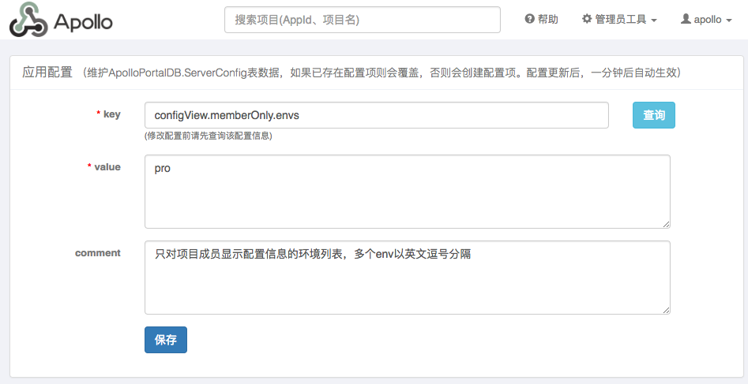
>
> 配置加密可以参考 [spring-boot-encrypt demo项目](https://github.com/ctripcorp/apollo-use-cases/tree/master/spring-boot-encrypt)

因此，我们暂时只能在客户端进行配置的加解密。这里，我们继续采用在[《芋道 Spring Boot 配置文件入门》](http://www.iocoder.cn/Spring-Boot/config-file/?self)的[「8. 配置加密」](https://www.iocoder.cn/Spring-Cloud/Apollo/?self#)小节中使用的 [Jasypt](https://github.com/jasypt/jasypt)。

下面，我们来创建一个 [`labx-09-sc-apollo-demo-jasypt`](https://github.com/YunaiV/SpringBoot-Labs/tree/master/labx-09-spring-cloud-apollo/labx-09-sc-apollo-demo-jasypt) 示例项目，使用 Apollo + Jasypt 搭建一个配置加密的示例。最终项目代码如下图所示：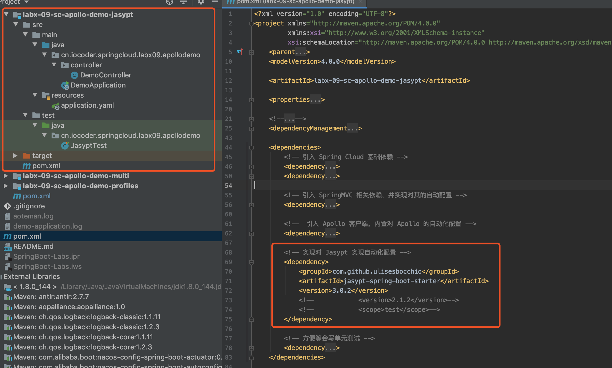

### 5.1 引入依赖

在[「2.1 引入依赖」](https://www.iocoder.cn/Spring-Cloud/Apollo/?self#)的基础之上，额外引入 Jasypt 相关依赖如下：


```xml
<!-- 实现对 Jasypt 实现自动化配置 -->
<dependency>
    <groupId>com.github.ulisesbocchio</groupId>
    <artifactId>jasypt-spring-boot-starter</artifactId>
    <version>3.0.2</version>
</dependency>

<!-- 方便等会写单元测试 -->
<dependency>
    <groupId>org.springframework.boot</groupId>
    <artifactId>spring-boot-starter-test</artifactId>
    <scope>test</scope>
</dependency>
```


完整的，可以点击 [`pom.xml`](https://github.com/YunaiV/SpringBoot-Labs/blob/master/labx-09-spring-cloud-apollo/labx-09-sc-apollo-demo-jasypt/pom.xml) 文件查看。

### 5.2 创建 Apollo 配置

在 Apollo 中创建 Apollo 配置，内容如下图所示：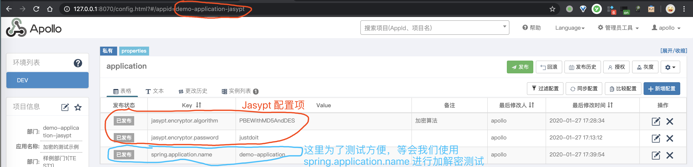

这里为了测试简便，我们直接添加加密秘钥 `jasypt.encryptor.password` 配置项在该 Apollo 配置中。如果为了安全性更高，实际建议把加密秘钥和配置隔离。不然，如果配置泄露，岂不是可以拿着加密秘钥，直接进行解密。

### 5.3 配置文件

在 [`application.yml`](https://github.com/YunaiV/SpringBoot-Labs/blob/master/labx-09-spring-cloud-apollo/labx-09-sc-apollo-demo-jasypt/src/main/resources/application.yaml) 中，添加 Apollo 配置，如下：


```xml
server:
  port: 7070 # 避免和本地的 Apollo Portal 端口冲突

app:
  id: demo-application-jasypt # 使用的 Apollo 的项目（应用）编号
apollo:
  meta: http://127.0.0.1:8080 # Apollo Meta Server 地址
  bootstrap:
    enabled: true # 是否开启 Apollo 配置预加载功能。默认为 false。
    eagerLoad:
      enable: true # 是否开启 Apollo 支持日志级别的加载时机。默认为 false。
    namespaces: application # 使用的 Apollo 的命名空间，默认为 application。
```


- 和[「2.2 配置文件」](https://www.iocoder.cn/Spring-Cloud/Apollo/?self#)一样，就是换了一个 Apollo 项目为 `demo-application-jasypt`。

### 5.4 DemoApplication

创建 [DemoApplication](https://github.com/YunaiV/SpringBoot-Labs/tree/master/labx-09-spring-cloud-apollo/labx-09-sc-apollo-demo-jasypt/src/main/java/cn/iocoder/springcloud/labx09/apollodemo) 类，作为应用启动类。代码如下：


```java
@SpringBootApplication
public class DemoApplication {

    public static void main(String[] args) {
        SpringApplication.run(DemoApplication.class);
    }

}
```


### 5.5 JasyptTest

创建 [JasyptTest](https://github.com/YunaiV/SpringBoot-Labs/blob/master/labx-09-spring-cloud-apollo/labx-09-sc-apollo-demo-jasypt/src/test/java/cn/iocoder/springcloud/labx09/apollodemo/JasyptTest.java) 测试类，使用 Jasypt 将配置项的值进行加密。代码如下：


```java
@RunWith(SpringRunner.class)
@SpringBootTest
public class JasyptTest {

    @Autowired
    private StringEncryptor encryptor;

    @Test
    public void encode() {
        // 第一个加密
        String password = "woshimima";
        System.out.println(encryptor.encrypt(password));

        // 第二个加密
        password = "bushimima";
        System.out.println(encryptor.encrypt(password));
    }

    @Value("${xxx-password:}")
    private String xxxPassword;

    @Test
    public void print() {
        System.out.println(xxxPassword);
    }

}
```


下面，我们进行下简单测试。

① 首先，执行 `#encode()` 方法，**手动**使用 Jasypt 将 `"woshimima"` 和 `"bushimima"` 进行加密，获得加密结果。加密结果如下：


```
// "woshimima" 的加密结果
yCJ8JgVNG8Ns+vikAvZBKfJu/7LVejQWzwMxyoVFoR8=
// "bushimima" 的加密结果
NGgajNjjhKcgm7ncXvdVNsShSsueysdcCOTbOmtHXRc=
```


② 然后，将 `"woshimima"` 加密结果 `"yCJ8JgVNG8Ns+vikAvZBKfJu/7LVejQWzwMxyoVFoR8="`，赋值到 Apollo 的 `xxx-password` 配置项中。如下图所示：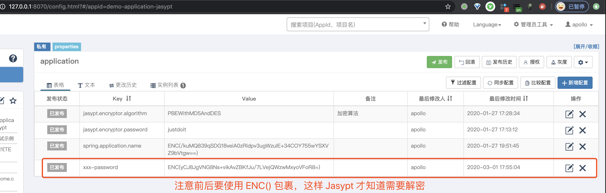

之后，执行 `#print()` 方法，**自动**使用 Jasypt 将 `xxx-password` 配置项解密。解密结果如下：


```
woshimima
```


- 成功正确解密，符合预期。

### 5.6 DemoController

创建 [DemoController](https://github.com/YunaiV/SpringBoot-Labs/blob/master/labx-09-spring-cloud-apollo/labx-09-sc-apollo-demo-jasypt/src/main/java/cn/iocoder/springcloud/labx09/apollodemo/controller/DemoController.java) 类，提供查询 `xxx-password` 配置项的 HTTP 接口。代码如下：


```java
@RestController
@RequestMapping("/demo")
@RefreshScope
public class DemoController {

    @Value("${xxx-password:}")
    private String xxxPassword;

    @GetMapping("/test")
    public String test() {
        return xxxPassword;
    }

}
```


下面，我们进行下简单测试。

① 使用 DemoApplication 启动示例应用。

② 访问 <http://127.0.0.1:7070/demo/test> 地址，返回结果为 `bushimima`，符合预期。

### 5.7 补充说明

目前测试下来，在将 Jasypt 集成进来时，Apollo 的[「4. 自动配置刷新」](https://www.iocoder.cn/Spring-Cloud/Apollo/?self#)功能，竟然失效了。

- 具体的验证，胖友可以将 `jasypt-spring-boot-starter` 依赖设置成 `<scope>test</scope>`，并是使用 [DemoController](https://github.com/YunaiV/SpringBoot-Labs/blob/master/lab-45/lab-45-apollo-demo-jasypt/src/main/java/cn/iocoder/springboot/lab45/apollodemo/controller/DemoController.java) 进行测试。
- 具体的原因，艿艿暂时没去调试与研究，有了解的胖友，麻烦告知下哟。在 [issues#2162](https://github.com/ctripcorp/apollo/issues/2162) 中，也有其它胖友提到该问题。

如果说，胖友暂时不需要自动配置刷新功能的话，可以考虑选择使用 Jasypt 集成。如果需要的话，那么就等待官方支持吧，暂时不要考虑使用 Jasypt 咧。

> 示例代码对应仓库：[lab-45-apollo-demo-multi](https://github.com/YunaiV/SpringBoot-Labs/tree/master/lab-45/lab-45-apollo-demo-multi)。

在[《芋道 Spring Boot 配置文件入门》](http://www.iocoder.cn/Spring-Boot/config-file/?self)的[「9. 配置加载顺序」](https://www.iocoder.cn/Spring-Cloud/Apollo/?self#)小节，我们了解了 Spring Boot 自带的配置加载顺序。本小节，我们来看看来自 Apollo 的配置，在其中的顺序。同时，我们将配置多个 Apollo Namespace 命名空间，看看它们互相之间的加载顺序。

下面，我们来搭建一个用于测试配置加载顺序的示例。

## 6. 配置加载顺序

> 示例代码对应仓库：[`labx-09-sc-apollo-demo-multi`](https://github.com/YunaiV/SpringBoot-Labs/tree/master/labx-09-spring-cloud-apollo/labx-09-sc-apollo-demo-multi)。

在[《芋道 Spring Boot 配置文件入门》](http://www.iocoder.cn/Spring-Boot/config-file/?self)的[「9. 配置加载顺序」](https://www.iocoder.cn/Spring-Cloud/Apollo/?self#)小节，我们了解了 Spring Boot 自带的配置加载顺序。本小节，我们来看看来自 Apollo 的配置，在其中的顺序。同时，我们将配置多个 Apollo Namespace 命名空间，看看它们互相之间的加载顺序。

下面，我们来创建一个 [`labx-09-sc-apollo-demo-multi`](https://github.com/YunaiV/SpringBoot-Labs/tree/master/labx-09-spring-cloud-apollo/labx-09-sc-apollo-demo-multi) 示例项目，搭建一个用于测试配置加载顺序的示例。最终项目代码如下图所示：[`labx-09-sc-apollo-demo-multi` 项目](https://static.iocoder.cn/images/Spring-Cloud/2020-09-01/61.png)

### 6.1 创建 Apollo 配置

在 Apollo 中创建 Apollo 配置，内容如下图所示：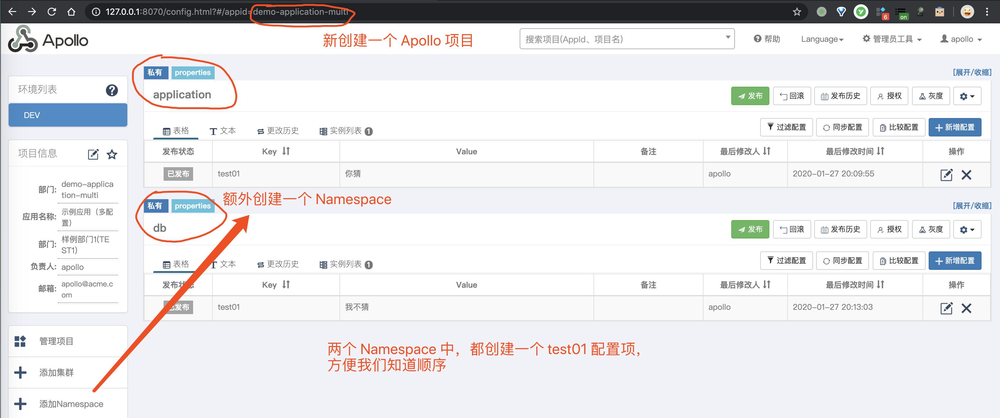

### 6.2 引入依赖

和[「2.1 引入依赖」](https://www.iocoder.cn/Spring-Cloud/Apollo/?self#)一致，可以点击 [`pom.xml`](https://github.com/YunaiV/SpringBoot-Labs/blob/master/labx-09-spring-cloud-apollo/labx-09-sc-apollo-demo-multi/pom.xml) 文件查看。

### 6.3 配置文件

在 [`application.yml`](https://github.com/YunaiV/SpringBoot-Labs/blob/master/labx-09-spring-cloud-apollo/labx-09-sc-apollo-demo-multi/src/main/resources/application.yaml) 中，添加 Apollo 配置，如下：


```xml
server:
  port: 7070 # 避免和本地的 Apollo Portal 端口冲突

app:
  id: demo-application-multi # 使用的 Apollo 的项目（应用）编号
apollo:
  meta: http://127.0.0.1:8080 # Apollo Meta Server 地址
  bootstrap:
    enabled: true # 是否开启 Apollo 配置预加载功能。默认为 false。
    eagerLoad:
      enable: true # 是否开启 Apollo 支持日志级别的加载时机。默认为 false。
    namespaces: application, db # 使用的 Apollo 的命名空间，默认为 application。
```


- 注意，我们在 `apollo.bootstrap.namespaces` 配置项中，设置了[「6.1 创建 Apollo 配置」](https://www.iocoder.cn/Spring-Cloud/Apollo/?self#)的两个 Namespace 命名空间。

### 6.4 DemoApplication

创建 [DemoApplication](https://github.com/YunaiV/SpringBoot-Labs/blob/master/labx-09-spring-cloud-apollo/labx-09-sc-apollo-demo-multi/src/main/java/cn/iocoder/springcloud/labx09/apollodemo/DemoApplication.java) 类，作为应用启动类。代码如下：


```java
@SpringBootApplication
public class DemoApplication {

    public static void main(String[] args) {
        // 启动 Spring Boot 应用
        ConfigurableApplicationContext context = SpringApplication.run(DemoApplication.class);

        // 查看 Environment
        Environment environment = context.getEnvironment();
        System.out.println(environment);
    }

}
```


在代码中，我们去获取了 Spring [Environment](https://github.com/spring-projects/spring-framework/blob/master/spring-core/src/main/java/org/springframework/core/env/Environment.java) 对象，因为我们要从其中获取到 [PropertySource](https://github.com/spring-projects/spring-framework/blob/master/spring-core/src/main/java/org/springframework/core/env/PropertySource.java) 配置来源。**DEBUG** 运行 Application，并记得在 `System.out.println(environment);` 代码块打一个断点，可以看到如下图的调试信息：[调试信息](https://static.iocoder.cn/images/Spring-Cloud/2020-09-01/62.png)

- 对于 `apollo.bootstrap` 对应一个 [CompositePropertySource](https://github.com/spring-projects/spring-framework/blob/master/spring-core/src/main/java/org/springframework/core/env/CompositePropertySource.java) 对象，即使有对应多个 Apollo Namespace。并且，多个 Namespace 是按照在 `apollo.bootstrap.namespaces` 配置顺序。
- 所有 Apollo 对应的 PropertySource 对象，优先级非常高，目前看下来仅仅低于 `server.ports` 对应的 MapPropertySource。基本上，我们可以认为是**最高优先级**了。

### 6.5 补充说明

搞懂配置加载顺序的作用，很多时候是解决多个配置来源，里面配置了相同的配置项。艿艿建议的话，尽量避免出现相同配置项，排查起来还挺麻烦的。

不过所幸，在日常开发中，我们也很少会设置相同的配置项 😜。