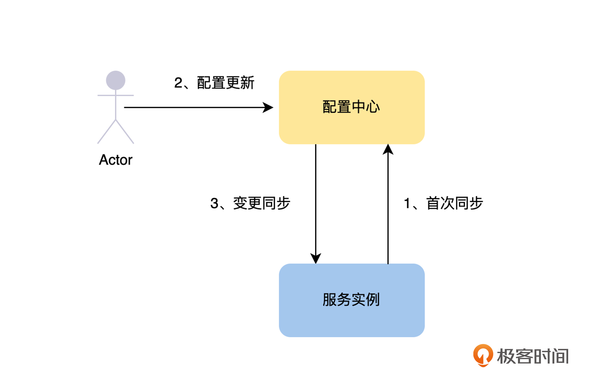
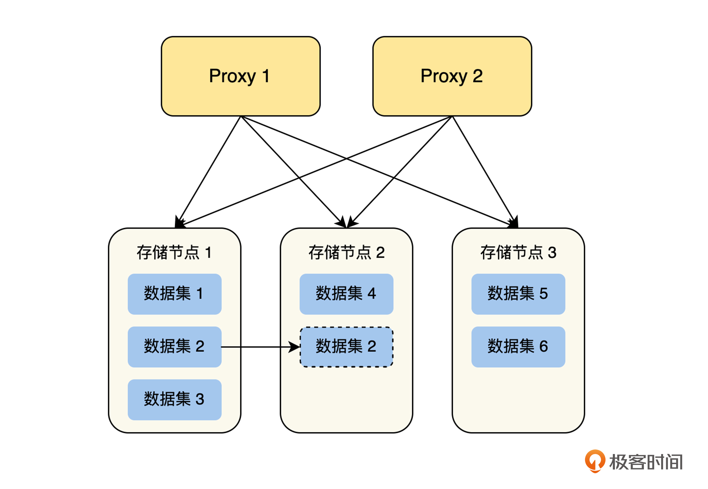
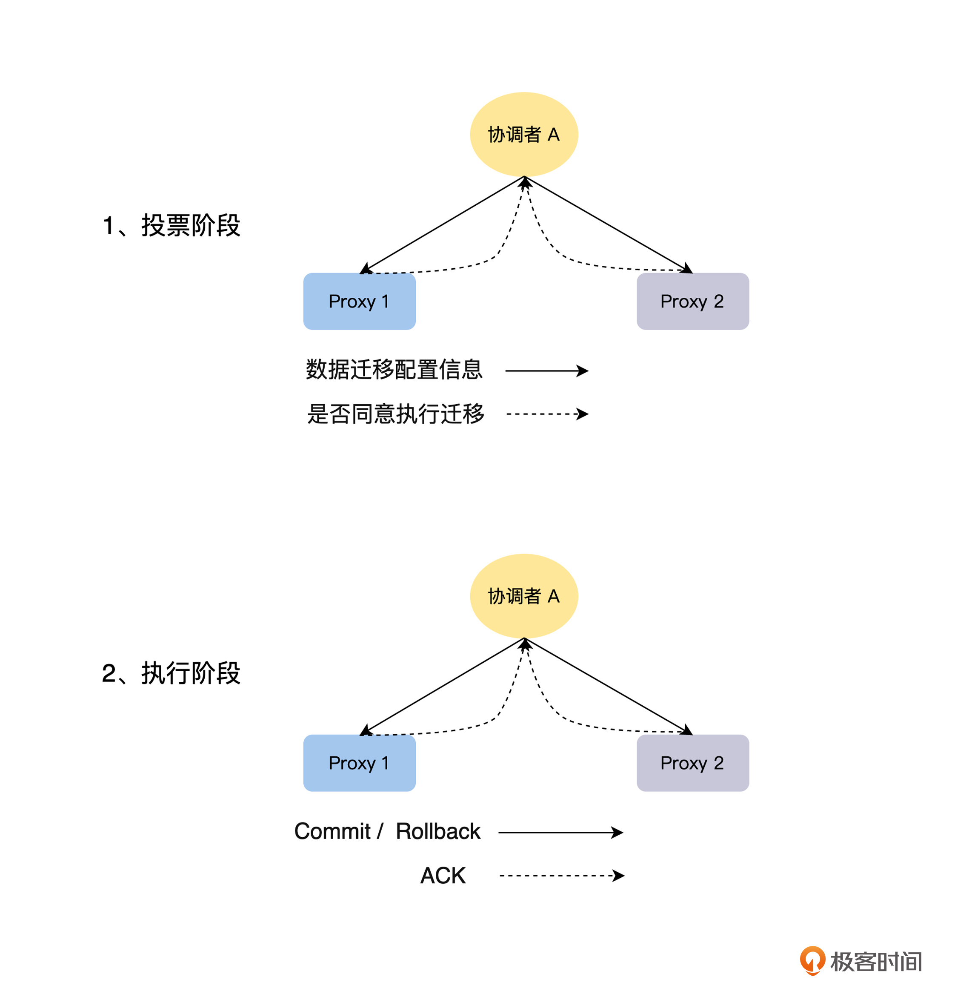

# 配置中心需要具备哪些功能

我们可以结合上文中，配置即代码的方法在分布式系统中面临的三个问题，推导出在分布式系统的架构下，一个理想的配置中心应该具备哪些特点。

**首先，这个配置中心，能够统一管理分布式系统所有服务的配置信息**。那么研发工程师就可以在配置中心上，便捷地全局搜索和查看每一个服务的配置信息，而不是看到所有服务的配置信息都散落在不同的地方。更进一步来说，配置中心需要能统一存储和管理整个分布式系统的所有配置文件。

**其次，配置中心里，同一个服务实例之间的配置应该保持一致**。也就是说，配置中心需要保证一个服务所有的实例，都加载同一份配置文件，而不是每一个实例维护一个配置文件的副本。这就需要配置中心统一去管理，服务当前版本的配置，并且服务的实例通过网络去配置中心，获得当前的配置信息，确保 Single Source of Truth ( SSOT )。

**最后，这个配置中心应该能高效地修改配置**。研发工程师只需要关心，并且高效地完成配置的修改、发布和回滚操作，而其他的就不需要研发工程师手动来操作了，比如配置文件的版本管理等，这些都由配置中心来自动完成。

经过前面的讨论，我们结合这节课开头提到的配置中心的业务场景，可以总结出配置中心需要解决的两个关键问题：

- **统一的配置存储**：一个带版本管理的存储系统，按服务的维度，存储和管理整个分布式系统的配置信息，这样可以很方便地对服务的配置信息，进行搜索、查询和修改。
- **配置信息的同步**：所有的实例，本地都不存储配置信息，实例能够从配置中心获得服务的配置信息，在配置修改后，能够及时将最新的配置，同步给服务的每一个实例。

那么到这里，你会发现配置中心和服务的注册发现机制是非常类似的，唯一不同的地方是服务注册发现所存储的服务实例的 IP 和 Port 等信息，是服务实例自己注册的，并且会设置过期时间，随着实例上线时主动写入，下线后会因为过期而被删除。但是配置中心的配置信息是研发工程师主动写入的，并且不会设置过期时间。

# 如何实现配置中心

我们确定了“统一的配置存储”和“配置的更新与同步”这两个关键问题，并且还发现了配置中心与服务的注册发现机制之间的相似性，掌握了这些信息，我们接下来就可以思考，如何实现配置中心的解决方法了。

关于如何实现配置中心，我们首先结合“统一的配置存储”这个关键点来分析，可以从“如何选择合适的存储系统”的角度来思考解决方法；然后再从“如何做配置信息的同步”的角度，讨论“配置的更新与同步”这个关键点。

## 如何选择合适的存储系统

与服务注册发现类似，实现配置中心也需要找一个外部存储，来做配置中心的统一存储。通过对配置中心的场景分析，我认为配置中心对存储系统的要求主要为以下几点：

- **可用性要求非常高**：因为配置中心和服务注册发现一样，是整个分布式系统的基石，如果配置中心出现问题，整个分布式系统都将出现非常严重的问题。
- **性能要求中等**：只要设计得当，整体的性能要求还是可控的，不过需要注意的是，性能要求会随分布式系统的实例数量变多而提高。
- **数据容量要求低**：配置中心是用来存储服务的配置信息的，一般来说，服务的配置信息都非常小，如果出现非常大的配置，一般也不当成配置来处理，可以将它放到外部存储上，在配置中配置下载的链接。
- **API 友好程度**：是否能很好地支持配置中心场景的“发布/订阅”模式，将服务的配置信息及时同步给服务的实例。

基于上面对所需求存储系统特点的分析，我们一起来对常见的存储系统做一个系统性的比较，由于注册发现和配置中心类似，所以我们使用第 4 节课“注册发现”中的这张图片，从配置中心的角度进一步分析：

\- 通过上面的分析，我们可以看到，MySQL 和 Redis 在高可用性和 API 友好程度上不满足要求，而 etcd、ZooKeeper 和 Eureka 这三个存储系统中，更适合的是 Eureka。下面我们来讨论一下，为什么 Eureka 这样的 AP 系统要比 etcd 和 ZooKeeper 这样的 CP 系统更合适。

如果我们选择 **etcd 和 ZooKeeper**，那么出现网络分区的时候，在网络分区的少数派节点一侧，配置中心将不能提供服务，这一侧的服务实例也就不能通过配置中心获取配置，这时如果有实例的重启等操作，就一定会发生故障。

如果选择 **Eureka**，那么配置中心这个整体，依然可以正常提供服务，唯一的问题是，如果这时有配置的更新，那么同一个服务中不同实例的配置可能会不一致，但是这个问题并不是最关键的，主要原因有两个。

首先，即使配置中心内部是强一致性的，但是配置中心和服务实例之间是通过网络同步配置的，而网络的时延是不确定的，这会导致配置信息同步到实例的时间有先有后，不能同时到达，使得配置中心和同一服务多实例之间的配置，同步退化到最终一致性。

其次，配置修改的频率是非常低的，而且因为是人工操作，所以在出现网络分区的时候，如果我们不去修改配置，那么 Eureka 上多个副本的数据就是一致的。

## 如何做配置信息的同步

讨论完“如何选择合适的存储系统”，我们接着讨论配置中心的另一个关键点“如何做配置信息的同步”，对于这个问题，我们可以将其分解为两个问题解决，具体操作如下图：-

\- 首先，实例刚启动的时候，主动去配置中心获取完整的配置信息，即**首次同步**：如上图中的 1，服务的每一个实例启动后，通过服务的唯一标识，去配置中心获取服务的所有配置，然后加载配置，完成实例的启动流程。

然后，在实例的运行过程中，如果服务的配置有修改，配置中心需要及时同步到实例，即**变更同步**：如上图中的 2 和 3，服务的配置信息有变更后，配置中心监听到服务的配置修改了，需要及时通知到服务的所有实例。这里可以采用“发布/订阅”的模式，也可以采用轮询模式，比如每 30 秒去配置中心查询一下，配置是否有变更。这里的数据同步是最终一致性的。

## 如何确保配置的强一致性

通过上面的讨论，我们知道了怎么来实现一个配置中心，并且知道了配置中心和服务实例之间的配置同步是最终一致性的。这时候你可能会有一个疑问，有没有一些业务场景必须要求，同一服务的多个实例之间的配置信息同时生效呢？如果有的话，应该怎么来保证呢？所以，我们最后来讨论一下，在需要配置同时生效的场景下，如何确保配置信息的强一致性。

确实有这样的场景，我们通过一个例子来分析一下。因为这部分只讨论配置强一致性的问题，所以这个数据迁移的例子，不会涉及整个数据迁移的完整流程。假设有一个分布式存储系统，如下图所示，我们现在需要通过配置信息，发送数据迁移指令，将数据集 2 从存储节点 1 迁移到节点 2 上。

在这个例子中，如果 Proxy 实例之间，对数据迁移的配置信息没有同时生效，将会导致什么样的异常情况呢？

从上图可以看出，在进行数据迁移前，Proxy 对数据集 2 的读写请求，都会路由到存储系统 1 上。我们通过配置中心，配置好数据迁移的配置后，如果 Proxy 1 已经加载了数据迁移的配置，Proxy 2 还没有接收到数据迁移的配置，那么在处理数据集 2 的请求时，就会出现 Proxy 1 读写存储节点 2，Proxy 2 读写存储节点 1 的情况，导致数据不一致的问题，反过来也是一样的。

那么我们应该怎么来解决这个问题呢？其实这是一个共识问题，需要所有的 Proxy 实例对数据迁移的配置达成共识后，才能进行迁移。而配置中心和多实例的配置同步，是通过网络来完成的，不是一个强一致性的模型，所以，我们不能简单依赖配置中心的配置同步来解决。

我们可以使用这样的解决思路，**配置信息不能按上面讨论的方式直接通过网络进行同步，而需要通过类似两阶段提交的方式来解决这个问题**。这里我们主要讨论处理这个问题的思路，不展开故障处理的情况，有了这个思路，后面你就可以处理多节点数据一致性和共识相关的问题了。

首先，从配置中心的存储节点中选择一个实例作为协调者 A。

在投票阶段，协调者 A 向所有的 Proxy 节点发送 Prepare 消息，即数据迁移的配置信息，Proxy 节点在收到数据迁移配置后，确认自己当前的状态是否可以执行数据迁移工作。如果可以，那么就阻塞当前节点所有的读写操作，进入 Prepare 状态，并回复协调者 A 同意执行数据迁移，否则回复不同意执行数据迁移。

那么这里要注意一点，为了数据的一致性，我们放弃了一定的可用性，Prepare 状态下的 Proxy 节点相当于被锁住，不能进行读写操作了。

在执行阶段，协调者 A 收集所有的 Proxy 节点的反馈，如果所有的 Proxy 都同意执行数据迁移，那么协调者 A 向所有的 Proxy 节点发送 Commit 消息，Proxy 节点收到 Commit 消息后，就应用数据迁移的配置信息，按最新的配置信息，接受读写请求，进行数据迁移。上文的例子，就是对于数据集 2 的读写请求，都路由到节点 2 来处理，否则就发送 Rollback 消息，Proxy 节点收到后，回滚状态，重新接受读写请求。-

## QA

问题

如果我们选择 etcd 和 ZooKeeper，那么出现网络分区的时候，在网络分区的少数派节点一侧，配置中心将不能提供服务，这一侧的服务实例也就不能通过配置中心获取配置，这时如果有实例的重启等操作，就一定会发生故障。
老师。我这边有个问题。etcd分区后。只是不能写，但是读是应该可以，为什么不能提供服务呢？

回答

在上面的情况，如果直接读网络分区的少数派节点一侧的数据，当数据在网络分区多数派一侧已经更新的情况下就会读到旧版本的数据，即 stale read，这个就不是线性一致性的读了。正常来说，如果要线性一致性地读 etcd 上的数据，需要 ReadIndex 或者 LeaseRead 之类的机制来保证。