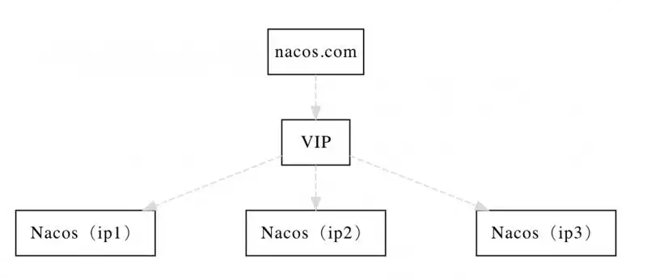

# 阿里注册中心Nacos生产部署方案


## 一、说明

生产环境中部署`nacos`首先肯定是使用集群模式`cluster`保证高可用，本文主要详细介绍最佳的集群方案怎样搭建与`spring cloud`程序怎样集成


## 二、集群方案

下图是官方推荐的集群方案，通过域名 + VIP模式的方式来实现，可读性好而且换ip方便




> 这里的`VIP`直接使用 `Nginx`就可以实现了


## 三、方案实现

```
nacos`集群最低配置是至少需要3个实例，因为我在本地搭建只有一台机器所以通过修改端口的方式来部署这3个实例，端口分别为：`8848`、`8849`、`8850
```


### 3.1. 修改集群配置

nacos的conf目录下有配置文件cluster.conf，请每行配置成ip:port。

```text
192.168.28.130:8848
192.168.28.130:8849
192.168.28.130:8850
```

> 192.168.28.130是我本机ip，三个nacos实例都配置一样即可


### 3.2. 配置 MySQL 数据库

集群模式必须使用`MySQL`数据库，生产使用建议至少主备模式，或者采用高可用数据库


#### 3.2.1. 初始化 MySQL 数据库

脚本在nacos的conf目录下有配置文件`nacos-mysql.sql`，直接执行即可


#### 3.2.2. 添加数据库配置

配置文件在nacos的conf目录下的`application.properties`，添加以下配置

```text
db.num=1
db.url.0=jdbc:mysql://192.168.28.131:3306/nacos_config?characterEncoding=utf8&connectTimeout=1000&socketTimeout=3000&autoReconnect=true
db.user=root
db.password=root
```

> db.num 为数据库实例数量
> 如果有多个数据库实例通过 db.url.0、db.url.1..... 指定不同的数据库链接 


### 3.3. 其他实例修改Nacos端口

修改nacos的conf目录下`application.properties`下的`server.port`变量，三个实例分别为：`8848`、`8849`、`8850`


> 如果是不同机器部署集群的话这步可以忽略 


### 3.4. 启动Nacos集群

分别把3个实例都启动起来，执行nacos的bin目录下`startup.sh`，该启动文件默认就是集群模式


### 3.5. 修改Nginx配置

修改`conf/nginx.conf`配置

```text
upstream nacos {
    server 192.168.28.130:8848;
    server 192.168.28.130:8849;
    server 192.168.28.130:8850;
}

server {
    listen 80;

    server_name test.nacos.com;

    location / {
        proxy_pass http://nacos;
    }
}
```

> 配置域名`test.nacos.com`绑定`VIP` 


### 3.6. 程序集成Nacos集群

nacos的地址`server-addr`配置域名`test.nacos.com`


## 四、Nacos集群管理


**参考资料**

[https://nacos.io/zh-cn/docs/cluster-mode-quick-start.html](http://link.zhihu.com/?target=https%3A//nacos.io/zh-cn/docs/cluster-mode-quick-start.html) 

