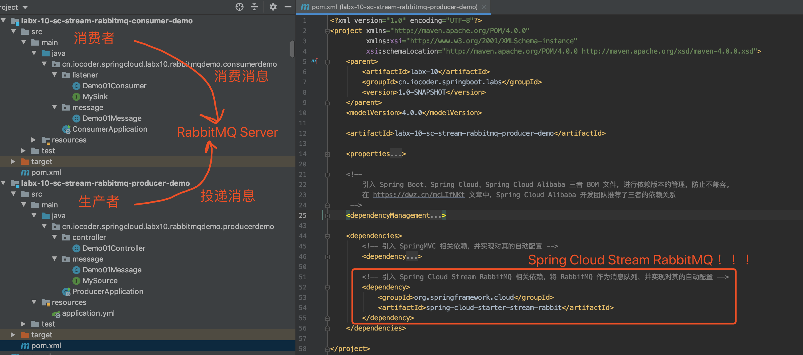

# Spring Cloud 消息队列 RabbitMQ 入门

## 1. 概述

本文我们来学习 [Spring Cloud Stream RabbitMQ](https://github.com/spring-cloud/spring-cloud-stream-binder-rabbit) 组件，基于 [Spring Cloud Stream](https://github.com/spring-cloud/spring-cloud-stream) 的编程模型，接入 RabbitMQ 作为消息中间件，实现消息驱动的微服务。

>RabbitMQ 是一套开源（MPL）的消息队列服务软件，是由 LShift 提供的一个 Advanced Message Queuing Protocol (AMQP) 的开源实现，由以高性能、健壮以及可伸缩性出名的 Erlang 写成。

在开始本文之前，胖友需要对 RabbitMQ 进行简单的学习。可以阅读[《RabbitMQ 极简入门》](http://www.iocoder.cn/RabbitMQ/install/?self)文章，将第**一二**小节看完，在本机搭建一个 RabbitMQ 服务。


## 2. Spring Cloud Stream 介绍

[Spring Cloud Stream](https://github.com/spring-cloud/spring-cloud-stream) 是一个用于构建基于**消息**的微服务应用框架，使用 [Spring Integration](https://www.oschina.net/p/spring+integration) 与 Broker 进行连接。

友情提示：可能有胖友对 Broker 不太了解，我们来简单解释下。

一般来说，消息队列中间件都有一个 **Broker Server**（代理服务器），消息中转角色，负责存储消息、转发消息。

例如说在 RocketMQ 中，Broker 负责接收从生产者发送来的消息并存储、同时为消费者的拉取请求作准备。另外，Broker 也存储消息相关的元数据，包括消费者组、消费进度偏移和主题和队列消息等。

Spring Cloud Stream 提供了消息中间件的**统一抽象**，推出了 publish-subscribe、consumer groups、partition 这些统一的概念。

Spring Cloud Stream 内部有两个概念：**Binder** 和 **Binding**。

① **Binder**，跟消息中间件集成的组件，用来创建对应的 Binding。各消息中间件都有自己的 Binder 具体实现。

```java
public interface Binder<T, 
    C extends ConsumerProperties, // 消费者配置
    P extends ProducerProperties> { // 生产者配置
    
    // 创建消费者的 Binding
    Binding<T> bindConsumer(String name, String group, T inboundBindTarget, C consumerProperties);

    // 创建生产者的 Binding
    Binding<T> bindProducer(String name, T outboundBindTarget, P producerProperties);
    
}
```

- Kafka 实现了 [KafkaMessageChannelBinder](https://github.com/spring-cloud/spring-cloud-stream-binder-kafka/blob/master/spring-cloud-stream-binder-kafka/src/main/java/org/springframework/cloud/stream/binder/kafka/KafkaMessageChannelBinder.java)
- RabbitMQ 实现了 [RabbitMessageChannelBinder](https://github.com/spring-cloud/spring-cloud-stream-binder-rabbit/blob/master/spring-cloud-stream-binder-rabbit/src/main/java/org/springframework/cloud/stream/binder/rabbit/RabbitMessageChannelBinder.java)
- RocketMQ 实现了 [RocketMQMessageChannelBinder](https://github.com/alibaba/spring-cloud-alibaba/blob/master/spring-cloud-stream-binder-rocketmq/src/main/java/com/alibaba/cloud/stream/binder/rocketmq/RocketMQMessageChannelBinder.java)

② **Binding**，包括 Input Binding 和 Output Binding。Binding 在消息中间件与应用程序提供的 Provider 和 Consumer 之间提供了一个桥梁，实现了开发者只需使用应用程序的 Provider 或 Consumer 生产或消费数据即可，屏蔽了开发者与底层消息中间件的接触。

最终整体交互如下图所示：


## 3. 快速入门

示例代码对应仓库：

- 生产者：[`labx-10-sc-stream-rabbitmq-producer-demo`](https://github.com/YunaiV/SpringBoot-Labs/tree//master/labx-10-spring-cloud-stream-rabbitmq/labx-10-sc-stream-rabbitmq-producer-demo)
- 消费者：[`labx-10-sc-stream-rabbitmq-consumer-demo`](https://github.com/YunaiV/SpringBoot-Labs/blob//master/labx-10-spring-cloud-stream-rabbitmq/labx-10-sc-stream-rabbitmq-consumer-demo/)

本小节，我们一起来快速入门下，会创建 2 个项目，分别作为生产者和消费者。最终项目如下图所示：



>友情提示：考虑到胖友能够有更舒适的入门体验，需要对 RabbitMQ 的基本概念有一定的了解，特别是对 Exchange 的四种类型 Direct、Topic、Fanout、Headers 噢。
>
>如果还不知道的，也不要慌~只需要阅读下艿艿写的[《芋道 Spring Boot 消息队列 RabbitMQ 入门》](http://www.iocoder.cn/Spring-Boot/RabbitMQ/?self)的[「3. 快速入门」](https://www.iocoder.cn/Spring-Cloud/RabbitMQ/#)即可。


