# Consumer Group Protocol

本文参考：https://developer.confluent.io/courses/architecture/consumer-group-protocol/

Kafka 将存储与计算分开。存储由代理处理，计算主要由消费者或基于消费者构建的框架（Kafka Streams、ksqlDB）处理。消费者组在 Kafka 消费者的有效性和可扩展性方面发挥着关键作用。

## Kafka 消费者组

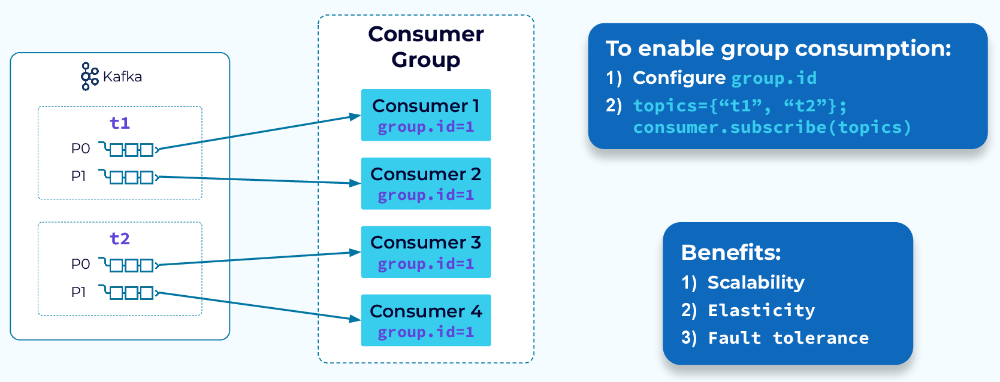

要定义一个消费者组，我们只需要在消费者配置中设置 `group.id`。一旦设置好，每个新的消费者实例都会被添加到该组中。然后，当消费者组订阅一个或多个主题时，这些主题的分区会在组中的实例之间均匀分配。这允许对这些主题中的数据进行并行处理。

并行处理的单位是分区。对于给定的消费者组，消费者可以处理多个分区，但一个分区只能由一个消费者处理。如果我们的组订阅了两个主题，并且每个主题都有两个分区，那么我们最多可以有效地使用四个消费者。我们可以添加第五个消费者，但它会处于空闲状态，因为分区无法共享。

分区分配给消费者组实例是动态的。随着消费者加入组中，或者当消费者因某些原因失败或从组中移除时，工作负载将会自动重新平衡。

## Group Coordinator

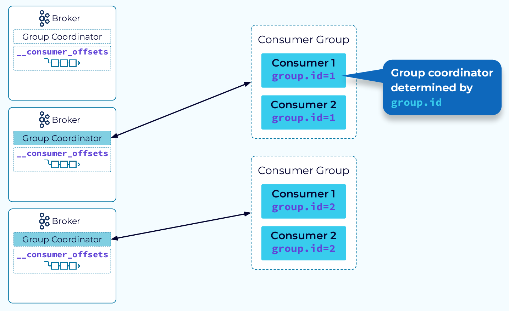

消费者组的核心机制是由组协调器提供的。组协调器帮助将订阅主题中的数据均匀分配给消费者组的实例，并在组成员发生变化时保持平衡。协调器使用一个内部的 Kafka 主题来跟踪组的元数据。

在一个典型的 Kafka 集群中，会有多个组协调器。这使得可以高效地管理多个消费者组。

## Group Startup

让我们看一下启动新消费者组所涉及的步骤。

#### Step 1 – Find Group Coordinator

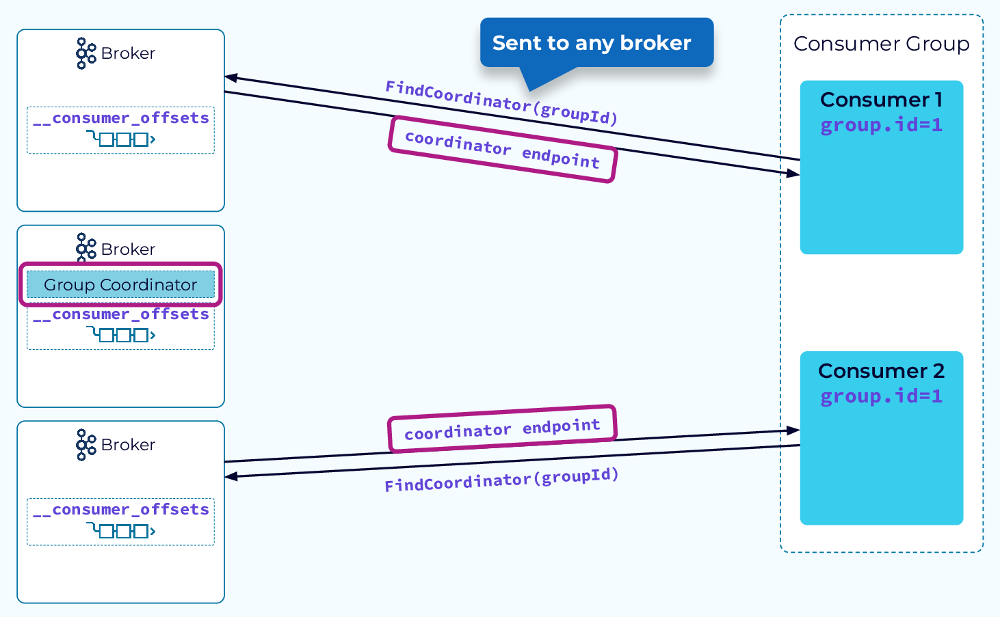

当一个消费者实例启动时，它会向集群中的任何一个代理（broker）发送一个包含其 `group.id` 的 `FindCoordinator` 请求。代理会对 `group.id` 进行哈希处理，并将其对内部 `__consumer_offsets` 主题的分区数量取模。这决定了该组的所有元数据事件将被写入哪个分区。承载该分区主副本的代理将担任新消费者组的组协调器角色。收到 FindCoordinator请求的代理将使用组协调器的端点进行响应。

#### Step 2 – Members Join

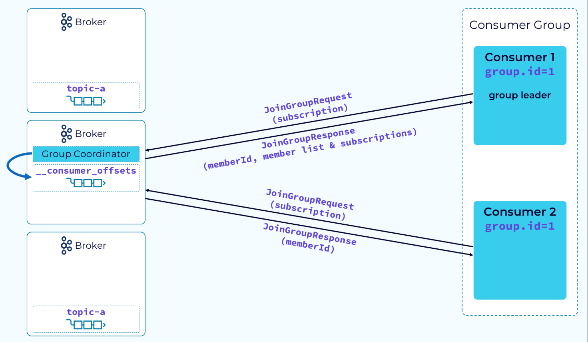

接下来，消费者和组协调器开始进行一系列协调操作，首先是消费者发送 `JoinGroup` 请求并传递其主题订阅信息。协调器会选择一个消费者，通常是第一个发送 `JoinGroup` 请求的消费者，作为组领导者。协调器会向每个消费者返回一个 `memberId`，同时还会向组领导者返回所有成员的列表及其订阅信息。这样做的原因是让组领导者可以使用可配置的分区分配策略来实际执行分区分配。

#### Step 3 – Partitions Assigned

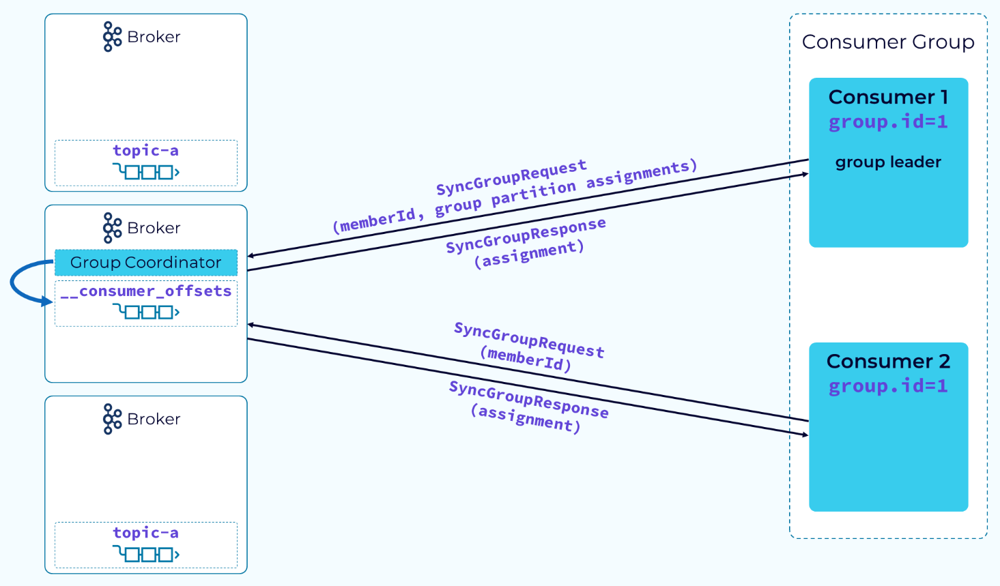

当组领导者收到完整的成员列表和订阅信息后，它会使用配置的分区器将订阅中的分区分配给组成员。完成后，领导者会向协调器发送一个 `SyncGroupRequest`，传递其 `memberId` 和分区器提供的组分配信息。其他消费者也会发送类似的请求，但只会传递它们的 `memberId`。协调器将使用组领导者提供的分配信息，向每个消费者返回实际的分配结果。现在，消费者可以开始真正的工作，进行数据的消费和处理。

## Range Partition Assignment Strategy

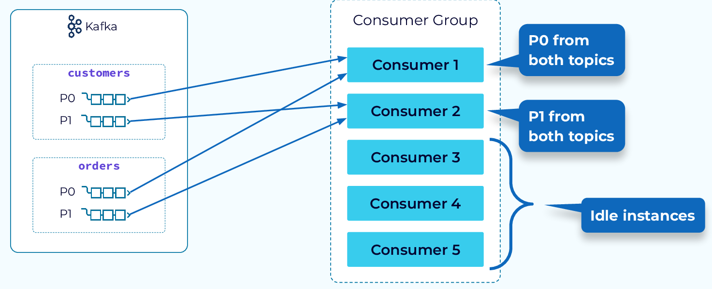

现在，让我们看看一些可用的分配策略。首先是范围分配策略（range assignment strategy）。该策略遍历订阅中的每个主题，并从第一个消费者开始为每个分区分配消费者。这意味着，每个主题的第一个分区将分配给第一个消费者，第二个分区将分配给第二个消费者，以此类推。如果订阅中的任何单个主题的分区数量少于消费者数量，那么某些消费者将处于空闲状态。

乍一看，这似乎不是一个非常好的策略，但它有一个特殊的用途。当从多个主题中合并事件时，事件需要由同一个消费者读取。如果两个不同主题中的事件使用相同的键，它们将位于各自主题的同一分区中，使用范围分配器时，它们将被分配给同一个消费者。

>如果两个主题的事件使用相同的键（比如相同的用户 ID 或订单号），这些事件会被哈希到各自主题的相同分区上。由于范围分配器会将相同编号的分区分配给同一个消费者，这就保证了相同键的事件被同一个消费者读取。

## Round Robin and Sticky Partition Assignment Strategies

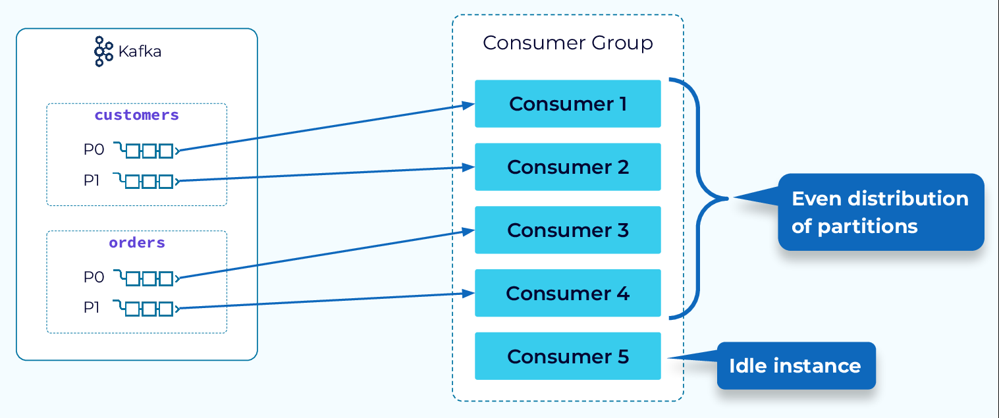

接下来，我们来看看 Round Robin 策略。使用此策略，订阅的所有分区（无论主题如何）都将均匀分布在可用的消费者中。这会导致空闲的消费者实例更少，并行度更高。

循环法的一个变体称为粘性分区策略，其工作原理相同，但它在重新平衡期间会尽最大努力坚持之前的分配。这提供了更快、更高效的重新平衡。

## Tracking Partition Consumption

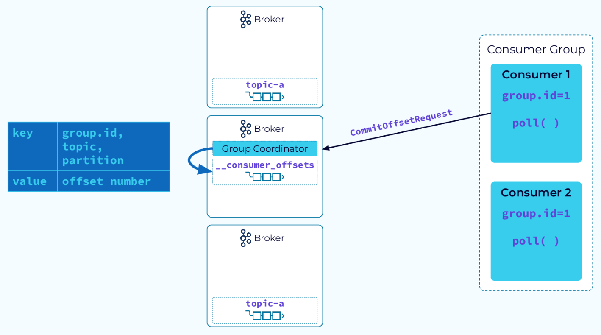

在 Kafka 中，跟踪消费者的进度相对简单。给定分区始终分配给单个消费者，并且消费者始终按偏移顺序读取该分区中的事件。因此，消费者只需跟踪每个分区的最后一个偏移量即可。为此，消费者将向组协调器发出 CommitOffsetRequest 。然后，协调器将把该信息保存在其内部__consumer_offsets主题中

## Determining Starting Offset to Consume

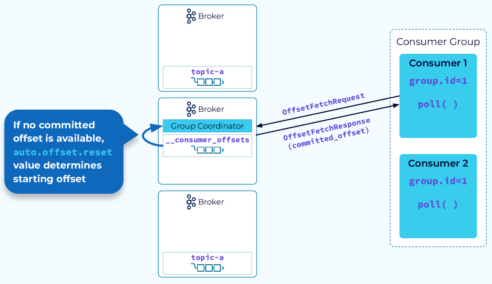

当消费者组实例重新启动时，它将向组协调器发送OffsetFetchRequest以检索其分配的分区的最后提交的偏移量。一旦获得偏移量，它将从该点恢复消费。如果此消费者实例是第一次启动，并且此消费者组没有保存的偏移量位置，则auto.offset.reset配置将确定它是从最早的偏移量还是最晚的偏移量开始消费。

## Group Coordinator Failover

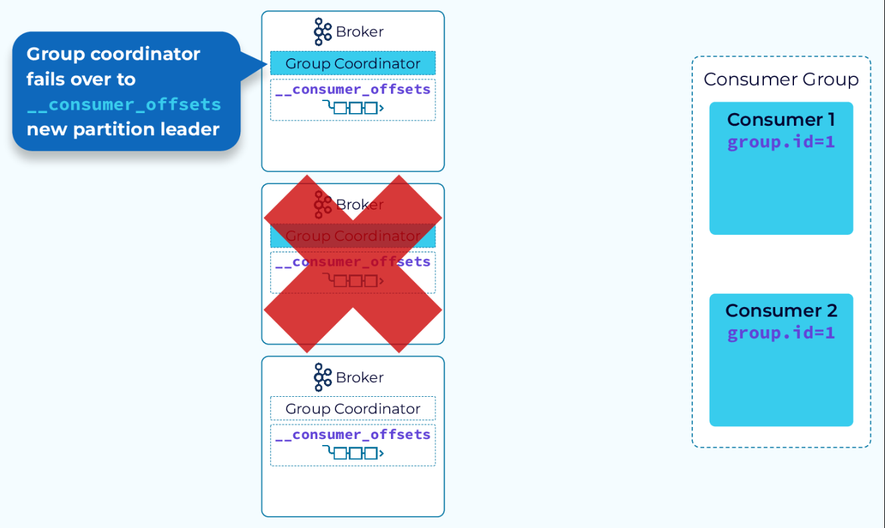

内部__consumer_offsets主题的复制方式与任何其他 Kafka 主题一样。另外，回想一下，组协调器是托管分配给此组的__consumer_offsets分区的领导者副本的代理。因此，如果组协调器发生故障，则托管该分区的追随者副本之一的代理将成为新的组协调器。当消费者尝试调用旧协调器时，他们将收到有关新协调器的通知，然后一切将照常继续。

## Consumer Group Rebalance Triggers

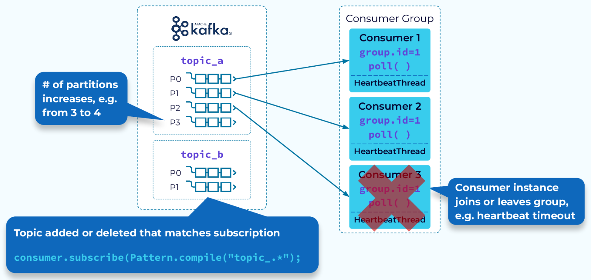

消费者组的一个关键特性是再平衡。我们将更详细地讨论再平衡，但首先让我们来看一下可以触发再平衡的一些事件：

- 一个实例未能在超时前向协调器发送心跳，并被从组中移除
- 一个实例被添加到组中
- 组的订阅主题中增加了分区
- 组有通配符订阅，且创建了一个新的匹配主题
- 当然，组的初次启动也会触发再平衡

接下来我们看看重新平衡时会发生什么。

## Consumer Group Rebalance Notification

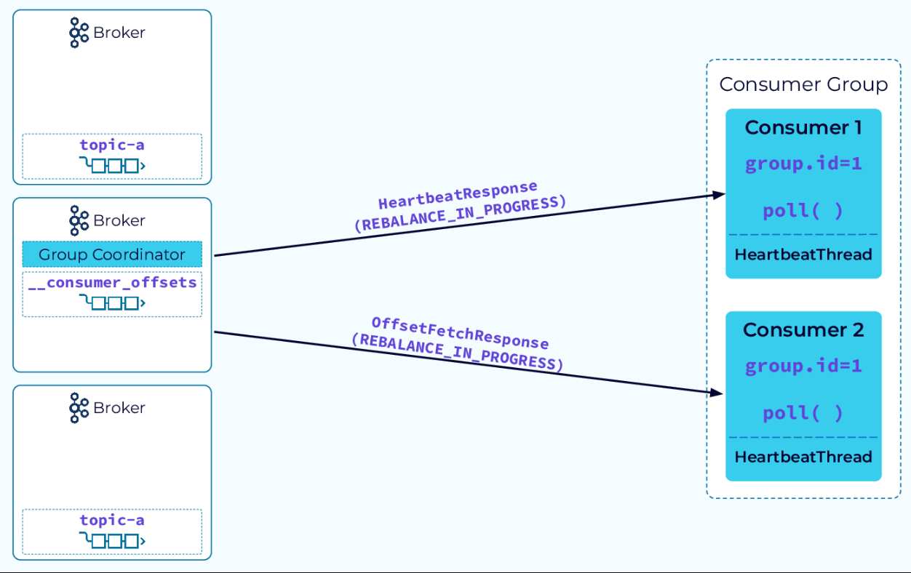

再平衡过程从协调器通知消费者实例再平衡已经开始时启动。它通过附加在 `HeartbeatResponse` 或 `OffsetFetchResponse` 上来发送这个通知。现在有趣的部分开始了！

### Stop-the-World Rebalance

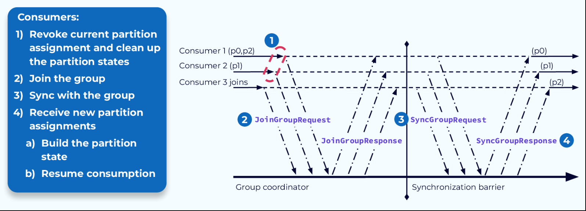

传统的重新平衡过程相当复杂。一旦消费者收到来自协调器的重新平衡通知，他们就会撤销当前的分区分配。如果他们一直维护与之前分配的分区中的数据相关的任何状态，他们还必须清理这些状态。现在他们基本上就像新的消费者一样，将经历与加入该组的新消费者相同的步骤。

他们会向协调器发送JoinGroupRequest ，然后发送SyncGroupRequest。协调器会做出相应的响应，然后每个消费者都会得到新的任务。

现在，消费者需要的任何状态都必须根据新分配的分区中的数据进行重建。这个过程虽然有效，但也有一些缺点。现在让我们来看看其中的几个。

### Stop-the-World 问题 #1 – 重建状态

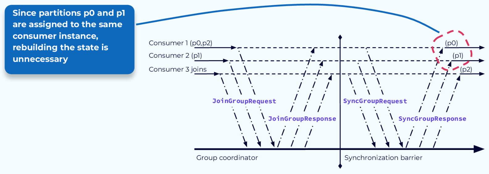

第一个问题是需要重建状态。如果消费者应用程序根据其被分配到的分区中的事件来维护状态，则在重新平衡完成后，它可能需要读取分区中的所有事件以重建该状态。从我们的示例中可以看出，有时即使不需要，也会进行这项工作。如果消费者撤销其对特定分区的分配，然后在重新平衡期间被分配到同一分区，则可能会出现大量浪费的处理。

### Stop-the-World 问题 #2 – 暂停处理

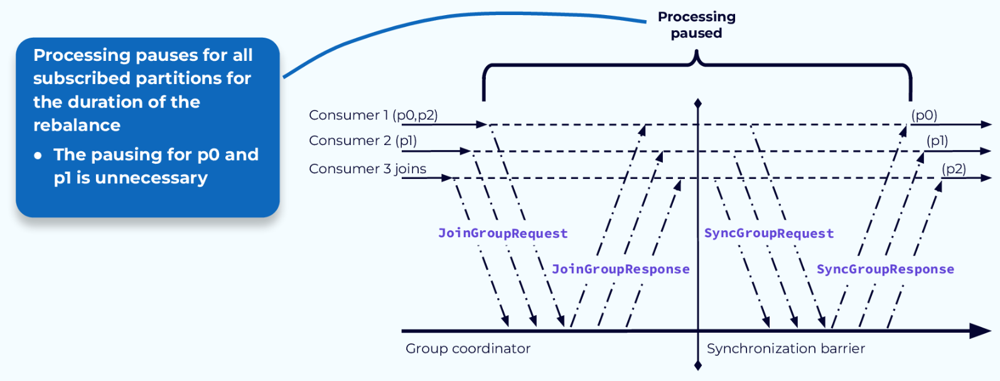

第二个问题是，我们需要在重新平衡过程中暂停所有处理，因此得名“Stop-the-world”。由于所有消费者的分区分配在流程开始时就被撤销，因此在流程完成并重新分配分区之前，什么都不会发生。在许多情况下，就像我们这里的例子一样，一些消费者会保留一些相同的分区，理论上可以在重新平衡过程中继续使用它们。

让我们看看为了解决这些问题已经做出的一些改进。

### 使用 StickyAssignor 避免不必要的状态重建

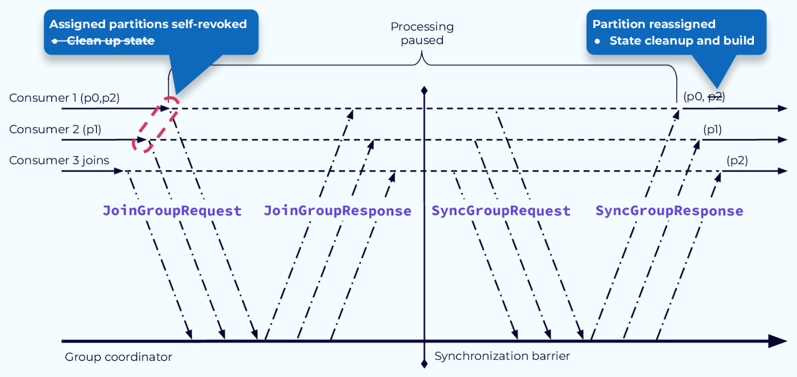

首先，使用新的StickyAssignor我们可以避免不必要的状态重建。与StickyAssignor的主要区别在于，在重新分配完成后，状态清理被移至后续步骤。这样，如果消费者被重新分配到同一个分区，它就可以继续工作，而不必清除或重建状态。在我们的示例中，只需要为分配给新消费者的分区 p2 重建状态。

### 使用 CooperativeStickyAssignor 避免暂停步骤 1

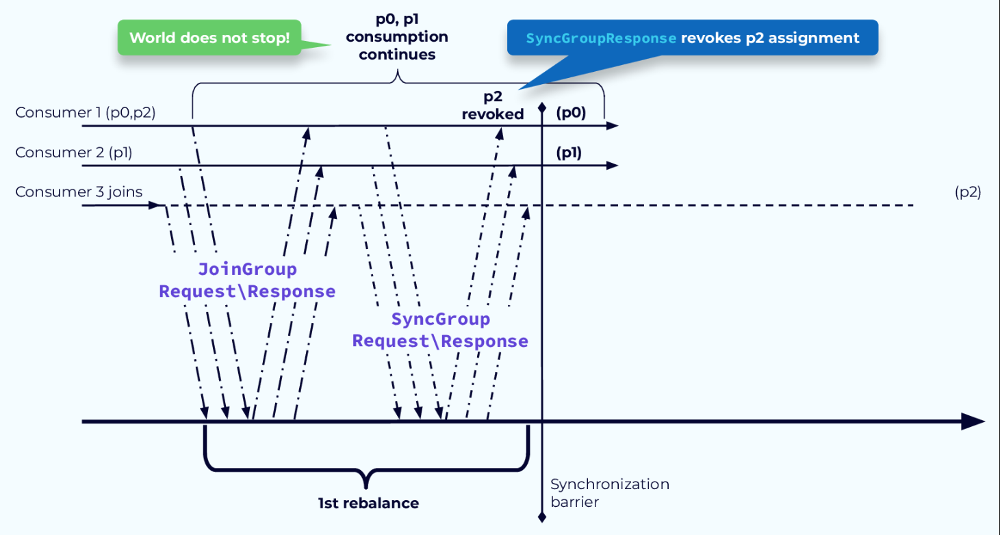

为了解决暂停处理的问题，我们引入了 CooperativeStickyAssignor 。此分配器的工作过程分为两个步骤。第一步，确定需要撤销哪些分区分配。这些分配将在第一个重新平衡步骤结束时撤销。未撤销的分区可以继续处理。

### 使用 CooperativeStickyAssignor 避免暂停步骤 2

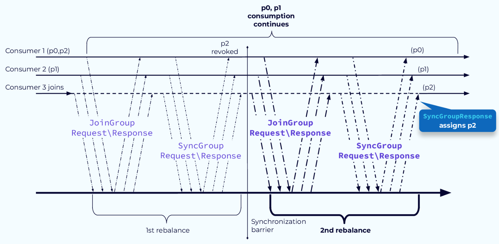

在第二个重新平衡步骤中，将分配已撤销的分区。在我们的示例中，分区 2 是唯一被撤销的分区，它被分配给新的消费者 3。在更复杂的系统中，所有消费者可能都有新的分区分配，但事实是，任何不需要移动的分区都可以继续处理，而不会让世界陷入停顿。

### 使用静态组成员身份避免重新平衡

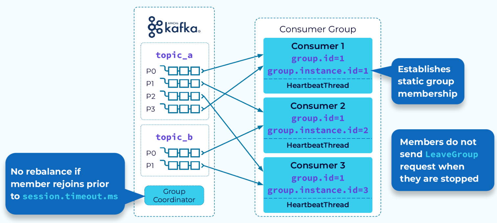

俗话说，最快的重新平衡就是不发生重新平衡。这就是静态组成员身份的目标。对于静态组成员身份，每个消费者实例都会被分配一个group.instance.id。此外，当消费者实例正常离开时，它不会向协调器发送LeaveGroup请求，因此不会启动重新平衡。当同一个实例重新加入组时，协调器将识别它并允许它继续其现有的分区分配。同样，不需要重新平衡。

同样，如果消费者实例失败但在其心跳间隔超时之前重新启动，它将能够继续其现有的分配。