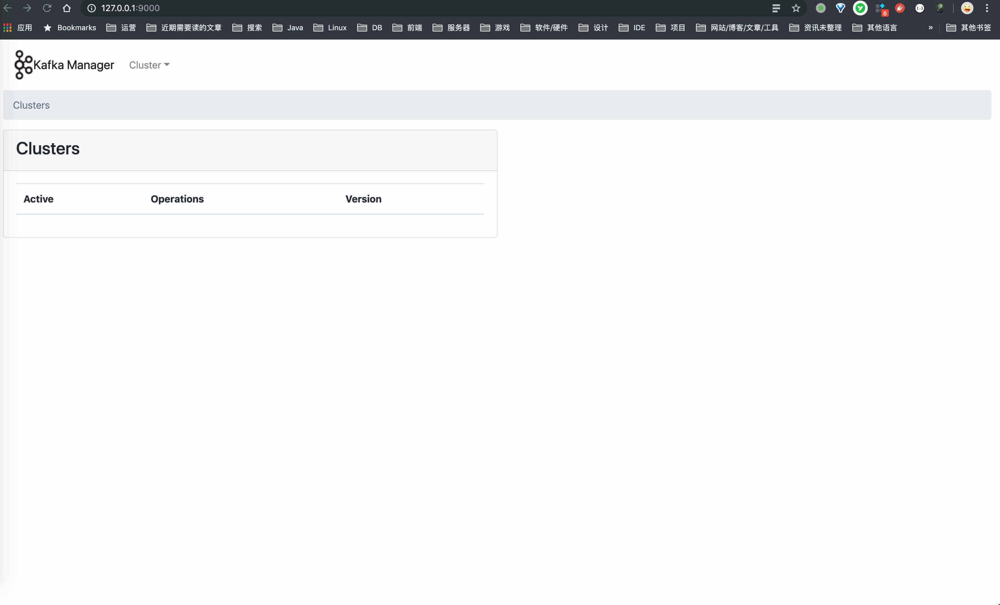
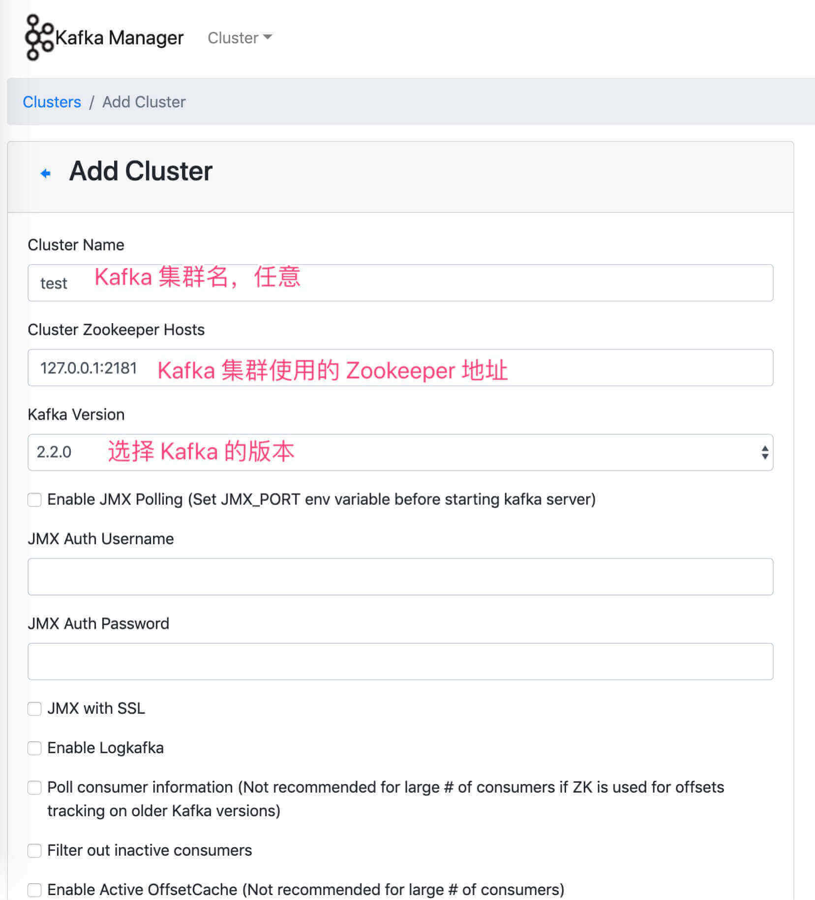
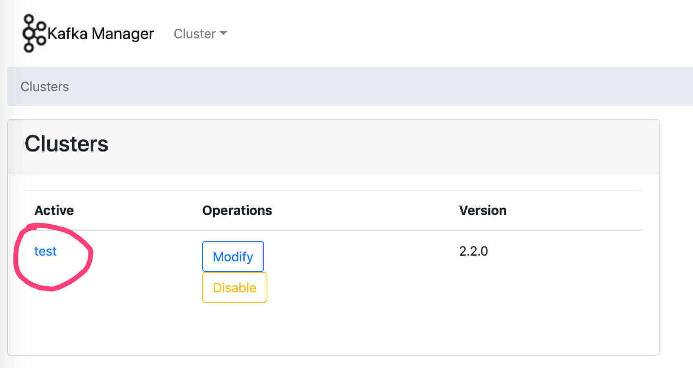
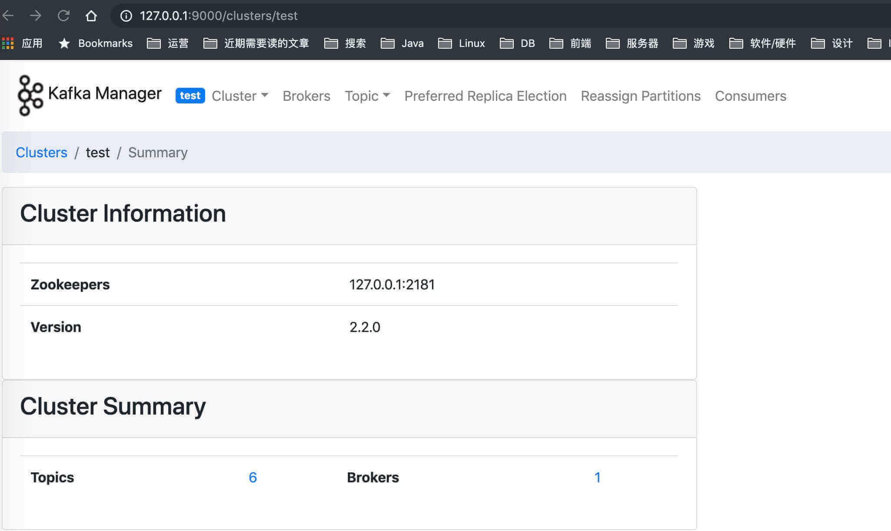

# Kafka 极简入门


## 1. 概述

[Kafka](https://kafka.apache.org/) 是基于发布与订阅的消息系统。它最初由 LinkedIn 公司开发，之后成为 Apache 项目的一部分。

因为朋友已经写了一篇很不错的 Kafka 入门文章，所以艿艿就可以光明正大的偷懒了。对 Kafka 不了解的胖友，可以先阅读 [《消息队列之 Kafka》](http://www.iocoder.cn/Kafka/yuliu/doc) 文章的 [「1. Kafka 特点」](https://www.iocoder.cn/Kafka/install/?self#) 和 [「2. Kafka 中的基本概念」](https://www.iocoder.cn/Kafka/install/?self#) 两个小节。😜

## 2. 单机部署

> 操作系统：macOS 10.14
>
> 其它系统，基本一致的。

Kafka 依赖 ZooKeeper 服务，所以胖友先自行安装并启动一个 ZooKeeper 服务。不会的胖友，可以参考阅读下 [《ZooKeeper 极简入门》](http://www.iocoder.cn/ZooKeeper/install/?self) 文章的 [「2. 单机部署」](https://www.iocoder.cn/Kafka/install/?self#) 小节。这里，艿艿在本机 `127.0.0.1:2181` 启动了一个 ZooKeeper 单节点。

### 2.1 下载软件包

打开 [Kafka Download](http://kafka.apache.org/downloads) 页面，我们可以看到 Kafka 所有的发布版本。这里，我们选择最新的 [Kafka 2.3.1](hhttp://kafka.apache.org/downloads#2.3.1) 版本。这里，我们可以看到两种发布版本：

- Source: [kafka-2.3.1-src.tgz](https://www.apache.org/dyn/closer.cgi?path=/kafka/2.3.1/kafka-2.3.1-src.tgz)
- Binary: [kafka_2.12-2.3.1.tgz](https://www.apache.org/dyn/closer.cgi?path=/kafka/2.3.1/kafka_2.12-2.3.1.tgz)

一般情况下，我们可以直接使用 Binary 版本，它是 Kafka 已经编译好，可以直接使用的 Kafka 软件包。

下面，我们开始下载 Kafka Binary 软件包。命令行操作如下：


```shell
# 创建目录
$ mkdir -p /Users/yunai/Kafka
$ cd /Users/yunai/Kafka

# 下载
$ wget http://mirrors.tuna.tsinghua.edu.cn/apache/kafka/2.3.1/kafka_2.12-2.3.1.tgz

# 解压
$ unzip kafka_2.12-2.3.1.tgz

# 查看 Kafka 软件包的目录
$ kafka_2.12-2.3.1
$ ls -ls
total 72
64 -rw-r--r--   1 yunai  staff  32216 Oct 18 08:10 LICENSE
 8 -rw-r--r--   1 yunai  staff    337 Oct 18 08:10 NOTICE
 0 drwxr-xr-x  33 yunai  staff   1056 Oct 18 08:12 bin # 执行脚本
 0 drwxr-xr-x  16 yunai  staff    512 Oct 18 08:12 config # 配置文件
 0 drwxr-xr-x  94 yunai  staff   3008 Oct 18 08:12 libs # Kafka jar 包
 0 drwxr-xr-x   9 yunai  staff    288 Dec  5 14:50 logs # 日志文件
 0 drwxr-xr-x   3 yunai  staff     96 Oct 18 08:12 site-docs # 文档
```


### 2.2 配置文件

在 `config` 目录下，提供了 Kafka 各个组件的配置文件。如下：


```shell
$ ls -ls config
total 136
 8 -rw-r--r--  1 yunai  staff   906 Oct 18 08:10 connect-console-sink.properties
 8 -rw-r--r--  1 yunai  staff   909 Oct 18 08:10 connect-console-source.properties
16 -rw-r--r--  1 yunai  staff  5321 Oct 18 08:10 connect-distributed.properties
 8 -rw-r--r--  1 yunai  staff   883 Oct 18 08:10 connect-file-sink.properties
 8 -rw-r--r--  1 yunai  staff   881 Oct 18 08:10 connect-file-source.properties
 8 -rw-r--r--  1 yunai  staff  1552 Oct 18 08:10 connect-log4j.properties
 8 -rw-r--r--  1 yunai  staff  2262 Oct 18 08:10 connect-standalone.properties
 8 -rw-r--r--  1 yunai  staff  1221 Oct 18 08:10 consumer.properties
16 -rw-r--r--  1 yunai  staff  4727 Oct 18 08:10 log4j.properties
 8 -rw-r--r--  1 yunai  staff  1925 Oct 18 08:10 producer.properties
16 -rw-r--r--  1 yunai  staff  6851 Oct 18 08:10 server.properties
 8 -rw-r--r--  1 yunai  staff  1032 Oct 18 08:10 tools-log4j.properties
 8 -rw-r--r--  1 yunai  staff  1169 Oct 18 08:10 trogdor.conf
 8 -rw-r--r--  1 yunai  staff  1023 Oct 18 08:10 zookeeper.properties
```


这里，我们先创建一个 `data` 目录，然后编辑 `conf/server.properties` 配置文件，修改数据目录为新创建的 `data` 目录，即 `log.dirs=/Users/yunai/Kafka/kafka_2.12-2.3.1/data` 。

😈 当然，因为单机部署是学习或者测试之用，所以不改也问题不大。

### 2.3 启动 Kafka

启动一个 Kafka Broker 服务。命令行操作如下：


```shell
$ nohup bin/kafka-server-start.sh config/server.properties &
```


启动完成后，查看日志。


```shell
# 查看 Kafka Broker 日志。
$ tail -f logs/server.log

[2019-12-07 19:34:27,983] INFO Kafka version: 2.3.1 (org.apache.kafka.common.utils.AppInfoParser)
[2019-12-07 19:34:27,983] INFO Kafka commitId: 18a913733fb71c01 (org.apache.kafka.common.utils.AppInfoParser)
[2019-12-07 19:34:27,983] INFO Kafka startTimeMs: 1575545667980 (org.apache.kafka.common.utils.AppInfoParser)
[2019-12-07 19:34:27,985] INFO [KafkaServer id=0] started (kafka.server.KafkaServer)
```


- 默认情况下，Kafka Broker 日志文件所在地址为 `logs/server.log` 。如果想要自定义，可以通过 `config/log4j.properties` 配置文件来进行修改。

😈 至此，我们已经完成了 Kafka 单机部署。下面，我们开始进行下消息的发送和消费的测试。

### 2.4 创建 Topic

在发送和消费消息之前，我们先来创建 Topic 。我们可以使用 `bin/kafka-topics.sh` 脚本，来进行 Kafka Topic 的管理。


```
# 创建名字为 TestTopic 的 Topic 。 
# @param replication-factor 参数：Topic 副本数
# @param partitions 参数：Topic 分区数
# 关于两个参数的详细解释，可以看看 https://www.cnblogs.com/liuys635/p/10806665.html
$ bin/kafka-topics.sh --create --zookeeper localhost:2181 --replication-factor 1 --partitions 1 --topic TestTopic

# 查询 Topic 列表
$ bin/kafka-topics.sh --list --zookeeper 127.0.0.1:2181
TestTopic
```


### 2.5 测试发送消息

通过使用 `bin/kafka-console-producer.sh` 脚本，实现测试发送消息。命令行操作如下：


```
# 执行 kafka-console-producer.sh 脚本，进入使用命令行发送消息的模式。
$ bin/kafka-console-producer.sh --broker-list 127.0.0.1:9092 --topic TestTopic

# 每输入一行，敲回车，都会发送一条消息
> yudaoyuanma
> nicai
> hahaha
```


完成发送三条测试消息后，我们使用「command + C」终止当前脚本，退出。

### 2.6 测试消费消息

通过使用 `bin/kafka-console-consumer.sh` 脚本，实现测试消费消息。命令行操作如下：


```shell
# 执行 kafka-console-consumer.sh 脚本，进入使用命令行消费消息
$ bin/kafka-console-consumer.sh --bootstrap-server 127.0.0.1:9092 --topic TestTopic --from-beginning
# 执行后，看到刚发送的三条消息，被成功消费，并打印在终端上。
yudaoyuanma
nicai
hahaha
```


至此，我们已经完成单机部署的 Kafka 的测试，舒服~

## 3. 集群部署

咳咳咳，偷懒下。胖友可以先看艿艿朋友写的 [《消息队列之 Kafka》](http://www.iocoder.cn/Kafka/yuliu/doc) 文章的 [「6. Kafka 集群配置」](https://www.iocoder.cn/Kafka/install/?self#) 小节。

在生产环境下，必须搭建 Kafka 高可用集群，不然简直是找死。

## 4. Kafka Manager

[Kafka Manager](https://github.com/yahoo/kafka-manager) 是由 Yahoo 雅虎开源的 Kafka 管理工具。它支持如下功能：

> 打开有道词典，一顿翻译。不过相信胖友，大体意思是能看的懂的。

- Manage multiple clusters
- Easy inspection of cluster state (topics, consumers, offsets, brokers, replica distribution, partition distribution)
- Run preferred replica election
- Generate partition assignments with option to select brokers to use
- Run reassignment of partition (based on generated assignments)
- Create a topic with optional topic configs (0.8.1.1 has different configs than 0.8.2+)
- Delete topic (only supported on 0.8.2+ and remember set delete.topic.enable=true in broker config)
- Topic list now indicates topics marked for deletion (only supported on 0.8.2+)
- Batch generate partition assignments for multiple topics with option to select brokers to use
- Batch run reassignment of partition for multiple topics
- Add partitions to existing topic
- Update config for existing topic
- Optionally enable JMX polling for broker level and topic level metrics.
- Optionally filter out consumers that do not have ids/ owners/ & offsets/ directories in zookeeper.

下面，让我们来搭建一个 Kafka Manager 。

### 4.1 下载软件包

Kafka Manager 在 [Releases](https://github.com/yahoo/kafka-manager/releases) 中，暂时只提供源码 Source 包，未提供编译好的二进制 Binary 包。

考虑到 Kafka Manager 需要使用 [sbt](https://www.scala-sbt.org/) 进行构造，所以我们就暂时不考虑编译源码的方式。而是，从热心“网友”提供的[Kafka Manager 安装包下载](https://blog.wolfogre.com/posts/kafka-manager-download/) ，美滋滋。这里，我们使用 Kafka Manager 2.0.0.2 版本。操作流程如下：


```shell
$ 下载。可能很慢，可以考虑采用迅雷下载。
$ wget https://github.com/wolfogre/kafka-manager-docker/releases/download/2.0.0.2/kafka-manager-2.0.0.2.zip

$ 解压
$ unzip kafka-manager-2.0.0.2.zip

# 查看 Kafka Manager 软件包的目录
$ cd kafka-manager-2.0.0.2
$ ls -ls
total 24
24 -rw-r--r--@   1 yunai  staff  8686 Apr 11  2019 README.md
 0 drwxr-xr-x@  14 yunai  staff   448 Dec  5 23:17 bin #  执行脚本
 0 drwxr-xr-x@   7 yunai  staff   224 Dec  5 23:17 conf # 配置文件
 0 drwxr-xr-x@ 103 yunai  staff  3296 Dec  5 23:17 lib # Kafka Manager jar 包
 0 drwxr-xr-x@   3 yunai  staff    96 Dec  5 23:17 share
```


### 4.2 配置文件

编辑 `conf/application.conf` 配置文件，修改配置项为 `kafka-manager.zkhosts="127.0.0.1:2181"` 。此处，填写的是胖友的 ZooKeeper 地址。因为艿艿是本地启的 ZooKeeper 服务，所以填写了 `"127.0.0.1:2181"` 。

### 4.3 启动 Kafka Manager

启动一个 Kafka Manager 服务。命令行操作如下：


```shell
$ nohup bin/kafka-manager &
```


启动完成后，查看日志。


```shell
# 查看 Kafka Broker 日志。
$ tail -f logs/application.log

Application started (Prod)

2019-12-07 23:32:17,845 - [INFO] - from play.core.server.AkkaHttpServer in main
Listening for HTTP on /0:0:0:0:0:0:0:0:9000
```


### 4.4 添加 Kafka 集群

使用浏览器，访问 <http://127.0.0.1:9000/> 地址，我们就可以看到 Kafka Manager 的界面。如下图：

点击导航栏的「Cluster」按钮，选择「Add Cluster」选项，进入 <http://127.0.0.1:9000/addCluster> 地址。在该界面，我们配置新增 Kafka 集群。如下图：

填写完成后，拉到表单最底部，点击「Save」按钮，保存 Kafka 集群。保存成功后，我们重新访问 <http://127.0.0.1:9000/> 地址，就可以看到我们新添加的 Kafka 集群。如下图：

点击「test」Kafka 集群，我们就可以管理该 Kafka 集群。如下图：

具体的功能，胖友可以自己多多体验，艿艿就不啰嗦赘述了。

## 5. 简单示例

> 示例代码对应仓库：[lab-03-kafka-native](https://github.com/YunaiV/SpringBoot-Labs/blob/master/lab-03-kafka/lab-03-kafka-native/) 。

本小节，我们来看看在 Java 中，如何使用生产者 Producer 发送消息，和消费者 Consumer 消费消息。

### 5.1 引入依赖

在 [`pom.xml`](https://github.com/YunaiV/SpringBoot-Labs/blob/master/lab-03-kafka/lab-03-kafka-native/pom.xml) 文件中，引入相关依赖。


```
<?xml version="1.0" encoding="UTF-8"?>
<project xmlns="http://maven.apache.org/POM/4.0.0"
         xmlns:xsi="http://www.w3.org/2001/XMLSchema-instance"
         xsi:schemaLocation="http://maven.apache.org/POM/4.0.0 http://maven.apache.org/xsd/maven-4.0.0.xsd">
    <modelVersion>4.0.0</modelVersion>

    <artifactId>lab-03-kafka-native</artifactId>

    <dependencies>
        <!-- 引入 Kafka 客户端依赖 -->
        <dependency>
            <groupId>org.apache.kafka</groupId>
            <artifactId>kafka-clients</artifactId>
            <version>2.3.1</version>
        </dependency>
    </dependencies>

</project>
```


具体每个依赖的作用，胖友自己认真看下艿艿添加的所有注释噢。

### 5.2 ProducerMain

创建 [ProducerMain](https://github.com/YunaiV/SpringBoot-Labs/blob/master/lab-03-kafka/lab-03-kafka-native/src/main/java/cn/iocoder/springboot/lab03/kafkademo/ProducerMain.java) 类，使用 [KafkaProducer](https://github.com/apache/kafka/blob/master/clients/src/main/java/org/apache/kafka/clients/producer/KafkaProducer.java) 发送消息。代码如下：


```
// ProducerMain.java

public class ProducerMain {

    private static Producer<String, String> createProducer() {
        // 设置 Producer 的属性
        Properties properties = new Properties();
        properties.put("bootstrap.servers", "127.0.0.1:9092"); // 设置 Broker 的地址
        properties.put("acks", "1"); // 0-不应答。1-leader 应答。all-所有 leader 和 follower 应答。
        properties.put("retries", 3); // 发送失败时，重试发送的次数
//        properties.put("batch.size", 16384);
//        properties.put("linger.ms", 1);
//        properties.put("client.id", "DemoProducer");
//        properties.put("buffer.memory", 33554432);
        properties.put("key.serializer", StringSerializer.class.getName()); // 消息的 key 的序列化方式
        properties.put("value.serializer", StringSerializer.class.getName()); // 消息的 value 的序列化方式

        // 创建 KafkaProducer 对象
        // 因为我们消息的 key 和 value 都使用 String 类型，所以创建的 Producer 是 <String, String> 的泛型。
        return new KafkaProducer<>(properties);
    }

    public static void main(String[] args) throws ExecutionException, InterruptedException {
        // 创建 KafkaProducer 对象
        Producer<String, String> producer = createProducer();

        // 创建消息。传入的三个参数，分别是 Topic ，消息的 key ，消息的 message 。
        ProducerRecord<String, String> message = new ProducerRecord<>("TestTopic", "key", "yudaoyuanma");

        // 同步发送消息
        Future<RecordMetadata> sendResultFuture = producer.send(message);
        RecordMetadata result = sendResultFuture.get();
        System.out.println("message sent to " + result.topic() + ", partition " + result.partition() + ", offset " + result.offset());
    }

}
```


- 代码比较简单，胖友根据艿艿添加的注释，理解下哈。

执行 `#main(args)` 方法，发送消息到 Kafka 。执行结果如下：


```
message sent to TestTopic, partition 0, offset 8
```


- 发送消息成功。

### 5.3 ConsumerMain

创建 [ConsumerMain](https://github.com/YunaiV/SpringBoot-Labs/blob/master/lab-03-kafka/lab-03-kafka-native/src/main/java/cn/iocoder/springboot/lab03/kafkademo/ConsumerMain.java) 类，使用 [KafkaConsumer](https://github.com/apache/kafka/blob/master/clients/src/main/java/org/apache/kafka/clients/consumer/KafkaConsumer.java) 消费消息。代码如下：


```shell
// ConsumerMain.java

public class ConsumerMain {

    private static Consumer<String, String> createConsumer() {
        // 设置 Producer 的属性
        Properties properties = new Properties();
        properties.put("bootstrap.servers", "127.0.0.1:9092"); // 设置 Broker 的地址
        properties.put("group.id", "demo-consumer-group"); // 消费者分组
        properties.put("auto.offset.reset", "earliest"); // 设置消费者分组最初的消费进度为 earliest 。可参考博客 https://blog.csdn.net/lishuangzhe7047/article/details/74530417 理解
        properties.put("enable.auto.commit", true); // 是否自动提交消费进度
        properties.put("auto.commit.interval.ms", "1000"); // 自动提交消费进度频率
        properties.put("key.deserializer", StringDeserializer.class.getName()); // 消息的 key 的反序列化方式
        properties.put("value.deserializer", StringDeserializer.class.getName()); // 消息的 value 的反序列化方式

        // 创建 KafkaProducer 对象
        // 因为我们消息的 key 和 value 都使用 String 类型，所以创建的 Producer 是 <String, String> 的泛型。
        return new KafkaConsumer<>(properties);
    }

    public static void main(String[] args) {
        // 创建 KafkaConsumer 对象
        Consumer<String, String> consumer = createConsumer();

        // 订阅消息
        consumer.subscribe(Collections.singleton("TestTopic"));

        // 拉取消息
        while (true) {
            // 拉取消息。如果拉取不到消息，阻塞等待最多 10 秒，或者等待拉取到消息。
            ConsumerRecords records = consumer.poll(Duration.ofSeconds(10));
            // 遍历处理消息
            records.forEach(new java.util.function.Consumer<ConsumerRecord>() {

                @Override
                public void accept(ConsumerRecord record) {
                    System.out.println(record.key() + "\t" + record.value());
                }

            });
        }
    }

}
```


- 代码比较简单，胖友根据艿艿添加的注释，理解下哈。

执行 `#main(args)` 方法，从 Kafka 消费消息。执行结果如下：


```shell
null	123
null	fsf
null	123
null	123
null	nicai
null	1232321
null	3213231
key	yudaoyuanma
key	yudaoyuanma
```


- 😈 有一部分消息是艿艿之前做测试发的，可以忽略哈。此时，我们已经成功消费。

## 6. Spring Boot 使用示例

在 [《芋道 Spring Boot 分布式消息队列 Kafka 入门》](http://www.iocoder.cn/Spring-Boot/Kafka/?self) 中，我们来详细学习如何在 Spring Boot 中，整合并使用 Kafka 。😈 会方便很多。

## 7. Spring Cloud 使用示例

在如下的文章中，我们来详细学习如何在 Spring Cloud 中，整合并使用 Kafka 。😈 更加方便。

- [《芋道 Spring Cloud 消息队列 Kafka 入门》](http://www.iocoder.cn/Spring-Cloud/Kafka/?self)
- [《芋道 Spring Cloud 事件总线 Bus Kafka 入门》](http://www.iocoder.cn/Spring-Cloud/Bus-Kafka/?self)

# 