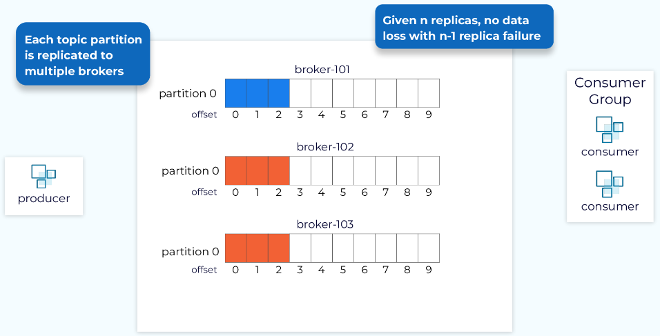
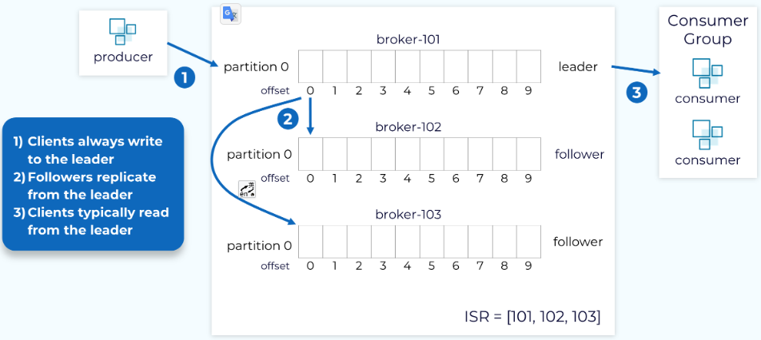
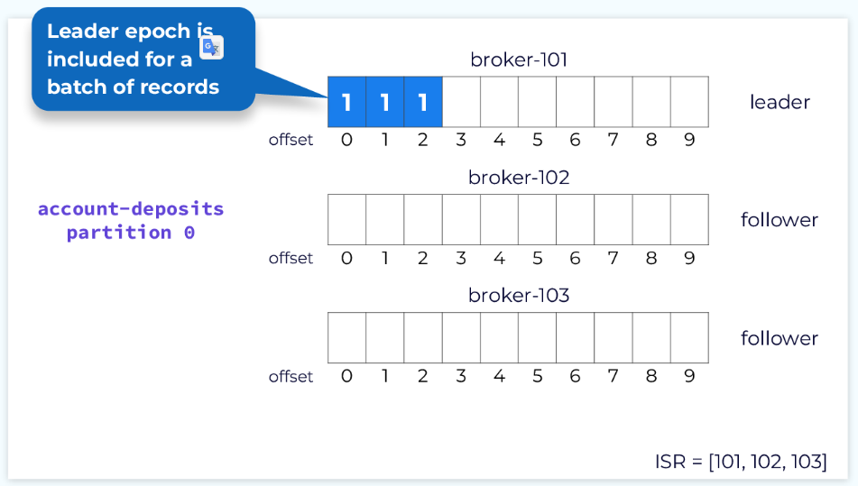
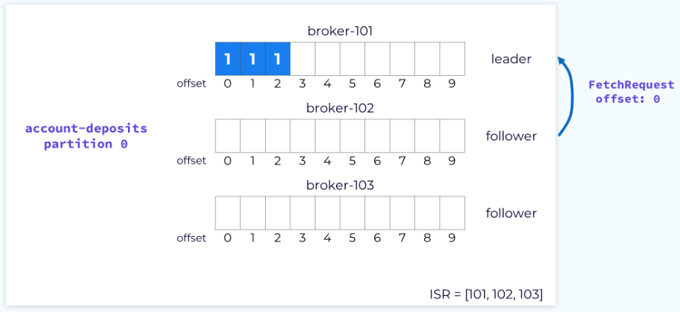
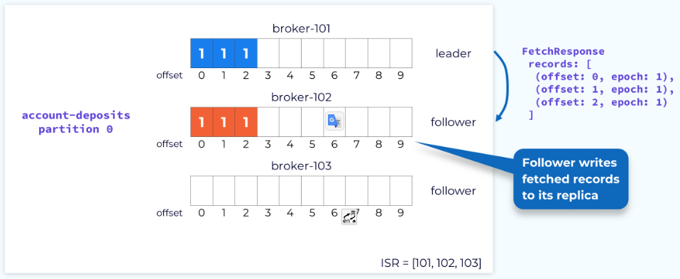
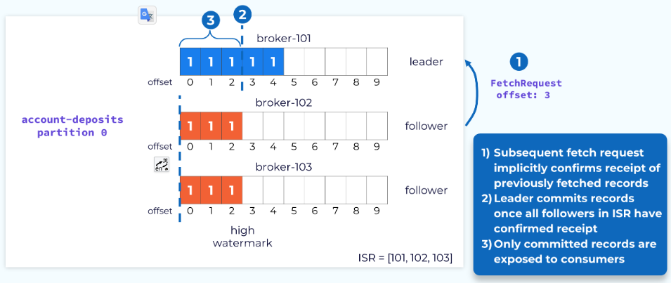
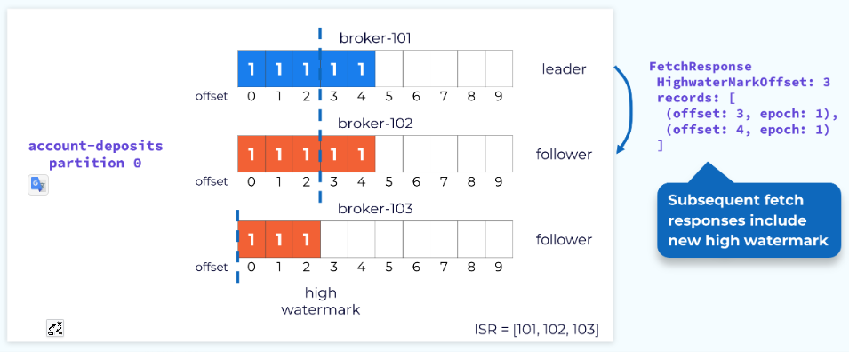
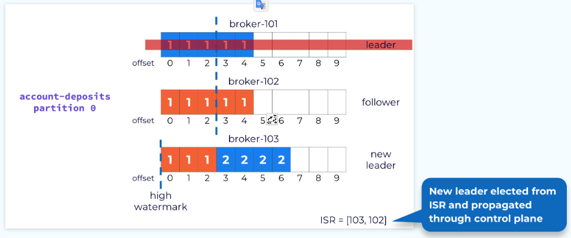
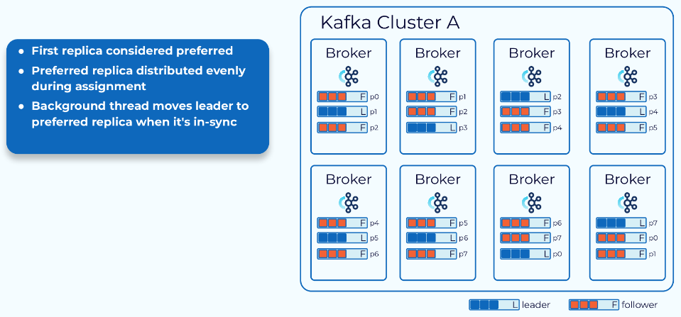

# 数据平面：Replication Protocol

### Kafka 数据复制

在本模块中，我们将了解数据平面如何处理数据复制。数据复制是 Kafka 的一项关键功能，它使 Kafka 能够提供高耐久性和高可用性。我们在主题级别启用复制。当创建一个新主题时，我们可以明确指定或通过默认值设置我们需要多少副本。然后，该主题的每个分区将被复制相应的次数。这个数字被称为复制因子（replication factor）。当复制因子为 N 时，通常我们可以容忍 N-1 次故障，而不会丢失数据，并且能够保持可用性。

### Leader, Follower, and In-Sync Replica (ISR) List

一旦为主题中所有分区创建了副本，每个分区的一个副本将被指定为 leader 副本，持有该副本的 broker 将成为该分区的 leader。其余的副本将是 followers。生产者将数据写入 leader 副本，而 followers 将从 leader 中获取数据以保持同步。消费者通常也从 leader 副本中获取数据，但可以配置为从 followers 中获取。

分区 leader 以及所有已与 leader 同步的 followers 将成为同步副本集合（ISR）的成员。在理想情况下，所有副本都将成为 ISR 的一部分。

### Leader Epoch

每个 leader 都与一个唯一的、单调递增的数字相关联，这个数字称为 leader epoch。leader epoch 用于跟踪当该副本作为 leader 时所完成的工作，每当选举出新的 leader 时，leader epoch 会增加。leader epoch 对于诸如日志重调等操作非常重要，我们稍后将讨论。

### Follower Fetch Request

每当 leader 将新数据追加到其本地日志中时，followers 会向 leader 发出 fetch 请求，并传递它们需要从哪个偏移量开始获取数据。

### Follower Fetch Response

leader 将以从指定偏移量开始的记录响应 fetch 请求。fetch 响应还会包括每条记录的偏移量和当前的 leader epoch。然后，followers 会将这些记录追加到它们自己的本地日志中。

### Committing Partition Offsets

一旦 ISR 中的所有 followers 都已获取到特定偏移量之前的记录，这些记录将被视为已提交，并且对消费者可用。这通过高水位线（high watermark）来标识。

leader 通过 fetch 请求中发送的偏移量值了解 followers 获取的最高偏移量。例如，如果一个 follower 向 leader 发送了一个指定偏移量为 3 的 fetch 请求，leader 就知道该 follower 已经提交了所有到偏移量 3 之前的记录。一旦所有 followers 都达到了偏移量 3，leader 将相应地推进高水位线。

### Advancing the Follower High Watermark

leader 通过 fetch 响应通知 followers 当前的高水位线。由于这个过程是异步的，followers 的高水位线通常会滞后于 leader 持有的实际高水位线。

### Handling Leader Failure

如果 leader 发生故障，或者由于其他原因需要选择新的 leader，则会从 ISR 中选择一个 broker 作为新的 leader。领导选举和通知受影响的 followers 的过程由控制平面处理。对数据平面来说，重要的是在这个过程中没有数据丢失。这就是为什么新的 leader 只能从 ISR 中选择，除非主题被特别配置以允许选择未同步的副本。我们知道 ISR 中的所有副本都已与最新的已提交偏移量保持同步。

一旦选举出新的 leader，leader epoch 将会增加，新的 leader 将开始接受生产请求。

### Partition Leader Balancing

正如我们所看到的，包含 leader 副本的 broker 相较于 follower 副本需要做更多的工作。因此，最好避免将过多的 leader 副本集中在单个 broker 上。为此，Kafka 引入了首选副本（preferred replica）的概念。当创建一个主题时，每个分区的第一个副本被指定为首选副本。由于 Kafka 已经在努力将分区均匀地分布到可用的 brokers 上，这通常会导致 leader 的良好平衡。

由于各种原因发生的 leader 选举可能会导致 leader 落在非首选副本上，从而可能导致不平衡。因此，Kafka 会定期检查 leader 副本是否存在不平衡。它使用一个可配置的阈值来做出这个判断。如果发现不平衡，Kafka 会执行 leader 重新平衡操作，将 leader 恢复到首选副本上。

### 参考

[Data Plane: Replication Protocol](https://developer.confluent.io/courses/architecture/data-replication/)