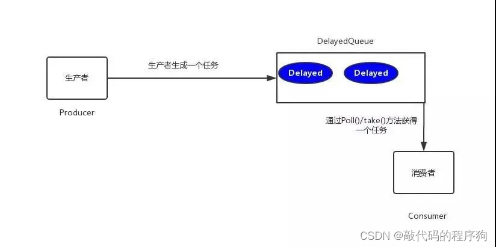
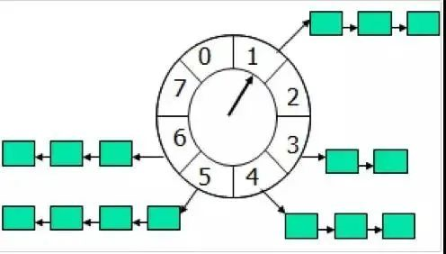
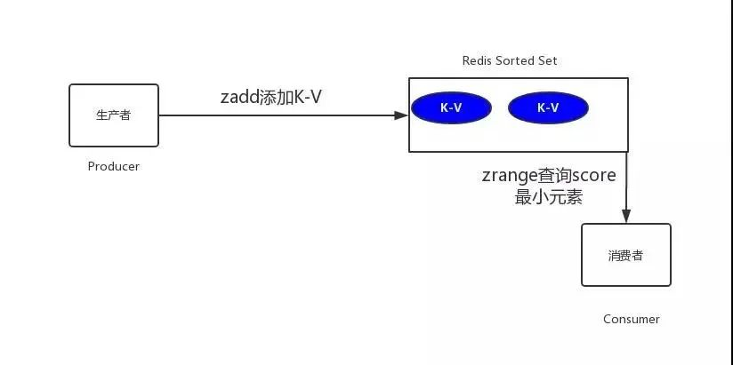
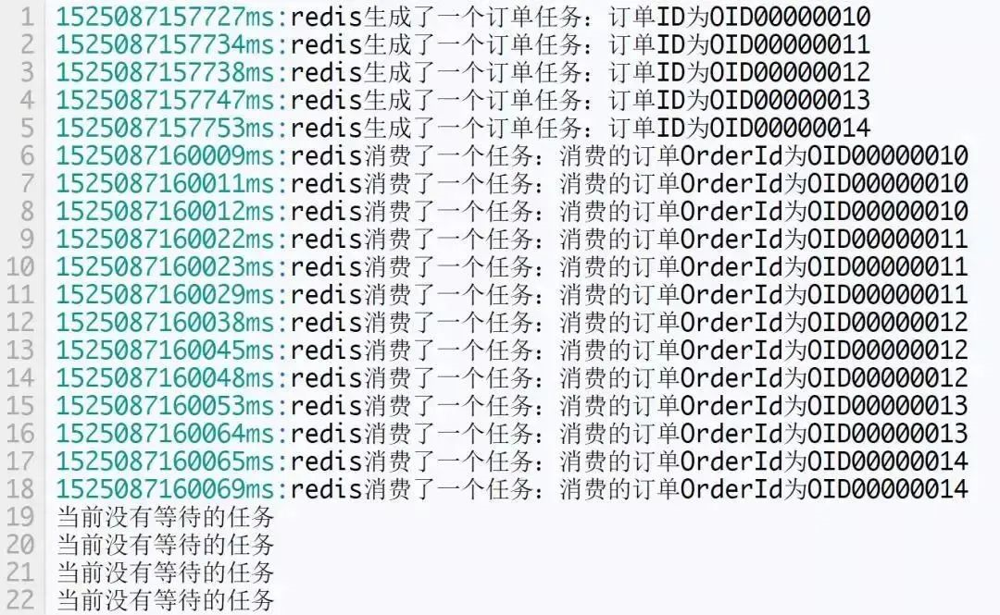
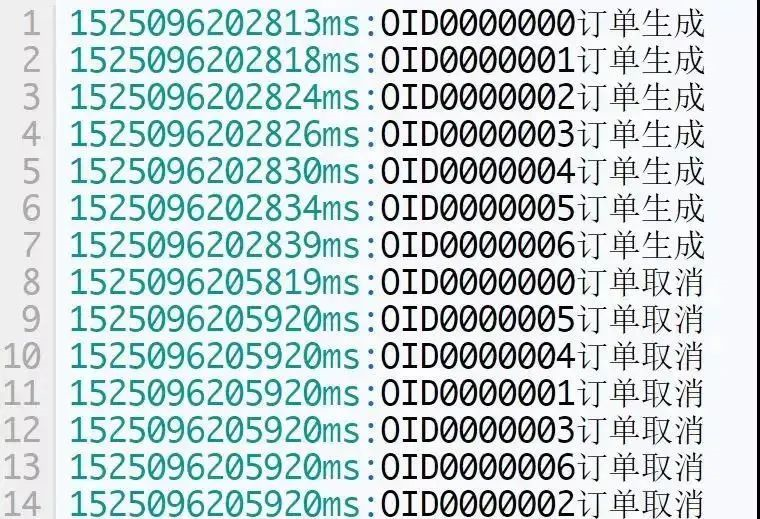

# 生成订单30分钟未支付，则自动取消，该怎么实现


## 了解需求

在开发中，往往会遇到一些关于`延时任务`的需求。

例如

- 生成订单 30 分钟未支付，则自动取消
- 生成订单 60 秒后,给用户发短信

对上述的任务，我们给一个专业的名字来形容，那就是`延时任务`。那么这里就会产生一个问题，这个`延时任务`和`定时任务`的区别究竟在哪里呢？一共有如下几点区别

定时任务有明确的触发时间，延时任务没有

`定时任务`有执行**周期**，而`延时任务`在某事件触发后一段时间内执行，**没有执行周期**

`定时任务`一般执行的是**批处理操作**是多个任务，而`延时任务`一般是单个任务

下面，我们以判断订单是否超时为例，进行方案分析


## 方案 1：数据库轮询


### 思路

该方案通常是在小型项目中使用，即通过一个线程定时的去扫描数据库，通过订单时间来判断是否有超时的订单，然后进行 update 或 delete 等操作


### 实现

可以用 quartz 来实现的，简单介绍一下

maven 项目引入一个依赖如下所示

```xml
<dependency>
    <groupId>org.quartz-scheduler</groupId>
    <artifactId>quartz</artifactId>
    <version>2.2.2</version>
</dependency>
```

调用 Demo 类 MyJob 如下所示

```java
package com.rjzheng.delay1;

import org.quartz.*;
import org.quartz.impl.StdSchedulerFactory;

public class MyJob implements Job {

    public void execute(JobExecutionContext context) throws JobExecutionException {
        System.out.println("要去数据库扫描啦。。。");
    }

    public static void main(String[] args) throws Exception {
        // 创建任务
        JobDetail jobDetail = JobBuilder.newJob(MyJob.class)
                .withIdentity("job1", "group1").build();
        // 创建触发器 每3秒钟执行一次
        Trigger trigger = TriggerBuilder
                .newTrigger()
                .withIdentity("trigger1", "group3")
                .withSchedule(
                        SimpleScheduleBuilder
                                .simpleSchedule()
                                .withIntervalInSeconds(3).
                                repeatForever())
                .build();
        Scheduler scheduler = new StdSchedulerFactory().getScheduler();
        // 将任务及其触发器放入调度器
        scheduler.scheduleJob(jobDetail, trigger);
        // 调度器开始调度任务
        scheduler.start();
    }

}
```

运行代码，可发现每隔 3 秒，输出如下

```shell
要去数据库扫描啦。。。
```


### 优点

简单易行，支持集群操作


### 缺点

- 对服务器内存消耗大
- 存在延迟，比如你每隔 3 分钟扫描一次，那最坏的延迟时间就是 3 分钟
- 假设你的订单有几千万条，每隔几分钟这样扫描一次，数据库损耗极大


## 方案 2：JDK 的延迟队列


### 思路

该方案是利用 JDK 自带的 DelayQueue 来实现，这是一个无界阻塞队列，该队列只有在延迟期满的时候才能从中获取元素，放入 DelayQueue 中的对象，是必须实现 Delayed 接口的。

DelayedQueue 实现工作流程如下图所示




其中 Poll():获取并移除队列的超时元素，没有则返回空

take():获取并移除队列的超时元素，如果没有则 wait 当前线程，直到有元素满足超时条件，返回结果。


### 实现

定义一个类 OrderDelay 实现 Delayed，代码如下

```java
package com.rjzheng.delay2;

import java.util.concurrent.Delayed;
import java.util.concurrent.TimeUnit;

public class OrderDelay implements Delayed {

    private String orderId;

    private long timeout;

    OrderDelay(String orderId, long timeout) {
        this.orderId = orderId;
        this.timeout = timeout + System.nanoTime();
    }

    public int compareTo(Delayed other) {
        if (other == this) {
            return 0;
        }
        OrderDelay t = (OrderDelay) other;
        long d = (getDelay(TimeUnit.NANOSECONDS) - t.getDelay(TimeUnit.NANOSECONDS));
        return (d == 0) ? 0 : ((d < 0) ? -1 : 1);
    }

    // 返回距离你自定义的超时时间还有多少
    public long getDelay(TimeUnit unit) {
        return unit.convert(timeout - System.nanoTime(), TimeUnit.NANOSECONDS);
    }

    void print() {
        System.out.println(orderId + "编号的订单要删除啦。。。。");
    }

}
```

运行的测试 Demo 为，我们设定延迟时间为 3 秒

```java
package com.rjzheng.delay2;

import java.util.ArrayList;
import java.util.List;
import java.util.concurrent.DelayQueue;
import java.util.concurrent.TimeUnit;

public class DelayQueueDemo {

    public static void main(String[] args) {
        List<String> list = new ArrayList<String>();
        list.add("00000001");
        list.add("00000002");
        list.add("00000003");
        list.add("00000004");
        list.add("00000005");

        DelayQueue<OrderDelay> queue = newDelayQueue < OrderDelay > ();
        long start = System.currentTimeMillis();
        for (int i = 0; i < 5; i++) {
            //延迟三秒取出
            queue.put(new OrderDelay(list.get(i), TimeUnit.NANOSECONDS.convert(3, TimeUnit.SECONDS)));
            try {
                queue.take().print();
                System.out.println("After " + (System.currentTimeMillis() - start) + " MilliSeconds");
            } catch (InterruptedException e) {
                e.printStackTrace();
            }
        }
    }

}
```

输出如下

```apache
00000001编号的订单要删除啦。。。。
After 3003 MilliSeconds
00000002编号的订单要删除啦。。。。
After 6006 MilliSeconds
00000003编号的订单要删除啦。。。。
After 9006 MilliSeconds
00000004编号的订单要删除啦。。。。
After 12008 MilliSeconds
00000005编号的订单要删除啦。。。。
After 15009 MilliSeconds
```

可以看到都是延迟 3 秒，订单被删除


### 优点

效率高,任务触发时间延迟低。


### 缺点

- 服务器重启后，数据全部消失，怕宕机
- 集群扩展相当麻烦
- 因为内存条件限制的原因，比如下单未付款的订单数太多，那么很容易就出现 OOM 异常
- 代码复杂度较高


## 方案 3：时间轮算法


### 思路

先上一张时间轮的图(这图到处都是啦)



时间轮算法可以类比于时钟，如上图箭头（指针）按某一个方向按固定频率轮动，每一次跳动称为一个 tick。这样可以看出定时轮由个 3 个重要的属性参数，ticksPerWheel（一轮的 tick 数），tickDuration（一个 tick 的持续时间）以及 timeUnit（时间单位），例如当 ticksPerWheel=60，tickDuration=1，timeUnit=秒，这就和现实中的始终的秒针走动完全类似了。

如果当前指针指在 1 上面，我有一个任务需要 4 秒以后执行，那么这个执行的线程回调或者消息将会被放在 5 上。那如果需要在 20 秒之后执行怎么办，由于这个环形结构槽数只到 8，如果要 20 秒，指针需要多转 2 圈。位置是在 2 圈之后的 5 上面（20 % 8 + 1）


### 实现

我们用 Netty 的 HashedWheelTimer 来实现

给 Pom 加上下面的依赖

```xml
<dependency>
    <groupId>io.netty</groupId>
    <artifactId>netty-all</artifactId>
    <version>4.1.24.Final</version>
</dependency>
```

测试代码 HashedWheelTimerTest 如下所示

```java
package com.rjzheng.delay3;

import io.netty.util.HashedWheelTimer;
import io.netty.util.Timeout;
import io.netty.util.Timer;
import io.netty.util.TimerTask;

import java.util.concurrent.TimeUnit;

public class HashedWheelTimerTest {

    static class MyTimerTask implements TimerTask {

        boolean flag;

        public MyTimerTask(boolean flag) {
            this.flag = flag;
        }

        public void run(Timeout timeout) throws Exception {
            System.out.println("要去数据库删除订单了。。。。");
            this.flag = false;
        }
    }

    public static void main(String[] argv) {
        MyTimerTask timerTask = new MyTimerTask(true);
        Timer timer = new HashedWheelTimer();
        timer.newTimeout(timerTask, 5, TimeUnit.SECONDS);
        int i = 1;
        while (timerTask.flag) {
            try {
                Thread.sleep(1000);
            } catch (InterruptedException e) {
                e.printStackTrace();
            }
            System.out.println(i + "秒过去了");
            i++;
        }
    }

}
```

输出如下

```undefined
1秒过去了
2秒过去了
3秒过去了
4秒过去了
5秒过去了
要去数据库删除订单了。。。。
6秒过去了
```


### 优点

效率高,任务触发时间延迟时间比 delayQueue 低，代码复杂度比 delayQueue 低。


### 缺点

- 服务器重启后，数据全部消失，怕宕机
- 集群扩展相当麻烦
- 因为内存条件限制的原因，比如下单未付款的订单数太多，那么很容易就出现 OOM 异常


## 方案 4：redis 缓存


### 思路一

利用 redis 的 zset,zset 是一个有序集合，每一个元素(member)都关联了一个 score,通过 score 排序来取集合中的值

添加元素:ZADD key score member [score member …]

按顺序查询元素:ZRANGE key start stop [WITHSCORES]

查询元素 score:ZSCORE key member

移除元素:ZREM key member [member …]

测试如下

```shell
添加单个元素
redis> ZADD page_rank 10 google.com
(integer) 1

添加多个元素
redis> ZADD page_rank 9 baidu.com 8 bing.com
(integer) 2

redis> ZRANGE page_rank 0 -1 WITHSCORES
1) "bing.com"
2) "8"
3) "baidu.com"
4) "9"
5) "google.com"
6) "10"

查询元素的score值
redis> ZSCORE page_rank bing.com
"8"

移除单个元素
redis> ZREM page_rank google.com
(integer) 1

redis> ZRANGE page_rank 0 -1 WITHSCORES
1) "bing.com"
2) "8"
3) "baidu.com"
4) "9"
```

那么如何实现呢？我们将订单超时时间戳与订单号分别设置为 score 和 member,系统扫描第一个元素判断是否超时，具体如下图所示




### 实现一

```java
package com.rjzheng.delay4;

import redis.clients.jedis.Jedis;
import redis.clients.jedis.JedisPool;
import redis.clients.jedis.Tuple;

import java.util.Calendar;
import java.util.Set;

public class AppTest {

    private static final String ADDR = "127.0.0.1";

    private static final int PORT = 6379;

    private static JedisPool jedisPool = new JedisPool(ADDR, PORT);

    public static Jedis getJedis() {
        return jedisPool.getResource();
    }

    //生产者,生成5个订单放进去
    public void productionDelayMessage() {
        for (int i = 0; i < 5; i++) {
            //延迟3秒
            Calendar cal1 = Calendar.getInstance();
            cal1.add(Calendar.SECOND, 3);
            int second3later = (int) (cal1.getTimeInMillis() / 1000);
            AppTest.getJedis().zadd("OrderId", second3later, "OID0000001" + i);
            System.out.println(System.currentTimeMillis() + "ms:redis生成了一个订单任务：订单ID为" + "OID0000001" + i);
        }
    }

    //消费者，取订单

    public void consumerDelayMessage() {
        Jedis jedis = AppTest.getJedis();
        while (true) {
            Set<Tuple> items = jedis.zrangeWithScores("OrderId", 0, 1);
            if (items == null || items.isEmpty()) {
                System.out.println("当前没有等待的任务");
                try {
                    Thread.sleep(500);
                } catch (InterruptedException e) {
                    e.printStackTrace();
                }
                continue;
            }
            int score = (int) ((Tuple) items.toArray()[0]).getScore();
            Calendar cal = Calendar.getInstance();
            int nowSecond = (int) (cal.getTimeInMillis() / 1000);
            if (nowSecond >= score) {
                String orderId = ((Tuple) items.toArray()[0]).getElement();
                jedis.zrem("OrderId", orderId);
                System.out.println(System.currentTimeMillis() + "ms:redis消费了一个任务：消费的订单OrderId为" + orderId);
            }
        }
    }

    public static void main(String[] args) {
        AppTest appTest = new AppTest();
        appTest.productionDelayMessage();
        appTest.consumerDelayMessage();
    }

}
```

此时对应输出如下



可以看到，几乎都是 3 秒之后，消费订单。

然而，这一版存在一个致命的硬伤，在高并发条件下，多消费者会取到同一个订单号，我们上测试代码 ThreadTest

```java
package com.rjzheng.delay4;

import java.util.concurrent.CountDownLatch;

public class ThreadTest {

    private static final int threadNum = 10;
    private static CountDownLatch cdl = newCountDownLatch(threadNum);

    static class DelayMessage implements Runnable {
        public void run() {
            try {
                cdl.await();
            } catch (InterruptedException e) {
                e.printStackTrace();
            }
            AppTest appTest = new AppTest();
            appTest.consumerDelayMessage();
        }
    }

    public static void main(String[] args) {
        AppTest appTest = new AppTest();
        appTest.productionDelayMessage();
        for (int i = 0; i < threadNum; i++) {
            new Thread(new DelayMessage()).start();
            cdl.countDown();
        }
    }

}
```

输出如下所示


显然，出现了多个线程消费同一个资源的情况。


### 解决方案

(1)用分布式锁，但是用分布式锁，性能下降了，该方案不细说。

(2)对 ZREM 的返回值进行判断，只有大于 0 的时候，才消费数据，于是将 consumerDelayMessage()方法里的

```reasonml
if(nowSecond >= score){
    String orderId = ((Tuple)items.toArray()[0]).getElement();
    jedis.zrem("OrderId", orderId);
    System.out.println(System.currentTimeMillis()+"ms:redis消费了一个任务：消费的订单OrderId为"+orderId);
}
```

修改为

```reasonml
if (nowSecond >= score) {
    String orderId = ((Tuple) items.toArray()[0]).getElement();
    Long num = jedis.zrem("OrderId", orderId);
    if (num != null && num > 0) {
        System.out.println(System.currentTimeMillis() + "ms:redis消费了一个任务：消费的订单OrderId为" + orderId);
    }
}
```

在这种修改后，重新运行 ThreadTest 类，发现输出正常了


### 思路二

该方案使用 redis 的 Keyspace Notifications，中文翻译就是键空间机制，就是利用该机制可以在 key 失效之后，提供一个回调，实际上是 redis 会给客户端发送一个消息。是需要 redis 版本 2.8 以上。


### 实现二

在 redis.conf 中，加入一条配置

notify-keyspace-events Ex

运行代码如下

```java
package com.rjzheng.delay5;

import redis.clients.jedis.JedisPool;
import redis.clients.jedis.JedisPubSub;

public class RedisTest {

    private static final String ADDR = "127.0.0.1";
    private static final int PORT = 6379;
    private static JedisPool jedis = new JedisPool(ADDR, PORT);
    private static RedisSub sub = new RedisSub();

    public static void init() {
        new Thread(new Runnable() {
            public void run() {
                jedis.getResource().subscribe(sub, "__keyevent@0__:expired");
            }
        }).start();
    }

    public static void main(String[] args) throws InterruptedException {
        init();
        for (int i = 0; i < 10; i++) {
            String orderId = "OID000000" + i;
            jedis.getResource().setex(orderId, 3, orderId);
            System.out.println(System.currentTimeMillis() + "ms:" + orderId + "订单生成");
        }
    }

    static class RedisSub extends JedisPubSub {
        @Override
        public void onMessage(String channel, String message) {
            System.out.println(System.currentTimeMillis() + "ms:" + message + "订单取消");

        }
    }
}
```

输出如下



可以明显看到 3 秒过后，订单取消了

ps:redis 的 pub/sub 机制存在一个硬伤，官网内容如下

原:Because Redis Pub/Sub is fire and forget currently there is no way to use this feature if your application demands reliable notification of events, that is, if your Pub/Sub client disconnects, and reconnects later, all the events delivered during the time the client was disconnected are lost.

翻: Redis 的发布/订阅目前是即发即弃(fire and forget)模式的，因此无法实现事件的可靠通知。也就是说，如果发布/订阅的客户端断链之后又重连，则在客户端断链期间的所有事件都丢失了。因此，方案二不是太推荐。当然，如果你对可靠性要求不高，可以使用。


### 优点

(1) 由于使用 Redis 作为消息通道，消息都存储在 Redis 中。如果发送程序或者任务处理程序挂了，重启之后，还有重新处理数据的可能性。

(2) 做集群扩展相当方便

(3) 时间准确度高


### 缺点

需要额外进行 redis 维护


## 方案 5：使用消息队列


### 思路

我们可以采用 rabbitMQ 的延时队列。RabbitMQ 具有以下两个特性，可以实现延迟队列

RabbitMQ 可以针对 Queue 和 Message 设置 x-message-tt，来控制消息的生存时间，如果超时，则消息变为 dead letter

lRabbitMQ 的 Queue 可以配置 x-dead-letter-exchange 和 x-dead-letter-routing-key（可选）两个参数，用来控制队列内出现了 deadletter，则按照这两个参数重新路由。结合以上两个特性，就可以模拟出延迟消息的功能,具体的，我改天再写一篇文章，这里再讲下去，篇幅太长。


### 优点

高效,可以利用 rabbitmq 的分布式特性轻易的进行横向扩展,消息支持持久化增加了可靠性。


### 缺点

本身的易用度要依赖于 rabbitMq 的运维.因为要引用 rabbitMq,所以复杂度和成本变高。