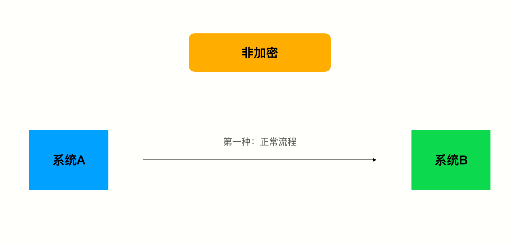
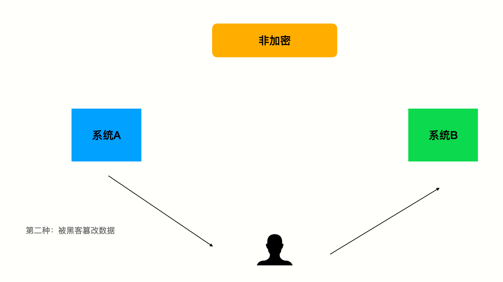
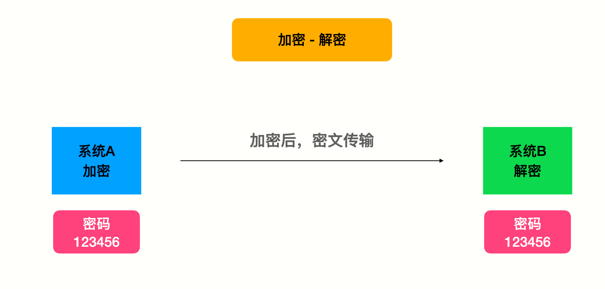
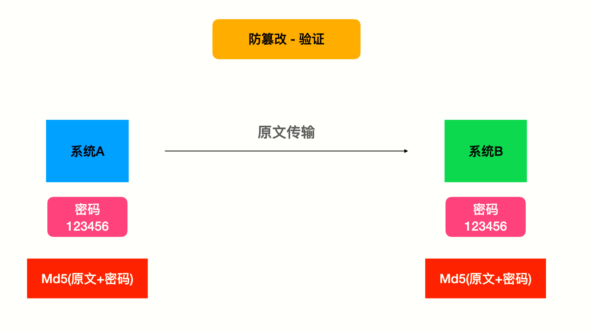
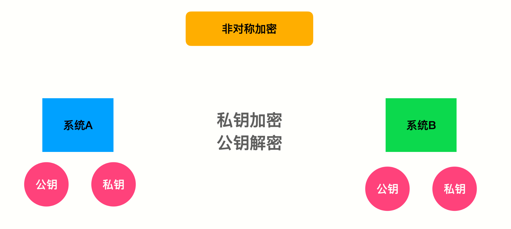
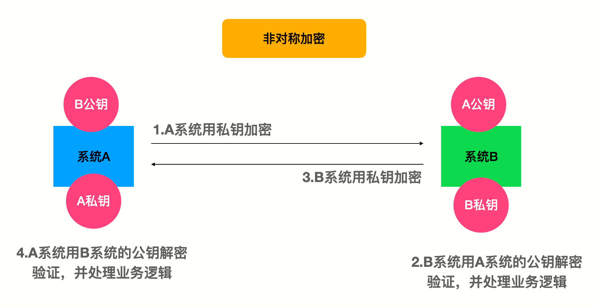

# Go语言操作支付宝


## 基础准备

### 支付宝开放平台

网页/移动应用开发 -> 创建应用

```
https://open.alipay.com/
```

### 秘钥工具

```
https://opendocs.alipay.com/common/02kkv7
```

### 沙箱环境

```
https://openhome.alipay.com/develop/sandbox/app
```

### 内网穿透

**ngrok** 官网

```
https://ngrok.com/download
```


## 如何保证数据安全

### 非加密





### 加密-解密



### 防篡改



### 非对称加密






