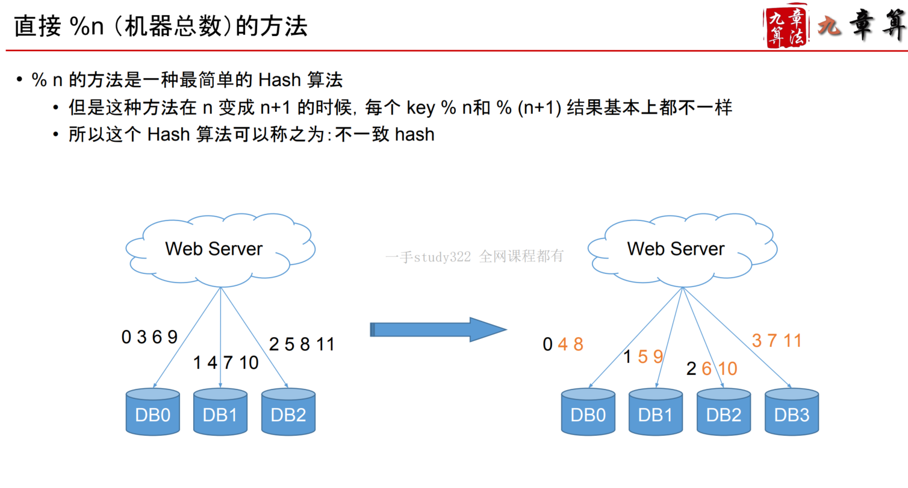
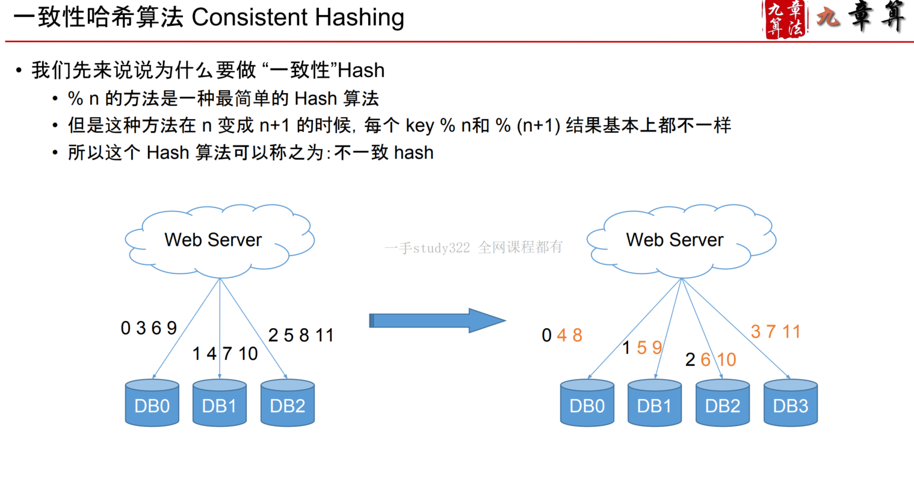
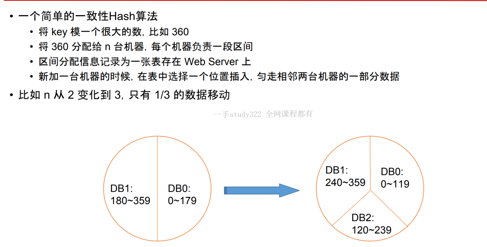
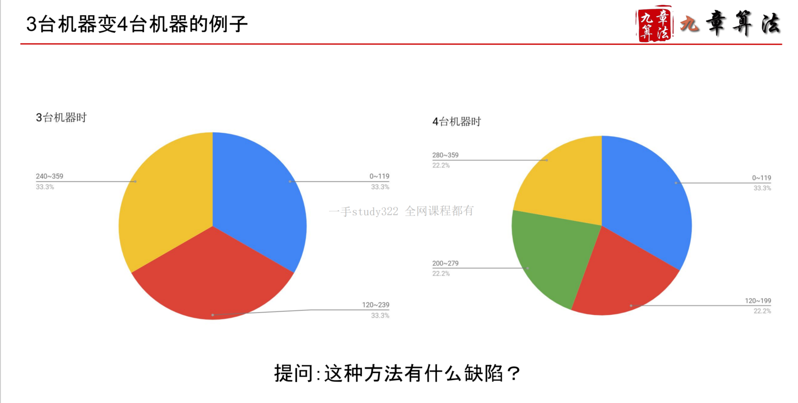
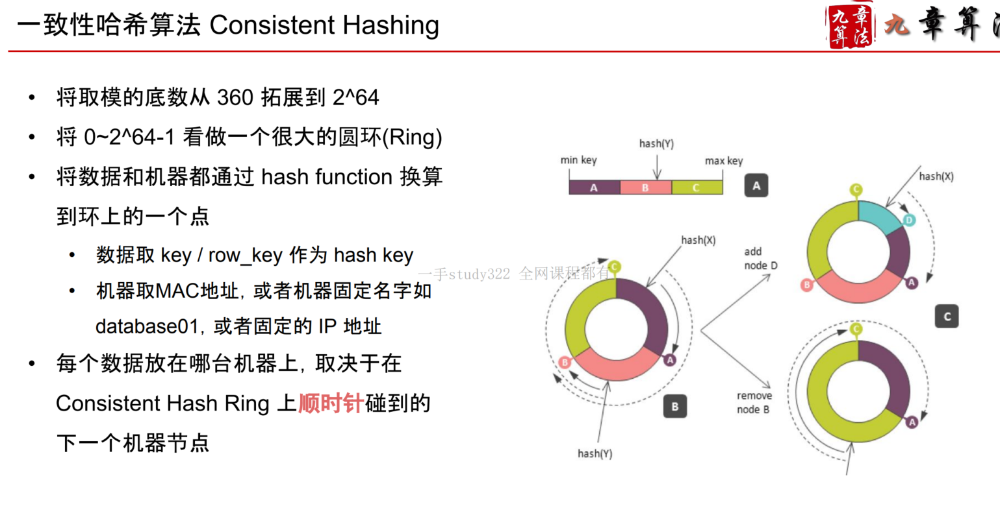
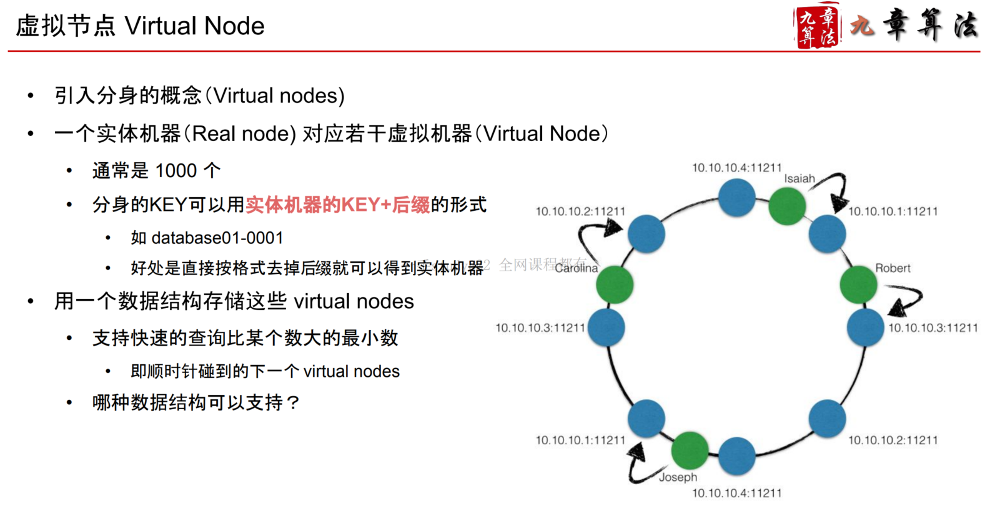
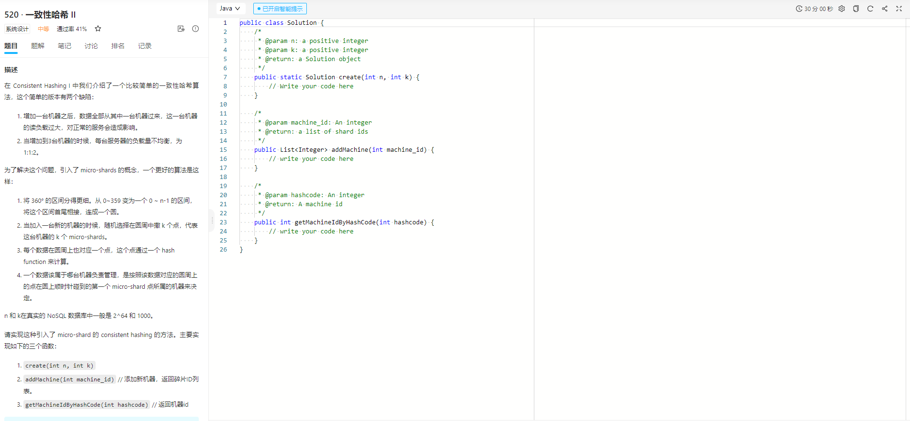
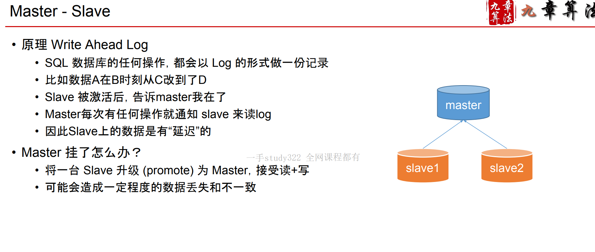
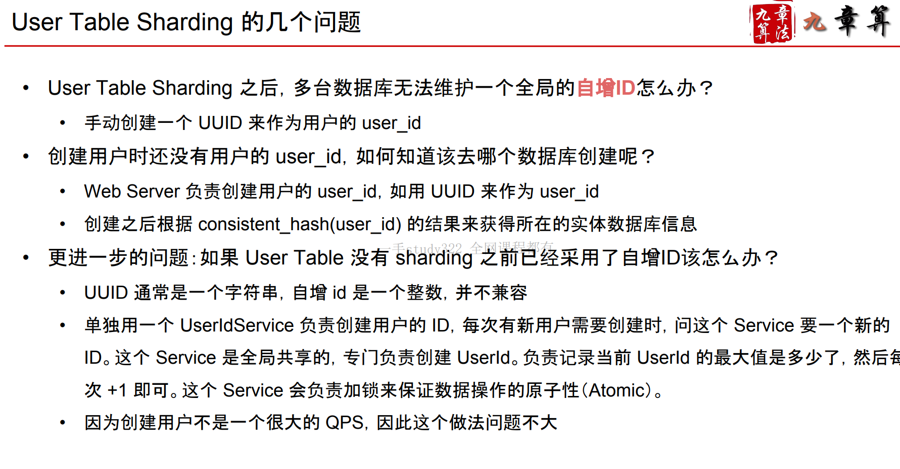
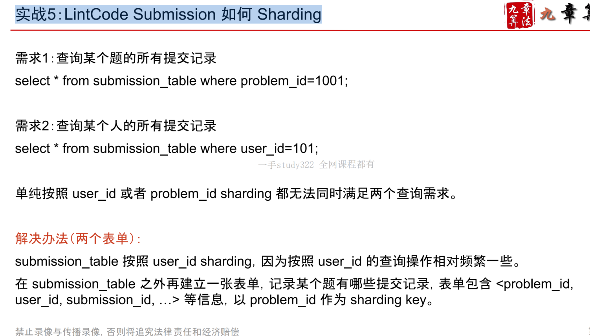

# 数据库拓展与一致性哈希算法

## 数据拆分 Sharding

纵向拆分 Vertical Sharding横向拆分 Horizontal Sharding

### 纵向拆分

**Vertical Sharding**

**User Table 放一台数据库**

**Friendship Table 放一台数据库**

**Message Table 放一台数据库**

**…**

#### 稍微复杂一点的 Vertical Sharding

比如你的 User Table 里有如下信息

- email
- username
- password
- nickname // 昵称
- avatar // 头像

我们知道 email / username / password 不会经常变动

而 **nickname**, **avatar** 相对来说变动频率更高

可以把他们拆分为两个表 **User Table** 和 **UserProfile Table**

- UserProfile 中用一个 user_id 的 foreign key 指向 User
- 然后再分别放在两台机器上
- 这样如果 **UserProfile Table** 挂了，就不影响 User 正常的登陆

#### Vertial Sharding 的缺点是什么？不能解决什么问题？

一个表非常大的时候。比如一个表只有两个column，一千万条数据。

### 横向切分 

**Horizontal Sharding**

#### 猜想1：新数据放新机器，旧数据放旧机器

比如一台数据库如果能放下 1T 的数据那么超过1T之后就放在第二个数据库里以此类推问：这种方法的问题是什么？

假设所有数据访问几率是相等的，但这个假设是错误的。

**参考：时间局部性**

#### 猜想2：对机器数目取模

假如我们来拆分 Friendship Table我们有 3 台数据库的机器于是想到按照 from_user_id % 3 进行拆分这样做的问题是啥？

问题是当增加机器的时候。

**假如 3 台机器不够用了**

我现在新买了1台机器原来的%3，就变成了%4几乎所有的数据都要进行位置大迁移

**过多的数据迁移会造成的问题**

1. **慢，容易㐀成数据的不一致性**
2. **迁移期间，服务器压力增大，容易挂**

## 一致性 Hash 算法Consistent Hashing

Horizontal Sharding 的秘密武器

**无论是 SQL 还是 NoSQL 都可以用这个方法进行 Sharding**

注：大部分 NoSQL 都帮你实现好了这个算法，帮你自动 Sharding很多 SQL 数据库也逐渐加入 Auto-scaling 的机制了，也开始帮你做自动的 Sharding

**缺陷1** **数据分布不均匀**

因为算法是“将数据最多的相邻两台机器均匀分为三台”比如，3台机器变4台机器时，无法做到4台机器均匀分布

**缺陷2 迁移压力大**

新机器的数据只从两台老机器上获取导致这两台老机器负载过大

### 哈希函数 Hash Function

将任意类型的 key 转换为一个 0~size-1 的整数在 Consistent Hashing 中，一般取 size = 2^64很多哈希算法可以保证不同的 key 算得相同的 hash 值的概率等于**宇宙爆炸的概率**

**新增一台机器**

创建对应的 1000 个分身 db99-000 ~ 999加入到 virtuals nodes 集合中问：该从哪些机器迁移哪些数据到新机器上？

Consistent Hashing http://www.lintcode.com/problem/consistent-hashing-ii/实现一遍，印象更深刻

## Backup 和 Replica 有什么区别

Backup

- 一般是周期性的，比如每天晚上进行一次备份
- 当数据丢失的时候，通常只能恢复到之前的某个时间点
- Backup 不用作在线的数据服务，不分摊读

Replica

- 是实时的， 在数据写入的时候，就会以复制品的形式存为多份
- 当数据丢失的时候，可以马上通过其他的复制品恢复
- Replica 用作在线的数据服务，分摊读

### MySQL Replica

以MySQL为代表SQL型数据库，通常“自带” Master Slave 的 Replica 方法Master 负责写，Slave 负责读Slave 从 Master 中同步数据

 

### Master - Slave

### NoSQL Replica

以 Cassandra 为代表的 NoSQL 数据库通常将数据“顺时针”存储在 Consistent hashing 环上的三个 virtual nodes 中

### SQL vs NoSQL in Replica

SQL

“自带” 的 Replica 方式是 Master Slave“

手动” 的 Replica 方式也可以在 Consistent Hashing 环上顺时针存三份

NoSQL

“自带” 的 Replica 方式就是 Consistent Hashing 环上顺时针存三份“手动” 的 Replica 方式：就不需要手动了，NoSQL就是在 Sharding 和 Replica 上帮你偷懒用的！

## 实战

### 实战1：User Table 如何 Sharding

如果我们在 SQL 数据库中存储 User Table那么按照什么做 Sharding ？

**怎么取数据就怎么拆数据**

**How to shard data based on how to query data**

**绝大多数请求：select * from user_table where user_id=xxx**

**问如果我需要按照 username 找用户怎么办？**

### 实战2: Friendship Table 如何 Sharding

双向好友关系是否还能只存储为一条数据？单向好友关系按照什么 sharding？

双向-->不能

### 实战3：Session Table 如何 Sharding

Session Table 主要包含 session_key(session token), user_id, expire_at 这几项

按照session_key Sharding

### 实战4：News Feed / Timeline 按照什么Sharding？

News Feed = 新鲜事列表

Timeline = 某人发的所有帖子

News Feed   ===》按owerId   Sharding

Timeline     ====》按userId

### 实战5：LintCode Submission 如何 Sharding

## 参考资料 & FAQ

Consistent Hashing

http://bit.ly/1XU9uZH

http://bit.ly/1KhqPEr

