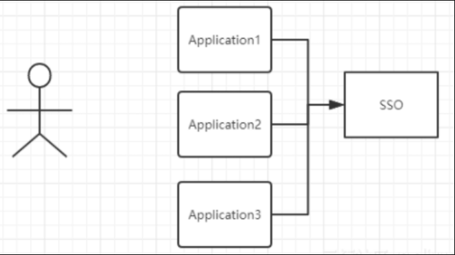
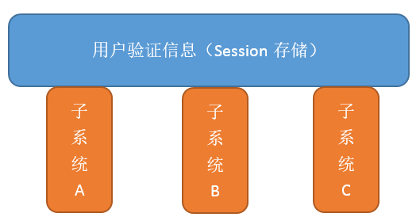
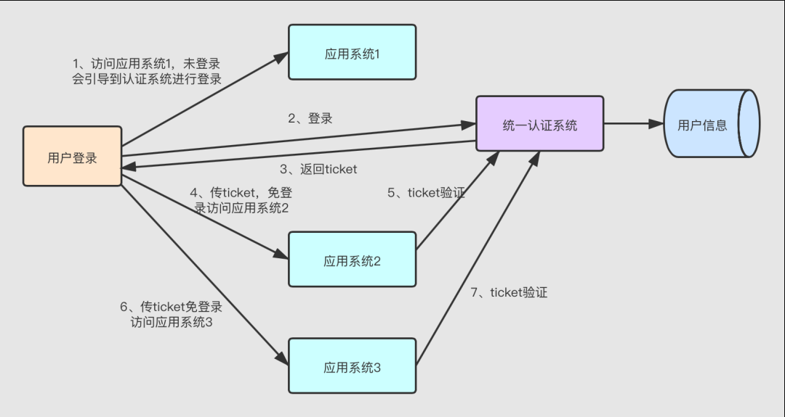
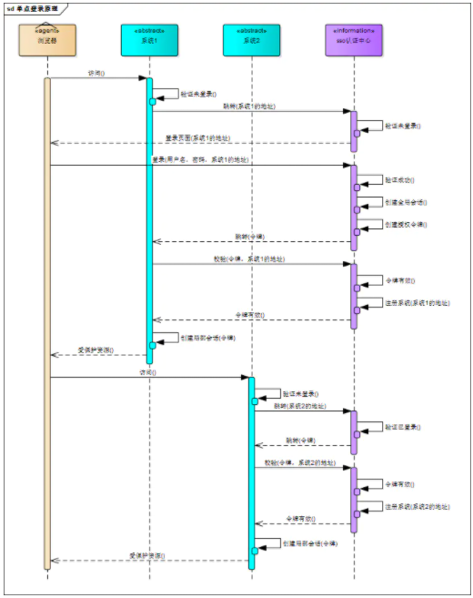
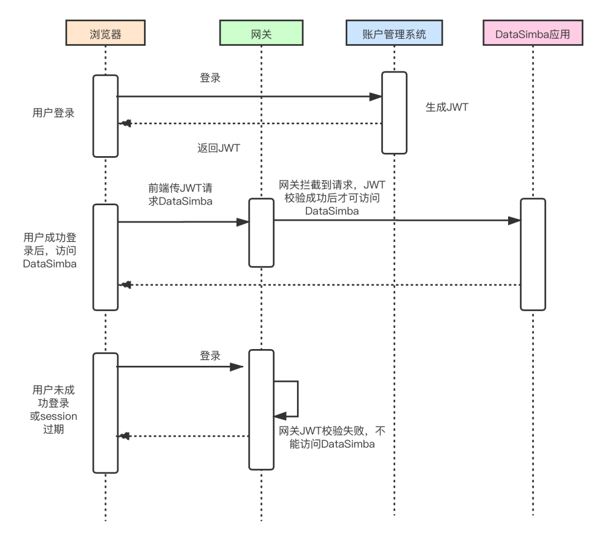
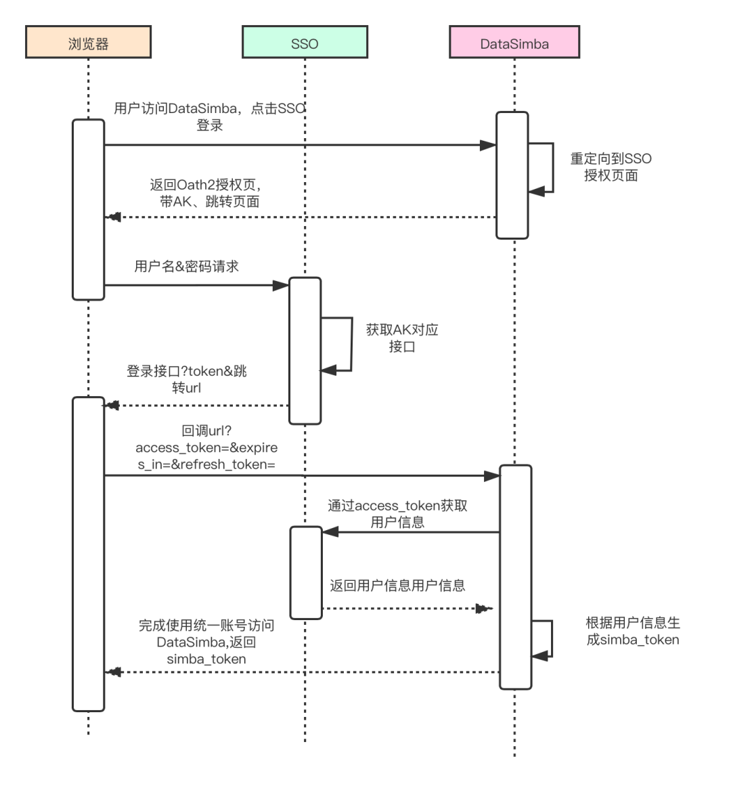
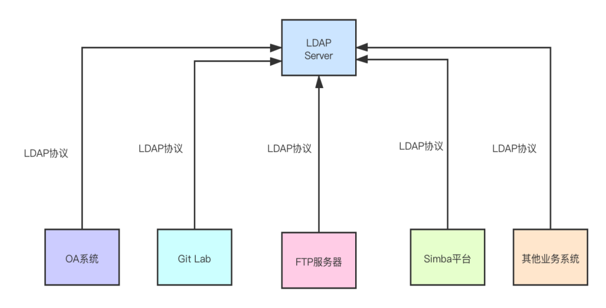

# 单点登录


## 什么事单点登录

单点登录（Single Sign On），简称为 SSO，是目前比较流行的企业业务整合的解决方案之一

SSO的定义是在多个应用系统中，用户只需要登录一次就可以访问所有相互信任的应用系统

SSO 一般都需要一个独立的认证中心（passport），子系统的登录均得通过`passport`，子系统本身将不参与登录操作

当一个系统成功登录以后，`passport`将会颁发一个令牌给各个子系统，子系统可以拿着令牌会获取各自的受保护资源，为了减少频繁认证，各个子系统在被`passport`授权以后，会建立一个局部会话，在一定时间内可以无需再次向`passport`发起认证



上图有四个系统，分别是`Application1`、`Application2`、`Application3`、和`SSO`，当`Application1`、`Application2`、`Application3`需要登录时，将跳到`SSO`系统，`SSO`系统完成登录，其他的应用系统也就随之登录了

**举个例子**

淘宝、天猫都属于阿里旗下，当用户登录淘宝后，再打开天猫，系统便自动帮用户登录了天猫，这种现象就属于单点登录


## **单点登录的实现方案**


### **基于 Cookie 的单点登录**

基于 Cookie 的单点登录是最简单的单点登录实现方式，它使用 Cookie 作为媒介，存放用户凭证。

用户登录父应用之后，应用返回一个加密的 Cookie，用户访问子应用的时候，携带上这个 Cookie，授权应用解密 Cookie 并进行校验，校验通过则登录当前用户。

这种方式虽然实现简单，但 Cookie 不够安全，容易泄漏，且不能跨域实现免登。


### **分布式 Session 实现单点登录**

分布式 Session 实现单点登录原理是将用户认证信息保存于 Session 中，即以 Session 内存储的值为用户凭证，一般采用 Cache 中间件实现（如 Redis）。用户再次登录时，应用服务端获取分布式 Session 来校验用户信息。如图所示：



一般情况下都是基于 Redis 实现 Session 共享，将 Session 存储于 Redis 上，然后将整个系统的全局 Cookie Domain 设置于顶级域名上，这样 SessionID 就能在各个子系统间共享。

这种方式也有一个问题，共享 Session 无法处理跨顶级域名。


### **统一认证授权方式实现单点登录**


  由图可知，通过统一认证授权方式实现单点登录，需要有一个独立的认证系统。

用户第一次访问应用系统时，由于还未登录，被引导到认证系统中进行登录，认证系统接受用户名密码等安全信息，生成访问令牌（ticket）。用户通过 ticket 访问应用系统，应用系统接受到请求之后会访问认证系统检查 ticket 的合法性，如果检查通过，用户就可以在不用再次登录的情况下访问应用系统资源。


### 不同域名下的单点登录(一)

如果是不同域的情况下，`Cookie`是不共享的，这里我们可以部署一个认证中心，用于专门处理登录请求的独立的 `Web `服务

用户统一在认证中心进行登录，登录成功后，认证中心记录用户的登录状态，并将 `token` 写入 `Cookie`（注意这个 `Cookie `是认证中心的，应用系统是访问不到的）

应用系统检查当前请求有没有 `Token`，如果没有，说明用户在当前系统中尚未登录，那么就将页面跳转至认证中心

由于这个操作会将认证中心的 `Cookie` 自动带过去，因此，认证中心能够根据 `Cookie` 知道用户是否已经登录过了

如果认证中心发现用户尚未登录，则返回登录页面，等待用户登录

如果发现用户已经登录过了，就不会让用户再次登录了，而是会跳转回目标 `URL `，并在跳转前生成一个 `Token`，拼接在目标` URL` 的后面，回传给目标应用系统

应用系统拿到 `Token `之后，还需要向认证中心确认下 `Token` 的合法性，防止用户伪造。确认无误后，应用系统记录用户的登录状态，并将 `Token `写入` Cookie`，然后给本次访问放行。（注意这个 `Cookie` 是当前应用系统的）当用户再次访问当前应用系统时，就会自动带上这个 `Token`，应用系统验证 Token 发现用户已登录，于是就不会有认证中心什么事了

此种实现方式相对复杂，支持跨域，扩展性好，是单点登录的标准做法


### 不同域名下的单点登录(二)

可以选择将 `Session ID` （或 `Token` ）保存到浏览器的 `LocalStorage` 中，让前端在每次向后端发送请求时，主动将`LocalStorage`的数据传递给服务端

这些都是由前端来控制的，后端需要做的仅仅是在用户登录成功后，将 `Session ID `（或 `Token `）放在响应体中传递给前端

单点登录完全可以在前端实现。前端拿到 `Session ID `（或 `Token` ）后，除了将它写入自己的 `LocalStorage` 中之外，还可以通过特殊手段将它写入多个其他域下的 `LocalStorage` 中

关键代码如下：

```
// 获取 token
var token = result.data.token;
 
// 动态创建一个不可见的iframe，在iframe中加载一个跨域HTML
var iframe = document.createElement("iframe");
iframe.src = "http://app1.com/localstorage.html";
document.body.append(iframe);
// 使用postMessage()方法将token传递给iframe
setTimeout(function () {
    iframe.contentWindow.postMessage(token, "http://app1.com");
}, 4000);
setTimeout(function () {
    iframe.remove();
}, 6000);
 
// 在这个iframe所加载的HTML中绑定一个事件监听器，当事件被触发时，把接收到的token数据写入localStorage
window.addEventListener('message', function (event) {
    localStorage.setItem('token', event.data)
}, false);
```


前端通过 `iframe`+`postMessage()` 方式，将同一份 `Token` 写入到了多个域下的 `LocalStorage` 中，前端每次在向后端发送请求之前，都会主动从 `LocalStorage` 中读取`Token`并在请求中携带，这样就实现了同一份` Token` 被多个域所共享

此种实现方式完全由前端控制，几乎不需要后端参与，同样支持跨域


### 流程

单点登录的流程图如下所示：



- 用户访问系统1的受保护资源，系统1发现用户未登录，跳转至sso认证中心，并将自己的地址作为参数
- sso认证中心发现用户未登录，将用户引导至登录页面
- 用户输入用户名密码提交登录申请
- sso认证中心校验用户信息，创建用户与sso认证中心之间的会话，称为全局会话，同时创建授权令牌
- sso认证中心带着令牌跳转会最初的请求地址（系统1）
- 系统1拿到令牌，去sso认证中心校验令牌是否有效
- sso认证中心校验令牌，返回有效，注册系统1
- 系统1使用该令牌创建与用户的会话，称为局部会话，返回受保护资源
- 用户访问系统2的受保护资源
- 系统2发现用户未登录，跳转至sso认证中心，并将自己的地址作为参数
- sso认证中心发现用户已登录，跳转回系统2的地址，并附上令牌
- 系统2拿到令牌，去sso认证中心校验令牌是否有效
- sso认证中心校验令牌，返回有效，注册系统2
- 系统2使用该令牌创建与用户的局部会话，返回受保护资源

用户登录成功之后，会与`sso`认证中心及各个子系统建立会话，用户与`sso`认证中心建立的会话称为全局会话

用户与各个子系统建立的会话称为局部会话，局部会话建立之后，用户访问子系统受保护资源将不再通过`sso`认证中心

全局会话与局部会话有如下约束关系：

- 局部会话存在，全局会话一定存在
- 全局会话存在，局部会话不一定存在
- 全局会话销毁，局部会话必须销毁


## 具体场景

以上介绍了单点登录常见的 几种实现方案，在实际应用中还需要根据具体场景来实现。

接下来通过几个实际生产场景，来阐述单点登录的详细实现方案。


### **使用 JWT 实现单点登录**

**（完全跨域方案）**

JWT （JSON Web Token）是一个开放标准（RFC7519），它是一个含签名并携带用户相关信息的加密串。页面请求校验登录接口时，请求头中携带 JWT 串到后端服务，后端通过签名加密串匹配校验，保证信息未被篡改，校验通过则认为是可靠的请求，将正常返回数据。


DataSimba（奇点云数据中台产品）结合 JWT 与分布式 session，实现多域多空间单点登录。通过 JWT 生成和校验令牌，将刷新令牌存储在 redis 中，网关统一校验令牌，校验通过后将用户信息设置在请求头中，应用在拦截器中获取到用户信息后即可验证通过。


不同域中的 DataSimba 共用一套密钥并且实时同步用户信息，通过 JWT 生成和校验令牌，用户登录其中一个域后，前端获取 JWT 加密串并存储在 Local Storage 中，当用户切换到其他域时前端传入加密串，后端网关校验，由此实现免登录访问其他域资源，如下图所示：




### **使用 OAuth2.0 实现单点登录**

OAuth 2.0 是一种认证授权机制，主要用来颁发令牌（token），OAuth 的核心就是向第三方应用颁发令牌，OAuth2.0 就是对应上文 2.3（统一认证授权方式实现单点登录）中的认证系统。

OAuth 在“客户端”与“服务端”之间，设置了一个授权层（Authorization Layer）, “客户端”通过登录授权层获取令牌，通过令牌即可访问服务端资源。

OAuth2.0 单点登录流程同上文介绍的“统一认证授权方式”流程一致：用户首次访问服务端资源时未登录，被引导到认证系统中进行登录授权，登录成功后获取令牌，用户获取令牌后可以通过令牌获取用户信息。客户端必须获取到用户授权，才能获取令牌。

OAuth2.0 定义了 4 种授权方式：

```
授权码模式（authorization code）简化模式（implicit）密码模式（resource owner password credentials）客户端模式（client credentials）
```

DataSimba 通过简化模式获取令牌，使用 OAuth2.0 实现单点登录时序图如下：



通过 OAuth2.0 认证实现单点登录，为开发人员提供了一个通用的身份验证框架，提高开发人员的效率，解决了跨顶级域名单点登录问题。


### **集成 LDAP 实现统一认证登录**

LDAP（Lightweight Directory Access Protocol），它是基于 X.500 标准的轻量级目录访问协议。LDAP 目录服务是由目录数据库和一套访问协议组成的系统。

日常办公经常会有多套系统，如果各个系统各自维护一套用户认证，用户需要记住多个用户名密码。系统各自管理用户认证的方式，不但会有重复建设的问题，用户体验也会差——经常会有用户忘记密码的情况。通过 LDAP，我们可以管理企业级账号，认证用户名密码，实现统一账号登录，只需一个用户名密码就可以登录所有系统。

LDAP 作为统一登录认证架构图如下：



LDAP 主要是用来实现统一身份认证的技术，目前市面上大部分的开源系统都支持 LDAP，因此通过 LDAP 能够统一管理和维护公司的账号，极大地提高了运维的工作效率。

在实际应用中，奇点云的数据中台产品 DataSimba 也通过单点登录实现了多域多空间的访问。用户登录 DataSimba 某一个域后，无需再次登录，即可方便地切换到其他域。

以一个国内大型饮料集团客户为例，DataSimba 使用 JWT+Session 共享方式实现跨域单点登录，通过 OAuth2.0 对接其统一认证平台，实现统一账号单点登录。

 

实现单点登录的技术方案很多，但没有哪种方案可以完美解决所有问题。我们需要针对具体应用场景来制定最优解决方案。


  