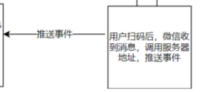

# 实现第三方登陆：微信扫码登录

>[实现第三方登陆：微信扫码登录 (spring boot)](https://segmentfault.com/a/1190000043395324)


## 前言

各种官方网站通常都会有app、微信公众号等。比如央视网，银行等。

当我们关注公众号或者app后，这些应用就可以在移动端方便地将信息推送给用户。

统一各产品线的账号体系，实现一个账号处处使用的目标是非常有必要的。

于是有需求：**可以实现微信扫码登陆。**

## 微信对接

通常网站与个人微信的对接有两种方式：

### 第一种是Oauth2登陆：

用户通过扫描网站的二维码， 授权公开信息，如昵称、头像等。便可以成功登陆网站。

例如在爱奇艺网站扫描二维码登陆后，授权给网站，之后成功登陆爱奇艺。


登陆完之后，微信会提示信息。


### 第二种是关注微信公众号

网站自己弹出一个二维码，扫描二维码后弹出公众号的关注界面、只要一关注公众号网站自动登录、第二次扫描登录的时候网站直接登录。

例如这种，[随便找的网站](https://link.segmentfault.com/?enc=xDPR9xsAe4FeuziLo%2F2Fsg%3D%3D.Q6ugeMpIV3m9mSQtMfVYWtlLAsHLYrXK1Mf%2FKOQubfs%3D)。
扫码后跳到公众号，关注后自动登陆。


------

**这两种扫码登陆方法，对应微信提供的两种开发方式**

一种是基于微信公众平台的扫码登录，另一种是基于微信开放平台的扫码登录。

> 微信开放平台就是为了让第三方应用投入微信的怀抱而设计的，这第三方应用指的是比如android、ios、网站、系统等；
> 引用
> 微信公众平台就是为了让程序员小伙伴利用微信自家技术(公众号、小程序)开发公众号、小程序而准备的。

微信开放平台入口：[https://open.weixin.qq.com/](https://link.segmentfault.com/?enc=AqLROzrqyuLPypWTnoWjig%3D%3D.RiK%2FpnwmdEO6OW2EukgZTewAr9Pt4Zwsk6jWfExDsIs%3D)

微信公众平台入口：[https://mp.weixin.qq.com/](https://link.segmentfault.com/?enc=VeNvh%2FX6NZ8SN2AZYBCR3g%3D%3D.TdGuu7Zhk%2FZlX%2FWftSYuGoaIc29dZ1uev5F4ewShj%2FM%3D)


**两者使用微信扫码登录的区别：**

微信开放平台需要开企业认证才能注册。比较难申请

微信公众平台需要认证微信服务号，才能进行扫码登录的开发。只需申请一个公众号。

下面采用第二种。


## 后台与公众号配置

后台使用的是spring boot，前台用的angular。

这里引入github一个公众号开发工具包
[github仓库](https://link.segmentfault.com/?enc=NeMqOlxsaevvOP8ihK5I1g%3D%3D.w4l%2FhmLP6uLaZzEAuzFjw9zAmfkJGfi6WsKZPM25O1uqj0six1li83PDNIph4g7%2B)

后台pom.xml依赖:

```html
   <dependency>
        <groupId>com.github.binarywang</groupId>
        <artifactId>weixin-java-mp</artifactId>
        <version>4.4.0</version>
    </dependency>


    <dependency>
        <groupId>com.github.binarywang</groupId>
        <artifactId>wx-java-mp-spring-boot-starter</artifactId>
        <version>4.4.0</version>
    </dependency>
```

### 1.申请一个公众号。若无，可用测试公众号。

[微信公众平台接口测试帐号申请](https://link.segmentfault.com/?enc=lOuATAJbYGPR4pwUEbBeKw%3D%3D.yUQ0JB3%2FbazZnV9QGQAE0dNYj17uivrJ%2FebK4QeEniBUZleorFhvgmSt7RhbqmkexUW%2BVDXudkCZTZdk736tHw%3D%3D)

### 2.配置服务器信息

URL为开发者服务器的接口地址，微信服务器通过该接口与开发者服务器建立连接。Token可由开发者可以任意填写，用作生成签名（该Token会和接口URL中包含的Token进行比对，从而验证安全性）
若是没有服务器，可以用ngrok进行内网穿透，免费好用。这里用的就是ngrok


### 3.配置后台:

```yaml
# 公众号配置(必填)
wx:
  mp:
    appid: wxaf7fe05a8xxxxxxxxx
    secret: 57b48fcec2d5db1axxxxxxxxxxx
    token: yunzhi
    aesKey: 123
```

```java
@Service
public class WeChatMpService extends WxMpServiceImpl {

  @Autowired
  private WxMpConfig wxMpConfig;

  @PostConstruct
  public void init() {
    final WxMpDefaultConfigImpl config = new WxMpDefaultConfigImpl();
    // 设置微信公众号的appid
    config.setAppId(this.wxMpConfig.getAppid());
    // 设置微信公众号的app corpSecret
    config.setSecret(this.wxMpConfig.getAppSecret());
    // 设置微信公众号的token
    config.setToken(this.wxMpConfig.getToken());
    // 设置消息加解密密钥
    config.setAesKey(this.wxMpConfig.getAesKey());
    super.setWxMpConfigStorage(config);
  }
}
```

### 4.验证服务器地址的有效性

开发者提交信息后，**微信服务器将发送GET请求**到刚才填写的服务器地址URL上，

**经过确认后，需要向微信服务器原样返回echostr参数内容，接入才生效，否则接入失败。**

例如，微信服务器未正确收到返回信息，显示配置失败。


GET请求携带参数如下表所示：

| 参数      | 描述                                                         |
| --------- | ------------------------------------------------------------ |
| signature | 微信加密签名，signature结合了开发者填写的 token 参数和请求中的 timestamp 参数、nonce参数 |
| timestamp | 时间戳                                                       |
| nonce     | 随机数                                                       |
| echostr   | 随机字符串                                                   |

验证签名的主要代码:

用的验证签名的函数是weixin-java-mp包提供的。

```typescript
@RequestMapping("wechat")
@RestController
public class WechatController {
 
  @Autowired
  WeChatMpService weChatMpService;


  /*
   * @param signature 微信加密签名，signature结合了开发者填写的 token 参数和请求中的 timestamp 参数、nonce参数。
   * @param timestamp 时间戳
   * @param nonce     这是个随机数
   * @param echostr   随机字符串，验证成功后原样返回
   */
  @GetMapping
  public void get(@RequestParam(required = false) String signature,
                  @RequestParam(required = false) String timestamp,
                  @RequestParam(required = false) String nonce,
                  @RequestParam(required = false) String echostr,
                  HttpServletResponse response) throws IOException {
    if (!this.weChatMpService.checkSignature(timestamp, nonce, signature)) {
      this.logger.warn("接收到了未通过校验的微信消息，这可能是token配置错了，或是接收了非微信官方的请求");
      return;
    }
    response.setCharacterEncoding("UTF-8");
    response.getWriter().write(echostr);
    response.getWriter().flush();
    response.getWriter().close();
  }
}
```


## 扫码登录的开发

先来看一下大致流程


### 1.向微信服务器发送请求，获取access_token。


[微信请求access_token文档](https://link.segmentfault.com/?enc=9pi0vWVAd8hCg1fUHnysBg%3D%3D.GQlke%2B2kHYDsBxl%2FFejHYy2bHZpsapl0A8yOAIcy3K06gdAcD%2F42RoCbWEjqyfCI7n55W1rrActvAJAOzoOslv2RN6xvJuG7LCoJGbx9Vmx%2Bzv2kYZQhUKj%2Fl2nj%2F24p)

> access_token是公众号的全局唯一接口调用凭据，公众号调用各接口时都需使用access_token。开发者需要进行妥善保存。access_token的存储至少要保留512个字符空间。access_token的有效期目前为2个小时，需定时刷新，重复获取将导致上次获取的access_token失效。

url(1)请求示例地址: [https://api.weixin.qq.com/cgi...](https://link.segmentfault.com/?enc=82TssKjHSC%2B05a9g%2BbI27Q%3D%3D.0NNcr5Qy56U9DSTP8KUtiqNVwq3ZkF26s9Z46KcfD9X9kBhyewwyK%2FMvR0xKaHIEaoBy50HVRogZALHqbnkGw%2B%2BtWKohRkzENQK%2BIgC8ue%2FsjrwqmicPRjojTwR%2BonX8Bp%2BJNzp5zq2BV0ULV6sZPA%3D%3D)

所以假如直接对微信文档开发的话，需要先请求access_token。

**但用了weixin-java-mp包，会帮我们做这件事。下面跳到下一步**


### 2.请求获取ticket，用于换取登陆二维码。


[微信获取二维码文档](https://link.segmentfault.com/?enc=siq8UO6IacU1R7fy6CY8NQ%3D%3D.NyRAuBsiQmd%2FKpYVc7jCDyxpoi3JNqKYjLvHDs8aiUwkbI2Eytw4RRE18mc6bKktqQDCn%2FdBG9aqsjJ%2FSPUhs%2BLeZblxt1fLsT0liDC3mfI58H6ThGXNnzVLgkPLSjhAFyJHAOALYggl2boLhfi%2FGA%3D%3D)

获取带参数的二维码的过程包括两步:

1. **首先创建二维码ticket**
2. **凭借 ticket 到指定 URL 换取二维码。**

> 目前有2种类型的二维码：
>
> - 临时二维码，有过期时间的，最长可以设置为在二维码生成后的30天后过期，能够生成较多数量。
> - 永久二维码，无过期时间的，数量较少（目前为最多10万个）。

临时二维码足以满足需求。

用包提供的方法获取ticket

```java
String qrUuid = UUID.randomUUID().toString();
WxMpQrCodeTicket wxMpQrCodeTicket = this.wxMpService.getQrcodeService().qrCodeCreateTmpTicket(qrUuid, 10 * 60);
```

每次创建二维码 ticket 需要提供一个开发者自行设定的参数（scene_id）, 这里用了随机生成的uuid。


### 3.用ticket向微信请求二维码。前端显示


[请求二维码文档](https://link.segmentfault.com/?enc=buyV%2FGkbdltXBquZsSG4IQ%3D%3D.Udwek%2FbYE7PT3le8%2FXWL2ArA%2B7xMXBJXLxv1Cbc5TQfrACgzjy%2Flw0%2BphRQJM%2BG12NKbLBJmM9RmxaPUFSTedUlgjgWbXJ%2Bi%2BsB8SIn%2B%2B49XMvtNaVCbnMNnnlQx1va0nKD9nGFqKKeedoev1sGUgg%3D%3D)

> 获取二维码 ticket 后，开发者可用 ticket 换取二维码图片。
> HTTP GET请求（请使用 https 协议）[https://mp.weixin.qq.com/cgi-...](https://link.segmentfault.com/?enc=KxJ9DaHPDiIIY2q3i9hLnw%3D%3D.ZlRQVe0nFZWh7o%2Fh1ypbdQCRNyGftNJ5vxD%2Bih60lYB4gGljU2h%2B%2Fgi82mW8XsjGOJOLbVtPXC0e4UqzM3wAaw%3D%3D)
> 提醒：TICKET记得进行UrlEncode

ticket正确情况下，http 返回码是200，是一张图片的url地址，可以直接展示或者下载。

使用包提供的方法进行请求获取

```javascript
String qrCodeUrl = this.wxMpService.getQrcodeService().qrCodePictureUrl(wxMpQrCodeTicket.getTicket());
```

之后返回给前端，前端用标签处理，作为src的值。

```javascript

```


### 4.用户扫描二维码，微信进行事件推送



微信用户使用公共号时可能会产生很多事件，例如

- 关注/取消关注事件
- 扫描带参数二维码事件
- 自定义菜单事件
- 点击菜单拉取消息时的事件推送
- 点击菜单跳转链接时的事件推送

而当前的场景就是**用户扫描带参数二维码事件**

**用户扫描带场景值二维码时，可能推送以下两种事件：**

- 如果用户还未关注公众号，则用户可以关注公众号，关注后微信会将带场景值关注事件推送给开发者。
- 如果用户已经关注公众号，则微信会将带场景值扫描事件推送给开发者。

[微信推送事件文档](https://link.segmentfault.com/?enc=vkH4rLGOvy955Lx8OQM9vg%3D%3D.Ftu9TKG6YVowl6fG3gUQ8A2zyYGk3r61ITIWG%2BfBR7u6Gz4ND0IQTXVJINNqSwhfLzmM62KBFYzafygLrMq%2Bdl5t6fv%2BaZhryyB8vXYFzbyGPviXUnncjdqISmu6o50m)

接受微信的事件推送：

```typescript
 /**
   * 当设置完微信公众号的接口后，微信会把用户发送的消息，扫码事件等推送过来
   *
   * @param signature 微信加密签名，signature结合了开发者填写的 token 参数和请求中的 timestamp 参数、nonce参数。
   * @param encType 加密类型（暂未启用加密消息）
   * @param msgSignature 加密的消息
   * @param timestamp 时间戳
   * @param nonce 随机数
   * @throws IOException
   */
  @PostMapping(produces = "text/xml; charset=UTF-8")
  public void api(HttpServletRequest httpServletRequest,
                  HttpServletResponse httpServletResponse,
                  @RequestParam("signature") String signature,
                  @RequestParam(name = "encrypt_type", required = false) String encType,
                  @RequestParam(name = "msg_signature", required = false) String msgSignature,
                  @RequestParam("timestamp") String timestamp,
                  @RequestParam("nonce") String nonce) throws IOException {
    if (!this.weChatMpService.checkSignature(timestamp, nonce, signature)) {
      this.logger.warn("接收到了未通过校验的微信消息，这可能是token配置错了，或是接收了非微信官方的请求");
      return;
    }
    BufferedReader bufferedReader = httpServletRequest.getReader();
    String str;
    StringBuilder requestBodyBuilder = new StringBuilder();
    while ((str = bufferedReader.readLine()) != null) {
      requestBodyBuilder.append(str);
    }
    String requestBody = requestBodyBuilder.toString();

    this.logger.info("\n接收微信请求：[signature=[{}], encType=[{}], msgSignature=[{}],"
                    + " timestamp=[{}], nonce=[{}], requestBody=[\\n{}\\n]",
            signature, encType, msgSignature, timestamp, nonce, requestBody);
}
```

### 5. 后台进行逻辑处理


微信推送给公众号的消息类型很多，而公众号也需要针对用户不同的输入做出不同的反应。

如果使用if ... else ...来实现的话非常难以维护，这时可以根据[weixin-java-mp开发文档](https://link.segmentfault.com/?enc=dlIZxX72qW%2FQ1Lv6XIOMww%3D%3D.vBDIFe2Gt4VsMPUfw03oruJBnN3GLod7E%2B8ZVyMSI9Wk%2FnNdaiEJnMyEmwfmVhnF%2FB5lrvTO28%2Bt%2BM6efk3eiHsyCvvjPx36xGn7rzIEd4Z%2FiokkPH0uSnT9oexd3tRqCqtDFKU0XjPD39pPEHl3Lg%3D%3D)，使用 `WxMpMessageRouter` 来对消息进行路由维护。

先写出几个事件的handler。比如扫码事件和关注事件。 源码在文末


```java
/**
 * 处理关注事件
 * 新用户走关注事件；老用户走扫码事件
 * @author Binary Wang
 */
@Component
public class SubscribeHandler extends AbstractHandler {
  private final WeChatMpService weChatMpService;
  private final WechatService wechatService;
  private final Logger logger = LoggerFactory.getLogger(this.getClass());

  public SubscribeHandler(WeChatMpService weChatMpService , WechatService wechatService) {
    super(weChatMpService);
    this.weChatMpService = weChatMpService;
    this.wechatService = wechatService;
  }

  @Override
  public WxMpXmlOutMessage handle(WxMpXmlMessage wxMessage,
                                  Map<String, Object> context,
                                  WxMpService wxMpService,
                                  WxSessionManager sessionManager) throws WxErrorException {
    this.logger.info("新关注用户 OPENID: " + wxMessage.getFromUser());
    if (this.logger.isDebugEnabled()) {
      this.logger.info("新关注用户 OPENID: " + wxMessage.getFromUser());
    }
    WeChatUser weChatUser = this.wechatService.getOneByOpenidAndAppId(wxMessage.getFromUser(), wxMessage.getToUser());
    if (wxMessage.getEventKey().startsWith("qrscene_")) {
      String key = wxMessage.getEventKey().substring("qrscene_".length());
      return this.handleByEventKey(key, weChatUser, wxMessage);
    }
    return new TextBuilder().build("感谢关注，祝您生活愉快!",
        wxMessage,
        weChatMpService);
  }
}
```

对写的几个handler进行路由注册

```java
private WxMpMessageRouter router;

 private void refreshRouter() {
    final WxMpMessageRouter newRouter = new WxMpMessageRouter(this);

    // 关注事件
     newRouter.rule().async(false).msgType(EVENT).event(SUBSCRIBE).handler(this.subscribeHandler).end();

    // 取消关注事件
     newRouter.rule().async(false).msgType(EVENT).event(UNSUBSCRIBE).handler(this.unsubscribeHandler).end();
    // 扫码事件 newRouter.rule().async(false).msgType(EVENT).event(SCAN).handler(this.scanHandler).end();

    // 默认
    newRouter.rule().async(false).handler(this.msgHandler).end();

    this.router = newRouter;
  }

/**
   * 微信事件通过这个入口进来
   * 根据不同事件，调用不同handler
   */
 public WxMpXmlOutMessage route(WxMpXmlMessage message) {
    try {
      return this.router.route(message);
    } catch (Exception e) {
      this.logger.error(e.getMessage(), e);
    }

    return null;
  }
```

------

现在已经配置好了，微信推送的扫码事件或者关注事件已经被我们定义的handler获取到了。

那么有下一个问题：**假如有多个用户同时在使用微信登录，我们怎么要推送给哪个客户端，让扫码成功的用户成功登陆呢？**


这时就需要在返回用户登陆二维码前，

- 记录该客户端的seesionId
- 同时添加一个key为sceneStr，value为自定义handler到hashmap中。

**这里的sceneStr为，前面获取ticket随机生成的场景值。**

微信推送给我们的消息中，就带有这个场景值。

[详细可见文档](https://link.segmentfault.com/?enc=LH1qiUOzudsqVCkzPcwsMw%3D%3D.W0zdIuJKsnV5C02TQvpMoso0w1BUfx46pR1%2BpkPR1%2Bv4aWYeuF90FirK5wkdjkFzHtbm8OxCXQozoQ0XRGHqdo6JpeixkqMML1RUf1fr8t1zwF%2FYORmSbm%2FpWm7JN9MgBtkOwcvWm8lwknMJtHfUIljji1Iw9u4unerftpnaGp8LvtZQjq8FhTYREb8RovbEfvyWjNoVPxmRYV76f8EhvvSqk%2BL8QQ6zW6PkzwH6%2FQI%3D)

这样就可以在扫码事件handler中， 调用这个自定义的handler，实现向指定客户端发送信息。


在返回二维码前，定义自定义handler

```typescript
 @Override
  public String getLoginQrCode(String wsLoginToken, HttpSession httpSession) {
    try {
      if (this.logger.isDebugEnabled()) {
        this.logger.info("1. 生成用于回调的uuid，请将推送给微信，微信当推送带有UUID的二维码，用户扫码后微信则会把带有uuid的信息回推过来");
      }
      String qrUuid = UUID.randomUUID().toString();
      WxMpQrCodeTicket wxMpQrCodeTicket = this.wxMpService.getQrcodeService().qrCodeCreateTmpTicket(qrUuid, 10 * 60);
      this.wxMpService.addHandler(qrUuid, new WeChatMpEventKeyHandler() {
        long beginTime = System.currentTimeMillis();
        private Logger logger = LoggerFactory.getLogger(this.getClass());

        @Override
        public boolean getExpired() {
          return System.currentTimeMillis() - beginTime > 10 * 60 * 1000;
        }

        /**
         * 扫码后调用该方法
         * @param wxMpXmlMessage 扫码消息
         * @param weChatUser 扫码用户
         * @return 输出消息
         */
        @Override
        public WxMpXmlOutMessage handle(WxMpXmlMessage wxMpXmlMessage, WeChatUser weChatUser) {
          if (this.logger.isDebugEnabled()) {
            this.logger.info("2. 用户扫描后触发该方法, 发送扫码成功的同时，将wsUuid与微信用户绑定在一起，用后面使用wsU");
          }
          String openid = wxMpXmlMessage.getFromUser();
          if (openid == null) {
            this.logger.error("openid is null");
          }

          if (weChatUser.getUser() != null) {
            String uuid = UUID.randomUUID().toString();
            bindWsUuidToWeChatUser(uuid, weChatUser);
            simpMessagingTemplate.convertAndSendToUser(wsLoginToken,
                "/stomp/scanLoginQrCode",
                uuid);
            return new TextBuilder().build(String.format("登录成功，登录的用户为： %s", weChatUser.getUser().getName()),
                wxMpXmlMessage,
                null);
          } else {
            simpMessagingTemplate.convertAndSendToUser(wsLoginToken,
                "/stomp/scanLoginQrCode",
                false);
            return new TextBuilder().build(String.format("登录原则，原因：您尚未绑定微信用户"),
                wxMpXmlMessage,
                null);
          }
        }
      });
      return this.wxMpService.getQrcodeService().qrCodePictureUrl(wxMpQrCodeTicket.getTicket());
    } catch (Exception e) {
      this.logger.error("获取临时公众号图片时发生错误：" + e.getMessage());
    }
    return "";
  }
```


利用websocket和stomp向前端发送信息

> WebSocket 是 HTML5 开始提供的一种在单个 TCP 连接上进行全双工通讯的协议。
> WebSocket 使得客户端和服务器之间的数据交换变得更加简单，允许服务端主动向客户端推送数据。在 WebSocket API 中，浏览器和服务器只需要完成一次握手，两者之间就直接可以创建持久性的连接，并进行双向数据传输。

```java
 simpMessagingTemplate.convertAndSendToUser(wsLoginToken,
    "/stomp/scanLoginQrCode",
    loginUid);
```

之后前端就可以利用这个身份信息loginUid登陆了。

**前台向后台发送登陆请求**

```javascript
/**
   * 微信扫码登录
   */
  onWeChatLogin() {
    this.userService.getLoginQrCode()
      .subscribe(src => {
        this.qrCodeSrc = src;
        this.loginModel = 'wechat';
        this.userService.onScanLoginQrCode$.pipe(first()).subscribe(data => {
          const uuid = data.body;
          this.login({username: uuid, password: uuid});
        });
      });
  }
```

后台再判断loginUid是否在map中，是则登陆成功。

```java
/**
   * 校验微信扫码登录后的认证ID是否有效
   * @param wsAuthUuid websocket认证ID
   */
  @Override
  public boolean checkWeChatLoginUuidIsValid(String wsAuthUuid) {
    return this.map.containsKey(wsAuthUuid);
  }
```

## 效果


源码地址： [https://github.com/weiweiyi18...](https://link.segmentfault.com/?enc=%2Batdw5HlG1JmFcrFeemYdw%3D%3D.%2BERiFjvWV5V1xYzModloC2d2UEyTNWZAw%2BfNU8gKM5H24CV51sUQKykMAjRXRmbo)

[springboot](https://segmentfault.com/t/springboot)    [angular](https://segmentfault.com/t/angular)


