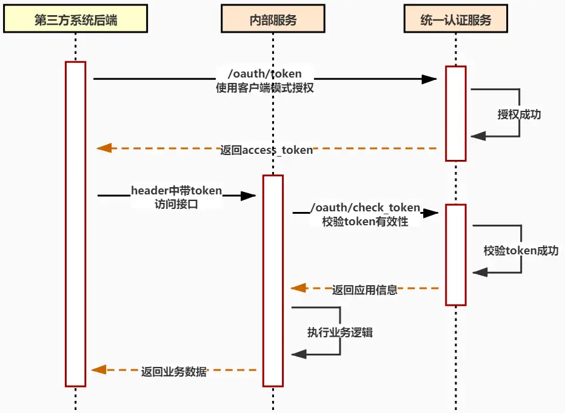

# 第三方API对接如何设计接口认证？

## 一、前言

在与第三方系统做接口对接时，往往需要考虑接口的安全性问题，本文主要分享几个常见的系统之间做接口对接时的认证方案。


## 二、认证方案

例如订单下单后通过 **延时任务** 对接 **物流系统** 这种 **异步** 的场景，都是属于系统与系统之间的相互交互，不存在用户操作；所以认证时需要的不是用户凭证而是系统凭证，通常包括 **app_id** 与 **app_secrect**。

> app_id与app_secrect由接口提供方提供


### 2.1. Baic认证

这是一种较为简单的认证方式，客户端通过明文（Base64编码格式）传输用户名和密码到服务端进行认证。

通过在 `Header` 中添加key为 Authorization，值为 Basic 用户名:密码的base64编码，例如app_id为和app_secrect都为 `zlt`，然后对 `zlt:zlt` 字符进行base64编码，最终传值为：

```http
Authorization: Basic emx0OnpsdA==
```


#### 2.1.1. 优点

简单，被广泛支持。


#### 2.1.2. 缺点

安全性较低，需要配合HTTPS来保证信息传输的安全

1. 虽然用户名和密码使用了Base64编码，但是很容易就可以解码。
2. 无法防止 **重放攻击** 与 **中间人攻击**。


### 2.2. Token认证

使用 `Oauth2.0` 中的 `客户端模式` 进行Token认证，流程如下图所示：



> 使用Basic认证的方式获取access_token之后，再通过token来请求业务接口


#### 2.2.1. 优点

安全性相对 `Baic认证` 有所提升，每次接口调用时都使用临时颁发的 `access_token` 来代替 `用户名和密码` 减少凭证泄漏的机率。


#### 2.2.2. 缺点

依然存在 `Baic认证` 的安全问题。


### 2.3. 动态签名

在每次接口调用时都需要传输以下参数：

- **app_id** 应用id
- **time** 当前时间戳
- **nonce** 随机数
- **sign** 签名


其中sign签名的生成方式为：使用参数中的
app_id + time + nonce 并在最后追加 `app_secrect` 的字符串进行md5加密，并全部转换成大写。

> 如果需要实现参数的防篡改，只需把接口所有的请求参数都作为签名的生成参数即可


#### 2.3.1. 优点

安全性最高

1. 服务端使用相同的方式生成签名进行对比认证，无需在网络上传输 `app_secrect`。 
2. 可以防止 **中间人攻击**。
3. 通过 `time` 参数判断请求的时间差是否在合理范围内，可防止 **重放攻击**。
4. 通过 `nonce` 参数进行幂等性判断。


#### 2.3.2. 缺点

不适用于前端应用使用，js源码会暴露签名的方式与app_secrect

