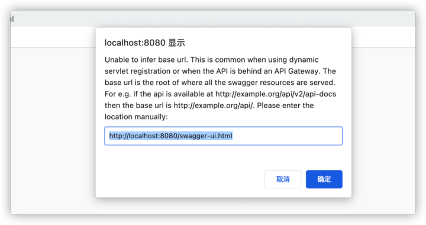
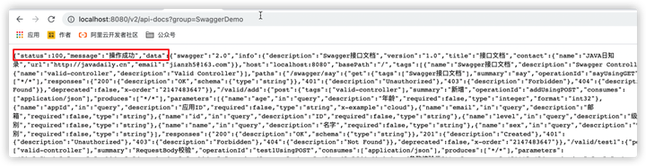
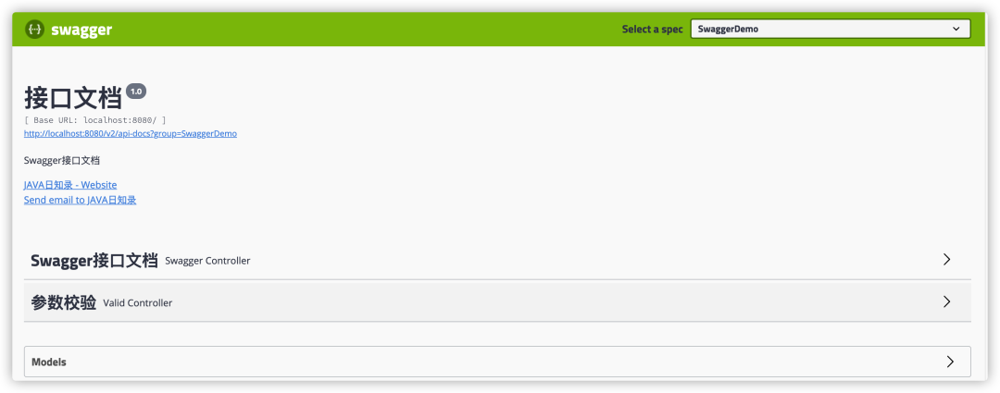
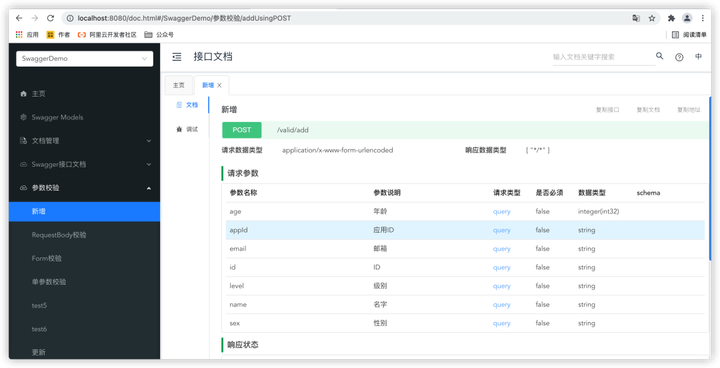
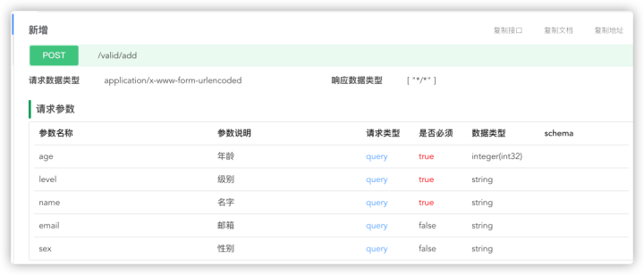
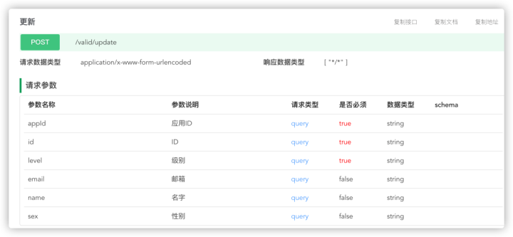
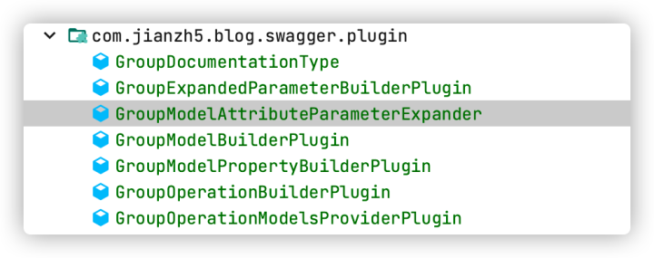

## SpringBoot 如何生成接口文档

SpringBoot老鸟系列的文章已经写了两篇，每篇的阅读反响都还不错，果然大家还是对SpringBoot比较感兴趣。那今天我们就带来老鸟系列的第三篇：集成Swagger接口文档以及Swagger的高级功能。 文章涉及到的代码已经上传到了github，希望最终能应用在你们实际项目上，当然如果有其他需要我添加到内容也可以直接留言告诉我，我会视情况给你们加上去的。

好了，闲话少叙，让我们先来看看为什么要用Swagger？

### 为什么要用Swagger ？

```properties
“作为一名程序员，我们最讨厌两件事：1. 别人不写注释。2. 自己写注释。
而作为一名接口开发者，我们同样讨厌两件事：1. 别人不写接口文档，文档不及时更新。2. 需要自己写接口文档，还需要及时更新。
”
```

相信无论是前端还是后端开发，都或多或少地被接口文档折磨过。前端经常抱怨后端给的接口文档与实际情况不一致。后端又觉得编写及维护接口文档会耗费不少精力，经常来不及更新。

而随着Springboot、Springcloud等微服务的流行，每个项目都有成百上千个接口调用，这时候再要求人工编写接口文档并且保证文档的实时更新几乎是一件不可能完成的事，所以这时候我们迫切需要一个工具，一个能帮我们自动化生成接口文档以及自动更新文档的工具。它就是Swagger。

Swagger 提供了一个全新的维护 API 文档的方式，有4大优点：

1. 自动生成文档：只需要少量的注解，Swagger 就可以根据代码自动生成 API 文档，很好的保证了文档的时效性。
2. 跨语言性，支持 40 多种语言。
3. Swagger UI 呈现出来的是一份可交互式的 API 文档，我们可以直接在文档页面尝试 API 的调用，省去了准备复杂的调用参数的过程。
4. 还可以将文档规范导入相关的工具（例如 SoapUI）, 这些工具将会为我们自动地创建自动化测试。

现在我们知道了Swagger的作用，接下来将其集成到我们项目中。

### Swagger集成

集成Swagger很简单，只需要简单三步。

#### 第一步：引入依赖包

```xml
<!--swagger-->
<dependency>
    <groupId>io.springfox</groupId>
    <artifactId>springfox-swagger2</artifactId>
    <version>2.9.2</version>
</dependency>

<!--swagger-ui-->
<dependency>
    <groupId>io.springfox</groupId>
    <artifactId>springfox-swagger-ui</artifactId>
    <version>2.9.2</version>
</dependency>
```

#### 第二步：修改配置文件

1. application.properties 加入配置

```text
# 用于控制是否开启Swagger，生产环境记得关闭Swagger，将值设置为 false
springfox.swagger2.enabled = true
```

  2.增加一个swagger配置类

```java
@Configuration
@EnableSwagger2
@ConditionalOnClass(Docket.class)
public class SwaggerConfig {

    private static final String VERSION = "1.0";

    @Value("${springfox.swagger2.enabled}")
    private Boolean swaggerEnabled;

    @Bean
    public Docket createRestApi(){
        return new Docket(DocumentationType.SWAGGER_2)
                .enable(swaggerEnabled)
                .groupName("SwaggerDemo")
                .apiInfo(apiInfo())
                .select()
                .apis(RequestHandlerSelectors.withClassAnnotation(Api.class))
                .paths(PathSelectors.any())
                .build();
    }

    /**
     * 添加摘要信息
     */
    private ApiInfo apiInfo() {
        return new ApiInfoBuilder()
                .title("接口文档")
                .contact(new Contact("JAVA日知录","http://javadaily.cn","jianzh5@163.com"))
                .description("Swagger接口文档")
                .version(VERSION)
                .build();
    }

}
```

这里通过`.apis(RequestHandlerSelectors.withClassAnnotation(Api.class))`标明给加上`@Api`注解的类自动生成接口文档。

#### 第三步，配置API接口

```java
@RestController
@Api(tags = "参数校验")
@Slf4j
@Validated
public class ValidController {

    @PostMapping("/valid/test1")
    @ApiOperation("RequestBody校验")
    public String test1(@Validated @RequestBody ValidVO validVO){
        log.info("validEntity is {}", validVO);
        return "test1 valid success";
    }

    @ApiOperation("Form校验")
    @PostMapping(value = "/valid/test2")
    public String test2(@Validated ValidVO validVO){
        log.info("validEntity is {}", validVO);
        return "test2 valid success";
    }

    @ApiOperation("单参数校验")
    @PostMapping(value = "/valid/test3")
    public String test3(@Email String email){
        log.info("email is {}", email);
        return "email valid success";
    }
}
```

通过`@Api`注解标注需要生成接口文档，通过`@ApiOperation`注解标注接口名。

同时我们给`ValidVO`也加上对应的注解

```java
@Data
@ApiModel(value = "参数校验类")
public class ValidVO {

    @ApiModelProperty("ID")
    private String id;

    @ApiModelProperty(value = "应用ID",example = "cloud")
    private String appId;

    @NotEmpty(message = "级别不能为空")
    @ApiModelProperty(value = "级别")
    private String level;

    @ApiModelProperty(value = "年龄")
    private int age;

    ...

}
```

通过`@ApiModel`标注这是一个参数实体，通过`@ApiModelProperty`标注字段说明。

### Unable to infer base url

简单三步，我们项目就集成了Swagger接口文档，赶紧启动服务，访问

`http://localhost:8080/swagger-ui.html`体验一下。



好吧，出了点小问题，不过不用慌。

出现这个问题的原因是因为我们加上了`ResponseBodyAdvice`统一处理返回值/响应体，导致给Swagger的返回值也包装了一层，UI页面无法解析。可以通过`http://localhost:8080/v2/api-docs?group=SwaggerDemo`观察Swagger返回的json数据。



既然知道了问题原因那就很好解决了，我们只需要在ResponseBodyAdvice处理类中只转换我们自己项目的接口即可。

```java
@RestControllerAdvice(basePackages = "com.jianzh5.blog")
@Slf4j
public class ResponseAdvice implements ResponseBodyAdvice<Object> {
  ...
}   
```

通过添加basePackage属性限定统一返回值的范围，这样就不影响Swagger了。

重启服务器再次访问swagger接口地址，就可以看到接口文档页面了。



### For input string: ""

Swagger2.9.2有个bug，就是当我们参数实体有int类型的参数时，打开Swagger接口页面时后端会一直提示异常：

```java
java.lang.NumberFormatException: For input string: ""
 at java.base/java.lang.NumberFormatException.forInputString(NumberFormatException.java:65)
 at java.base/java.lang.Long.parseLong(Long.java:702)
 at java.base/java.lang.Long.valueOf(Long.java:1144)
```

有两种解决方案：

1.给int类型的字段使用`@ApiModelPorperty`注解时添加example属性

```java
@ApiModelProperty(value = "年龄",example = "10")
private int age;
```

2.去除原swagger中的`swagger-models`和`swagger-annotations`，自行引入高版本的annotations和models

  ```java
<dependency>
  <groupId>io.springfox</groupId>
  <artifactId>springfox-swagger2</artifactId>
  <version>2.9.2</version>
  <exclusions>
    <exclusion>
      <groupId>io.swagger</groupId>
      <artifactId>swagger-annotations</artifactId>
    </exclusion>
    <exclusion>
      <groupId>io.swagger</groupId>
      <artifactId>swagger-models</artifactId>
    </exclusion>
  </exclusions>
</dependency>

<dependency>
  <groupId>io.swagger</groupId>
  <artifactId>swagger-annotations</artifactId>
  <version>1.5.22</version>
</dependency>
<dependency>
  <groupId>io.swagger</groupId>
  <artifactId>swagger-models</artifactId>
  <version>1.5.22</version>
</dependency>
  ```

集成Swagger过程中虽然会出现两个小问题，解决后我们就可以愉快享受Swagger给我们带来的便利了。

### Swagger美化

Swagger原生UI有点丑，我们可以借助Swagger的增强工具`knife4j`优化一下。

#### 第一步：引入依赖包

“由于knife4j中已经带了`swagger-annotations`和`swagger-models`的依赖，所以我们可以把上文中手动添加的两个依赖删除。
”

#### 第二步：启用knife4j增强

```java
@Configuration
@EnableSwagger2
@ConditionalOnClass(Docket.class)
@EnableKnife4j
public class SwaggerConfig {
  ...
}
```

通过上面两步我们就完成了Swagger的美化，通过浏览器访问`http://localhost:8080/doc.html`即可看到效果。



### Swagger参数分组

看到这里的同学心理肯定会想，就这？这就是老鸟的做法？跟我们新手也没啥区别呀！

别急，我们先来看一个效果。

首先我们定义了两个接口，一个新增，一个编辑

```java
@ApiOperation("新增")
@PostMapping(value = "/valid/add")
public String add(@Validated(value = {ValidGroup.Crud.Create.class}) ValidVO validVO){
  log.info("validEntity is {}", validVO);
  return "test3 valid success";
}


@ApiOperation("更新")
@PostMapping(value = "/valid/update")
public String update(@Validated(value = ValidGroup.Crud.Update.class) ValidVO validVO){
  log.info("validEntity is {}", validVO);
  return "test4 valid success";
}
```

注意看，这里用的是同一个实体`ValidVO`来接收前端参数，只不过使用了参数校验中的分组，然后我们打开kife4j页面观察两者的接口文档有何不同。

新增：



编辑：



通过上面可以看到，虽然用于接受参数的实体一样，但是当分组不一样时展示给前端的参数也不一样，这就是Swagger的分组功能。

当然原生的Swagger是不支持分组功能的，我们需要对Swagger进行扩展。我已经将代码上传到了github上，由于代码量比较多这里就不展示了，大家可以自行查阅。



引入扩展类后还需要在Swagger配置类`SwaggerConfig`中注入对应的Bean。

```java
@Configuration
@EnableSwagger2
@ConditionalOnClass(Docket.class)
@EnableKnife4j
public class SwaggerConfig {
    ...

    @Bean
    @Order(SwaggerPluginSupport.SWAGGER_PLUGIN_ORDER + 1000)
    public GroupOperationModelsProviderPlugin groupOperationModelsProviderPlugin() {
        return new GroupOperationModelsProviderPlugin();
    }

    @Bean
    @Order(SwaggerPluginSupport.SWAGGER_PLUGIN_ORDER + 1000)
    public GroupModelBuilderPlugin groupModelBuilderPlugin() {
        return new GroupModelBuilderPlugin();
    }

    @Bean
    @Order(SwaggerPluginSupport.SWAGGER_PLUGIN_ORDER + 1000)
    public GroupModelPropertyBuilderPlugin groupModelPropertyBuilderPlugin() {
        return new GroupModelPropertyBuilderPlugin();
    }

    @Bean
    @Order(SwaggerPluginSupport.SWAGGER_PLUGIN_ORDER + 1000)
    public GroupExpandedParameterBuilderPlugin groupExpandedParameterBuilderPlugin() {
        return new GroupExpandedParameterBuilderPlugin();
    }

    @Bean
    @Order(SwaggerPluginSupport.SWAGGER_PLUGIN_ORDER + 1000)
    public GroupOperationBuilderPlugin groupOperationBuilderPlugin() {
        return new GroupOperationBuilderPlugin();
    }

    @Bean
    @Primary
    @Order(SwaggerPluginSupport.SWAGGER_PLUGIN_ORDER + 1000)
    public GroupModelAttributeParameterExpander groupModelAttributeParameterExpander(FieldProvider fields, AccessorsProvider accessors, EnumTypeDeterminer enumTypeDeterminer) {
        return new GroupModelAttributeParameterExpander(fields, accessors, enumTypeDeterminer);
    }


}
```

### 分组使用说明

1.在bean对象的属性里配置如下注释

```java
@Null(groups = ValidGroup.Crud.Create.class)
@NotNull(groups = ValidGroup.Crud.Update.class,message = "应用ID不能为空")
@ApiModelProperty(value = "应用ID",example = "cloud")
private String appId;
```

当新增场景的时候，appId为空，不需要传值；当修改场景的时候，appId不能为空，需要传值 ；其他没有配置组的皆为默认组(Default)

2.在接口参数的时候加入组规则校验

```java
@ApiOperation("新增")
 @PostMapping(value = "/valid/add")
 public String add(@Validated(value = {ValidGroup.Crud.Create.class}) ValidVO validVO){
  log.info("validEntity is {}", validVO);
  return "test3 valid success";
 }
```

当前接口会针对默认组的bean属性进行校验，同时针对保存常见的属性进行校验。

### 小结

Swagger集成相对来说还是很简单的，虽然在集成过程中也出现了几个小问题，不过也很容易就解决了。今天文章的重点内容是Swagger分组功能，跟之前的参数校验文章一样，很多同学遇到这种分组场景时往往会选择创建多个实体类，虽然也能解决问题，只不过总是有点别扭。

不过遗憾的是，本文中Swagger的分组扩展只支持Swagger2，至于新版本Swagger3就不怎么友好了。如果有同学已经扩展好了，欢迎给我提pr呀。