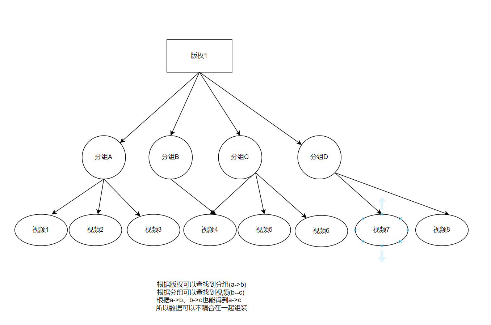

## 性能优化编码设计


```java
 public Pager selVendors(Integer offset, Integer limit) {
        Pager<CmsMediaVendorVo> pager = new Pager<>();

        // 获得分页数据
        Page<CmsMediaVendor> page = PageHelper.offsetPage(offset, limit).doSelectPage(() -> {
            List<CmsMediaVendor> cmsMediaVendors = cmsMediaVendorMapper.selectAll();
        });
        ArrayList<CmsMediaVendorVo> res = new ArrayList<>();
        // 遍历组装数据（cmsMediaVendorVo）
        for(CmsMediaVendor cmsMediaVendor:page){
            CmsMediaVendorVo cmsMediaVendorVo = new CmsMediaVendorVo();
            cmsMediaVendorVo.setId(cmsMediaVendor.getId());
            ...
            ...
     
            // 组装多语言数据
            CmsMediaVendorLang cmsMediaVendorLang = new CmsMediaVendorLang();
            cmsMediaVendorLang.setMediaVendorId(cmsMediaVendor.getId());
            List<CmsMediaVendorLang> cmsMediaVendorLangs = cmsMediaVendorLangMapper.selectByCondition(cmsMediaVendorLang);
            cmsMediaVendorVo.setCmsMediaVendorLangList(cmsMediaVendorLangs);

            //独立频道酒店数量
            CmsMediaVendorOfItem cmsMediaVendorOfItem = new CmsMediaVendorOfItem();
            cmsMediaVendorOfItem.setMediaVendorId(cmsMediaVendor.getId());
            List<CmsMediaVendorOfItem> cmsMediaVendorOfItems = cmsMediaVendorOfItemMapper.selectByCondition(cmsMediaVendorOfItem);
            List<Integer> itemIdList = cmsMediaVendorOfItems.stream().map(CmsMediaVendorOfItem::getItemId).collect(Collectors.toList());
            if(CollectionUtils.isEmpty(itemIdList)){
                cmsMediaVendorVo.setHotelSize(0);
            }else{
                List<CmsItemHotel> cmsItemHotels = cmsItemHotelMapper.selectByIdList(itemIdList);
                if(CollectionUtils.isNotEmpty(cmsItemHotels)){
                    List<Integer> hotelIdList = cmsItemHotels.stream().map(CmsItemHotel::getHotelId).distinct().collect(Collectors.toList());
                    cmsMediaVendorVo.setHotelSize(hotelIdList.size());
                }else{
                    cmsMediaVendorVo.setHotelSize(0);
                }
            }
            //视频数量
            CmsMediaTypeOfMediaVendor cmsMediaTypeOfMediaVendor = new CmsMediaTypeOfMediaVendor();
            cmsMediaTypeOfMediaVendor.setMediaVendorId(cmsMediaVendor.getId());
            List<CmsMediaTypeOfMediaVendor> cmsMediaTypeOfMediaVendors = cmsMediaTypeOfMediaVendorMapper.selectByCondition(cmsMediaTypeOfMediaVendor);
            List<Integer> typeIdList = cmsMediaTypeOfMediaVendors.stream().map(CmsMediaTypeOfMediaVendor::getMediaTypeId).collect(Collectors.toList());
            List<CmsMediatypeMediaRelation> cmsMediatypeMediaRelations = cmsMediatypeMediaRelationMapper.selectByMediaTypeIdList(typeIdList);
            List<Integer> mediaId = cmsMediatypeMediaRelations.stream().map(CmsMediatypeMediaRelation::getMediaId).distinct().collect(Collectors.toList());
            cmsMediaVendorVo.setMediaSize(mediaId.size());
            res.add(cmsMediaVendorVo);
        }
        pager.setIndex(page.getPageNum());
        pager.setOffset(offset);
        pager.setLimit(limit);
        pager.setTotal(page.getTotal());
        pager.setRows(res);

        return pager;
    }
```

上述编码缺陷是在for循环里对数据库进行操作，对数据库访问的次数会很大，导致出现严重的性能问题，甚至接口超时。

改进：

```java
 public Pager selVendors2(Integer offset, Integer limit) {
        Pager<CmsMediaVendorVo> pager = new Pager<>();


        // 获得分页数据
        Page<CmsMediaVendor> page = PageHelper.offsetPage(offset, limit).doSelectPage(() -> {
            List<CmsMediaVendor> cmsMediaVendors = cmsMediaVendorMapper.selectAll();
        });

        //  多语言数据
        List<CmsMediaVendorLang> cmsMediaVendorLangs = cmsMediaVendorLangMapper.selectAll();  //暂时这样写

        // 独立频道酒店数量
        List<CmsMediaVendorOfItem> cmsMediaVendorOfItems = cmsMediaVendorOfItemMapper.selectAll();   // 暂时这样写
        List<Integer> mvo = cmsMediaVendorOfItems.stream().map(CmsMediaVendorOfItem::getItemId).collect(Collectors.toList());
        List<CmsItemHotel> cmsItemHotels;
        if(CollectionUtils.isNotEmpty(mvo)){
            cmsItemHotels= cmsItemHotelMapper.selectByIdList(mvo);
        }else{
            cmsItemHotels = new ArrayList<>();
        }

        //  视频数量
        List<CmsMediaTypeOfMediaVendor> cmsMediaTypeOfMediaVendors = cmsMediaTypeOfMediaVendorMapper.selectAll();  // 暂时这样写
        List<Integer> typeIdList = cmsMediaTypeOfMediaVendors.stream().map(CmsMediaTypeOfMediaVendor::getMediaTypeId).collect(Collectors.toList());
        List<CmsMediatypeMediaRelation> cmsMediatypeMediaRelations;
        if(CollectionUtils.isNotEmpty(typeIdList)){
            cmsMediatypeMediaRelations= cmsMediatypeMediaRelationMapper.selectByMediaTypeIdList(typeIdList);
        }else{
            cmsMediatypeMediaRelations = new ArrayList<>();
        }


        List<CmsMediaVendorVo> res = new ArrayList<>();
        // 遍历组装数据（cmsMediaVendorVo）
        for(CmsMediaVendor cmsMediaVendor:page){
            CmsMediaVendorVo cmsMediaVendorVo = new CmsMediaVendorVo();
            cmsMediaVendorVo.setId(cmsMediaVendor.getId());
            ...
            ...
       
            //  组装多语言数据
            List<CmsMediaVendorLang> langs = cmsMediaVendorLangs.stream().filter(item -> item.getMediaVendorId().equals(cmsMediaVendor.getId())).collect(Collectors.toList());
            cmsMediaVendorVo.setCmsMediaVendorLangList(langs);


            // 组装独立频道酒店数量
            List<Integer> itemIds = cmsMediaVendorOfItems.stream().filter(item -> item.getMediaVendorId().equals(cmsMediaVendor.getId())).map(CmsMediaVendorOfItem::getItemId).collect(Collectors.toList());
            List<Integer> itemIdList = cmsItemHotels.stream().filter(item->itemIds.contains(item.getItemId())).map(CmsItemHotel::getHotelId).distinct().collect(Collectors.toList());
            cmsMediaVendorVo.setHotelSize(itemIdList.size());

            // 组装视频数量
            List<Integer> typeIds = cmsMediaTypeOfMediaVendors.stream().filter(item -> item.getMediaVendorId().equals(cmsMediaVendor.getId())).map(CmsMediaTypeOfMediaVendor::getMediaTypeId).collect(Collectors.toList());
            List<Integer> mediaIds = cmsMediatypeMediaRelations.stream().filter(item -> typeIds.contains(item.getMediaTypeId())).map(CmsMediatypeMediaRelation::getMediaId).distinct().collect(Collectors.toList());
            cmsMediaVendorVo.setMediaSize(mediaIds.size());
            res.add(cmsMediaVendorVo);
        }
        pager.setIndex(page.getPageNum());
        pager.setOffset(offset);
        pager.setLimit(limit);
        pager.setTotal(page.getTotal());
        pager.setRows(res);

        return pager;
    }
```

上述改进可以使用传递性来归类

即：A-->B    B-->C   then   A-->C 

或如图所示：



所以在for循环外得到版权下分组的数据、分组（分组指所有分组）视频数据，然后再用对应关系求得最终数据。

